# 棚中圆木

> **原标题**：Бревно в шалаше
> **作者**：К. Осипенко（K. 奥西彭科）、А. Спивак（A. 斯皮瓦克）、В. Тихомиров（V. 季霍米罗夫，1934—，俄罗斯数学家，Kvant 主编之一）
> **译自**：Квант 2002, № 1
> **原文扫描**：https://www.kvant.digital/data/kvant_2002_1/jpg/0009.jpg
> **主题**：圆锥内接圆柱的最大体积问题；点到抛物线、椭圆、双曲线的距离；星形线、半立方抛物线（曲线族的包络）
> **难度**：★★★★（涉及微积分、解析几何、圆锥曲线、含参方程）
> **译者**：Claude（初译）／ 2026-06-25

---

> *原文标题《Бревно в шалаше》字面意为「棚（圆锥形窝棚）中的圆木（圆柱）」，形象地比喻「圆锥中内接的圆柱」。——译者注*

## 引言

**怎样才是可以塞进给定圆锥的体积最大的圆柱？** 这个问题可以在许多代数和数学分析的教科书里找到。在《开普勒与酒桶——奥地利的和莱茵的》（《量子》2000 年第 6 期）一文中，它曾作为一道习题被提出：「在给定的圆锥内作一内接圆柱，使其体积最大，且圆柱的轴与圆锥的轴重合。」

为什么要加上「其轴与圆锥的轴重合」这几个字呢？难道不能把它们删掉吗？换句话说，能放进给定圆锥内部的、体积最大的圆柱，其轴是否一定平行于圆锥的轴？很可能是的。但是我们不会证明：任意（倾斜放置的）圆柱这个问题出乎意料地困难，我们没能解决它。倒是对于其轴平行于圆锥底面的圆柱，我们把它弄清楚了。这道题的解法和答案都有些繁杂，但颇有教益。在此过程中需要计算从一个位于双曲线对称轴上的点到该双曲线本身的距离。

有双曲线的地方，就有椭圆和抛物线。于是，这篇文章从「能不能省下『其轴与圆锥的轴重合』这几个字」这样一个问题出发，几经生发，越写越长。当然，本来也可以不必做这么多旁逸斜出的展开，直接讲完「躺着的」最大圆柱那道题就行。但是我们希望，凡是有一点数学趣味的人，都会乐于认识我们沿途俯拾皆是的那些经典概念和结论。你将学会计算点到抛物线、椭圆、双曲线的距离，了解到星形线与椭圆、抛物线与半立方抛物线之间是怎样联系起来的。

这篇文章甚至可能让那种除了考大学之外对世上一切都不感兴趣的十一年级考生也觉得有意思——当然，是他选了大学、而大学还没选上他的时候。归根到底，「最大圆柱」的问题（以及与之相仿、本文也将一并解决的「最小圆锥」问题）就是一道「含参数的题」，只不过相当难罢了。

## 「站着的」与「躺着的」最大圆柱

### 「站着的」圆柱

设 $OA = R$ 与 $OS = H$ 为直圆锥的底面半径与高，$OL = x$、$LM = y$ 为内接圆柱的底面半径与高（图 1）。于是由三角形相似得 $y/H = AM/AS$ 与 $x/R = MS/AS$，因此

$$
\frac{y}{H} + \frac{x}{R} = \frac{AM}{AS} + \frac{MS}{AS} = 1.
$$

圆柱的体积为

$$
V = \pi x^{2} y = \pi x^{2} H \left(1 - \frac{x}{R}\right) = \frac{\pi H}{R}\left(x^{2} R - x^{3}\right).
$$

我们把问题归约为求函数

$$
f(x) = x^{2} R - x^{3}
$$

在区间 $(0;\ R)$ 上的最大值。这个函数在区间 $[0;\ R]$ 的两个端点处取零值，而它的导数

$$
f'(x) = 2xR - 3x^{2}
$$

在区间 $(0;\ R)$ 上仅当 $x = 2R/3$ 时为零。（函数 $f$ 的图像见图 2。）所以「站着的」圆柱的最大体积为

$$
V = \frac{\pi H}{R}\, f\!\left(\frac{2}{3}R\right) = \frac{4}{27}\,\pi R^{2} H.
$$

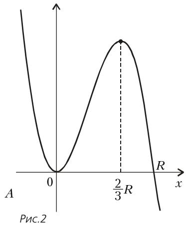

*图 2*

### 「躺着的」圆柱

乍看起来，「躺着的」圆柱那道题也同样简单。因为，若 $r$ 与 $2h$ 是内接于圆锥的「躺着的」圆柱（其轴平行于圆锥底面）的底面半径与高（图 3 画的是轴截面），则

$$
\frac{h}{R} + \frac{2r}{H} = \frac{SK}{SA} + \frac{KA}{SA} = 1,
$$

于是 $h = R\left(1 - \dfrac{2r}{H}\right)$。圆柱的体积为

$$
2\pi h r^{2} = 2\pi r^{2} R\left(1 - \frac{2r}{H}\right) = \frac{2\pi R}{H}\left(r^{2} H - 2r^{3}\right).
$$

和「站着的」圆柱一样，我们考察函数

$$
g(r) = r^{2} H - 2r^{3}
$$

并求其导数：

$$
g'(r) = 2rH - 6r^{2}.
$$

函数 $g$ 在区间 $[0;\ H/2]$ 的两端取零值，而它的导数在区间 $(0;\ H/2)$ 上当 $r = H/3$ 时为零。（函数 $g$ 的图像见图 4。）

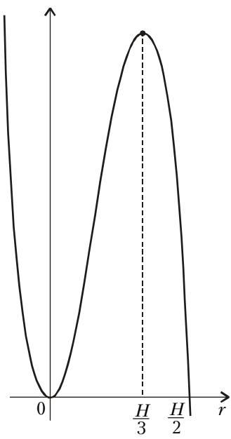

*图 4*

也就是说，函数在区间 $(0;\ H/2)$ 上的最大值在 $r = H/3$ 处取得。与之对应，

$$
h = R\left(1 - \frac{2H/3}{H}\right) = \frac{R}{3};
$$

因此「躺着的」圆柱的最大体积等于

$$
2\pi r^{2} h = \frac{2\pi}{27}\, H^{2} R.
$$

例如，取 $R = 1$、$H = 9$，「躺着的」圆柱的体积等于 $6\pi$。

而它所内接的圆锥的体积等于

$$
\frac{\pi}{3} R^{2} H = 3\pi.
$$

在一个物体（圆锥）内部，居然放下了另一个体积大一倍的物体（圆柱）！你想象一下，我们的构造在实践上能有多大用处吧！

### 错在哪里？

奇迹是不会发生的；当然，是我们弄错了。当 $r$ 很小时，内接圆柱用自己的两个点与圆锥的侧面相切（图 5），而随着 $r$ 增大，内接圆柱的高 $h$ 减小，到某一时刻，每一个切点都「一分为二」。从这一刻起，图 3 就不符合实际了：圆柱与圆锥的侧面相切的点不是两个，而是四个（图 6）。

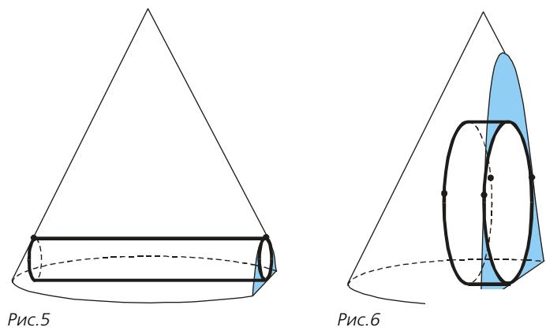

*图 5、图 6：圆柱与圆锥侧面相切的两种情形*

### 正确的答案

需要分两种相切情形分别讨论，这使问题的求解大为复杂。尽管如此，我们还是能够解决它，并得到如下答案：当 $R \geqslant H$ 时，内接于高为 $H$、底面半径为 $R$ 的圆锥的「躺着的」圆柱的最大体积为

$$
V = \frac{2}{27}\,\pi R H^{2},
$$

而当 $R \leqslant H$ 时，最大体积为

$$
\frac{\pi R^{3} \sqrt{2}\left(\sqrt{12 H^{2} + 13 R^{2} + R\sqrt{24 H^{2} + 25 R^{2}}} - 3R\sqrt{2}\right)^{2}}{9H\sqrt{6 H^{2} + 5 R^{2} + R\sqrt{24 H^{2} + 25 R^{2}}}}.
$$

（顺便说一下，当 $R = H$ 时，两个公式都可以用。事实上，把 $H = R$ 代入第二个公式，得到 $V = \dfrac{2}{27}\,\pi R^{3}$。请自行验证！）

我们不会马上就去讲「躺着的」最大圆柱那道题的解法，而是先做一点练习——剖析几道更简单（在我们看来也更基本、更有趣）的题目。掌握数学分析的读者，可以跳过接下来的几节。而对于经验较少的读者，希望这些练习能帮助你们把一切都弄明白。

## 点到抛物线、椭圆、双曲线的距离

众所周知，用竖直平面去截圆锥，得到的是双曲线。（如果你还不知道这一点，也不必沮丧：凡是我们需要的，都会给出证明！）因此在求解「躺着的」圆柱那道题时，我们将用到点到双曲线的距离公式。但作为练习，我们先用抛物线 $y = kx^{2}$ 代替双曲线。（两者并无本质区别，只不过对许多中学生来说抛物线比双线更熟悉罢了。）而且暂时先不取任意点，而是取位于抛物线对称轴上的点。

### 点 $(0;\ b)$ 到抛物线 $y = kx^{2}$ 的距离

于是，来求给定点 $A(0;\ b)$ 到由方程 $y = kx^{2}$（其中 $k > 0$）给出的抛物线的距离。

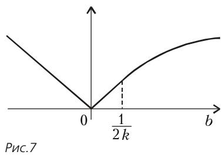

*图 7：点 $A(0;b)$ 到抛物线 $y=kx^{2}$ 的距离*

点到抛物线的距离是什么？它是所有距离 $AM$（其中 $M(x;\ kx^{2})$ 是抛物线上的点）中的最小者，也就是函数

$$
f(x) = \sqrt{x^{2} + (b - kx^{2})^{2}}
$$

的最小值。令 $t = x^{2}$，得

$$
f^{2}(x) = k^{2} t^{2} + (1 - 2kb)\, t + b^{2}.
$$

这个二次函数在点 $t_{0} = \dfrac{2kb - 1}{2k^{2}}$ 处取到最小值。此时经简单计算可得

$$
f^{2}\!\left(\sqrt{\frac{2kb - 1}{2k^{2}}}\right) = \frac{b}{k} - \frac{1}{4k^{2}}.
$$

不过要记得 $t = x^{2} \geqslant 0$：如果 $2kb - 1 < 0$，那么函数 $f(x)$ 在 $x = 0$ 处取到最小值。于是

$$
\min f(x) = \begin{cases} \sqrt{\dfrac{b}{k} - \dfrac{1}{4k^{2}}}, & \text{若}\ b > \dfrac{1}{2k}, \\[6pt] |b|, & \text{若}\ b \leqslant \dfrac{1}{2k}. \end{cases}
$$

$\min f$ 随 $b$ 变化的依赖关系见图 7。

### 点 $(a;\ a)$ 到双曲线 $xy = 1$ 的距离

继续练习。来看双曲线。但不是「躺着的」圆柱那道题里要用的那条，而是一条更常见的、由方程 $xy = 1$ 给出的双曲线。显然，当 $0 < a < 1$ 时，点 $A(a;\ a)$ 到双曲线的距离 $r$ 等于 $(1 - a)\sqrt{2}$。

当 $a > 1$ 时，答案更复杂。只要以 $A$ 为圆心、$AK$ 为半径的圆与双曲线只有一个公共点（图 8），距离就等于 $AK = (a - 1)\sqrt{2}$。但当 $a$ 足够大时，这样的圆与双曲线的公共点不是一个，而是三个（图 9）。此时点 $A$ 到双曲线的距离为 $AN < AK$。

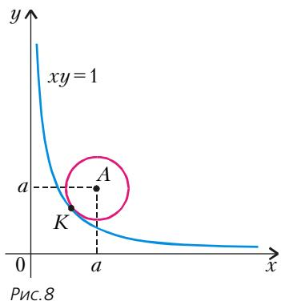

*图 8*

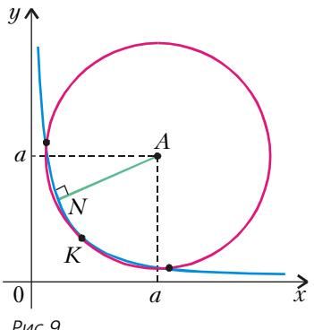

*图 9*

我们来弄清楚，对哪些 $a$ 公共点是一个，对哪些 $a$ 是三个。以 $A$ 为圆心、$(a - 1)\sqrt{2}$ 为半径的圆的方程很容易写出：

$$
(x - a)^{2} + (y - a)^{2} = 2(a - 1)^{2}.
$$

要知道这个方程所给的圆与双曲线相交于几个点，就要弄清方程

$$
(x - a)^{2} + \left(\frac{1}{x} - a\right)^{2} = 2(a - 1)^{2}
$$

有多少个解。展开括号，把方程写成

$$
x^{2} + \frac{1}{x^{2}} - 2a\left(x + \frac{1}{x}\right) + 4a = 2.
$$

令 $t = x + \dfrac{1}{x}$。由于 $t^{2} = x^{2} + \dfrac{1}{x^{2}} + 2$，所研究的方程化为二次方程

$$
t^{2} - 2at + 4a - 4 = 0.
$$

众所周知，$t \geqslant 2$，其中 $t = 2$ 对应唯一的 $x = 1$，而每个 $t > 2$ 对应两个互为倒数的 $x$。于是，我们要弄清楚：对哪些 $a > 1$，方程 $t^{2} - 2at + 4a - 4 = 0$ 恰有一个解 $t \geqslant 2$，而对哪些 $a$ 有两个解。

能帮上忙的是这样一点：圆过点 $K$，因此 $t = 2$ 是方程的根。由韦达定理，两根之和等于 $2a$，所以异于 $t = 2$ 的那个根等于 $2a - 2$。解不等式

$$
2a - 2 \geqslant 2,
$$

得到答案：当 $a > 2$ 时，圆与双曲线有三个公共点；而当 $1 < a \leqslant 2$ 时，只有一个公共点。

于是，当 $1 < a \leqslant 2$ 时，点 $A$ 到双曲线的距离等于 $AK = (a - 1)\sqrt{2}$。而当 $a > 2$ 时，这个距离小于线段 $AK$ 的长度。小多少？我们的论证对此没有给出答案。

算来算去，距离 $r$ 还是没求出来。为什么？看来我们做的事并不是该做的。是的——尊敬的读者们，请原谅我们！我们这是在装模作样地迷了一回路。回到正路上来吧。

为计算 $r$ 的值，我们考察点 $A(a;\ a)$ 到点 $M\!\left(x;\ \dfrac{1}{x}\right)$ 的距离：

$$
\rho(x) = \sqrt{(a - x)^{2} + \left(a - \frac{1}{x}\right)^{2}}.
$$

显然，$r$ 是函数 $\rho(x)$ 的最小值。所以我们把 $\rho$ 平方再求导：

$$
\left(\rho^{2}(x)\right)' = 2(x - a) + 2\left(a - \frac{1}{x}\right) \cdot \frac{1}{x^{2}}.
$$

令导数为零：

$$
x - a + \frac{a}{x^{2}} - \frac{1}{x^{3}} = 0,
$$

$$
x^{4} - ax^{3} + ax - 1 = 0,
$$

$$
\left(x^{2} - 1\right)\left(x^{2} - ax + 1\right) = 0.
$$

$x = \pm 1$ 对应于双曲线上的点 $(1;\ 1)$ 与 $(-1;\ -1)$。为求 $r$，剩下的事是按标准公式解二次方程 $x^{2} - ax + 1 = 0$：$x = \dfrac{a \pm \sqrt{a^{2} - 4}}{2}$。也就是说，当 $|a| < 2$ 时没有（实）解，此时 $r$ 是点 $A$ 到点 $(1;\ 1)$ 与 $(-1;\ -1)$ 中较近者的距离。而当 $|a| \geqslant 2$ 时，把 $x$ 的值代入 $\rho(x)$ 的公式即可求出 $r$。

不过计算可以简化。具体地，

$$
\begin{aligned}
r &= \sqrt{a^{2} - 2ax + x^{2} + a^{2} - \frac{2a}{x} + \frac{1}{x^{2}}} \\[4pt]
  &= \sqrt{2a^{2} - 2a\left(x + \frac{1}{x}\right) + \left(x + \frac{1}{x}\right)^{2} - 2}.
\end{aligned}
$$

将方程 $x^{2} - ax + 1 = 0$ 两边除以 $x$，得

$$
x + \frac{1}{x} = a,
$$

于是

$$
r = \sqrt{2a^{2} - 2a^{2} + a^{2} - 2} = \sqrt{a^{2} - 2}.
$$

还有另一种做法。写出以 $A(a;\ a)$ 为圆心、$r$ 为半径的圆的方程：

$$
(x - a)^{2} + (y - a)^{2} = r^{2}.
$$

代入 $y = 1/x$，展开括号并作代换 $t = x + \dfrac{1}{x}$，得

$$
t^{2} - 2at + 2a^{2} - 2 = r^{2}.
$$

我们要弄清楚：对哪些 $a > 1$，可以如此选取 $r$，使得不等式 $r < (a - 1)\sqrt{2}$ 成立，并且二次方程 $t^{2} - 2at + 2a^{2} - 2 = 0$ 在射线 $(2;\ +\infty)$ 上恰有一个根 $t$。

这是一道典型的「含参数的题」。我们不把它的解法详细写出来，只指出关键之处：判别式应等于零，即

$$
4a^{2} - 4\left(2a^{2} - 2 - r^{2}\right) = 0,
$$

由此 $r = \sqrt{a^{2} - 2}$。在这个 $r$ 值下，$t = a$。又因 $t = x + \dfrac{1}{x} \geqslant 2$，故必须 $a \geqslant 2$。于是，点 $A(a;\ a)$ 到双曲线的距离 $r$ 当 $0 < a \leqslant 2$ 时等于 $|a - 1|\sqrt{2}$，而当 $a \geqslant 2$ 时等于

$$
\sqrt{a^{2} - 2}.
$$

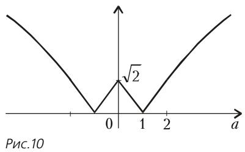

*图 10：距离 $r$ 随参数 $a$ 变化的图像*

### 练习

1. 设 $a$ 与 $k$ 是正数。求点 а) $(a;\ a)$；б) $(a;\ -a)$ 到由方程 $xy = k$ 给出的双曲线的距离。

2. 求 $\min\limits_{x^{2} - y^{2} = h^{2}} \left((a - x)^{2} + y^{2}\right)$，其中 $a \geqslant h > 0$。

3. 求坐标原点到由方程 $x^{2} - axy + y^{2} = 1$（其中 $a$ 为给定数）所给点集的距离。（注：当 $|a| < 2$ 时，方程 $x^{2} - axy + y^{2} = 1$ 给出椭圆；当 $|a| = 2$ 时，给出一对平行直线；当 $|a| > 2$ 时，给出双曲线。）

4. 求 $x^{2} + 2y^{2}$ 在条件 $x^{2} - xy + 2y^{2} = 1$ 下的最大值与最小值。

## 从点向抛物线所作的垂线

众所周知，点到直线的距离是沿垂线量的。对于点到曲线的距离，情况并不总是如此：垂线未必唯一（图 11），它也未必是连接该点与曲线上各点的线段中最短者——甚至有时垂线反而是这些线段中最长者（图 12）。

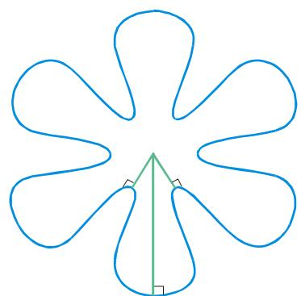

*图 11：垂线不唯一的情形*

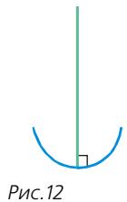

*图 12：垂线反而最长的情形*

你可能还记得，我们已经解决了点 $(0;\ b)$ 到抛物线 $y = kx^{2}$ 的距离问题。如果点 $(0;\ b)$ 足够低（确切地说，如果 $b \leqslant 1/(2k)$），那么抛物线上离它最近的点就是坐标原点。而如果 $b > 1/(2k)$，情况就不是这样了：以 $(0;\ b)$ 为圆心、$b$ 为半径的圆与抛物线有多于一个的交点（图 13）；从点 $(0;\ b)$ 向抛物线可以作的不止一条垂线，而是三条。

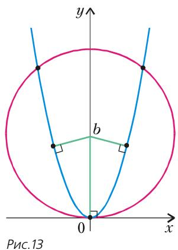

*图 13*

## 半立方抛物线——抛物线的渐屈线

现在来弄清楚，从哪些点能向抛物线 $y = x^{2}$ 作几条垂线。（读者若愿意，不难对抛物线 $y = kx^{2}$ 重复这些计算。）为此考察距离的平方。

> **译者插话（原文用示意图说理）**：设想曲线上有两点 $A$ 与 $B$，过它们分别作曲线的切线，二切线交于点 $C$。让点 $B$ 沿曲线趋向点 $A$，则 $C$ 也趋向点 $A$。（当然，不应把上述说法当作一条严格的定理。但我们希望，其中的思想你已经领会。而一旦学过数学分析课程，要「补上严格性」并不困难。）

先来看抛物线的垂线（法线）。由于

$$
\left(x^{2}\right)' = 2x
$$

且两条互相垂直的直线的角系数（斜率）之积等于 $-1$，所以在点 $(a;\ a^{2})$ 处所作抛物线的垂线（法线），其角系数等于 $-1/(2a)$。于是，这条垂线由方程

$$
y = -\frac{1}{2a}(x - a) + a^{2}
$$

给出，也可写成

$$
2ay = -x + a + 2a^{3}.
$$

为求包络，我们考察把参数 $a$ 换成 $a + \varepsilon$ 后所得的相应方程，并在随后让 $\varepsilon$ 趋于零。（好好想想这个想法！为了求包络，我们考察「相近的」直线，求出它们的交点，再取极限，把「相近的」直线变成——如果可以这么说的话——「无穷相近的」。）于是考察方程组

$$
\left\{\begin{array}{l} 2ay = -x + a + 2a^{3}, \\ 2(a + \varepsilon)\, y = -x + a + \varepsilon + 2(a + \varepsilon)^{3}. \end{array}\right.
$$

用第二式减去第一式：

$$
2\varepsilon y = \varepsilon + 6a^{2}\varepsilon + 6a\varepsilon^{2} + 2\varepsilon^{3},
$$

于是 $y = \dfrac{1}{2} + 3a^{2} + 3a\varepsilon + \varepsilon^{2}$。让 $\varepsilon$ 趋于零，得

$$
y = \frac{1}{2} + 3a^{2}.
$$

把这个值代入方程组的第一个方程，得

$$
a + 6a^{3} = -x + a + 2a^{3},
$$

于是

$$
x = -4a^{3}.
$$

所以 $(x;\ y) = \left(-4a^{3};\ \dfrac{1}{2} + 3a^{2}\right)$。我们求出了抛物线的法线族（即垂线族）的包络。

### 练习

6. 验证：所求得的包络，正是那条半立方抛物线 $x^{2} = \dfrac{8}{27}(2y - 1)^{3}$。

7. 证明：由方程 $2ay = -x + a + 2a^{3}$（其中 $a \neq 0$）给出的直线，在点 $\left(-4a^{3};\ \dfrac{1}{2} + 3a^{2}\right)$ 处与由方程 $y = \dfrac{3}{4}\, x^{2/3} + \dfrac{1}{2}$ 给出的曲线相切。

8. 求抛物线 $y = kx^{2}$（其中 $k > 0$）的法线族的包络的方程。

## 星形线

如果我们问：一条定长线段，两端沿一个给定直角的两条边滑动时，它扫出怎样的点集（图 20），就会得到最令人难忘的包络之一。

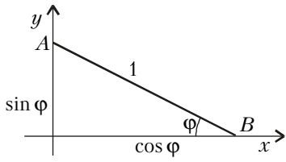

*图 20、图 21：滑动线段及其包络——星形线*

考察单位长度的线段 $AB$，其两端位于坐标轴上（图 21）。直线 $AB$ 的方程容易写出：有人能背熟所谓的「截距式直线方程」

$$
\frac{x}{\cos\varphi} + \frac{y}{\sin\varphi} = 1,
$$

有人则会把方程写成

$$
y = \sin\varphi - x\,\mathrm{tg}\,\varphi.
$$

考察由方程

$$
y = \sin\psi - x\,\mathrm{tg}\,\psi
$$

给出的「相近的」直线。（稍后我们将让 $\psi$ 趋于 $\varphi$，眼下 $\psi \neq \varphi$。）求这两条直线的交点：

$$
\sin\varphi - x\,\mathrm{tg}\,\varphi = \sin\psi - x\,\mathrm{tg}\,\psi,
$$

于是

$$
x = \frac{\sin\psi - \sin\varphi}{\mathrm{tg}\,\psi - \mathrm{tg}\,\varphi} = \frac{\sin\psi - \sin\varphi}{\psi - \varphi} : \frac{\mathrm{tg}\,\psi - \mathrm{tg}\,\varphi}{\psi - \varphi}.
$$

回想正弦与正切的导数，得到：当 $\psi \to \varphi$ 时，$x$ 趋于 $\cos^{3}\varphi$。知道 $x$ 之后，容易求出

$$
y = \sin\varphi - \cos^{3}\varphi\, \mathrm{tg}\,\varphi = \sin^{3}\varphi.
$$

所以 $(x;\ y) = (\cos^{3}\varphi;\ \sin^{3}\varphi)$。我们得到了一条以参数形式给出的曲线，它有名字：**星形线**（астроида）。显然

$$
\sqrt[3]{x^{2}} + \sqrt[3]{y^{2}} = \cos^{2}\varphi + \sin^{2}\varphi = 1.
$$

---

## 译者注与校对说明

1. **OCR 校正**：本文由 MinerU 对扫描页（PDF 源）做俄文 OCR 后翻译。已校正大量 OCR 错误，主要包括：
   - 作者署名「К. ОСИПЕНКО, А. СПИВАК, В. ТИХОМИРОВ」原 OCR 散为带大量空格的字母串，已拼合；
   - 引文「《量子》2000 年第 6 期」原 OCR 误作 `$2 0 0 0 ~ \Gamma 0 \varDelta )`，已据上下文（《Кеплер и винные бочки》，《Квант》 №6 за 2000 год）还原；
   - 几何记号多处错乱：`$O L = x _ { \mathrm { ~ H ~ } } L M = y$` 校正为 $OL = x$、$LM = y$；`$A ( \theta ; b )$` 中的 $\theta$ 实为 $0$（点 $A(0;\ b)$）；`$k > \ell$` 校正为 $k > 0$；`$\dot{2}R/3$` 校正为 $2R/3$；`$\bar{H}/2$`、`$\bar{b}$` 上的横线系 OCR 噪声，已删；`$\overset{-}{a}$`、`$\hat{t}=2$`、`$\hat{2}$` 等帽子/上划线噪声已删；
   - 俄文词被 OCR 拆碎处已还原：如 `$r \mathrm{~ - ~ } {}_{3\mathrm{T O}}$`、`$r \mathrm{~~{-~}~}{\mathsf{3TO}}$` 均为「$r$ — это」（即「$r$ 就是」）；`$\mathrm{\Pi_{I A p y}}$`= «пары»（一对）；`$\mathrm{r u n e p 6 0 . 0 1 y .}$`= «гиперболу»（双曲线）；乱码 `$\hat{2}^{\cdot} - \jmath_{\mathrm{H I I I I b ~ O , I I H y}}$` 据 Vieta 推导的上下文还原为「при $1 < a \leqslant 2$」之结论；`b g1 1; и` 还原为 $(1;\ 1)$ и；
   - 希腊字母：`$\boldsymbol{\Phi}$`、`$\Psi \to \Phi$` 校正为 $\varphi$、$\psi \to \varphi$（滑动线段与坐标轴的夹角）；星形线推导中 $\varphi$、$\psi$ 全部统一为小写；
   - 项目字母 а)、б) 原 OCR 与拉丁 a)、b) 混淆，已按俄文字母还原；俄文小数逗号（如 $5{,}5$）按规范保留；
   - 重复页：OCR 将 p14 与 p15 两页内容几乎完全重复（星形线一节），按规范「同页重复只译一次」，已合并为一节。
2. **术语**：цилиндр=圆柱，конус=圆锥，объём=体积，осевое сечение=轴截面，касательная=切线，нормаль=法线（即垂线），производная=导数，огибающая=包络，астроида=星形线，полукубическая парабола=半立方抛物线，эволюта=渐屈线，угловой коэффициент=角系数（即斜率），теорема Виета=韦达定理，дискриминант=判别式，параметр=参数。术语遵照《01_工作规范.md》对照表；原文用「垂线」（перпендикуляр）处，因讨论的正是「法线」概念，译文中两词并用以助理解。
3. **图号与配图**：原文图号自图 1 起递增，但 OCR 未将图 1（带内接圆柱的圆锥轴截面）、图 3（「躺着的」圆柱的圆锥轴截面）作为独立图片裁出（二者在文中以记号 $OA=R$、$OS=H$、$OL=x$、$LM=y$、$SK$、$KA$ 等描述），故译文中对图 1、图 3 仅保留引用、不另配图。其余配图与 meta.json 中 `figures[].std_name` 对应：图 2→`fig_p9_01.png`，图 4→`fig_p11_01.png`，图 5/6（合图）→`fig_p11_02.png`，图 7→`fig_p12_01.png`，图 8→`fig_p12_02.png`，图 9→`fig_p12_03.png`，图 10→`fig_p13_01.png`，图 11→`fig_p13_02.png`，图 12→`fig_p13_03.png`，图 13→`fig_p13_04.png`，图 20/21（合图）→`fig_p14_01.png`。图 5/6 与图 20/21 在原扫描页中分别为同一框内的左右两幅小图，故合并配一幅并加复合图注。
4. **原文缺「最小圆锥」与正文衔接说明**：引言中提及的「最小圆锥」（миниконус）问题，以及「躺着的」最大圆柱问题的完整解法，在本文所给扫描页（p9—p15）范围内并未展开，原文应有后续篇幅；译文忠实呈现所给原文，未作增补。
5. **图像核对说明**：本篇扫描源为 PDF（`images/ext_X41/p9.pdf`—`p15.pdf`），按规范应核对 `p9.jpg`，但目录下仅有 PDF，无法用图像分析工具直接读取（工具不支持 PDF 格式，且环境无 PyMuPDF 可供转换），故**整体页面图像核对跳过**；改以逐张核对 MinerU 已裁出的 11 张 `fig_pXX_NN.png`（见上节图号映射），几何关系（圆锥/圆柱截面、抛物线/双曲线/星形线、切点与交点）均与正文叙述一致。

## 建议讨论题

1. 「站着的」圆柱最大体积公式 $V=\dfrac{4}{27}\pi R^{2}H$ 与「躺着的」圆柱（$R\geqslant H$ 时）最大体积公式 $V=\dfrac{2}{27}\pi RH^{2}$，二者之比为 $\dfrac{2R}{H}$。当 $R>H$ 时，「躺着的」居然更大——这与「错觉」中圆锥内最大圆柱总该「站着」的直觉相悖，你能从几何上解释为什么吗？
2. 文章用「以 $A$ 为圆心、半径渐增的圆与双曲线的交点个数」来判断距离公式何时发生切换（$a=2$ 处）。这种「用圆去探测距离」的思想，与求曲线的法线／切线有什么联系？
3. 抛物线 $y=x^{2}$ 的法线族的包络是一条半立方抛物线（即抛物线的渐屈线）。一般地，「一条曲线的渐屈线」是什么意思？椭圆的渐屈线又是什么形状？
4. 星形线 $x^{2/3}+y^{2/3}=1$ 是「定长线段两端在直角边上滑动」这一线段族的包络。你能否不用微积分，而用纯几何（相似、勾股）的方式推出同一个方程？

---

> **版权说明**：原文版权归 MCCME（莫斯科连续数学教育中心）及作者继承者所有。本译文为非商业、自用、数学圈内部参考，未获授权不得公开分发。原文扫描见 [kvant.digital](https://www.kvant.digital/data/kvant_2002_1/jpg/0009.jpg)。

> **复用说明**：本译文的俄文 OCR 原文与所有插图均存档于 `ocr/ext_X41/`（`ru.md` 为合并 OCR 文本，`meta.json` 为图映射）。如对译文质量不满意，可直接基于 `ru.md` 重译，无需重跑 OCR。图片路径前缀为 `../images/ext_X41/`。
