# 哪条跑道更短？

> **原标题**：Какая дорожка короче?
> **作者**：В. Г. Болтянский（V. G. 博尔强斯基，1915—2008，苏联／俄罗斯数学家，俄罗斯教育科学院院士）
> **译自**：Квант 1997, № 1
> **原文扫描**：https://www.kvant.digital/data/kvant_1997_1/jpg/0009.jpg
> **主题**：角度的度量（度、弧度）、圆周长与扇形面积公式、极值问题与高维推广
> **难度**：★★（涉及弧度、π 的几何含义与极值思想，属初中后段／高中层面）
> **译者**：Claude（初译）／ 2026-06-25

---

## 114° 与此事何干？

设想有一个公园，里面有一条圆形的跑道，还有几条放射状的跑道，把公园的中心与圆形跑道上的几个点连接起来（图 1）。要从点 $A$ 走到点 $B$，走哪条路最短：是沿着圆弧走，还是沿两条半径走？答案也许出乎意料：如果 $\angle AOB$ 小于（大约）114°，那么沿圆弧走更合算；否则，沿两条半径走的"散步"更合适。

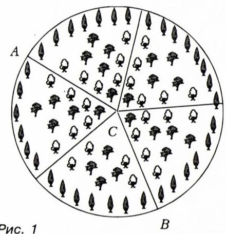

*图 1*

## 怎样测量角度？

为了说明 114 这个数从何而来，首先得回忆一下，角度是用哪些单位来度量的。大家最熟悉的当然是度。如果把一个周角分成 360 个相等的角，我们就得到了"度"的概念。把直角分成 90 个相等的部分，结果也是一样。

现在，我们从角 $AOB$ 的一条边开始，一个接一个地摆放 1 度大小的角（顶点都在同一个 $O$）。如果在角 $AOB$ 的内部恰好放下 $n$ 个这样的"度的角"，而第 $(n+1)$ 个已经超出了角 $AOB$ 的范围，我们就说角 $AOB$ 含有 $n$ 度。如果还有余数，就用分（即度的六十分之一）来度量；如果再有余数，就用秒（即分的六十分之一）来度量。

这种度量角度大小的方法来自远古。它至今仍流行于天文学，以及其他一些需要度量角度的科学之中。不过，并非所有科学都用它。例如在炮兵中，使用的是"密位（град，grad）"，即周角的四百分之一；换句话说，直角含有一百密位。

## 度是从哪里来的？

在古代，底格里斯河与幼发拉底河流域住着苏美尔人——一个最有趣、文化高度发达的古代民族之一。他们拥有数学知识，彼此之间以及与其他民族之间有贸易往来。看来正是苏美尔人最先引入了货币关系作为交换商品的基础。他们的基本货币单位是**米纳（мина）**——一小堆白银。米纳是个相当大的货币单位，可以买到很多货物。因此常把米纳分成两半；为了更小的购买，又把每一半分成三个相等的部分。这样就出现了米纳的六分之一。更小的购买则使用零碎的银块（或银制品）。

阿卡德人是两河流域的另一个古代民族，他们开始使用"**舍客勒（шекель）**"，这是一个相当小的货币单位。在苏美尔人与阿卡德人通商时，米纳的六分之一被定为等于十个舍客勒。于是米纳就等于六十个舍客勒。数 60 能被 2、3、4、5、6 等数整除，这在买卖时非常方便。

后来，在古巴比伦，数 60 不仅被作为贸易关系的基础，而且成为了**六十进制**计数法的底数。

它在制定度量角度与时间的单位时，扮演了重要角色。**正六边形**是最容易用简单工具（比方说圆规和直尺）作出来的图形之一。于是人们把等边三角形中的角（六个这样的三角形正好组成一个正六边形，图 2）取作度量角度的单位。这个单位相当大。于是又把它（就像米纳被分成 60 舍客勒那样）分成 60 个相等的部分——**度**。而在更精密的角度测量中（这对迅速发展的天文学很重要），每一度又被分成 60 **分**。就这样，六十进制在历史上形成的角度单位上留下了印记。在度量时间间隔时也出现了类似的情况：一小时被分成 60 分，一分被分成 60 秒。

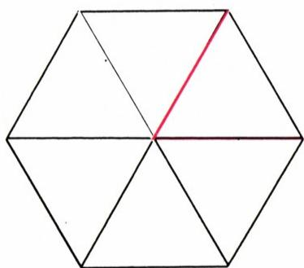

*图 2*

## 圆周长

自古以来，长度和面积的度量就受到高度重视。人们关心的不仅是线段长度（或多边形面积）的度量，也包括圆周长及其弧长（或圆及其各部分的面积）的度量。内接于半径为 $r$ 的圆的正六边形（图 3），其周长比这个圆的周长略小（一般而言，凸的闭合曲线 $L_1$ 的长度，小于"包围"它的闭合凸曲线 $L_2$ 的长度，图 4）。而正六边形的周长为 $6r$，所以半径为 $r$ 的圆的周长略大于 $6r$，即半圆周长略大于 $3r$。半圆周长与其半径之比记作 $\pi$，也就是说，半圆周长等于 $\pi r$，而整个圆周长等于 $2\pi r$。

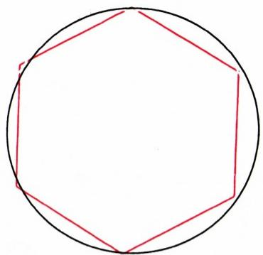

*图 3*

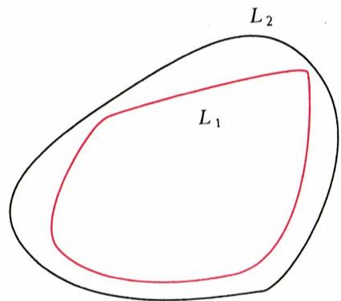

*图 4*

需要着重指出：数 $\pi$ 对所有圆都是同一个值，也就是说它不依赖于半径。可以这样来解释。设 $\pi$ 是半径为 1 的半圆周长。半径为 $r$ 的半圆（具有同一中心 $O$）由单位半圆经过以系数 $r$ 的相似变换（位似变换）而得到（图 5）。但在以系数 $r$ 的相似变换下，一切长度都扩大 $r$ 倍。因此半径为 $r$ 的半圆周长，等于把数 $\pi$ 乘以 $r$，即等于 $\pi r$。而半径为 $r$ 的整个圆周长，等于两个半圆周长之和，即等于 $2\pi r$。

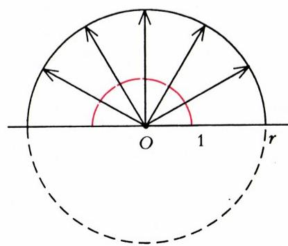

*图 5*

如我们所见，数 $\pi$ 略大于 3。古希腊伟大的学者阿基米德证明了 $\pi$ 介于

$$
3 \frac{1}{7} \approx 3{,}1429 \quad \text{与} \quad 3 \frac{10}{71} \approx 3{,}1409
$$

之间，即他论证了近似值 $\pi \approx 3{,}14$。

## 怎样度量圆周长？

我们来考察顶点在圆心的角。周角含 360°，而整个圆周长等于 $2\pi r$。由比例关系可知，含有 $n$ 度的圆心角所对的弧，其长度为

$$
l = \frac{n}{360} \cdot 2\pi r = \frac{n\pi r}{180}\tag{1}
$$

（图 6）。当然，弧长所用的长度单位，与度量半径时所用的单位相同。

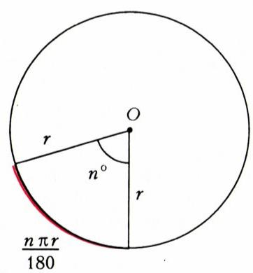

*图 6*

作为一个简单的练习，建议读者自行验证：如果角用密位来度量（提醒一下，密位是直角的百分之一），那么含有 $k$ 密位的角所对的弧长为

$$
l = \frac{k\pi r}{200}.
$$

当然，度量角度不仅可以使用度（或密位），还可以使用其他单位。最方便、最常用的角度单位是**弧度**。它是这样定义的：与 1 弧度的圆心角相对应的圆弧，其长度恰好等于半径。那么 1 弧度究竟含有多少度？按公式 (1)，若圆弧长度等于半径（即 $l=r$），则 $n=180/\pi$（度），即 1 弧度含有 $180/\pi\approx 57$ 度（图 7）。也就是说，弧度比 $60°$ 略小一点（因为 $\pi$ 略大于 3）。

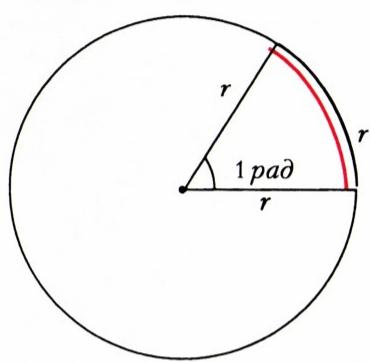

*图 7*

由弧度的定义直接可知：含有 $\alpha$ 弧度的圆心角所对的弧，长度为 $\alpha r$，即公式 (1) 被下面这个简单的公式（图 8）所取代：

$$
l = \alpha r.\tag{2}
$$

正是这个公式的简单性，使得用弧度来度量角度最为方便。具体地，周角含有 $2\pi$ 弧度（即大约 6,28 弧度），因为整个圆周长等于 $2\pi r$。

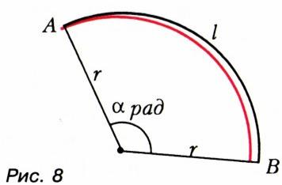

*图 8*

现在我们回到文章开头考察的问题。如果两条放射状跑道之间的角含有 $\alpha$ 弧度，那么沿圆弧走的跑道长度等于 $\alpha r$。而经过中心的跑道长度等于 $2r$。可见，当 $\alpha r<2r$ 时，沿圆弧走更合算。因此，如果放射状跑道之间的角小于 2 弧度（即约 114°），那么经过中心的跑道就不那么合算。

## 圆扇形的面积

考虑一个圆心角为 $\alpha$（弧度）的圆扇形，以及内接于它的等腰三角形（图 9）。把这个三角形的底和高分别记作 $a$ 和 $h$。这个三角形的面积等于 $\dfrac{1}{2}ah$。当角 $\alpha$ 很小时，$h\approx r$，$a\approx l=\alpha r$。所以三角形的面积约等于 $\dfrac{1}{2}\alpha r\cdot r=\dfrac{\alpha}{2}r^{2}$。因此，如果我们考虑内接于圆的正 $n$ 边形（图 10），则得到 $n$ 个这样的三角形，其中每一个的圆心角都等于 $\alpha=2\pi/n$。整个多边形的面积约等于

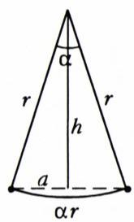

*图 9*

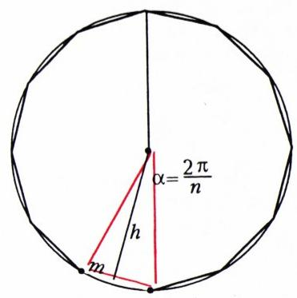

*图 10*

$$
n\cdot\frac{1}{2}\alpha r\cdot r = n\cdot\frac{1}{2}\cdot\frac{2\pi}{n}r\cdot r = \pi r^{2}.
$$

但 $n$ 越大，正内接多边形的面积就越精确地接近圆的面积。而既然对任何 $n$，多边形的面积都约等于同一个量 $\pi r^{2}$，那么圆的面积就**精确**等于 $\pi r^{2}$。

圆可以看作圆心角为 $2\pi$（弧度）的扇形。既然圆的面积等于 $\pi r^{2}$，那么（由比例关系）圆心角为 $\alpha$ 弧度的扇形面积等于

$$
s = \frac{\alpha}{2}r^{2}.\tag{3}
$$

现在我们回到跑道问题，考虑两条路径（沿圆弧或沿两条半径）长度相等、都等于 $2r$ 的情形。这发生在两条放射状跑道之间的夹角为 2 弧度（即大约 114°）时。因此，按公式 (3)，两条跑道之间所夹的扇形（图 11）的面积等于 $r^{2}$，也就是说，这个扇形与以 $r$ 为边长的正方形等积。

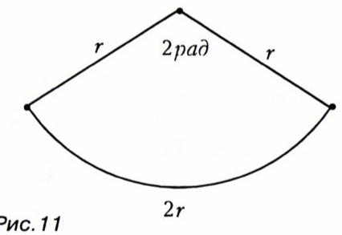

*图 11*

这样一来，跑道问题的解答还可以这样来表述：考虑由两条跑道（一条沿两条半径、另一条沿圆弧）所夹的图形 $F$（它小于半圆）；如果图形 $F$ 的面积小于 $r^{2}$，则沿圆弧走的跑道较短；如果这个面积大于 $r^{2}$，则沿两条半径走更合算。

## 走到空间中去吧

不知读者是否注意到了一个绝妙的事实：在表示圆弧长的公式 (2) 中，以及在给出圆扇形面积的公式 (3) 中，都出现了同一个数 $\pi$？

不仅如此，这同一个数 $\pi$ 也出现在空间几何的公式中。高年级同学都知道，半径为 $r$ 的球面的面积等于 $4\pi r^{2}$，而它所围成的球的体积等于 $\dfrac{4}{3}\pi r^{3}$。

我们还可以考虑跑道问题的空间类比。即考虑一个顶点在球心的圆锥。它与球相交得到一个立体（图 12），其表面由两部分组成：圆锥的侧面和一个球面"小帽"（与图 6 比较，那里扇形是角与圆的交）。这两部分哪一部分的表面积更大？为了回答这个问题，要约定如何度量空间角。我们约定：顶点在球心的圆锥含有一个空间角，其大小为 $S/r^{2}$ **球面度**，其中 $S$ 是该圆锥从球面上截出的那块"小帽"的面积。这样一来，点 $O$ 周围的完整空间角含 $4\pi$ 球面度。可以证明，若圆锥的母线与其轴线之间的夹角为 $\varphi$，则该圆锥含 $2\pi(1-\cos\varphi)$ 球面度。

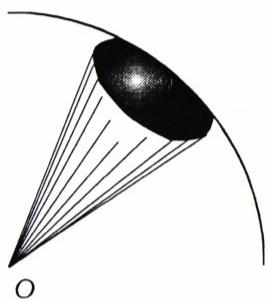

*图 12*

现在上述问题的答案就清楚了：圆锥侧面的面积为 $\pi r^{2}\sin\varphi$，而球面"小帽"的面积为 $2\pi r^{2}(1-\cos\varphi)$。这两个面积之比为

$$
\frac{\pi r^{2}\sin\varphi}{2\pi r^{2}(1-\cos\varphi)} = \frac{\cos(\varphi/2)}{2\sin(\varphi/2)}.
$$

如果这个比值小于 1，则"更合算"（即面积更小）的是圆锥侧面。两者相等发生在 $\cos(\varphi/2)=2\sin(\varphi/2)$ 时，即 $\operatorname{tg}(\varphi/2)=1/2$ 时。可以算出，此时圆锥所含的空间角为 $4\pi/5$ 球面度。

熟悉多维几何概念的读者，可以提出这样的问题：在 $n$ 维空间中又如何？数 $\pi$ 是否进入 $n$ 维球的体积及其表面积的公式？答案令人惊奇：当 $n=2k$ 和 $n=2k+1$ 时，这些公式中都含有（带某个有理系数的）数 $\pi^{k}$，即球的体积等于 $\lambda_{n}\pi^{k}r^{n}$，而球面的面积等于 $\lambda_{n}n\pi^{k}r^{n-1}$，其中 $\lambda_{n}$ 是某个有理数。例如，对于四维空间 $\lambda_{4}=1/2$。会求积分、并掌握多维几何概念的读者，可以求得 $\lambda_{2m}=1/m!$，而 $\lambda_{2m+1}=\dfrac{2^{m+1}}{1\cdot 3\cdot\ldots\cdot(2m+1)}$。

## 什么是极值？

现在我们来考虑一个跑道系统更复杂的小公园，其中除了放射状跑道外，还有半径各不相同的圆形跑道（图 13）。哪一条连接 $A$ 和 $B$ 的路径最短？读者现在已经能轻松回答这个问题：如果角 $AOB$（不超过平角）小于 2 弧度，则最短的是由线段 $AM$ 和圆弧 $MB$ 组成的路径。如果角 $AOB$ 大于 2 弧度，则最短的是放射状路径 $AOB$。

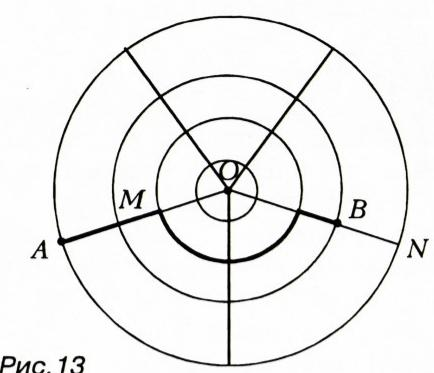

*图 13*

现在我们从一个一般的数学观点来看这个问题。我们有若干条不同的路径，从小公园中的点 $A$ 通向点 $B$（其中有放射状路径 $AOB$，也有各种含圆弧的路径，例如图 13 中用粗线画出的那一条）。也就是说，我们有一个由从 $A$ 到 $B$ 的路径组成的集合。把这个集合记作 $S$。每条路径 $x$（即每个元素 $x\in S$）都对应着它的长度，记作 $l(x)$。于是，在集合 $S$ 上定义了一个函数 $l(x)$。所考察的跑道问题，就是要找出定义在集合 $S$ 上的函数 $l(x)$ 的最小值。

函数的最小值和最大值，称为它的**极值**。高年级同学都知道，如果给定一个数值函数（定义在某个区间上、取实数值），并且这个函数是可微的，那么它的极值可以通过令导数等于零来求得。这就是属于**费马**的一条定理——这位杰出的数学家，对数学分析和数论的发展都作出了重大贡献。

但现代数学考察的，不仅仅是在区间上定义的数值函数，还包括定义在更复杂集合上的函数。例如，集合（或在这种情况下，数学家所说的"空间"）可以由各种火箭的弹道、企业的生产计划、凸图形、机翼的各种形状等等组成。在这样的空间上考察某个函数（燃料消耗、产量、面积、空气动力阻力等）。问题就是要找出所考察函数的极值，例如从燃料消耗最小这一角度来看最优的火箭飞行弹道。我们所考察的问题（图 13 中示意）也属于极值问题之列。

现代数学不仅由几何、代数、分析组成。它包含数十个不同的方向，而现代数学的大多数分支（无论是"纯粹的"、理论性的数学，还是应用数学）都与求解这种或那种极值问题有关。

## 「Квант」微笑

## \* \* \*

有一次在自己的讲座上，大卫·希尔伯特说：

——每个人都有一个确定的视界。当它缩小并变成无穷小时，它就化为一个点。于是这个人就说：「这就是我的观点。」

## \* \* \*

如何用语言来定量描述测量结果，芝加哥大学教授盖尔曾举过一个有趣的例子。

教授在实验室里和一个学生一起工作，他们不知道应当接上仪器的那些接线柱处在多大的电压下——是 110 伏还是 220 伏。学生正要跑去拿电压表，教授却建议他用手摸来判定电压。

——可这样只会让我触一下电罢了。——学生反驳道。

——是的，可如果是 110 伏，你会弹开并叫一声：「啊，见鬼！」；如果是 220 伏，那措辞可就更厉害了。

我把这个故事讲给学生听时，其中一个学生评论道：「今天早上我遇到一个小伙子，看他那样子，大概正好在那之前接了 440 伏！」

## \* \* \*

狄拉克喜欢就各种各样的话题作理论推演。有一次他提出一个设想：存在一个最优的距离，在这个距离上女性的面容显得最具魅力。因为在两个极端情形下——距离为零和距离为无穷大时——"魅力都化为零"（什么都看不见），那么在这两个极限之间，自然应当存在一个极大值。

---

## 译者注与校对说明

1. **OCR 校正**：本文由 MinerU 对扫描页（p9—p12）做俄文 OCR 后翻译。已校正若干 OCR 错误与排版瑕疵：俄文小数逗号（如 $3{,}14$、$6{,}28$）依规范保留；公式 (1) 中分母 $3 6 0$、$1 8 0$ 的多余空格已合为 $360$、$180$；半角的图号「Рис. 1—13」统一译为「图 1—13」；末段"стеррадианов"实为"стерадианов"（球面度）的 OCR 笔误，已校正；空间角比值公式原 OCR 写作 $\cos\varphi/2$、$\sin\varphi/2$、$\operatorname{tg}\varphi/2$，按几何含义（半角公式 $\sin\varphi=2\sin(\varphi/2)\cos(\varphi/2)$）应理解为 $\cos(\varphi/2)$、$\sin(\varphi/2)$、$\operatorname{tg}(\varphi/2)$，已据上下文与等式 $\operatorname{tg}(\varphi/2)=1/2$ 还原；原文「t.e.」（т.е.，即）已译作"即"。
2. **术语**：核心术语遵照《01_工作规范.md》对照表：окружность=圆、радиус=半径、дуга=弧、сектор=扇形、угол=角、радиан=弧度、градус=度、град=密位、шар=球、сфера=球面、конус=圆锥、стереадиан（стерадиан）=球面度、экстремум=极值、функция=函数、множество=集合、подобие=相似／位似。古代货币单位 мина／шекель 分别音译为"米纳"和"舍客勒"（汉译通行译名）。
3. **图表**：原文图 1—13 由 MinerU 从整页扫描中自动裁出，存于 `images/ext_X42/fig_pXX_NN.png`（共 13 张）。其中图 6 与图 8 是无标题的插图（原文中夹排在正文里），此处据正文内容补以图注以便理解。文中未含表格。
4. **章节完整性**：已据 ru.md 逐节核对，全文 9 节（114° 与此事何干？／怎样测量角度？／度是从哪里来的？／圆周长／怎样度量圆周长？／圆扇形的面积／走到空间中去吧／什么是极值？／「Квант」微笑，含 3 则花絮）全部译出，无遗漏。

## 建议讨论题

1. 为什么"走圆弧还是走两条半径"的临界角恰好是 2 弧度（≈114°）？请用公式 (2) 给出严格的说明，并验证当角等于 2 弧度时两种路径长度正好相等。
2. 文章把圆弧长公式 $l=\alpha r$（弧度制）与圆扇形面积公式 $s=\dfrac{\alpha}{2}r^{2}$ 中的同一个 $\pi$ 联系起来，并推广到 $n$ 维球。试问：为什么高维球体积公式中 $\pi$ 的幂次 $k=\lfloor n/2\rfloor$ 而不是 $n$？
3. 跑道问题被作者归为"极值问题"。除令导数为零（费马定理）这条经典途径外，你能想到哪些**不需要微积分**也能求极值的方法？本文中两种路径的比较算不算一种？
4. 「Квант」微笑中狄拉克说"吸引力在 0 和 ∞ 处都为零，故中间存在极大值"。这种"两个端点都为零 ⇒ 中间必有极大"的推理何时成立、何时不成立？请举一个反例。

---

> **版权说明**：原文版权归 MCCME（莫斯科连续数学教育中心）及作者继承者所有。本译文为非商业、自用、数学圈内部参考，未获授权不得公开分发。原文扫描见 [kvant.digital](https://www.kvant.digital/data/kvant_1997_1/jpg/0009.jpg)。

> **复用说明**：本译文的俄文 OCR 原文与所有插图均存档于 `ocr/ext_X42/`（`ru.md` 为合并 OCR 文本，`meta.json` 为图映射，`images/ext_X42/` 为图）。如对译文质量不满意，可直接基于 `ocr/ext_X42/ru.md` 重译，无需重跑 OCR。
