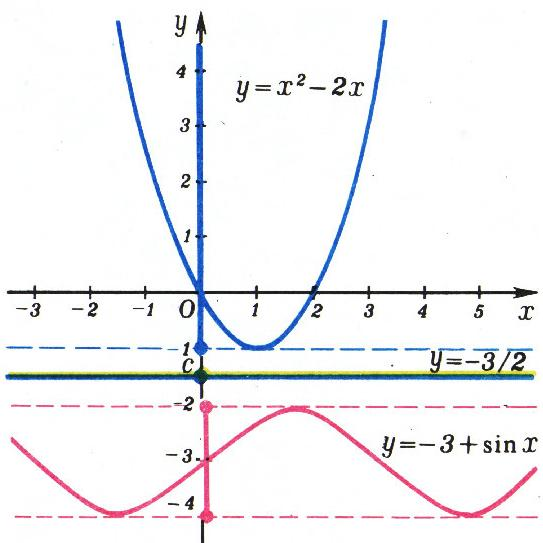
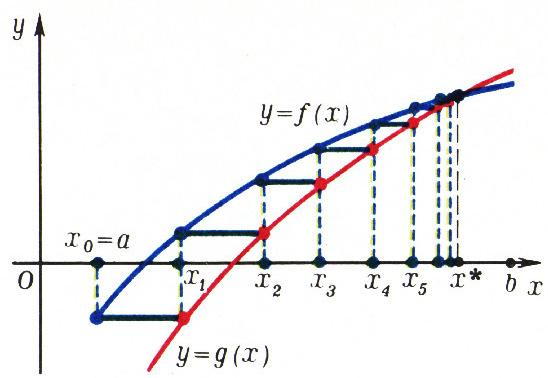

# 分离常数法

> **原标题**：Метод отделяющих констант
> **作者**：В. Г. Болтянский（V. G. 博尔强斯基，1915—2005，苏联／俄罗斯数学家，列宁奖金获得者）
> **译自**：Квант 1977, № 4
> **原文扫描**：https://www.kvant.digital/data/kvant_1977_4/jpg/0046.jpg
> **主题**：分离常数法（利用函数的值域证明不等式、解方程；迭代法求方程的根）
> **难度**：★★★（需熟悉函数图像、三角函数、arctan/arctg、迭代思想）
> **译者**：Claude（初译）／ 2026-06-25

---

近年来，在高校招生的笔试题中出现了一类题目，其求解以先确定某些函数所取值的集合（即函数的值域）来开头最为方便。有时问题到此便告结束——所得结果直接给出答案；而在另一些情形下，仅仅掌握函数的值域就能大大缩减解题的工作量，并指出通往答案的最短路径。

本文要谈的，正是应用这一方法时的一些特点。

## 不等式的证明

我们从下面这道题开始。

**例 1.** 证明不等式

$$
x ^ {2} - 2 x \geqslant - 3 + \sin x.\tag{1}
$$

为证此式，只需注意：射线 $[-1;\,\infty)$ 作为函数

$$
f (x) = x ^ {2} - 2 x = (x - 1) ^ {2} - 1
$$

的值域，与函数

$$
g (x) = - 3 + \sin x
$$

的值域（即闭区间 $[-4;\,-2]$）不相交。

也可以换一种说法：存在这样的一个数 $c$（例如 $c = -3/2$），使得对一切 $x \in \mathbb{R}$ 都成立不等式 $f(x) > c$、$c > g(x)$（图 1），由此不仅得到不等式 (1) 成立，还得到一个更强的事实：对任意的 $x,\ y \in \mathbb{R}$ 都有 $f(x) > g(y)$，亦即恒有

$$
x ^ {2} - 2 x > - 3 + \sin y.
$$

*图 1*

在更复杂的例子中，要想找到一个能将函数 $f(x)$ 的值与函数 $g(x)$ 的值在整个定义域上「分离」开来的常数 $c$ 已不可能，但可以把整条数轴分成若干个区间，使其中的每一个区间都拥有各自的分离常数。

**例 2.** 证明不等式

$$
\operatorname{arctg} x > 4 \sqrt {3}\, x - x ^ {2} - 11.\tag{2}
$$

此时，在区间 $(-\infty;\,\sqrt{3})$ 上（即当 $-\infty < x < \sqrt{3}$ 时），这样的分离常数是 $c_{1} = -2$（图 2）；而在区间 $[\sqrt{3};\,\infty)$ 上，可取分离常数 $c_{2} = 1{,}01$。

当然，图 2 中的图像只是对所述内容的直观说明；而建立在分离常数思想之上的完整证明，可以例如这样来叙述。函数

$$
f (x) = \operatorname{arctg} x
$$

对一切 $x \in \mathbb{R}$（特别地，对 $x < \sqrt{3}$）满足不等式 $f(x) > -\dfrac{\pi}{2} > -2$，即 $f(x) > c_{1}$。另一方面，函数

$$
g(x) = 4\sqrt{3}\,x - x^{2} - 11 = -(x - 2\sqrt{3})^{2} + 1
$$

在 $x = \sqrt{3}$ 处取值

$g(\sqrt{3}) = -2 = c_{1}$，而在 $x = \sqrt{3}$ 这一点的左侧此函数递增，故 $x < \sqrt{3}$ 时 $g(x) < c_{1}$。于是 $x < \sqrt{3}$ 时 $f(x) > c_{1} > g(x)$，即对这样的 $x$ 值不等式 (2) 成立。剩下要讨论 $x \geqslant \sqrt{3}$ 的情形。

注意 $f(\sqrt{3}) = \operatorname{arctg}\sqrt{3} = \pi/3 > 1{,}01$，而且 $f(x)$ 是递增函数，故 $x \geqslant \sqrt{3}$ 时 $f(x) > c_{2}$。至于函数 $g(x)$，对任意 $x \in \mathbb{R}$（特别地，对 $x \geqslant \sqrt{3}$）都有 $g(x) \leqslant 1 < c_{2}$。从而 $x \geqslant \sqrt{3}$ 时 $f(x) > c_{2} > g(x)$，即对这样的 $x$ 值不等式 (2) 也成立。

![图 3：在闭区间 $[a;b]$ 上用「阶梯折线」把 $y=f(x)$ 与 $y=g(x)$ 的图像隔开](../images/ext_X43/fig_p47_02.png)

*图 3*

刚才用于证明不等式的方法，绝不应被看作是什么别出心裁、偶一为之、罕能套用的招数。相反，对连续函数而言，这一方法几乎可以看作是普遍适用的。事实上，例如设连续函数 $f(x)$ 和 $g(x)$ 给定在闭区间 $[a;\,b]$ 上，并且我们大致勾画了它们的图像后，发现似乎在整个区间上不等式 $f(x) > g(x)$ 都成立。我们该如何去证明这一不等式呢？

如果对一切 $x \in [a;\,b]$ 不等式 $f(x) > g(x)$ 都成立，那么函数 $f(x)$ 与 $g(x)$ 的图像就没有公共点，因而可以\*作一条「阶梯状折线」（图 3），把 $y = f(x)$ 的图像与 $y = g(x)$ 的图像分隔开来。而这恰好意味着：闭区间 $[a;\,b]$ 可以被分成若干个更小的区间，每一个小区间上都存在分离常数 $c_{i}$。

> \* 原文此处为脚注，对连续函数这一论断的严格根据是下文「迭代」一节所示的事实（其证明用到连续函数的中间值性质）。

当然，上面这番推理只涉及「用分离常数法证明 $f(x) > g(x)$ 在原则上可行」的问题。而到了每个具体场合，运用此法的技巧便在于：如何为区间 $[a;\,b]$ 找到一种合适的分割，并对其每一部分给出相应的分离常数。

## 迭代

一般说来，很难给出关于如何去选取分割方式和相应分离常数的一般性建议。然而在某些情形下，这类建议还是可以提出的。

例如，设函数 $f(x)$ 与 $g(x)$ 二者同为递增（或同为递减），且 $f(a) > g(a)$。作直线 $y = f(a)$（图 4）并考察它与函数 $y = g(x)$ 图像的交点。把这个交点的横坐标记作 $x_1$。在闭区间 $[a;\,x_1]$ 上，可取分离常数 $c_1 = f(a)$。事实上，在整个这段区间上有 $f(x) \geqslant c_1$、$g(x) \leqslant c_1$，而且第一个不等式仅在 $[a;\,x_1]$ 的左端点处取等号，第二个不等式仅在右端点处取等号。由此

![图 4：过 $y=f(x_k)$ 作水平线与 $y=g(x)$ 相交，逐步把 $[a;b]$ 分成若干段，每段有一个分离常数 $c_k=f(x_{k-1})$](../images/ext_X43/fig_p48_01.png)

*图 4*

便知在整个 $[a;\,x_1]$ 上不等式 $f(x) > g(x)$ 都成立。注意分离常数 $c_1 = f(a)$ 在某种意义上是最优的：若取比 $f(a)$ 更小的数作为 $c_1$，则该常数所「管辖」的区间就会变小。

接下来，作直线 $y = f(x_{1})$，得到区间 $[x_{1};\,x_{2}]$，在其上 $c_{2} = f(x_{1})$ 是分离常数；然后作直线 $y = f(x_{2})$，如此以往（图 4）。如此一来，就把闭区间 $[a;\,b]$ 分成了若干段，每一段都得到一个分离常数，从而证明了不等式 $f(x) > g(x)$ 在整个 $[a;\,b]$ 上成立。

上面的推理可以形式化如下。

我们从点 $x_{0} = a$ 出发。

若对某个 $k = 0, 1, \ldots$ 已知点 $x_{k}$，则我们找一个这样的点 $x_{k+1}$，使 $g(x_{k+1}) = f(x_{k})$。

把这一过程反复进行（数学上称之为**迭代**），我们便由 $x_{0}$ 求出 $x_{1}$，再由 $x_{1}$ 求出 $x_{2}$，如此以往。若经过若干次迭代我们能到达函数 $f(x)$、$g(x)$ 定义区间的右端，则不等式 $f(x) > g(x)$ 即获证明。

**例 3.** 求方程

$$
\operatorname{tg} x = 4 x - 2{,}5,\tag{3}
$$

位于区间 $(0;\,\pi/2)$ 内的根。

函数 $f(x) = \operatorname{tg} x$、$g(x) = 4x - 2{,}5$ 在区间 $(0;\,\pi/2)$ 上都递增。开头几次迭代如下（$f(x)$ 的值取不足近似值）：

$$
x _ {0} = 0;
$$

$g(x_{1}) = f(x_{0}) = 0;\ 4x_{1} - 2{,}5 = 0,\ x_{1} = 0{,}625;\quad g(x_{2}) = f(x_{1}) \approx 0{,}72;\ 4x_{2} - 2{,}5 = 0{,}72,\ x_{2} = 0{,}805;$

*图 5*

$g(x_{3}) = f(x_{2}) \approx 1{,}04;\ 4x_{3} - 2{,}5 = 1{,}04,\ x_3 = 0{,}885;\quad g(x_4) = f(x_3) \approx 1{,}22;\ 4x_4 - 2{,}5 = 1{,}22,\ x_4 = 0{,}93;\quad g(x_5) = f(x_4) \approx 1{,}34;\ 4x_5 - 2{,}5 = 1{,}34,\ x_5 = 0{,}96;\quad g(x_{6}) = f(x_{5}) \approx 1{,}42;\ 4x_{6} - 2{,}5 = 1{,}42,\ x_6 = 0{,}98;\ \ldots$

经过大约二十次迭代，便能到达区间 $(0;\,\pi/2)$ 的右端。由此确立：在整个区间上不等式 $f(x) > g(x)$ 都成立，因此方程 (3) 在所考察的区间内没有根。

现在请注意：在施行迭代时，我们事先并不能知道能否到达区间 $[a;\,b]$ 的右端（即能否证明不等式 $f(x) > g(x)$ 在整个 $[a;\,b]$ 上成立）。那么，当给定在 $[a;\,b]$ 上的 $f(x)$ 与 $g(x)$ 的图像相交、亦即不等式 $f(x) > g(x)$ 并非在整个区间上成立时，迭代又会呈现出怎样的图景呢？

图 5 直观地表明：此时，通过一串无穷迭代，我们将得到一列数 $x_0,\ x_1,\ \ldots,\ x_k,\ \ldots$，它们逼近方程 $f(x) = g(x)$ 的根 $x^*$；更确切地说，$x^* = \lim_{k \to \infty} x_k$ 是该方程落在区间 $[a;\,b]$ 内的最小根。因此，借助逐次迭代，我们便可以近似地求出这一根。

上述方法在计算实践中常被用来近似求解方程的根。一般而言，在现代数学中，各种各样的**迭代方法**起着极其重要的作用：它们不仅能以任意给定的精度求解方程，甚至能用来证明定理。

## 解方程

分离常数法不仅能用于证明不等式，在某些情况下还能用来**解方程**，而且是精确地、而非近似地求解。

**例 4.** 解方程 $x^{2} - 2x\sin x - 2\cos x + 2 = 0$。 (4)

把方程改写为

$$
(x - \sin x) ^ {2} = - (1 - \cos x) ^ {2},
$$

即 $f(x) = g(x)$ 的形式，其中

$$
\begin{array}{c} f (x) = (x - \sin x) ^ {2}, \\ g (x) = - (1 - \cos x) ^ {2}. \end{array}
$$

显然，对任意 $x \in \mathbb{R}$ 都有 $f(x) \geqslant 0$、$g(x) \leqslant 0$。由此可知，某个数 $x_{0}$ 只有在满足 $f(x_{0}) = 0$、$g(x_{0}) = 0$ 时，才能满足等式 $f(x_{0}) = g(x_{0})$，亦即成为方程 (4) 的根——也就是说，$x_{0}$ 必须是方程组

$$
\left\{ \begin{array}{l} x - \sin x = 0, \\ 1 - \cos x = 0 \end{array} \right.
$$

的解。

这个方程组的第二个方程的根为 $x = 2k\pi$（$k = 0,\ \pm 1,\ \pm 2,\ \ldots$），其中只有 $x = 0$ 满足第一个方程。因此，原方程有唯一根 $x = 0$。

**例 5.** 解方程

$$
x ^ {3} - 2 x ^ {2} + x + 1 = \sqrt {\sin \frac {\pi x}{2}}.\tag{5}
$$

此方程可写成 $f(x) = g(x)$ 的形式，其中

$$
\begin{array}{r l} f (x) & = x ^ {3} - 2 x ^ {2} + x + 1, \\ g (x) & = \sqrt {\sin \frac {\pi x}{2}}. \end{array}
$$

由于 $f(x) = 1 + x (x - 1)^{2}$，故 $x \geqslant 0$ 时 $f(x) \geqslant 1$。与此同时，对函数 $g(x)$ 定义域内的一切 $x$ 都有 $g(x) \leqslant 1$。因此，在 $x \geqslant 0$ 这一段上，$c = 1$ 是函数 $f(x)$ 与 $g(x)$ 的分离常数。由此推得：方程 (5) 的非负根必须满足方程组

$$
\left\{ \begin{array}{l} f (x) = 1, \\ g (x) = 1. \end{array} \right.
$$

第一个方程的根易见为 $x_{1} = 1$、$x_{2} = 0$，其中只有 $x_{1}$ 满足第二个方程。于是方程 (5) 仅有一个非负根 $x_{1} = 1$。

下面看看有没有负根。由于 $-2 < x < 0$ 时 $g(x)$ 无定义，故负根只能到 $x \leqslant -2$ 这一段上去找。但当 $x \leqslant -2$ 时

$f(x) = 1 + x (x - 1)^{2} \leqslant 1 - 2 \cdot 3^{2} = -17$，而由函数 $\sqrt{x}$ 的定义有 $g(x) \geqslant 0$。因此在 $x \leqslant -2$ 这一段（在 $g(x)$ 有定义的那些 $x$ 处），例如 $c = -10$ 就是 $f(x)$ 与 $g(x)$ 的分离常数。故所论方程没有负根，即 $x_{1} = 1$ 是方程 (5) 的唯一根。

最后要指出，分离常数法尽管有普适性，却并不总是证明某个具体不等式时最方便的工具。例如，要证明在区间 $(0;\,\pi/2)$ 上不等式 $\operatorname{tg} x > 4x - 2{,}5$ 成立（见例 3），可以利用下述事实：函数 $\varphi(x) = \operatorname{tg} x - 4x + 2{,}5$ 的导数，即 $\dfrac{1}{\cos^{2}x} - 4$，在该区间内仅在一个点处为零，也就是在 $x = \pi/3$ 处。在这点处 $\varphi$ 的值为正：

$$
\varphi(\pi/3) = \operatorname{tg} \frac{\pi}{3} - 4 \cdot \frac{\pi}{3} + 2{,}5 \approx 0{,}04.
$$

而在区间的两端，函数 $\varphi(x)$ 取较大的值：$\varphi(0) = 2{,}5$，且 $x \to \pi/2$（但 $x < \pi/2$）时 $\varphi(x) \to \infty$。由此可以

推断：在区间 $(0;\,\pi/2)$ 上考察的函数 $f(x)$（指 $\varphi(x)$）在 $x = \pi/3$ 处取最小值，因而 $\varphi(x) > 0$，即在整段区间上 $\operatorname{tg} x > 4x - 2{,}5$。于是，运用导数在此处给出了更简捷的解。

反之，在解不等式 $\operatorname{arctg} x > 4\sqrt{3}\,x - x^2 - 11$（例 2）时，若要找导数的零点就需解一个三次方程，因此此处用分离常数法更为合算。

能否为所遇到的具体题目选出最有利的方法，取决于实际经验、对函数图像的「直觉」，以及对导数等函数研究工具的掌握程度。愿在分离常数法的应用上多加练习的读者，可参阅一本很有益的书：Г. В. Дорофеев、М. К. Потапов、Н. Х. Розов，《高校招生数学辅导手册》（Москва, «Наука», 1976, 第四章 § 1）。

## 练习题

1. 证明：对任意实数 $x$ 都成立不等式

   а) $\sqrt{1 + x^2} > 6x - x^2 - 7$；

   б) $\cos x > -\dfrac{1}{4}\, x^2$。

2. （莫斯科钢铁与合金学院，1971）解方程 $\sqrt{x+1} + \sqrt{2x+3} = 1$。

3. （莫斯科工程物理学院，1971）解方程 $\cos(\pi\sqrt{x-4})\,\cos(\pi\sqrt{x}) = 1$。

4. 求平面上坐标满足方程

$$
\sin x + \sin y = \frac {x}{| x |} + \frac {y}{| y |}
$$

的点 $M (x;\,y)$ 所构成的集合。

5. （雅罗斯拉夫尔工学院，1973）解方程组

$$
\left\{ \begin{array}{l} \sqrt {(x - 1) ^ {2} + y ^ {2}} + \sqrt {(x + 1) ^ {2} + y ^ {2}} = 2, \\ x ^ {2} + y ^ {2} - 4 x = 0. \end{array} \right.
$$

---

## 译者注与校对说明

1. **OCR 校正**：本文由 MinerU 对 1977 年《Квант》第 4 期第 46—50 页扫描件做俄文 OCR 后翻译。已校正若干 OCR 错误：
   - 例 2 等号右端常数原 OCR 误作「$-1\,1$」（两个 1 之间混入空格），实为 $-11$。
   - 例 5 中函数 $f(x)$ 原 OCR 误作 $x^{2}-2x^{2}+x+1$（前项指数错），实为 $x^{3}-2x^{2}+x+1$。
   - 习题 5 中根号 $\sqrt{\vphantom{...}\ }$ 原 OCR 误作拉丁字母 `V`（`V \overline {...}`），已还原为 $\sqrt{\;}{\;}$。
   - 文中俄文小数逗号（如 $1{,}01$、$2{,}5$、$0{,}625$、$\approx 0{,}04$）一律按规范保留。
   - 区间记号原 OCR 将欧式开闭区间 $]\,\cdot\,;\,\cdot\,[ $、$[\,\cdot\,;\,\infty]$ 误作含怪异字符的形式，已据上下文统一为 $(-\infty;\,\sqrt{3})$、$[\sqrt{3};\,\infty)$、$(0;\,\pi/2)$ 等。
   - 例 3 中若干分号 `;`（俄文断句）误作逗号或粘连，已据数学语境校正。
   - `\text{при}`（当…时）类残留无（本文未出现），但例 5 原 OCR 出现 `\text { rde }`（即俄文「где」之意「其中」的误识），已据上下文删除并改写为正常文字。
2. **图号**：原文插图依次编号为图 1—图 5。其中**图 2 在 MinerU 的本次 OCR 中未被切出**（扫描页中确有此图，但版面分析漏掉），故译文中无图 2 的配图，仅在正文内保留「(图 2)」的文字引用。图 1、图 3、图 4、图 5 分别对应 `fig_p46_02.png`、`fig_p47_02.png`、`fig_p48_01.png`、`fig_p48_02.png`，已与扫描页核对一致。`fig_p46_01.png`（页眉作者头像区）与 `fig_p47_01.png`（页首装饰区）为非正文图块，译文中不引用。
3. **术语**：核心术语 отделяющая константа 译为「**分离常数**」（即题名「分离常数法」之由来）；итерация 译为「**迭代**」；множество значений функции 译为「函数的**值域**」；отрезок / интервал / луч 分别为闭区间 / 开区间 / 射线。物理篇（库兹涅佐夫《透镜与透镜组》）紧随本文刊于第 50 页下半部，属另一篇文章，不在本译文范围内。
4. **作者名**：原文署名为「В. Болтянский」，即著名数学家、苏联科学院通讯院士 **Владимир Григорьевич Болтянский**（1915—2005），线性最优控制理论（庞特里亚金—博尔强斯基最大值原理）的奠基人之一。AI 视觉读图时曾将姓氏读作「Болдинский」，实为 OCR／识别误差。

## 建议讨论题

1. 例 1 中，作者说 $f(x) > g(y)$ 对**任意** $x, y \in \mathbb{R}$ 都成立——这比原不等式 $f(x) \geqslant g(x)$ 强在哪里？为什么把两个自变量拆成 $x$、$y$ 反而能得到更强的结论？
2. 「迭代法」既能在 $f(x) > g(x)$ 整段成立时**证明**该不等式，又能在两图像相交时**逼近**最小的交点。这两种用途在迭代序列 $x_0, x_1, \ldots$ 的行为上有何本质区别？（提示：序列是否有界、是否收敛。）
3. 例 4、例 5 用「左端恒 $\geqslant 0$、右端恒 $\leqslant 0$，故相等的必要条件是两端同时为 0」来精确解方程。请用同样的思路独立完成习题 2、习题 3。
4. 作者最后指出：证明 $\operatorname{tg} x > 4x - 2{,}5$ 时用**导数**更简捷，而证明 $\operatorname{arctg} x > 4\sqrt{3}\,x - x^2 - 11$ 时用**分离常数法**更合算。请各用两种方法各做一遍，亲身体会「何法更优」的判断依据。

---

> **版权说明**：原文版权归 MCCME（莫斯科连续数学教育中心）及作者继承者所有。本译文为非商业、自用、数学圈内部参考，未获授权不得公开分发。原文扫描见 [kvant.digital](https://www.kvant.digital/data/kvant_1977_4/jpg/0046.jpg)。

> **复用说明**：本译文的俄文 OCR 原文与所有插图均存档于 `ocr/ext_X43/`（`ru.md` 为合并 OCR 文本，`meta.json` 为图映射）。如对译文质量不满意，可直接基于 `ru.md` 重译，无需重跑 MinerU OCR。
