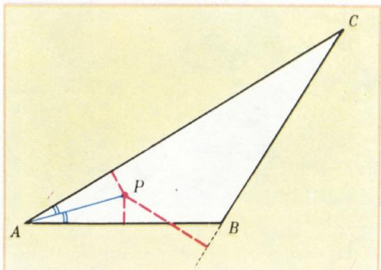
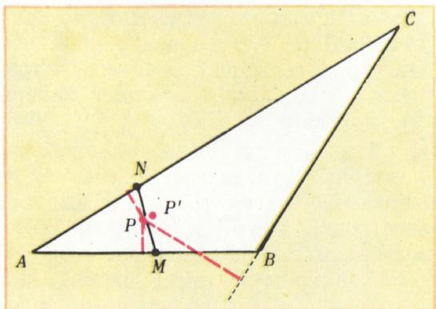
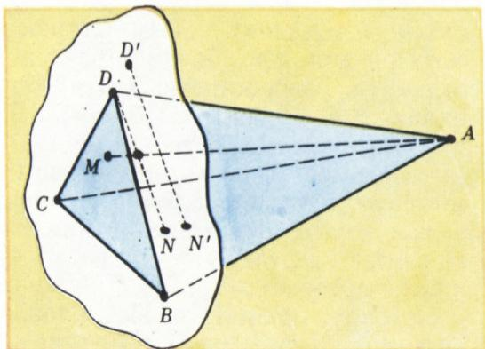
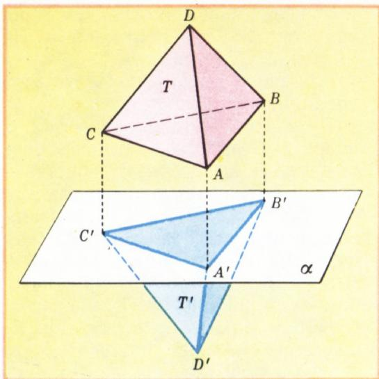
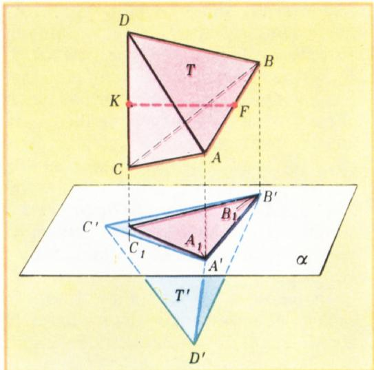
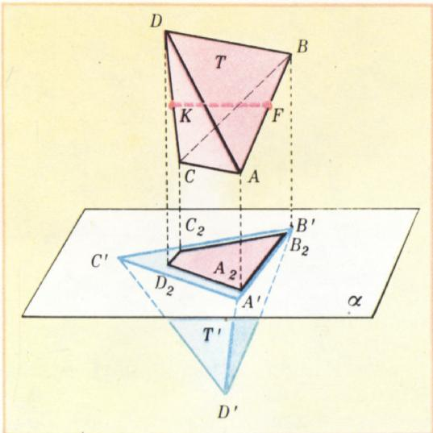
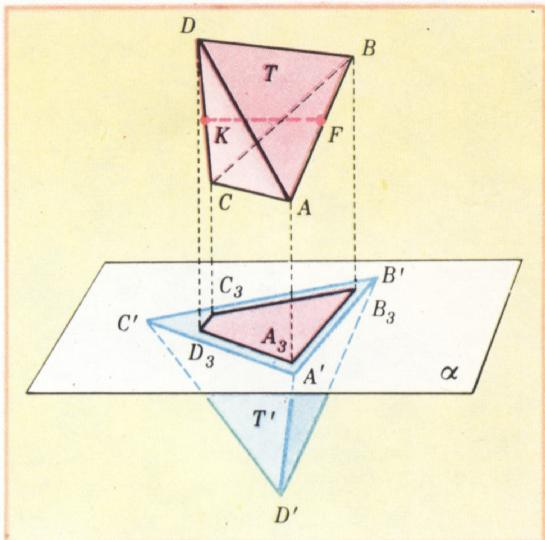
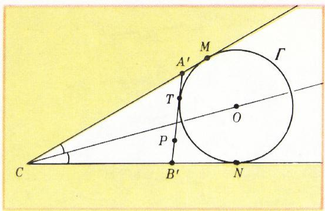
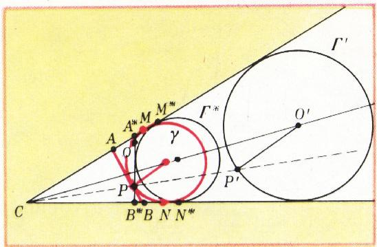

# 微扰法

> **原标题**：Метод малых шевелений
> **作者**：В. Г. Болтянский（V. G. 博尔强斯基，1915—2005，苏联／俄罗斯数学家，专长几何学与最优控制）
> **译自**：Квант 1979, № 4, с. 4–9
> **原文扫描**：https://www.kvant.digital/data/kvant_1979_4/jpg/0004.jpg
> **主题**：数学思维方法——几何对象的「小扰动」、稳定／不稳定性质、寻求反例与最优图形
> **难度**：★★（文字初高中可读；个别立体几何题与代数练习需稍多琢磨）
> **译者**：Claude（初译）／ 2026-06-25

---

## 微扰法

在检验几何命题是否可信、在寻找反例时，数学家常这样推想：

> 我先取一个命题成立的情形，然后把一个点（或一条线段，或某个点集）「扰动」一下。能否用这种方式，得到一个命题不再成立的情形？

先看一个简单的例子。

**题 1.** 自位于凸多边形内部的点 $P$，向它的各边或边的延长线作垂线。我们约定：若垂足落在边上，就称该垂足为「好的」；否则称为「坏的」。是否任一多边形的任一内点都至少有两个好的投影？

**解.** 先取一个三角形 $ABC$ 作为所求凸多边形。若它是锐角三角形，则其任一内点的所有投影都是好的。设 $\triangle ABC$ 是钝角三角形。在这种情况下，不难在其内部取一点 $P$，使它有两个好的投影（图 1）。现在也不难构造一个凸四边形以及其周界上的一点，使该点只有一个好的投影。例如，图 2 中的四边形 $MNCB$ 就是这样的（$MN$ 是任一条把投影 $A'$、$B'$、$C'$ 都留在其外侧的直线）。其周界上的点 $P$ 只有一个好的投影（这投影就是 $P$ 点本身）。但点 $P$ 不在多边形 $MNCB$ 的内部。所以我们来「扰动」点 $P$——把它稍稍向四边形内部移动。当点 $P$ 受到的小扰动足够小时，它的各投影也只会受到小的扰动。因此，在足够小的扰动下，那些在扰动之前是坏的投影，扰动之后仍将是坏的。于是，扰动点 $P$ 之后，我们在四边形内部得到一点 $P'$，它恰好只有一个好的投影（即落在边 $MN$ 上的那个投影）。

*图 1*

**题 2.** 已知在任一三角形中，三条高（或它们的延长线）交于一点。对于四面体，类似的命题是否成立：「任一四面体的所有高（或它们的延长线）有公共点」？

**解.** 任取一个四面体 $ABCD$，在其中作高 $AM$ 与 $DN$（图 3）。现在扰动这个四面体：把顶点 $D$ 移到位置 $D'$，但 $D'$ 仍在平面 $BCD$ 上。在新四面体 $ABCD'$ 中，高 $AM$ 不变（因为平面 $BCD$ 与 $BCD'$ 重合），即这条高「承受住了」$D$ 点在平面 $BCD$ 上的扰动。而与此同时，新四面体的高 $D'N'$ 却可以移到与 $DN$ 平行的任一位置（只要离 $DN$ 足够近）。由此可见，借助 $D$ 点的扰动，可以得到一个高 $AM$ 与 $D'N'$ 没有公共点的四面体（即使在原来的四面体中高 $AM$ 与 $DN$ 是相交的）。所以，与三角形三高共点的定理相类似的命题，对任意四面体并不成立。

*图 2*

**题 3.** 是否存在一个有界的凸多面体，它在任一平面上的正交投影都是一千九百七十九边形？（编辑部按：本题系新西伯利亚的读者 А. 库兹明内赫寄来。）

假设这样的多面体存在。与其把这个多面体投影到形形色色的平面上，倒不如给它以各种不同的空间位置、而把它投影到一个固定的平面 $\alpha$ 上，这样对我们更方便。

先把我们的多面体放置得使它的一条棱——比如说 $A_1A_2$——垂直于平面 $\alpha$。在这个位置上投影时，顶点 $A_1$、$A_2$ 会重合成某一个一千九百七十九边形 $P_1P_2\ldots P_{1979}$ 的同一个顶点 $P_1$。

现在扰动一下多面体，使棱 $A_1A_2$ 不再垂直于平面 $\alpha$，并使顶点 $A_1$、$A_2$ 投影成投影多边形的两个不同顶点。如果这个扰动足够小，则各个互不相同的顶点 $P_i$、$P_j$ 仍将是顶点（不会「缩到内部」），并且仍然互不相同。于是在新的位置上，我们的多面体至少投影成一个一千九百八十边形。矛盾！

*图 3*

故所求的多面体不存在。

从这几个简单例子中，已经能看出此处所用「微扰法」的要旨。几何对象的性质可分为两类：**稳定的**——在图形的一切（足够小的）扰动下都保持的性质；以及**不稳定的**——在某个小扰动下就会被破坏的性质。例如，在题 1 中，「投影到边的延长线上」这一性质是稳定的，而「位于多边形的周界上」这一性质是不稳定的。在第三题中，「多面体两个顶点的投影互不相同」这一性质是稳定的，而「两个顶点的投影重合」这一性质则是不稳定的。请你自己判断：在题 2 中，哪些性质是稳定的、哪些是不稳定的。

因此，当我们寻找具有某一组性质的图形时，可以先确保所需的各种**稳定**性质成立，然后再用适当的小扰动来消去我们不想要的那些**不稳定**性质。

现在来解一道较难的题：

**题 4.** 能否在一个正四面体中打一个贯通的孔（不一定是圆孔），使一个同样大小的正四面体能从中穿过？

我们先解一道与之相关的数学题：

*图 4*

**题 4а.** 能否在空间中放置两个全等的正四面体，使得把它们正交投影到某一共同的平面上时，其中一个四面体的投影整个地（连同边界）落在另一个四面体的投影内部？

**解.** 把四面体 $T'$ 放得使其面 $A'B'C'$ 位于投影平面 $\alpha$ 上（图 4）。把第二个四面体 $T$ 先放置得使其面 $ABC$ 在平面 $\alpha$ 上的投影与三角形 $A'B'C'$ 重合。现在我们来扰动四面体 $T$，设法使它在平面 $\alpha$ 上的投影整个地落在三角形 $A'B'C'$ 内部。首先把四面体 $T$ 转一下，使顶点 $C$ 的投影落在三角形 $A'B'C'$ 内部。这一点可以这样做到：把四面体 $T$ 绕棱 $AB$ 转，转到使棱 $CD$ 垂直于平面 $\alpha$ 的位置。这时四面体 $T$ 的投影是一个等腰三角形 $A_1B_1C_1$，其中 $|A_1B_1| = |A'B'|$（图 5）。

*图 5*

现在再扰动四面体 $T$，使棱 $AB$ 的投影比线段 $A'B'$ 短。为此，标出棱 $AB$ 与 $CD$ 的中点 $F$ 和 $K$，并把四面体 $T$ 绕直线 $FK$ 转一个小角度。经过这次扰动之后，四面体 $T$ 在平面 $\alpha$ 上的投影是一个梯形 $A_2B_2C_2D_2$（图 6）。若转角足够小，这个梯形将位于三角形 $A'B'C'$ 内，并且其一边 $A_2B_2$ 落在该三角形的边界上。

要使梯形整个落在三角形 $A'B'C'$ 内部，只需对四面体再做一次扰动，即把四面体沿一个与向量 $\overrightarrow{FK}$ 共线的小向量平移一下（图 7）即可。

*图 6*

*图 7*

我们看到，四面体 $T$ 与 $T'$ 可以这样放置在空间中：四面体 $T$ 在平面 $\alpha$ 上的投影整个地落在四面体 $T'$ 在同一平面上的投影的内部。题 4а 已得解。

因此，在四面体 $T'$ 中打一个能让四面体 $T$ 穿过的孔是可能的（在 $T'$ 中打孔的方向应垂直于平面 $A'B'C'$，并使孔在平面 $A'B'C'$ 上的投影是某个把梯形 $A_3B_3C_3D_3$ 整个包含在其内部、又整个位于三角形 $A'B'C'$ 内部的图形）。

当我们需要在某一族图形中选出（构造、找出）那个在某意义上「最优」的图形（例如周长最短、面积最大等）时，微扰法的思想也很有用。在这种问题里，主要

*图 8*

困难在于先猜出正确的答案；微扰法在这方面就可能派上用场：先在给定族中取某个图形，试着用一个小扰动来改善它。如果做不到，那么所取图形很可能就是所求的（当然，随后还须给出严格的证明）。

**题 5.** 在一个小于平角的角 $C$ 内部给定点 $P$。给出一种作图方法：过点 $P$ 作一条直线，使它从角 $C$ 中截出一个周长最小的三角形。

**寻找解法.** 过点 $P$ 任作一条直线 $A'B'$（图 8），并设 $\Gamma$ 是 $\Delta A'CB'$ 的「旁切圆」——与边 $A'B'$ 及边 $CA'$、$CB'$ 的延长线都相切的那一个。先设想圆 $\Gamma$ 位于离 $C$ 「较远」处。三角形 $A'CB'$ 的周长 $2p$ 等于

$$
2p = |A'C| + |CB'| + |A'B'| = |A'C| + |CB'| + |A'T| + |B'T| = |A'C| + |CB'| + |A'M| + |B'N| = |CM| + |CN|.
$$

把相切圆 $\Gamma$ 向顶点 $C$ 靠拢、缩小它的半径。这时线段 $CM$、$CN$ 都会缩短，从而三角形 $A'CB'$ 的周长 $2p = |CM| + |CN|$ 也会缩短。如果点 $P$ 在圆 $\Gamma$ 之外，我们就可以扰动这个圆，使其圆心稍稍靠近顶点 $C$，但点 $P$ 仍保持在圆 $\Gamma$ 之外；这样三角形 $A'CB'$ 的周长便会减小。

> **译者注**：原文此处周长推导中，$|A'T|$、$B'T|$（无前竖线）等记号均为 OCR 残缺，已按圆的切线长相等的标准论证还原为 $|A'T|$、$|B'T|$，并补上前后竖线。下文同理。

这种「在已有三角形之外，另得到一个周长更短的三角形」的可能性，一旦点 $P$ 不再在圆 $\Gamma$ 之外、而是落在这圆上，便会消失。因此可以合理地推测：周长最小的三角形，是在直线 $A'B'$ 恰好与某个过点 $P$ 且与角 $C$ 两边相切的圆相切时取得的。

**解.** 在角 $C$ 内任作一个内切圆 $\Gamma'$，设 $O'$ 为其圆心。再记 $P'$ 为射线 $CP$ 与所作圆的第一个（从 $C$ 算起）交点。在以 $C$ 为中心、系数为 $k = \dfrac{|CP|}{|CP'|}$ 的位似变换下，点 $P'$ 变为点 $P$，因而圆 $\Gamma'$ 变为圆 $\gamma$——一个内切于角 $C$ 且过点 $P$ 的圆。（注意：具备这些性质的圆是唯一的，这同样可由位似考虑得出。）记 $AB$ 为过点 $P$ 所作的圆 $\gamma$ 的切线（点 $A$、$B$ 落在角的两边上）。

证明三角形 $ABC$ 即为所求。事实上，若 $[A^*B^*]$ 是任一异于 $[AB]$ 的、两端点落在角的两边上且过点 $P$ 的线段（图 9），则直线 $A^*B^*$ 不是圆 $\gamma$ 的切线，即它与该圆交于两点 $P$ 与 $Q$。因此三角形 $A^*B^*C$ 的旁切圆 $\Gamma^*$ 可由圆 $\gamma$ 经一个系数大于 $1$ 的位似变换得到。但由此显然有 $|CM^*| + |CN^*| > |CM| + |CN|$（图 9），即三角形 $A^*B^*C$ 的周长大于三角形 $ABC$ 的周长。

*图 9*

微扰法的思想不仅在几何问题中可能有用。举一个例子，看下面的题（《Квант》1974 年第 1 期，第 73 页）：

**题 6.** 三个朋友——阿利克、博里亚、瓦夏——讲述了这样一件事：他们某次一起下了若干盘棋，且每两人之间下的盘数相同。后来在商量谁下得更好、谁该算获胜者时，阿利克对朋友们说：「我输的盘数，比你们每个人输的都少。」博里亚说：「我赢的盘数，比你们每个人赢的都多。」瓦夏则说：「我得分最多。」（赢一盘记 $1$ 分，和棋记 $\tfrac{1}{2}$ 分，输一盘记 $0$ 分。）这样的比赛真的可能存在吗？若不可能，请证明；若可能，请举例。

**解.** 我们试着来构造一届满足上述三项条件的比赛：

I. 阿利克输的盘数最少。

II. 博里亚赢的盘数最多。

III. 瓦夏得分最多。

我们用一个个「轮次」来拼出它（一个轮次有三盘棋——每两人之间各下一盘）。比如，可以有这样的轮次：阿利克与另外两人都和棋，而博里亚赢了瓦夏。也可以是这样的轮次：阿利克与另外两人都和棋，而瓦夏赢了博里亚。把这样两个轮次配成一对，称为「阿利克型」的双轮次（「А 型」）。仅由一个这样的双轮次组成的比赛，显然满足条件 I：阿利克输的盘数（$0$ 盘）比其他人都少；此时每人各得 $2$ 分。由任意多个这样的「А 型」双轮次组成的比赛都会具有性质 I。

设一届比赛由许多个「А 型」双轮次组成——比如 $100$ 个。在其中，每人各得 $200$ 分，且阿利克输的盘数最少——$0$ 盘（但他赢的也是 $0$ 盘），而博里亚与瓦夏各有 $100$ 胜 $100$ 负。

现在对这届比赛做一点小扰动：再下数量不多的几个轮次（不必是「А 型」）。这样，阿利克输的盘数仍会比博里亚少、也比瓦夏少（换言之，比赛的小扰动下性质 I 是「稳定的」）。把这次扰动安排得使条件 II 也成立。为此，先设想一个「瓦夏型」的双轮次（「В 型」）：其中每两人之间各下两盘，瓦夏四盘全和，阿利克与博里亚各一胜一负；三个棋手各得 $2$ 分。若（在上述 $100$ 个「А 型」双轮次之后）又下了，比如说，$10$ 个「В 型」双轮次，那么经过这一小小的「比赛扰动」，阿利克有 $10$ 负，博里亚有 $110$ 负，瓦夏有 $100$ 负，即性质 I 保持不变。与此同时，博里亚有 $110$ 胜——多于阿利克（$10$ 胜）和瓦夏（$100$ 胜）。故条件 II 也成立。此外，最后每人各得 $220$ 分（所以条件 III 暂时还不满足）。

对刚得到的这届比赛，再做一次小扰动：再加一个任意单轮次；无论其结果如何，条件 I 与 II 都仍然成立（这两个条件是稳定的）。把这个附加轮次安排得让瓦夏在该轮中的得分高于其他任何人（例如，瓦夏在该轮得 $2$ 分——他赢了阿利克和博里亚，而阿利克与博里亚之间下成和棋）。这样一来，我们就构造出了一届三项条件 I、II、III 都成立的比赛，也就是说，题中所说的那种比赛是可能的。

## 练习

1. 在四边形 $ABCD$ 中，两条对角线互相垂直且相等，此外还有 $|AB| = |CD|$。这个四边形一定是正方形吗？

2. 在一个凸五边形中，各边都相等。这个五边形一定是正五边形吗？

3. 在一个凸五边形中，各对角线都相等。这个五边形一定是正五边形吗？

4. 在一个凸六边形中，对边两两平行，而连接对顶点的对角线都相等。这个六边形一定是正六边形吗？

5. 一个四边形外切于圆，且其两条对角线相等。这个四边形一定是梯形吗？（提示：从正方形出发！）

6. 平面上给定 $2n$ 个点 $A_1, \ldots, A_n, B_1, \ldots, B_n$。证明：经适当的小扰动这些点，可使得线段 $A_1B_1, \ldots, A_nB_n$ 中没有任何两条平行，也没有任何三条共点。

7. 空间中给定 $n$ 个点 $A_1, \ldots, A_n$。证明：经适当的小扰动这些点，可使得对任意四个互不相同的下标 $i, j, k, l$，点 $A_i, A_j, A_k, A_l$ 都不共面。

8\*. 给定一个凸 $n$ 边形 $M$。证明：经扰动其 $n - 5$ 个顶点，可使它的任何三条对角线都不共点。

9. 给定多项式

$$
x^{n} + a_{1} x^{n - 1} + \dots + a_{n - 1} x + a_{n}.
$$

证明：经对常数项 $a_n$ 的小「扰动」，可使该多项式没有重根。（提示：数 $x_0$ 是多项式的重根，当且仅当它同时是该多项式及其导数的根。）

10. 在小于平角的角 $C$ 内给定点 $P$。作一条过点 $P$ 的直线，使它从角 $C$ 中截出一个面积最小的三角形。

11. 若四边形是凸的，则其两条对角线长度之和大于它的半周长。请给出一个反例，说明其逆定理不成立。

\*) 并参见习题 M533（《Квант》1978 年第 11 期）。

---

## 译者注与校对说明

1. **标题译法**：俄文 *шевеление*（动词 *шевелить*）意为「轻轻挪动、微微动一下」，直译「小挪动法」。本文方法在汉语数学文献中通常称作「微扰法」「小扰动法」或「摄动法」，此处取「微扰法」一名，兼顾直观与通行。
2. **OCR 校正**：本文由 MinerU 对扫描页做俄文 OCR 后翻译。已校正若干 OCR 错误：题 1 中 *приятной*（好的）与 *неприятным*（坏的）的 *при-* 前缀被 OCR 多处误识为 *prin-*；个别处 *прият-* 误作 *прия-*、*проекцию* 误作 *проецию*（垂足／投影）；题 6「得分最多」处的小数 $\tfrac{1}{2}$、$0$ 等均据上下文还原；题 5 周长推导中切线长记号 $|A'T|$、$|B'T|$、$|A'M|$、$|B'N|$ 前后竖线在 OCR 中残缺，已按标准论证补齐；练习 5 提示中 OCR 出现 *сквадрата*（= *с квадрата*，从正方形出发）的拼写粘连，已还原；练习 10 *В нутри* 应为 *Внутри*（在……内），已校正。文末「建议购买」广告栏（杂志原始内容）按要求略去不译。
3. **术语**：核心术语 *шевеление* = 扰动／微扰；*выпуклый* = 凸；*ортогональная проекция* = 正交投影；*конгруэнтный* = 全等；*гомотетия* = 位似变换；*вневписанная окружность* = 旁切圆；*вписанная окружность* = 内切圆；*тетраэдр* = 四面体；*многогранник* = 多面体。术语遵照《01_工作规范.md》对照表。
4. **图表**：原文共 9 幅插图（图 1—9），由 MinerU 从整页扫描 `p4.jpg`–`p9.jpg` 中自动裁出，存于 `images/ext_X44/fig_pXX_NN.png`（命名见 `meta.json` 中 `figures[].std_name`）。译文按文中出现顺序引用；个别图（如图 6、图 7）原页跨栏排版，OCR 切分后即为两幅独立插图，已照常引用。
5. **题 6 的记分与轮次**：原文用「双轮次」（двойной тур）构造比赛——一个双轮次含两轮、共六盘棋；「А 型」双轮次使阿利克维持零负，「В 型」双轮次使瓦夏四和、阿利克与博里亚各一胜一负。译文照此直译，未改其计数。如对计数细节存疑，可对照 `ru.md` 第 153—164 行。
6. **公式核对**：题 3 中 $1980 = 1979 + 1$ 的计数、题 5 中 $k = |CP|/|CP'|$ 的位似系数、题 6 中 $100 \times 2 = 200$ 分与 $10 \times 2 = 20$ 分等算术，均与扫描页核对一致。

## 建议讨论题

1. 博尔强斯基把几何性质分成「稳定的」和「不稳定的」两类。你能再举一两个课本里的几何命题，分辨其中哪些条件是稳定的、哪些是「差一点就崩」的不稳定条件吗？
2. 题 4 把「在正四面体中打一个能让同样大小的正四面体穿过的孔」这个直观问题，转化为题 4а「两个全等正四面体的投影包含关系」这个平面投影问题。这种「把立体问题投影到平面上来想」的思路，你们还在哪些问题里见过？
3. 题 6 的「比赛」是用微扰法一个性质一个性质地「凑」出来的。如果再添第四位棋手、第四个条件，你打算怎样按同样的「先稳定、后不稳定」的次序去构造？
4. 练习 9 说，对常数项做一点点扰动就能消除多项式的重根。这与「重根是多项式与其导式的公共根」有什么关系？扰动之后，原来的重根会变成什么样的两个根？

---

> **版权说明**：原文版权归 MCCME（莫斯科连续数学教育中心）及作者继承者所有。本译文为非商业、自用、数学圈内部参考，未获授权不得公开分发。原文扫描见 [kvant.digital](https://www.kvant.digital/data/kvant_1979_4/jpg/0004.jpg)。

> **复用说明**：本译文的俄文 OCR 原文与所有插图均存档于 `ocr/ext_X44/`（`ru.md` 为合并 OCR 文本，`meta.json` 为图映射）。如对译文质量不满意，可直接基于 `ocr/ext_X44/ru.md` 重译，无需重跑 OCR；插图按 `meta.json` 中 `figures[].std_name`（即 `images/ext_X44/fig_pXX_NN.png`）引用即可。
