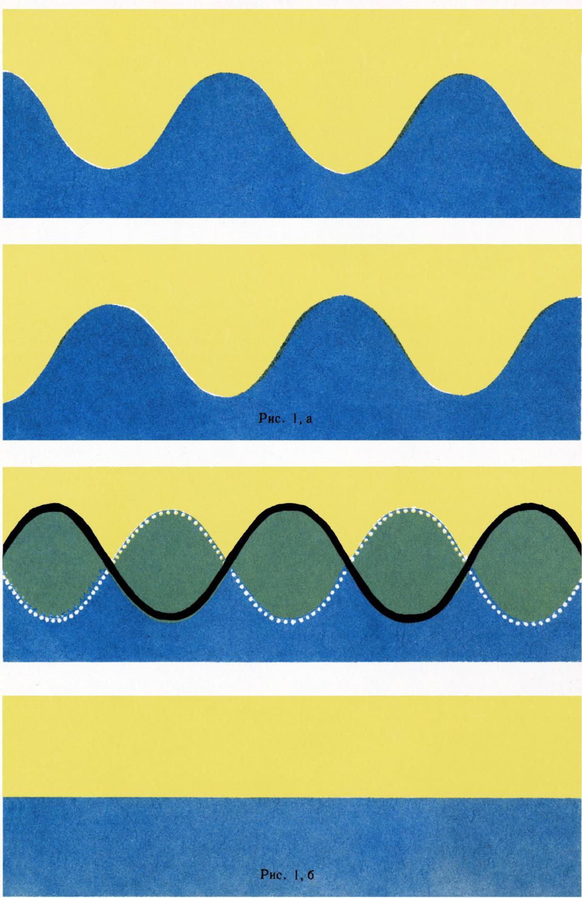
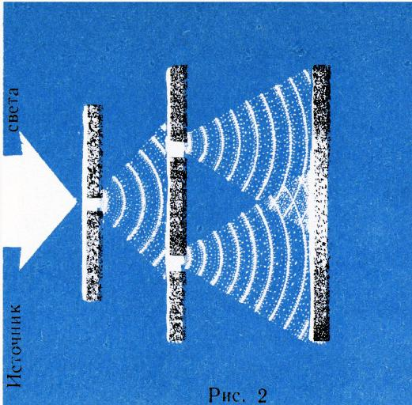
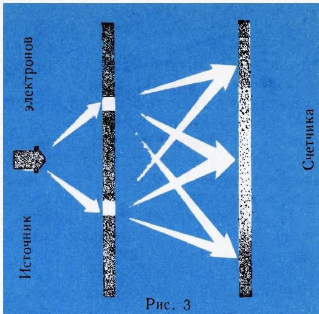

# 列宁的哲学思想与现代物理学的发展

> **原标题**：Философские идеи В. И. Ленина и развитие современной физики
> **作者**：И. К. Кикоин（I. K. 科科因／基科因，1908—1984，苏联物理学家、科学院院士，长期领导中学物理教材编写）
> **译自**：Квант 1970, № 4（为纪念列宁诞辰 100 周年而作）
> **原文扫描**：https://www.kvant.digital/data/kvant_1970_4/jpg/0001.jpg
> **主题**：列宁《唯物主义和经验批判主义》与认识论中的实践标准；相对论与量子力学革命；波粒二象性与测不准关系；唯物辩证法对现代物理学的意义
> **难度**：★★★（哲学与物理概念并重，需理解相对论、量子力学、波粒二象性、测不准关系等）
> **译者**：Claude（初译）／ 2026-06-25

---

> *人的头脑在自然界中发现了许多奇迹，并将发现更多，从而不断扩大自己对它的支配……*
> ——В. И. 列宁
>
> 1870—1970

物理学在众多的自然科学中占据着特殊的地位。物理学的这种特殊性，在于它研究的是物质的那些最简单、同时又最一般的性质。因此，物理学不可避免地要渗透进自然科学的任何一个分支。如今，生物物理学、地球物理学、天体物理学、化学物理学以及种种其他「某某物理学」，都已获得了公认的学科地位。

众所周知，物理学是技术之母。这一点历来如此，而到了近几年，随着核技术、电子技术、激光技术等等的诞生，这一点变得尤为明显。

物理学内容如此之广、如此之一般，必然会把它引向研究最一般的认识论问题的哲学。整个物理学发展的历史都说明了这一点。

每当物理学引入一些此前人们并不熟悉的新概念、新观念时，物理学总是与哲学紧密地交织在一起。

物理学与哲学的联系，在 20 世纪奠定现代物理学基础——关于物质结构的学说、相对论和量子力学——的时候，表现得尤为清晰。

物理学与认识论之间的这种紧密联系，是一种历史的必然。因此，物理学家们在试图弄清自己这门科学的状况时，经常求助于哲学，也就毫不奇怪了。许多最杰出的物理学家都出版过专门的哲学著作。

弗拉基米尔·伊里奇·列宁不仅是一位伟大的政治家和国务活动家，而且是一位伟大的科学家、科学共产主义的奠基人。物理学无论在技术发展还是在哲学发展中所起的那种特殊作用，正是列宁高度关注新物理学问题的原因（也许，列宁对物理学的兴趣在某种程度上也受到这样一点的影响：他的父亲伊利亚·尼古拉耶维奇·乌里扬诺夫是一位物理教师）。

列宁的治学方法，尤其令物理学家们感到亲切。在自己的理论科学工作中，列宁总是把经验、把实践作为真理的标准来依靠。列宁引用恩格斯的话，对「实践标准」这一思想作了如下阐明：「当我们按照我们所感知的某一物的特性来利用它的时候，我们就在这一时刻对我们的感官知觉的真伪作了无误的检验……（黑体为我所加。——伊·科）……我们行动的成功，证明着我们的知觉与所感知的物的『客观的』(gegenständlich)本性相符合」\*）。

这里便产生了一个问题。科学史上有不少例子表明，从现代观点看显然是错误的某些科学家的观念，却仍然导致了「我们行动的成功」。

举一个例子。在旧的磁学理论中，一块磁化的钢被视为一个磁偶极子，由两个磁极或者说两个「磁荷」（类比电偶极子）组成。物理学家正是借助这一观念创立了磁静电学，而一切使用磁铁的实践和技术都是建立在这门学科之上的。这一实践出色地证实了「磁荷」理论。然而现在已尽人皆知，实际上根本不存在任何磁荷。如今人们谈到磁极时，总要特地声明，这是一个虚构的概念。

如此看来，实践标准似乎不能作为弄清我们对某一事物的观念是否可靠的坚实基础？这当然不是一个无谓的问题。

当代最杰出的理论物理学家之一理查德·费曼（R. Feynman），在试图弄清物理定律的哲学解释究竟意味着什么时，用下面这个例子来说明这一问题的重要意义。

「让那些坚持『理论与实验的相符才是唯一重要的』的人，去想象一位玛雅天文学家同他的学生之间的一场对话吧。玛雅人能够以惊人的精度预言，例如日食的时刻、月球和金星及其他行星在天空中的位置。这一切都是借助算术运算完成的……他们对于天体的旋转毫无概念。

想象一下，有一位年轻人来见我们的这位天文学家，说道：『我忽然想到一个念头。也许这一切都在旋转，也许它们是一些石球……它们的运动完全可以换一种方法来计算。』当得知这位年轻人还没有走到行星运动的计算这一步时，玛雅天文学家会回答他说：我们本来就能足够精确地算出日食，所以你大可不必为你的那些念头操心。

可见，」费曼总结道，「要决定到底该不该去思考隐藏在我们的理论背后那些东西，这并不是一件容易的事。」

这确实不是一件容易的事。因为，如果毫无保留地接受「实践是真理的标准」这一论断，那么正如上面两个例子所表明的，这样的论断有可能导致科学上的停滞。

这一难题，被 В. И. 列宁出色地解决了。

在断言「生活和实践的观点应当是认识论的首先的和基本的观点」的同时，列宁补充了下面一段意味深长的话：

「……当然，在这里不要忘记：实践标准实质上决不能完全地证实或驳倒任何人类的表象。这个标准也是这样的『不确定』，以便不让人的知识变成『绝对』，同时它又是这样的确定，以便同唯心主义和不可知论的一切变种进行无情的斗争……」

「……由此，」列宁继续说，「就得出了唯一地通向这个真理的道路，这就是站在唯物主义观点上的科学的道路」\*）（黑体为我所加。——伊·科）。

于是，上述那个难题就被列宁解决了——他指出了应当如何把辩证法应用于认识论。

绝大多数物理学家，无论自觉与否，正是在以列宁这样理解的实践标准为指导。

经验是列宁阐述自己哲学观点基础时可靠的支柱。下面的例子就说明了这一点。

列宁认为，有必要用科学史（也就是物理学家所说的实验检验）来检验辩证法的一个基本命题——所谓「对立面的统一」。列宁的那篇札记《谈谈辩证法问题》正是这样开头的：「统一物之分为两个部分以及对它的矛盾着的部分的认识……是辩证法的实质（是辩证法的『本质』之一，是它的主要的特征或特性之一）……辩证法这一内容的这一方面的正确性必须由科学史来检验」\*\*）。

列宁的这一论述并非一句空话。这样的检验，他本人就在自己 1908 年写成的《唯物主义和经验批判主义》一书中付诸实施了。

В. И. 列宁赋予这一任务多么重要的意义，可以从他《我们的取消派》（1911 年）一文中的下面这段话看出：「这种哲学上的『清理』早就酝酿成熟了……例如，由于新物理学提出了一系列新问题，辩证唯物主义就不得不去『对付』它们」\*\*）。

而列宁确实在自己的这部经典著作《唯物主义和经验批判主义》中出色地对付了这一问题；这部著作对科学的发展产生了、并且继续产生着巨大的影响。

这部写于物理基本观念急剧更替年代里的著作，对当时物理学的状况作出了透彻的哲学分析。如今，大多数物理学家都不再怀疑，用杰出物理学家马克斯·玻恩（M. Born）的话说，「物理学需要一种概括性的哲学」。正是 В. И. 列宁，第一次在这部书中给出了这样一种概括性的物理学哲学。

从那时起，物理学的基本观念发生了根本性的变化。众所周知，列宁把 19 世纪最后三十年和 20 世纪初物理学所取得的成就称为「巨大的、令人眼花缭乱的」成就。对于这部书问世后随后的六十多年里物理学所取得的成就，这种评价就更为恰切了。

本世纪的开端，是以物理学上一场最伟大的革命为标志的，这场革命在时间上与俄国的第一次无产阶级革命恰相重合。1905 年，爱因斯坦那篇著名的论文《论动体的电动力学》发表了，它是狭义相对论的基础。我们这里不可能详细地阐述这一理论。它的基本思想，是这样一个「简单的」想法：在彼此相对运动的参照系中，时间的流逝是不同的。相对论之所以是一场革命，是因为它对时间和空间这两个基本的哲学概念和物理概念作出了根本性的改变。如今，在 1970 年，当相对论的基础已经开始在中学物理课程中讲授，当建立在相对论直接推论之上的核技术已经广泛发展的时候，当年它起初被物理学家「迎头」抵制，似乎令人难以置信。许多物理学家对相对论的出现表示过愤慨。甚至本世纪初最伟大的物理学家之一、电子论的创立者 Г. А. 洛伦兹（H. A. Lorentz），也没有立刻认识到这一理论的意义。在他 1909 年——也就是爱因斯坦那篇论文发表四年之后——出版的《电子论》一书中，他对相对论只是极其含糊地提了一下。而这正是那位洛伦兹，正是他为相对论锻造了最强大的武器——所谓的「洛伦兹变换」。

后来洛伦兹充分地认识到了相对论的意义。例如，在 1915 年他的著作再版时，洛伦兹指出：「如果现在要我来写这最后一章，我当然会把爱因斯坦的相对论放在一个显要得多的位置上，借助于相对论，运动系统中电磁现象的理论获得了如此的简洁性。」

令人赞叹的是，列宁虽非物理学家，却在爱因斯坦那篇论文发表仅仅两年多一点之后，就用下面这段话评价了它巨大的革命意义和哲学意义：「……把力学的运动规律局限于自然现象的一个领域并把它们从属于更深刻的电磁现象的规律等等，这一切都不过是辩证唯物主义的又一次确证」\*）。

在许多年里，相对论产生了大量的文献，这些文献反映了在哲学和物理两条战线上的激烈斗争。如今这些文献主要具有历史意义，我们就不去多谈它了。但应当提醒的是，В. И. 列宁在后来也继续把相对论的作者视为「伟大的自然科学改造者」。

例如，1922 年在《论战斗唯物主义的意义》一文中，谈到物理学家 А. К. 季米里亚泽夫论述相对论的文章时，列宁写道：「如果季米里亚泽夫在杂志创刊号上不得不声明，那些据季米里亚泽夫本人所说并未对唯物主义基础进行任何积极进攻的爱因斯坦，已经被各国大批资产阶级知识分子所抓住，那么这种情况不仅与爱因斯坦一人有关，而且与 19 世纪末以来一大批、如果不是大多数的话——伟大的自然科学改造者有关」\*）（黑体为我所加。——伊·科）。只有一位伟大的思想家，才能对自己时代科学的状况作出如此透彻的分析。

在物理学上，量子力学也掀起了一场可与相对论相比的革命。前面提到过的理查德·费曼就曾举例说，「……曾经有过那样一段时间，报纸上写道：相对论只有十二个人懂」。费曼不相信这一点，他认为，在科学家们读过爱因斯坦的文章之后，许多人在不同程度上都理解了相对论。「但是，」费曼继续说，「我敢相当大胆地说，谁也不懂量子力学。」

这是一位对量子电动力学的发展作出了巨大贡献的最杰出的理论物理学家之一所作出的非常坦诚的表态，意味深长。

接着费曼解释了所谓「理解」量子力学意味着什么。这意味着要回答这样一个问题：「这怎么可能呢？」

现代物理学就是量子物理学。量子力学的成就可以说是举世无双的。它揭示了原子结构的奥秘。借助于量子力学，可以以任意的精度来计算原子，即算出原子的详细电子结构。这些计算与实验的吻合，其精度令人惊叹。

整个现代的量子电子学及其各种各样的技术应用（激光器、微波激射器等等）——都是量子力学的产物。量子力学还没有成为中学里学习的对象，但它的应用已经在工科高等院校中讲授了。然而尽管如此，这一领域里最权威的人物却断言，谁也不懂它！

让我们试着弄清楚，量子力学之所以不被理解，原因究竟何在。

问题在于，量子力学在其诞生之初就已包含着矛盾。让我们来看看，例如，光的量子本性的最简单表现——光电效应。

爱因斯坦所发展的光电效应理论认为：频率为 $\nu$ 的光流，被看作是「粒子」流——光子，其能量为 $E = h\nu$（$h$ 为普朗克常量）。当光子到达金属表面时，其中一部分会被电子吸收。结果，吸收了光子的电子的动能增加了 $h\nu$ 这么多。拥有这样的能量，电子就有可能脱离金属而飞出。这时它要消耗掉所获得能量的一部分，用于「逸出功」$A$。因此，电子从金属中飞出时所具有的最大动能等于

$$
\frac{1}{2} m v^{2} = h \nu - A.
$$

这就是著名的爱因斯坦光电效应公式，它已被无数实验所证实，并且是该效应不可胜数的应用的基础。

那么，如果深思一下爱因斯坦公式（它也是爱因斯坦在 1905 年得到的）的含义，就会立即看清它的矛盾性。

进入这一公式的量 $E = h\nu$，是「光的粒子」（光子）的能量，而量 $\nu$ 则是由粒子组成的光的频率。但是，频率是表征波的量。光具有频率这一概念，是在 19 世纪确定了光是一个振动传播过程之后才出现的。这样的过程就叫做波。但波，按照这一概念本身的含义，要占据空间的很大区域，严格地说甚至要占据整个空间。而粒子则是某种在空间上定域化的东西，即只占据很小的体积。因此，把光子的能量（也就是粒子的能量）与光波的频率联系起来的那个基本关系式 $E = h\nu$，从「常识」的观点看似乎是荒谬的。

光电现象无可辩驳地证明，光是一股粒子流。

另一方面，也有同样无可辩驳的实验证据表明，光是一个波动过程。事实上，波的最具特征的性质如下：如果把两列波这样叠加在一起，使一列波的波峰与另一列波的波谷相重合（图 1，а），那么振动将完全停止（图 1，б）。反之，当一列波的波峰与另一列波的波峰相重合时，振动就增强。这个人们所熟知的现象叫做波的干涉。可以断言，如果在实验中观察到了干涉现象，那么我们所面对的就是一列波。

*图 1*

光的波动理论是在这样的演示之后才确立于科学之中的：被两个完全相同的光源同时照亮的屏上的某些点，竟是暗的（图 2），而每个光源单独作用时屏却是均匀照亮的。

*图 2*

因此，实践使得人们必须去理解这样一个自相矛盾的事实：光的波动理论和光的量子理论都是正确的，而 $E = h\nu$ 这一公式则把这两种相互矛盾的理论联系了起来。

这种对「常识」的挑战，在 1924 年达到了顶点：那时，「波—粒子」这一二重性概念，通过理论上的论证，被推广到了电子和原子身上。换句话说，原子和电子——它们自被发现之日起就具有粒子的一切属性——应当也像波一样地行为。而不久之后，实验就证实了这些结论。

物理学家们不得不更深入地去思考由此产生的局面，这就导致了现代量子力学（或按它早先的叫法，波动力学）的创立。

量子力学的基础是在 1925—1927 年间奠定的。德国物理学家维尔纳·海森伯（W. Heisenberg）通过对所谓「测不准关系」的表述，对其发展作出了重要贡献；围绕这一关系展开过一场广泛的哲学争论。这一关系把许多知名物理学家引入了哲学唯心主义的阵营。

乍看起来，测不准关系具有如下这样完全无害的形式：

$$
\Delta x \Delta p \geqslant \frac{h}{2 \pi}.
$$

这里 $\Delta x$ 是粒子坐标的不确定度（不准确度），$\Delta p$ 是粒子动量（或速度）的不确定度，$h$ 是普朗克常量。翻译成日常语言，这意味着：不可能在同一时刻精确地知道粒子的位置和速度。换句话说，如果我们试图把粒子固定在某个确定的位置上，那么我们的尝试将导致这样一个结果——我们无法确定它随后将朝哪个方向、以多大速度飞去。反之，如果我们迫使粒子以某个确定的速度非常缓慢地运动，那我们就无法指明它在哪里，也就是说，粒子会显得模糊不清。由此已很容易作出一个明显带有唯心主义色彩的「最简单」结论：人的认识是原则上受限的，因为我们竟然连这样一个简单的问题都回答不了。不仅如此，由此还可以得出一个同样具有唯心主义含义的结论：世界上的事件是不可预言的，也就是说，因果律被破坏了。

的确，我们已习惯了这样一种情况：经典力学使我们能够预言一个物体今后的运动，只要已知它的初始位置和速度，以及作用在它上面的力。整个力学就是建立在这上面的。例如，航天事业的成就正是建立在如下的基础上：知道了火箭的发射点（初始坐标），并给它以某一已知的初始速度，我们就能依据经典力学的规律，事先预言火箭在任何时刻将处于何处。

而服从量子力学的粒子，情况就不同了。既然按照测不准关系，我们不能精确地同时指明它的坐标和速度，那么显然我们也就不能预言它们今后将会如何。不难猜到，这一切都是粒子（电子、原子、中子等）具有波动性质这一事实的后果。

确实如此，让我们来考察下面这个粗略简化、但与实际所做的实验相差无几的实验。想象一下（图 3），由某个源（例如一根灼热的灯丝）所发射的电子，飞过屏上的两个小孔。从每一个小孔出发，电子可以朝各个方向飞去。在屏的后面，我们可以让电子计数器平行于带孔的屏移动。电子计数器能够记录下每一个射入其中的电子。因此，电子的数目是可以直接数出来的。

自然可以认为，每一个进入计数器的电子，都通过了两个小孔中的一个。因此，如果我们数出在第二个孔关闭时通过第一个孔进入计数器的电子数，然后再对第一个孔关闭时通过第二个孔进入计数器的电子数做同样的事，那么我们就有理由期待：当两个孔都打开时进入计数器的电子数，将等于这两次计数读数之和。常识正是这样要求的。我们确信，假如我们用一挺机枪穿过一块带有两个孔的装甲挡板射击，而挡板后面某处放着一个装满沙子的箱子，飞过的子弹便陷在其中，那么情形就会如此。我们可以毫不怀疑：当挡板上两个孔都打开时落入沙箱的子弹数目，等于分别单独打开每个孔时落入同一沙箱的子弹数目之和（当然，这里指的是同一段时间里，譬如说一小时）。

*图 3*

但是当我们用电子来「射击」时，结果却不是这样！不仅如此，还有可能发生这样的情形：安置在合适位置的计数器，在分别单独打开每个孔时记录到相同数目的电子（关闭其中一个孔时），却在两个孔都打开时记录不到任何一个电子（图 3）。

自然会产生这样一个问题：这怎么可能呢？

不难在这里看出与两个相同光源照亮屏时所观察到的相同的现象，也就是干涉现象。

现在让我们试着回答「量子力学为什么不可理解」这一问题。这将有助于我们弄清：一些哲学家和物理学家在分析物理学的现状时所得出的唯心主义结论，其根源究竟在哪里。

理解上述物理现象的基本困难，在于我们在分析它们时，试图去使用我们在日常生活中所习惯的那些概念。人类长达千百年之久的经验导致这样一个结果：人认为对自己来说是可以理解的，是那种他能在头脑中把它想象成一个几何形象或机械形象的东西。这种经验、这种研究周围世界的实践，造就了一系列概念，现实世界就借助它们反映在人的头脑中。但在 20 世纪以前，人类所接触的还只是以相对不大的速度运动的宏观物体。所谓宏观物体，是指那些看得见、能确定其形状和尺寸（即建立几何形象）、并能研究其运动（即建立机械形象）的物体。相应的概念正是适应于这一经验的。

为研究宏观物体的运动而建立的牛顿力学确定：物体的机械状态，是由它的坐标和动量（如果认为物体的质量不变，那就是速度）唯一地确定的。

可是现在我们进入了服从量子规律、不同于牛顿力学的那个对象的世界。人类的经验还来不及为这一世界创造出相应的对象形象和概念。

如果实验表明，这些对象既具有粒子的性质，又具有周期性波的性质，那么实际上它们既不是波也不是粒子，而应当是某种别的东西，是「对立中的统一」。而且，如果仔细地考察那些所谓「电子是通常的机械粒子」的实验证据，我们就会确信，这些证据都是相当间接的。多半只是物理学家们对物质原子结构的深刻信念，才使他们得出这样的结论：用电子（也包括原子）所做的实验，表明它们是通常机械意义上的粒子。

即使是爱因斯坦，也无法摆脱对电子运动的「机械」观点。他常常摇着头说：「上帝总不会靠掷『正面—反面』来决定电子该往哪里走吧。」

在我们这个时代，原子、电子、质子真实存在的确实程度，已可与天文学中哥白尼体系的确实程度相媲美。但这并不意味着，我们可以把这些对象想象成天体的一个缩小了的模型。我们至今仍根本无法把它们想象出来；它们什么也不像。而这并不是大自然的过错！

当然，如果认为大自然应当迁就人类的理智，以便他能形象地想象出它的一切对象，那将是哲学唯心主义的最高表现。正是因为我们不能把量子对象想象成几何形象和机械形象，我们才认为它们是不可理解的。

但既然如此，那我们又有什么根据去假定：量子对象的运动状态，应当由那些决定通常物体状态的同样的量——即坐标和动量——来决定呢？总之，「某一时刻的坐标和动量各为何？」这一问题，用到量子对象上就是一个不合法的问题。要知道，并不是任何问题都是合法的。例如，「普尔科沃子午线是什么颜色的？」这个问题就无法回答。但由此并不能得出人的认识能力有限的结论！

看来，「电子的坐标和动量各为何？」这个问题，也同样是同样程度地不合法的。

对于量子力学中所形成的局面，列宁就一个类似场合所说的话，再恰当不过地适用了：「物体在自然界中的运动，转化为不是具有不变质量的物体的运动，转化为未知的电的未知电荷在未知以太中的运动，——这种在实验室和工厂里进行的物质转化的辩证法，在唯心主义者眼中（也和在广大公众的眼中，也如在马赫主义者眼中那样），不是唯物主义辩证法的确证，反而是反对唯物主义的论据……」\*）。从上面所说的可以看出，量子力学的「不可理解性」丝毫不为关于认识自然的能力有限的唯心主义结论提供任何根据。

关于破坏因果律、即关于事件不可预言的唯心主义结论，同样是毫无根据的。

按照量子力学，一个系统的状态完全由一个特殊的量——所谓的波函数——来确定。对于波函数，存在一个方程；解出这个方程，物理学家就完全能够预言他将会得到怎样的实验结果。而且从来没有出现过量子力学的方程使实验者失望的情况！

列宁关于他自己那个时代的新物理学所作的下面这段论述，在这里完全贴切：「……这一切都比旧的力学深奥得多，但这一切都仍然是物质在空间和时间中的运动」\*\*）。

在我们今天，全世界越来越多的物理学家站到了辩证唯物主义的立场上。列宁在他那个时代曾指出，他那个时代的物理学家们未能「从形而上学的唯物主义直接而迅速地上升到辩证唯物主义」。但他预见到，「这一步，将由、并且正由现代物理学来完成」。

列宁的这一预见应验了！

---

## 两个传说

人们知道，俄罗斯杰出数学家米哈伊尔·瓦西里耶维奇·奥斯特罗格拉茨基（М. В. Остроградский）的才华，早在旅居巴黎期间就已显露出来。关于奥斯特罗格拉茨基旅居巴黎的细节，并不确凿可考，尽管流传着两个传说。下面就是这两个传说。

当奥斯特罗格拉茨基在赴巴黎途中被他的同行旅伴洗劫一空之后，他并没有返回家乡，而是「以步行的方式」继续他的行程，一文不名地到达了旅行的目的地。在巴黎，他到拉普拉斯（Laplace）家里当了仆人。

那时，拉普拉斯一直忙于求解天体力学中一个十分困难的问题。他一连好几天在算，用粉笔写满了一大块板子，但计算实在太长，拉普拉斯始终未能得到他所希望的结果。当他某一天回到家里，看到那块板子上已把他公式的变换算到了底，并得到了他早已预见到的结果时，他该是多么惊奇、多么高兴啊！当拉普拉斯得知这一结果是由他的仆人得出的时候，他更是惊诧不已。

下面是另一个传说。

拉普拉斯有一个习惯，就是给学生布置要在课堂上求解的题目。有一阵子他开始注意到：每次他刚把题目口授完，便有一个「头顶一大蓬头发」的高大身影站起来，回答所提的问题。有一次过后，拉普拉斯对这位「高大身影」产生了浓厚的兴趣，便把他请到家中。原来，此人不是别人，正是米哈伊尔·瓦西里耶维奇·奥斯特罗格拉茨基。

情形究竟是否如此，还是另有所本，我们不得而知；但两位大学者成了挚友，这却是事实。

---

## 译者注与校对说明

1. **背景说明**：本文为《Квант》杂志 1970 年第 4 期为纪念列宁诞辰 100 周年（1870—1970）而发表的特约文章。作者是苏联著名物理学家 И. К. 科科因（基科因），长期主持苏联中学物理教材的编写工作。文中大量引用列宁《唯物主义和经验批判主义》《谈谈辩证法问题》《论战斗唯物主义的意义》《我们的取消派》等著作的论述，并保留苏联科学时代的时代用语与背景。
2. **OCR 校正**：本文由 MinerU 对扫描页做俄文 OCR 后翻译。已校正若干 OCR 错误，主要包括：断行拼接（如 p4→p5 的 «ус-»/«пех»、p5 顶部行；p6 顶部的 «дальн-ейшем» 之类断词；p7→p8 的 «ме-»/«ханики»、«неоп-»/«ровержимо»、«неоп-ределенность» 等）；公式中字母 v（俄文频率 $\nu$）已据上下文还原为 $\nu$（普朗克—爱因斯坦关系 $E=h\nu$、爱因斯坦光电方程 $\tfrac12 mv^{2}=h\nu-A$ 中的 $v$ 为电子速度，原 OCR 一律作 v，已区分）；脚注星号 `\*）`/`\*\*）` 原指向页脚，正文内予以保留以标示引文出处。
3. **物理术语**：遵循术语对照表，关键术语译法如下：фотон＝光子，частота＝频率，волна＝波，длина волны（隐含）＝波长，интерференция＝干涉，магнитный полюс/заряд＝磁极／磁荷，диполь＝偶极子，фотоэффект＝光电效应，работа выхода＝逸出功，постоянная Планка＝普朗克常量，уравнение неопределённости／соотношение неопределённости＝测不准关系（海森伯不确定性关系），координата＝坐标，импульс＝动量，скорость＝速度，волновая функция＝波函数，принцип причинности＝因果律／因果性原理，диалектический материализм＝辩证唯物主义。
4. **图表**：原文共三幅插图（图 1、图 2、图 3），由 MinerU 从整页扫描中自动裁出，存于 `images/ext_X47/fig_p9_01.png`、`fig_p10_01.png`、`fig_p11_01.png`。图 1（p9）原文未明确题注，正文描述为两列波的相消与相长干涉；图 2（p10）为双光源干涉示意；图 3（p11）为电子双孔实验示意。图注据正文内容补全，图号、内容均与扫描页一致。
5. **引文出处**：原文所有列宁引文均带脚注星号（`\*）`、`\*\*）`），分别引自《唯物主义和经验批判主义》《谈谈辩证法问题》《论战斗唯物主义的意义》《我们的取消派》等。中文译文参考了中共中央编译局《列宁全集》相应篇目的通行译法，但为保持与本文俄文语境一致，个别字句作了贴近原文的直译。
6. **章节完整性**：已对照 `ru.md`（p1、p4—p13 共 9 个 OCR 页块）逐段核对，列宁哲学部分（p4—p8 正文、p8—p12 续）与《两个传说》短文（p13）均无遗漏。

## 建议讨论题

1. 列宁认为实践标准既是「不确定的」（不使知识变成「绝对」），又是「确定的」（足以与唯心主义作斗争）。请用自己的例子说明，为什么这两种性质同时成立？
2. 爱因斯坦光电效应公式 $E=h\nu$ 中，$E$ 是「粒子」的能量而 $\nu$ 是「波」的频率。科科因据此说这个公式「从常识的观点看似乎荒谬」。你能想清楚「波」和「粒子」在空间分布上的根本对立之处吗？
3. 文中那个「电子双孔实验」（图 3）里，两个孔都打开时计数器反而记录不到电子——作者说这与两束光的干涉是同一现象。请试着用「波叠加相消」来解释，为什么电子计数会变少甚至为零？
4. 海森伯测不准关系 $\Delta x\,\Delta p\geqslant h/2\pi$ 曾被一些物理学家用来导出「人的认识有限」「因果律失效」的唯心主义结论。科科因借助列宁的论述反驳了这些结论。请思考：问「电子此刻的精确坐标和动量各为何」这一问题，是否真的合法？它与「普尔科沃子午线是什么颜色」这一问题有何相似之处？

---

> **版权说明**：原文版权归 MCCME（莫斯科连续数学教育中心）及作者继承者所有。本译文为非商业、自用、数学／物理圈内部参考，未获授权不得公开分发。原文扫描见 [kvant.digital](https://www.kvant.digital/data/kvant_1970_4/jpg/0001.jpg)。

> **复用说明**：本译文的俄文 OCR 原文与所有插图均存档于 `ocr/ext_X47/`（`ru.md` 为合并 OCR 文本，`meta.json` 为图映射）。如对译文质量不满意，可直接基于 `ru.md` 重译，无需重跑 OCR。
