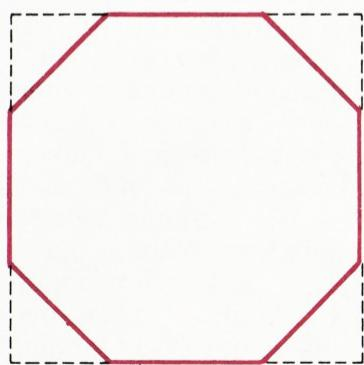
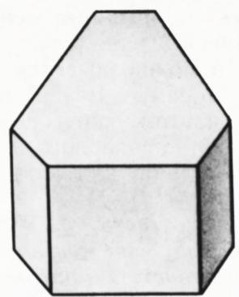
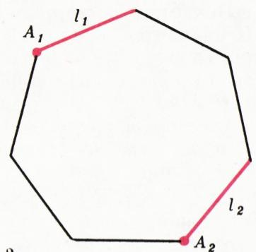
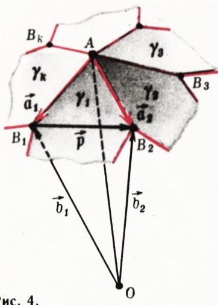
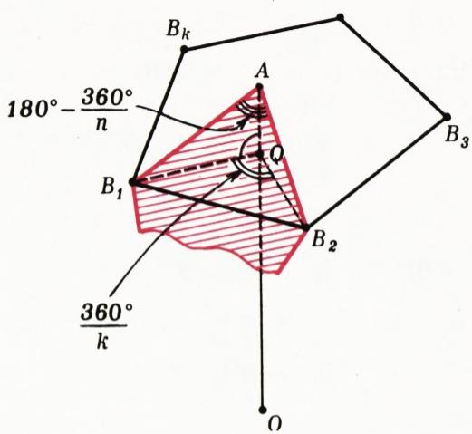
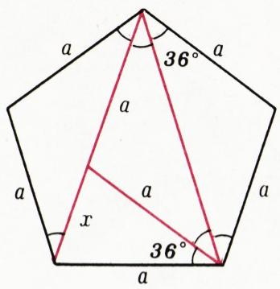
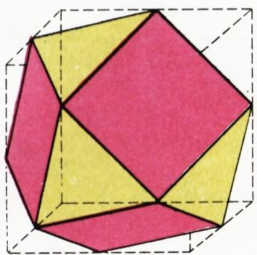
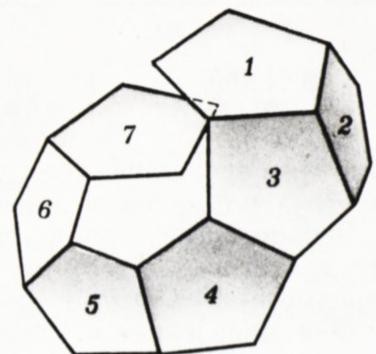
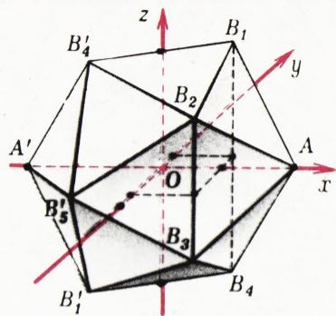

# 传递集合与正多面体

> **原标题**：Транзитивные множества и правильные многогранники
> **作者**：В. Г. Болтянский（V. G. 波尔佳斯基，1915—2001，苏联／俄罗斯数学家，在几何、凸分析与数学教育方面卓有贡献）
> **译自**：Квант 1980, № 7
> **原文扫描**：https://www.kvant.digital/data/kvant_1980_7/jpg/0004.jpg
> **主题**：图形的自叠合群、传递集合、强传递性、正多面体的几何刻画与坐标构造
> **难度**：★★★（需群与对称变换的初步知识，正多面体的向量与坐标推导属高中竞赛／大学初等层面）
> **译者**：Claude（初译）／ 2026-06-25

---

## 图形的自叠合群

位移 $f$ 称为**图形** $F$ 的**自叠合**（самосовмещение），如果它把这个图形变到自身：$f(F) = F$。容易证明，图形 $F$ 的一切自叠合所成的集合构成一个**群**（群的定义可参看《Квант》1976 年第 10 期）；我们约定把图形 $F$ 的自叠合群记作 $\Gamma(F)$。

## 习题

1. 指出下列图形的一切自叠合：а) 圆；б) 直线；в) 线段。

2. 举出一个图形 $F$，使群 $\Gamma(F)$ 恰好含三个自叠合。

图形 $F$ 的自叠合群与这个图形的「几何」本质地联系在一起。例如，设 $P$ 是既非矩形、又非菱形的平行四边形。把 $P$ 变到自身的位移有两个：恒等映射 $e$ 和关于对角线交点的中心对称 $r$。

**题 3.** 证明这种平行四边形 $P$ 除 $e$ 和 $r$ 之外再无其它自叠合。

由 $\Gamma(P)$ 含有中心对称 $r$ 一事，可推出平行四边形的一切基本性质：对边的合同与平行、对角的合同等等。

非正方形的菱形 $Q$，其自叠合群除了 $e$ 和 $r$ 之外，还含有关于两条对角线的两个轴对称 $s_{1}$、$s_{2}$，即 $\Gamma(Q)=\{e,r,s_{1},s_{2}\}$。正是由于群 $\Gamma(Q)$ 中含有（与一般平行四边形相比）额外的自叠合，才导出了菱形所特有的性质（除一切平行四边形共有的性质之外）：对角线互相垂直、对角线平分内角等等。

## 习题

4. 列举其自叠合群恰好含两个元素的一切四边形。

5. 证明：若图形 $F$ 是有界的（即含于某个圆内），则 $\Gamma(F)$ 不可能含有异于 $e$ 的平移。

## 平面上的传递集合

集合 $H$ 称为**传递的**（транзитивное），如果这个集合中的任意一点，都能被这个集合的某个自叠合变到其中任意另一点。图 1 画的是一个正方形，从它上面切去了四个全等的等腰直角三角形。所得八边形的所有顶点的集合就是传递的。

**定理 1.** 若 $H$ 是平面上的有界传递集合，则存在一个圆，它把 $H$ 含于其内。

**证明.** 既然 $H$ 是有界集，由定义它含于某个圆内。从而存在一个半径最小的、把 $H$ 含于其内的圆。设 $K$ 是这样一个最小的圆，$O$ 是它的圆心。

取集合 $H$ 中任意两点 $A$、$B$。我们证明 $|AO| = |BO|$。由此即可推出 $H$ 落在某个圆周上（容易看出这圆周恰好是圆 $K$ 的边界）。

由 $H$ 的传递性，存在一个自叠合 $f \in \Gamma(H)$，使 $f(A) = B$。由 $H \subset K$ 推出 $f(H) \subset f(K)$。但 $f(H) = H$。因此 $H \subset f(K)$。于是 $H \subset K \cap f(K)$。

*图 1*

由于 $f$ 是位移，$f(K)$ 是与圆 $K$ 合同的圆。倘若圆 $K$ 与 $f(K)$ 不相重合，那么就会存在一个半径更小的圆，把 $K \cap f(K)$、从而把 $H$ 含于其内——这与圆 $K$ 的选取相矛盾。因此 $f(K)=K$，从而也有 $f(O)=O$。

由 $f(A)=B$、$f(O)=O$ 以及 $f$ 是位移，即得 $|AO|=|BO|$。

显然，空集、任一单元集和任一二元集都是传递的。

## 习题

6. 证明：若一个传递集合含 $2k+1$ 个点（$k>0$），则这些点是某个正多边形的顶点。

7. а) 证明：若一个传递集合含 4 个点，则这些点是一个矩形的顶点。

б) 证明：若一个传递集合含 $2k$ 个点（$k>2$），则这些点是内接于同一圆周的两个正 $k$ 边形的顶点。

8. 证明：一个无穷有界传递集合 $H$ 在容纳它的圆周上**处处稠密**（即该圆周上不存在不含 $H$ 中点的弧）。

那么，是否存在**无界**的传递集合？当然存在：例如，整个平面和其上的任一直线都是。请试着再举出哪怕一个别的例子。

*图 3*

若一个多边形的一切顶点的集合是传递的，我们就约定把这个多边形叫做**传递多边形**。显然，任何正多边形都是传递的。然而正多边形 $P$ 还满足一个更深刻的性质，不妨称之为**强传递性**：若 $A_{1}$、$A_{2}$ 是任意两个顶点，$l_{1}$、$l_{2}$ 是分别依傍这两个顶点的边（图 2），则存在一个自叠合 $f \in \Gamma(P)$，满足 $f(A_{1}) = A_{2}$、$f(l_{1}) = l_{2}$。

如果一个多边形 $P$ 具有强传递性，那么它就是正多边形。

**题 9.** 证明：对正 $n$ 边形 $P$，群 $\Gamma(P)$ 含 $2n$ 个位移。并验证：这些位移中恰有一半是轴对称。

## 空间中的传递集合

在空间中也可讨论传递集合。例如，底面为传递多边形的直棱柱（图 3），其一切顶点的集合是传递的。

**定理 2.** 若 $H$ 是空间中的有界传递集合，则存在一个球面把 $H$ 含于其内。

证明与平面情形相同，只要把「最小圆」换成「最小**球**」——即把 $H$ 含于其内的最小球——即可。吹毛求疵的读者或许会指出：这两个证明其实**并不完整**，还须先确立容纳给定有界集 $H$ 的最小圆（或最小球）的存在性（这一点可由魏尔斯特拉斯定理推出）。为此我们给出另一个证明；它没有漏洞，但仅适用于**有限**集合 $H$。

*图 2*

**引理.** 设 $H=\{A_{1},\ldots,A_{n}\}$ 是有限点集。则存在唯一的点 $O$，使

$$
\overrightarrow {O A}_{1} + \dots + \overrightarrow {O A}_{n} = \overrightarrow {0}.
$$

（这样的点称为点 $A_{1}, \ldots, A_{n}$ 的**重心**。）

**证明.** 任取一点 $Q$，记 $\overrightarrow{a}$ 为向量 $\frac{1}{n}\left(\overrightarrow{QA}_{1} + \ldots + \overrightarrow{QA}_{n}\right)$，并取点 $O$ 使 $\overrightarrow{QO} = \overrightarrow{a}$。则

$$
\begin{array}{l} \overrightarrow {O A_{1}} + \dots + \overrightarrow {O A_{n}} = (\overrightarrow {O Q} + \overrightarrow {Q A_{1}}) + \dots \\ \dots + (\overrightarrow {O Q} + \overrightarrow {Q A_{n}}) = n\,\overrightarrow {O Q} + (\overrightarrow {Q A_{1}} + \dots \\ \dots + \overrightarrow {Q A_{n}}) = n (- \overrightarrow {a}) + n\,\overrightarrow {a} = \overrightarrow {0}, \end{array}
$$

即点 $O$ 即为所求。

再证唯一性。设 $O^{\prime}\overrightarrow{A}_{1}+\ldots+O^{\prime}\overrightarrow{A}_{n}=\overrightarrow{0}$（即向量 $\overrightarrow{O^{\prime}A_i}$ 之和为零向量）。则

$$
(O^{\prime}\vec{O}+O\vec{A}_{1})+\ldots+(O^{\prime}\vec{O}+O\vec{A}_{n})=\vec{0},
$$

即 $n\,O^{\prime}\vec{O}=\vec{0}$，从而 $O^{\prime}\vec{O}=\vec{0}$，故点 $O$ 与 $O^{\prime}$ 重合。

现在来证定理 2。设 $H = \{A_{1}, \ldots, A_{n}\}$ 是传递集合，$O$ 是点 $A_{1}, \ldots, A_{n}$ 的重心。取 $H$ 的任一自叠合 $f$，并在位移 $f$ 下把点 $A_{1}, \ldots, A_{n}$、$O$ 的像记作 $A_{1}^{\prime}, \ldots, A_{n}^{\prime}$、$O^{\prime}$。由等式 $O\overrightarrow{A}_{1} + \ldots + O\overrightarrow{A}_{n} = \overrightarrow{0}$ 可得 $O^{\prime}\overrightarrow{A}_{1}^{\prime} + \ldots + O^{\prime}\overrightarrow{A}_{n}^{\prime} = \overrightarrow{0}$。但 $A_{1}^{\prime}, \ldots, A_{n}^{\prime}$ 其实就是 $A_{1}, \ldots, A_{n}$ 这些点，只是按另一顺序排列而已（因为 $f(H) = H$）。所以把关系式 $O^{\prime}\overrightarrow{A}_{1}^{\prime} + \ldots + O^{\prime}\overrightarrow{A}_{n}^{\prime} = \overrightarrow{0}$ 的各项适当重排，可改写为 $O^{\prime}\overrightarrow{A}_{1} + \ldots + O^{\prime}\overrightarrow{A}_{n} = \overrightarrow{0}$。据引理，$O^{\prime}$ 与 $O$ 重合，即 $f(O) = O$。这样，在 $H$ 的任何自叠合下，点 $O$ 都变到自身。由此——和定理 1 的证明一样——推出 $H$ 中所有点到 $O$ 的距离都相等。

由我们的证明可见：若 $H=\{A_{1},\ldots,A_{n}\}$ 是不共面的传递集合，$O$ 是容纳 $H$ 的球面的球心，则 $\overrightarrow{OA_{1}}+\ldots+\overrightarrow{OA_{n}}=\overrightarrow{0}$。

若一个多面体的一切顶点的集合是传递的，我们就约定把这个多面体叫做**传递多面体**。据定理 2，存在过它一切顶点的球面（外接球面）。又由上述附注可得：若 $A_{1}$、…、$A_{n}$ 是传递多面体的一切顶点，$O$ 是其外接球面的球心，则 $\overrightarrow{OA}_{1} + \ldots + \overrightarrow{OA}_{n} = \overrightarrow{0}$。

## 正多面体

对于多面体，强传递性的表述如下：设 $A_{1}$、$A_{2}$ 是多面体 $M$ 的任意两个顶点，$l_{1}$、$l_{2}$ 是分别依傍 $A_{1}$、$A_{2}$ 的棱，$\gamma_{1}$、$\gamma_{2}$ 是分别依傍 $l_{1}$、$l_{2}$ 的面；则应存在自叠合 $f \in \Gamma(M)$，满足 $f(A_{1}) = A_{2}$、$f(l_{1}) = l_{2}$、$f(\gamma_{1}) = \gamma_{2}$。具有强传递性的多面体称为**正多面体**\*）。

10. 证明：满足强传递性定义中各条件 $f(A_{1}) = A_{2}$、$f(l_{1}) = l_{2}$、$f(\gamma_{1}) = \gamma_{2}$ 的自叠合 $f \in \Gamma(M)$ 是**唯一**的。

11. 证明：正多面体 $M$ 的群 $\Gamma(M)$ 的元素个数，是其棱数的**四**倍。

设 $M$ 是正多面体，$\gamma$ 是它的一个面，$A_{1}$、$A_{2}$ 是这个面的两个顶点，$l_{1}$、$l_{2}$ 是多边形 $\gamma$ 中分别依傍顶点 $A_{1}$、$A_{2}$ 的两边。由强传递性，存在自叠合 $f \in \Gamma(M)$，满足 $f(\gamma)=\gamma$、$f(A_{1})=A_{2}$、$f(l_{1})=l_{2}$。其中第一个等式表明 $f\in\Gamma(\gamma)$。我们看出，多边形 $\gamma$ 是强传递的，也就是正多边形。

*图 4*

由多面体 $M$ 的强传递性还可推出：它的一切面都合同。再由（即使是普通的、不必强的）传递性可知，依傍每个顶点的面的个数都相同。综上，正多面体的一切面都是全等的正多边形，并且依傍每个顶点的面的个数都相同。

**引理.** 设 $M$ 是正多面体，$A$ 是它的一个顶点，$AB_{1}$、…、$AB_{k}$ 是依傍它的各棱。则多边形 $B_{1}\ldots B_{k}$ 是正多边形。

**证明.** 记依傍顶点 $A$ 的各面为 $\gamma_{1},\ldots,\gamma_{k}$，记外接于多面体 $M$ 的球面的球心为 $O$（图 4）。由于 $|OB_{1}|=|OB_{2}|=R$（$R$ 为外接球面半径），向量 $\vec{b}_{1}=\overrightarrow{OB_{1}}$、$\vec{b}_{2}=\overrightarrow{OB_{2}}$ 和 $\overrightarrow{p}=\overrightarrow{B_{1}B_{2}}$ 满足 $\vec{b}_{1}^{2}=\vec{b}_{2}^{2}=(\vec{b}_{1}+\vec{p})^{2}$，即 $2\vec{b}_{1}\vec{p}=-\vec{p}^{2}$。又因 $|AB_{1}|=|AB_{2}|=a$（$a$ 为多面体 $M$ 的棱长），向量 $\overrightarrow{AB_{1}}=\vec{a}_{1}$、$\overrightarrow{AB_{2}}=\vec{a}_{2}$ 满足 $\vec{a}_{1}^{2}=\vec{a}_{2}^{2}=(\vec{a}_{1}+\vec{p})^{2}$，即 $2\vec{a}_{1}\vec{p}=-\vec{p}^{2}$。于是 $2\vec{a}_{1}\vec{p}=2\vec{b}_{1}\vec{p}$，即 $\vec{p}(\vec{a}_{1}-\vec{b}_{1})=0$，这表明 $(AO) \perp (B_{1}B_{2})$。

*图 5*

同样的计算表明：直线 $(B_{1}B_{3})$、…、$(B_{1}B_{k})$ 中的每一条都垂直于 $(AO)$。因此，过点 $B_{1}$ 而垂直于直线 $AO$ 的平面 $P$，包含 $B_{1}$、$B_{2}$、…、$B_{k}$ 全部各点。进而，由强传递性，存在自叠合 $f \in \Gamma(M)$，把顶点 $A$、棱 $AB_{1}$、面 $\gamma_{1}$ 分别变为顶点 $A$、棱 $AB_{2}$、面 $\gamma_{2}$。特别地 $f(B_{1}) = B_{2}$。在此自叠合下，面 $\gamma_{1}$ 中依傍 $A$ 的两条边，变为面 $\gamma_{2}$ 中依傍 $A$ 的两条边，即 $AB_{1}$ 变为 $AB_{2}$，而 $AB_{2}$ 变为 $AB_{3}$（图 4）。于是 $f(B_{2}) = B_{3}$。同理推得，在位移 $f$ 下点 $B_{1}$、…、$B_{k}$ 被循环置换：$f(B_{1}) = B_{2}$、$f(B_{2}) = B_{3}$、…、$f(B_{k-1}) = B_{k}$、$f(B_{k}) = B_{1}$。由此即可推出位于平面 $P$ 内的多边形 $B_{1}\ldots B_{k}$ 是正多边形。

所证引理使正多面体的基本参数易于计算。例如，设正多面体的各面是正 $n$ 边形，依傍每个顶点的面有 $k$ 个（棱长记作 $a$），我们来求外接球面半径。有 $\angle AB_{1}B_{2} = \dfrac{180^{\circ}}{n}$（面 $\gamma_{1}$ 是正 $n$ 边形）。由三角形 $AB_{1}B_{2}$ 求出正 $k$ 边形 $B_{1}B_{2}\ldots B_{k}$ 的边长 $|B_{1}B_{2}|$：

$$
|B_{1}B_{2}| = 2a \cos \frac{180^{\circ}}{n},
$$

进而求出其外接圆半径 $r = |QB_{1}|$（图 5）：

$$
r = \frac{\left| B_{1} B_{2} \right|}{2 \sin\, 180^{\circ}/k} = a \cdot \frac{\cos\, 180^{\circ}/n}{\sin\, 180^{\circ}/k}.
$$

再由三角形 $QAB_{1}$ 与 $OAB_{1}$，求得 $\dfrac{r^{2}}{a^{2}} + \dfrac{|AQ|^{2}}{a^{2}} = 1$、$|AQ| = \dfrac{a^{2}}{2R}$，即

$$
\frac{r^{2}}{a^{2}} + \left(\frac{a}{2R}\right)^{2} = 1.
$$

把 $r$ 的表达式代入，化简后得

$$
R = \frac{a}{2 \sqrt{\,1 - \left(\dfrac{\cos\, 180^{\circ}/n}{\sin\, 180^{\circ}/k}\right)^{2}}}.\tag{*}
$$

公式 $(*)$ 不仅给出给定正多面体的外接球面半径，还能指出 $n$ 和 $k$ 可能取哪些值。事实上，由于 $n \geqslant 3$，有 $\dfrac{180^{\circ}}{n} \leqslant 60^{\circ}$、$\cos \dfrac{180^{\circ}}{n} \geqslant \dfrac{1}{2}$；因而 $\sin \dfrac{180^{\circ}}{k} > \dfrac{1}{2}$（否则根号下的式子不会为正），故 $k < 6$。让 $k$ 取可能的值 $k = 3, 4, 5$，可知根号下的式子仅在五种情形为正——它们恰好对应五种可能的正多面体（参看《九—十年级几何》第 133 页）。

## 习题

12. 利用公式 $(*)$，求每个正多面体外接球面的半径。（本题及以下各题的答案将在下一期《Квант》给出。）

**提示.** 求出图 6 中各三角形的边长，并由此推出 $\cos 36^{\circ} = \dfrac{\xi}{2}$、$\sin 36^{\circ} = \dfrac{\sqrt[4]{5}}{2\sqrt{\xi}}$、$\sqrt{3} - 4\cos^{2}36^{\circ} = \dfrac{1}{\xi}$，其中 $\xi = \dfrac{1 + \sqrt{5}}{2}$。

13. 对每个正多面体，求从其外接球面的球心看一条棱所张的角。

14. 已知正多面体的棱长 $a$，求每个正多面体的表面积。

15. 证明：对每个正多面体，都存在一个球面与它的一切棱相切。

16. 计算正棱锥的高 $h$，这个棱锥以正多面体的一个面为底、以正多面体外接球面的球心 $O$ 为顶点。证明：以 $O$ 为心、半径为 $h$ 的球面含于该正多面体内部，且与它的一切面相切（内切球面）。

*图 6*

17. 已知棱长 $a$，求每个正多面体的体积。

18. 设 $M$ 是正多面体。以 $M$ 各面的外接圆圆心为顶点的多面体记作 $M^{*}$。证明：多面体 $M^{*}$（称为与 $M$ **对偶**的多面体）也是正多面体。立方体与哪种正多面体对偶？正十二面体呢？

19. 设 $\alpha$ 是正多面体 $M$ 的二面角的大小，$\beta^{*}$ 是从对偶多面体 $M^{*}$ 的外接球面球心看其一条棱所张的角。证明：$\alpha + \beta^{*} = 180^{\circ}$。利用此事计算每个正多面体的二面角。

20. 证明：正多面体各棱的中点是一个传递多面体的顶点。

*图 7*

图 7 画的是**立方八面体**（кубооктаэдр）——以立方体各棱中点（或正八面体各棱中点）为顶点的多面体。许多晶体呈立方八面体的形状；例如，在一定条件下，食盐的晶体就是如此。

至此，关于正多面体的讲述还留下一个问题未解决：**它们的存在性**。因为前面一切计算，都是在「存在以正 $n$ 边形为面、依傍每个顶点有 $k$ 个面的正多面体」这一假设下进行的。当

*图 8*

然，知道了二面角的大小（题 19），可以试着把所需的正多面体粘出来：把一个正 $n$ 边形按所需角度粘到另一个上，再把第三个粘到它们上面，依此类推。但怎能保证粘出来的多面体一定会「闭合」，而不会变成类似图 8 那样的东西呢？

存在性可以借助于在坐标系中实际构造出正多面体来证明。把坐标原点放在未来正多面体外接球面的球心。为简单起见，设顶点 $A$ 在 $x$ 正半轴上，即其坐标为 $(R;\, 0;\, 0)$，而它的相邻顶点 $B_{1}, \ldots, B_{k}$ 的 $x$ 坐标为 $x = R \cos \alpha$，其中 $\alpha$ 是从外接球面球心看一条棱所张的角。由于多边形 $B_{1} \ldots B_{k}$ 是正多边形且位于垂直于 $(OA)$ 的平面内，可设点 $B_{l}$ 的坐标为

$$
\left(R \cos \alpha;\; r \cos \frac{2\pi l}{k};\; r \sin \frac{2\pi l}{k}\right),\qquad l = 1, \ldots, k,
$$

*图 9*

其中 $r$ 是多边形 $B_{1} \ldots B_{k}$ 的外接圆半径。例如对正二十面体，这样即给出顶点 $A$、$B_{1}, \ldots, B_{5}$。其余顶点与它们关于坐标原点对称（图 9）。在 $R = \sqrt{5}$ 时坐标表达最简（此时 $R \cos \alpha = 1$、$r = 2$）：

$$
A = (\sqrt{5};\, 0;\, 0);\qquad B_{5} = (1;\, 2;\, 0);
$$

$$
B_{1} = \left(1;\; \frac{\sqrt{5} - 1}{2};\; \sqrt{\frac{5 + \sqrt{5}}{2}}\right);\qquad B_{2} = \left(1;\; -\frac{1 + \sqrt{5}}{2};\; \sqrt{\frac{5 + \sqrt{5}}{2}}\right);
$$

其余点的坐标由变号得到。为验证所得确为正二十面体，只需验证各棱等长（合同）；这不难用两点距离的坐标公式做到。

## 我们的读者

## 提供的问题

1. 求出一切满足下列条件的凸四边形：过四边形各项点所作、将其

а) 面积

б) 周长

平分的四条直线，交于同一点。

*В. 杜布罗夫斯基、И. 茹克*

2. а) 在正五边形中内接一个正方形。

б) 证明：不能把正五边形内接于正六边形。

в) 证明：当 $n>5$ 时，不能把正 $n$ 边形内接于正 $(n+1)$ 边形。

3. 令

$$
\sin_{2}(x) = \sin(\sin_{1}(x)),
$$

$$
\sin_{3}(x) = \sin(\sin_{2}(x)),
$$

$$
\cos_{1}(x) = \cos x,
$$

$$
\cos_{2}(x) = \cos(\cos_{1}(x)),
$$

$$
\cos_{3}(x) = \cos(\cos_{2}(x)),
$$

а) 作出函数

$$
y = \sin_{2}(x),\quad y = \sin_{3}(x),
$$

$$
y = \cos_{2}(x),\quad y = \cos_{3}(x)
$$

的图像。

б) 当 $n$ 为何值时，方程 $\sin_{n}(x)=\cos_{n}(x)$ 在 $[0;\,\pi/2]$ 上有解？

*И. 茹克*

4. 证明不等式

$$
9 r \leqslant h_{a} + h_{b} + h_{c} \leqslant \frac{2}{3}\,\frac{m_{a}^{2} + m_{b}^{2} + m_{c}^{2}}{R},
$$

其中 $h_{a}$、$h_{b}$、$h_{c}$ 是给定三角形的高，$m_{a}$、$m_{b}$、$m_{c}$ 是其中线长，$r$ 是三角形内切圆半径，$R$ 是其外接圆半径。

*М. 易卜拉欣莫夫*

---

## 译者注与校对说明

1. **OCR 校正**：本文由 MinerU 对扫描页做俄文 OCR 后翻译。已校正若干 OCR 错误与排版断行：
   - `условиямя` → `условимся`（「我们约定」）；`Ко- нечно` → `Конечно`；`ш а р` → `шар`（「球」）；`тео- ремы` → `теоремы`；`кон груэнтны` / `контруэнтности` → `конгруэнтны` / `конгруэнтности`（「全等」）；`шестигольник` → `шестиугольник`（「六边形」，题 2б）。
   - 引理唯一性证明中向量记号原 OCR 较乱（$O^{\prime}A_{1}$ 等），已统一改写为向量 $\overrightarrow{O^{\prime}A_i}$ 的求和；推导 $O^{\prime}\vec{O}=\vec{0}$ 一行原 OCR 写作 `O'O==0`，据上下文校正为零向量 $\vec{0}$。
   - 题 12 提示中 $\cos 36^{\circ}=\dfrac{\xi}{2}$（$\xi=\dfrac{1+\sqrt5}{2}$，黄金比），原 OCR 部分符号（如 $\sqrt[4]{5}$）已据三角恒等式校核，但其中个别关系（如 $\sqrt{3}-4\cos^{2}36^{\circ}=\dfrac{1}{\xi}$）疑为排版或 OCR 讹误，仅供参照原文。
   - 题末括注「（答案将在下一期给出）」原 OCR 漏右括号，已补。
   - 文末「读者提供的问题」各题按原文项目字母 а)、б)、в) 编排（已避免 OCR 中 a)/6)/b) 之类拉丁／数字混淆）。

2. **术语**：самосовмещение＝自叠合（图形在某个位移下与自身重合）；перемещение＝（刚体）位移／等距变换；транзитивное множество＝传递集合；сильная транзитивность＝强传递性；грань／ребро／вершина＝面／棱／顶点；двугранный угол＝二面角；вписанная／описанная сфера／окружность＝内切／外接球面／圆；центр тяжести＝重心；двойственный многогранник＝对偶多面体；кубооктаэдр＝立方八面体；икосаэдр／додекаэдр／октаэдр＝正二十面体／正十二面体／正八面体。术语遵照《01_工作规范.md》对照表。

3. **图与编号**：原文图 1—9 由 MinerU 从整页扫描裁出，存于 `images/ext_X48/fig_pXX_NN.png`，路径前缀 `../images/ext_X48/`。图号、图注均与扫描页一致。注意原文图序在版面上跨页穿插（如图 2、图 3 在 p5，但正文涉及处较晚），译文按图号顺序在正文首次提及处给出。

4. **作者背景**：В. Г. Болтянский（1915—2001）为苏联著名几何学家与数学教育家，长期参与《Квант》撰稿，与 Яглом 合著的《凸图形与凸多面体》等书在国内亦有影响。本文是其几何系列科普文章之一。

## 建议讨论题

1. 定理 1 与定理 2 的证明都用到「最小圆（球）」的存在性，而引理证明用「重心」绕开了这一步。请比较两种思路：为什么重心法只对**有限**集合有效？能否把它推广到无穷有界情形？（提示：处处稠密性，题 8。）
2. 「传递性」与「强传递性」的差别，对正多边形／正多面体而言究竟意味着什么？请用正三角形和一般等边三角形（若可定义）的对比，说明强传递性如何排除「不规则的均匀」。
3. 公式 $(*)$ 一举给出五种正多面体的存在性判据。请动手验算 $k=3,\,n=3,4,5$ 及 $k=4,\,n=3$、$k=5,\,n=3$ 这五组情形，并说明为何其余组合都不可能。
4. 题 18 引出对偶多面体，题 19 给出二面角与对偶棱张角互补的妙关系。请据此排出五种正多面体之间的对偶配对，并思考：哪种正多面体是**自对偶**的？

---

> **版权说明**：原文版权归 MCCME（莫斯科连续数学教育中心）及作者继承者所有。本译文为非商业、自用、数学圈内部参考，未获授权不得公开分发。原文扫描见 [kvant.digital](https://www.kvant.digital/data/kvant_1980_7/jpg/0004.jpg)。

> **复用说明**：本译文的俄文 OCR 原文与所有插图均存档于 `ocr/ext_X48/`（`ru.md` 为合并 OCR 文本，`meta.json` 为图映射，`images/ext_X48/fig_pXX_NN.png` 为各图）。如对译文质量不满意，可直接基于 `ocr/ext_X48/ru.md` 重译，无需重跑 OCR。
