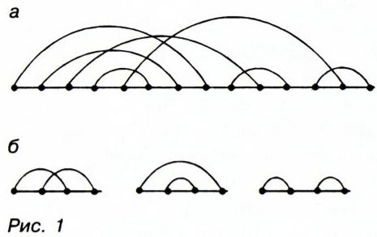
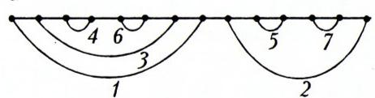
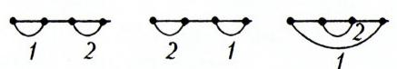
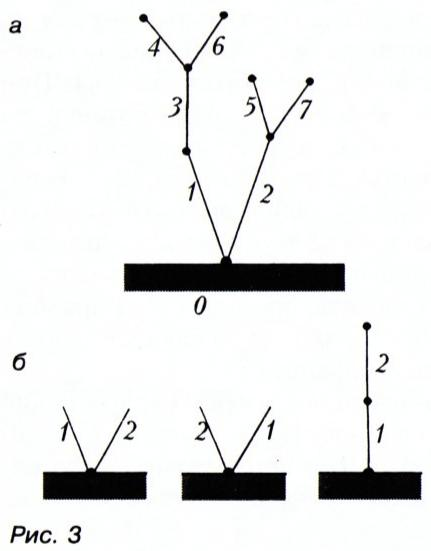
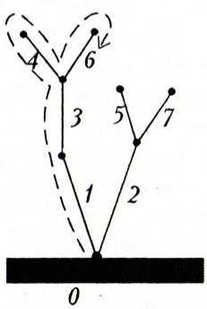
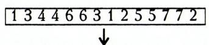

# 划分、GS-置换与树

> **原标题**：Разбиения, ГС-перестановки и деревья（划分、GS-置换与树）
> **作者**：Н. Б. Васильев（N. B. 瓦西里耶夫）、Л. Коганов（L. 科加诺夫）
> **题献**：*谨以此文纪念 Н. Я. 维连金（Н. Я. Виленкин）*
> **译自**：Квант 1997, № 6
> **原文扫描**：https://www.kvant.digital/data/kvant_1997_6/jpg/0002.jpg
> **主题**：组合计数——集合划分为对、Gessel–Stanley 置换、单调平面根树之间的统一双射与生成函数
> **难度**：★★★（涉及归纳、双射、生成函数；末尾习题较难）
> **译者**：Claude（初译）／ 2026-06-25

---

> 插图：М. 康斯坦丁诺娃

那些认真喜爱数学、参加数学奥林匹克并乐于思考复杂问题的中学生，应当熟悉组合数学（комбинаторика）的若干基本内容——它是当今数学中发展最为迅猛的分支之一。

下面我们将要剖析的几道题，虽然并不要求预先学习组合数学的系统知识，但我们仍十分建议那些初次接触组合问题的读者，去翻阅一本供物理数学班使用的教材——Н. Я. 维连金、О. С. 伊瓦舍夫-穆萨托夫、С. И. 施瓦尔茨布尔德所著《代数与数学分析》，其第二部分含有组合数学的初步知识；或者去读 Н. Я. 维连金的那本精彩著作《组合数学》，该书用大量各种各样的例子，讲解了本文中将遇到的那类典型问题提法与推理技巧。

我们先给出三道题的表述——稍后便会看到，它们彼此紧密相关。其中第二道，出自当代最负盛名的组合数学专家之一（一系列奠基性论文及优秀专著《计数组合数学》的作者）理查德·斯坦利（Richard Stanley）的工作。

## 问题的提法

**配对划分问题**。把由 $2n$ 个元素 $\{1, 2, \ldots, 2n\}$ 组成的集合划分为若干对，共有多少种划分方式？（每一对内部两元素的顺序，以及各对之间的先后顺序，都不予考虑。）

若把这 $2n$ 个元素表为实数轴上的点 $1, 2, \ldots, 2n$，我们就可以用 $n$ 条半圆（每条半圆的两端落在该对的两个点上）来画出一个划分（图 1，а）。

*图 1*

例如，当 $n=2$ 时，集合 $\{1, 2, 3, 4\}$ 共有 3 种不同的配对划分（图 1，б）。

*图 1（续）：$n=2$ 时的 3 种划分*

**GS-置换问题**。由 $2n$ 个元素 $\{1, 1, 2, 2, \ldots, n, n\}$（每个 $i$，从 $1$ 到 $n$，在置换中出现两次！）构成的置换中，满足下面这个 Gessel–Stanley 附加条件的有多少个：对任何 $i<n$，置换中位于两个 $i$ 之间的所有元素都大于 $i$？

这类置换（我们将称之为 **GS-置换**）曾在两位美国数学家——艾拉·盖塞尔（Ira Gessel）与理查德·斯坦利——1978 年发表的一篇文章中讨论过。每一个 GS-置换都可以这样画出：在水平直线上摆好 $2n$ 个点，在下半平面画出 $n$ 条以这些点为端点、彼此不相交（甚至连公共端点也没有）的半圆，并在各半圆上标上号码 $1, 2, \ldots, n$，使得位于另一条半圆「上方」的那条半圆号码更大。例如，图 2，а 画出的就是 GS-置换 13446631255772——第 $i$ 条半圆的两个端点，标明了元素 $i$ 在置换中两次出现的位置。

*图 2*

图 2，б 画出了当 $n=2$ 时全部 3 种可能的 GS-置换。

*图 2（续）：$n=2$ 时的 3 种 GS-置换*

**单调平面根树问题**。在图论中（所谓**图**，就是由若干点——**顶点**——组成、其中某些顶点对之间用线段——图的**边**——相连的系统），**树**定义为无圈的连通图，也就是其中任意两顶点之间都只有一条（由不同的边组成的）通路相连的图。我们要画的树，是从一条水平直线 $l$ 上某一点 $O$（即根）向上生长、并由 $n$ 条边——箭头——组成的：一条或多条边从 $O$ 出发；从这些边的终点起，可以继续向外（远离直线 $l$ 的方向）再长出若干条边，如此递推。各边用 $1$ 到 $n$ 编号，且编号是**单调**的：从边 $i$ 的终点继续长出的各边，其号码都必须大于 $i$。在这种情况下，边的长度与方向都不予考虑；但若从某一顶点长出多条边，那么这些边在平面上的左右排列顺序是重要的（哪条在左、哪条在右）。问：由 $n$ 条边组成的不同的单调平面树共有多少种？图 3，а 画出了这样一棵树。

*图 3*

而图 3，б 画出了当 $n=2$ 时全部 3 种不同的树。

*图 3 / 图 4：树的遍历编码——码：12, 5, 8, 3, 2, 1, 1*

> **译者注**：原图中图 3、图 4 的标注在排版上交错（«码：12, 5, 8, 3, 2, 1, 1» 字样紧邻树的遍历图，对应正文图 4 所述的沿河道行走所得的编码）。此处据正文语境归并说明。

令人称奇的是，这三道看起来如此迥异的问题，给出的答案却完全相同——不仅对 $n=2$ 如此，对一切 $n$ 都是如此。

我们逐一加以剖析。

## 划分的数目

先回忆组合数学的两个基本公式。

$n$ 个元素 $\{1, 2, \ldots, n\}$ 的不同**置换**的总数为

$$
n! = 1 \cdot 2 \cdot \dots \cdot n.\tag{1}
$$

这容易用归纳法证明，例如这样：设想 $n-1$ 个元素的置换是直线上排成某种顺序的 $n-1$ 个点 $1, 2, \ldots, n-1$。这 $n-1$ 个点把直线分成 $n$ 段：最左点左侧的射线、它与邻点之间的线段、……、最右点左侧的射线。新的点 $n$ 可以放进这 $n$ 段中的任何一段。于是，从 $n-1$ 到 $n$ 时，置换的数目增大到原来的 $n$ 倍。由此即得公式 (1)。

集合 $\{1, 2, \ldots, n\}$ 中由 $k$ 个元素组成的不同**子集**的个数 $C_{n}^{k}$ 为

$$
C _ {n} ^ {k} = \frac {n !}{k ! (n - k) !}\tag{2}
$$

（其中约定 $0! = 1$）。这个公式容易由 (1) 得到，依据在于：在子集中（与置换不同）元素的排列顺序不予考虑。任取 $\{1, 2, \ldots, n\}$ 的 $n!$ 个置换中的一个，约定把前 $k$ 个元素归入子集、后 $(n-k)$ 个元素排除在外。于是每一个确定的子集，都由 $k!(n-k)!$ 个置换给出：因为前 $k$ 个元素可有 $k!$ 种重排，且与此独立，后 $(n-k)$ 个元素可有 $(n-k)!$ 种重排（这里用到了组合数学中基本的「**乘法原理**」）。所以置换总数 $n!$ 等于 $C_{n}^{k}\,k!(n-k)!$，由此即得公式 (2)。注意，该式中可作约分，写成

$$
\begin{array}{r l} C _ {n} ^ {k} & = n (n - 1) \dots (n - k + 1) / k! = \\ & = n (n - 1) \dots (k + 1) / (n - k)! \end{array}
$$

完全相同的论证，也能解决「$2n$ 个元素划分为 $n$ 个（无序）对」的数目问题。把 $2n$ 个元素 $(1, 2, \ldots, 2n)$ 的每一个置换 $(i_{1}, i_{2}, i_{3}, i_{4}, \ldots, i_{2n-1}, i_{2n})$ 如下对应一个配对划分：$(i_{1}, i_{2}), (i_{3}, i_{4}), \ldots, (i_{2n-1}, i_{2n})$。于是每一个划分都由 $2^{n}n!$ 个置换给出：因为每一对内部两元素可（用两种方式）互换——这给出因子 $2^{n}$——此外 $n$ 个对之间可任意重排。因此，答案是：

划分的数目等于

$$
\begin{array}{r l} \frac {(2 n) !}{2 ^ {n} n !} & = \frac {(2 n) !}{2 \cdot 4 \cdot 6 \cdot \dots \cdot 2 n} = \\ & = 1 \cdot 3 \cdot 5 \cdot \dots \cdot (2 n - 1). \end{array}
$$

此数记作 $(2n-1)!!$（读作「$2n-1$ 双阶乘」；你当然知道，$n!$ 读作「$n$ 阶乘」）。如我们所承诺的，它还会反复出现。

## GS-置换问题

这里，与普通置换一样，Hessel–Stanley 置换数 $P_{\mathrm{GS}}(n)$ 的公式也容易由归纳法导出。注意，依 GS 条件，$2n$ 个元素 $\{1, 1, 2, 2, \ldots, n, n\}$ 的置换中，元素对 $n, n$ 必须相邻。把 $2n-2$ 个元素 $\{1, 1, 2, 2, \ldots, n-1, n-1\}$ 的（GS-）置换看作直线上的 $2n-2$ 个点，它们把直线分成 $2n-1$ 段（两条射线和 $2n-3$ 条线段）。在这 $2n-1$ 段中的任意一段里，我们都可以放进相邻的一对 $(n, n)$，从而得到 $2n-1$ 种不同的 GS-置换。于是，从 $n-1$ 到 $n$ 时，GS-置换的数目增大到原来的 $(2n-1)$ 倍。由归纳法得

$$
P _ {\mathrm{GS}} (n) = 1 \cdot 3 \cdot 5 \cdot \dots \cdot (2 n - 1) = (2 n - 1)!!
$$

> **译者注**：原 OCR 将 $P_{\mathrm{GS}}(n)$ 的下标误识为 $\mathrm{TC}$（俄文 «ГС» 之 Г 与拉丁 T 形近所致），此处已校正为 $\mathrm{GS}$。

当然，这里很自然地要讨论这样一个问题：

> 一般而言，由 $2n$ 个元素的重集（мультимножество） $\{1, 1, 2, 2, \ldots, n, n\}$ 构成的、**不必**满足 GS 条件的不同置换，共有多少个？

（「重集」一词的意思是：某些元素出现不止一次——这有别于普通集合，在普通集合中元素都被视为互不相同。）

这道并不难的题，留给读者。

我们给出更一般问题的答案：重集 $\{1, 1, \ldots, 1;\ 2, 2, \ldots, 2;\ \ldots;\ n, n, \ldots, n\}$（其中 $i$ 出现 $k_{i}$ 次，旧术语称作「**有重复的置换**」）的不同置换数为

$$
\left(k _ {1} + k _ {2} + \dots + k _ {n}\right)! / \left(k _ {1}! \, k _ {2}! \dots k _ {n}!\right).
$$

## 单调平面树问题

这道题同样可用归纳法解（想一想：最后那条第 $n$ 条边可以插入多少个位置）。但为了换种方式，我们另辟蹊径。我们将通过在「树的集合」与「重集 $\{1, 1, 2, 2, \ldots, n, n\}$ 的 GS-置换集合」之间建立一一对应，来证明 $n$ 条边的这种树的数目等于 $(2n-1)!!$。这种一一对应（用法语术语，称作**双射**（биекция））似乎最早由荷兰数学家尼古拉斯·戈弗特·德·布鲁因（Nicolaas Govert de Bruijn）及其合作者 Б. 莫尔塞特（Б. Морселт）于 1967 年为其他目的而提出。

设想以 $O$ 为根的有编号平面树 $D$ 的 $n$ 条边，都是「河道」（或者说——都是汇入湖泊 $O$ 的支流）。我们从 $O$ 出发——比如说，先沿着「左岸」——沿所有河道走一遍再回到 $O$，依次记下所遇到的每条河道的编号（图 4）。每个编号都会遇到两次。此时，若编号是单调的，则所得的重集 $\{1, 1, 2, 2, \ldots, n, n\}$ 的置换显然满足 GS 条件（从我们沿着第 $i$ 条河道左岸走过的那一刻起，直到我们抵达它的右岸为止，整段路途都走在编号大于 $i$ 的河道上）。

反之，由重集 $\{1, 1, 2, 2, \ldots, n, n\}$ 的任一 GS-置换，都可构造出与之对应的、有 $n$ 条边的单调平面树：可以设想，置换的编号写在一条纸带上 $2n$ 个格子里，我们把这条纸带「立着」放到平面上，先在相邻同号（特别是 $(n, n)$ 这一对）处折弯，然后逐步把所有同号的格子粘合起来。

于是，树问题的答案也是 $(2n-1)!!$。第二题与第三题答案的相同，我们已经解释清楚；而第一题与它们的相同，看上去却相当偶然。到底是不是偶然，我们在下一节讨论。

## 万能双射

「双射」一词我们已经见过——它是一个精确的数学术语，指两个集合 $X$ 与 $Y$ 之间的一一对应，即一个把 $X$ 映到 $Y$ 上的映射（отображение），使得每个 $x \in X$ 都对应唯一一个 $y \in Y$。当然，任意两个元素个数同为 $N$ 的有限集 $X$ 与 $Y$ 之间，总可以建立某种双射。

> **练习**。证明：这种建立方式共有 $N!$ 种。

但当我们讨论复杂的组合对象时，「随便某种」双射并不太有趣。真正美妙的是：建立对应的那条规则足够简单，使得给定 $x \in X$ 时能立刻找出对应的 $y \in Y$，反之给定 $y$ 也能找出 $x$。这（虽不完全是严格的数学说法）正是我们说「万能双射」时所意指的性质。

举一个例子。

集合 $\{1, 2, \ldots, n\}$ 的每一个子集，都可对应它的「**编码**」——一条长度为 $n$、由数字 $0$ 或 $1$ 组成的字符串（第 $i$ 位为 $1$，若 $i$ 属于该子集；为 $0$，若不属于）。这是一个众所周知的万能双射。它甚至能给所有 $2^{n}$ 个子集编号：因为「编码」——一条由 $0$、$1$ 组成的字符串——可以看作 $0$ 到 $2^{n}-1$ 之间一个数的二进制表示。

> **译者注**：原 OCR 将上界 $2^{n-1}$ 校正为 $2^{n}-1$（$n$ 个二进制位可表示 $0$ 至 $2^{n}-1$ 共 $2^{n}$ 个数）。

现在回到问题 1。我们将证明，在这道题中——如同在问题 2 中一样——可以建立一个自然的双射，对应到由 $(\alpha_{n}, \alpha_{n-1}, \ldots, \alpha_{1})$ 组成的元组之集合，其中 $\alpha_{i}$ 取 $2i-1$ 个值 $1, 2, \ldots, 2i-1$（$i$ 从 $1$ 到 $n$；对我们来说，把 $\alpha_{i}$ 自右而左、而非通常的自左而右编号更为方便，正如希伯来文的书写方向）。为此，要用到那些「连接图」——我们曾在问题描述时用来作图的半圆。

于是，设有 $2n$ 个元素——水平直线上的点——以及它们的一个配对划分（见图 1，а；不妨在每条半圆上画一个自右向左的箭头）。考察最右端的那个元素，找到与之配对的元素的编号 $\alpha_{n} \leqslant 2n-1$（我们假定元素自左向右依次编号为 $1, 2, \ldots, 2n-1$）。把这一对拿掉，剩下 $2n-2$ 个元素。考察其中最右端的一个；对其余元素（必要时跳过「原 $\alpha_{n}$」的位置）依次重新编号 $1, 2, \ldots, 2n-3$，并找出从最右端元素引出半圆所连的那个元素的编号 $\alpha_{n-1} \leqslant 2n-3$。再把这一对拿掉，如此继续。这样就得到元组 $(\alpha_{n}, \alpha_{n-1}, \ldots, \alpha_{1})$，由此显然能唯一地恢复出配对划分。

同一组元组 $(\alpha_{n}, \alpha_{n-1}, \ldots, \alpha_{1})$ 还能更简单地与 GS-置换对应：本质上，归纳解法中做的正是这件事。要在排在直线上 $2n-2$ 个点旁的重集 $\{1, 1, 2, 2, \ldots, n-1, n-1\}$ 编号置换中，选出一处安放 $(n, n)$ 这一对，我们要从这 $2n-2$ 个点把直线分成的 $2n-1$ 条射线与线段中选一条。可以把这些线段自左向右编号为 $1, 2, \ldots, 2n-1$，找出对应线段的编号 $\alpha_{n}$。在剩下的 $2n-2$ 元 GS-置换中（拿掉 $(n, n)$ 这对之后）同样地选出决定 $(n-1, n-1)$ 位置的编号 $\alpha_{n-1}$，如此继续（参见图 4 上的「编码」）。

显然，凭「编码」$(\alpha_{n}, \alpha_{n-1}, \ldots, \alpha_{1})$，我们能轻松地既构造出 GS-置换，又构造出配对划分；这样，我们就在两者之间建立了一个万能双射。

请注意：在组合数学中，寻找优美的——对应，往往比寻求对象数目的简洁显式公式是更深刻的问题。因为很多时候，这样的公式根本不存在。

研究组合对象的另一个不逊于此的有力工具，是**生成函数**（производящие функции）。

若有一个数列 $a_{m}$（例如，表示某种对象随参数 $m \geqslant 0$ 的数目），则其生成函数就是一个形式幂级数

$$
a _ {0} + a _ {1} x + a _ {2} x ^ {2} + \dots + a _ {m} x ^ {m} + \dots
$$

例如，对于集合 $\{1, 2, \ldots, 100\}$ 中 $m$ 元子集的个数 $C_{100}^{m}$，生成函数就只是一个多项式：

$$
\begin{array}{c} C _ {1 0 0} ^ {0} + C _ {1 0 0} ^ {1} x + C _ {1 0 0} ^ {2} x ^ {2} + \dots + \\ \dots + C _ {1 0 0} ^ {1 0 0} x ^ {1 0 0} = (1 + x) ^ {1 0 0}. \end{array}
$$

当——像本例这样——生成函数得以「折叠」或用其他函数表出时，往往能导出系数之间许多有趣的关系式或对系数的良好估计。当然，在含多个参数的问题中，也会用到多变量的生成函数，例如

$$
\begin{array}{r l} \sum_ {n \geqslant 0} \sum_ {m = 0} ^ {n} C _ {n} ^ {m} x ^ {m} y ^ {n} & = \\ & = \sum_ {n \geqslant 0} (1 + x) ^ {n} y ^ {n} = \frac {1}{1 - y - x y}. \end{array}
$$

在末节，我们将再给出几道较难的题，其中涉及与 GS-置换及其他类似组合相关联的计数数列的生成函数。

## 「餐后」习题

此前我们关心的是 $2n$ 元集合配对划分的全部方式。现在提出更一般的问题：把任意 $p$ 元集合划分为 $q$ 个块（不加任何特殊限制）的划分数。设 $S(p, q)$ 为此数。

> **译者注**：$S(p, q)$ 即第二类**斯特林数**（числа Стирлинга второго рода）。

回到 GS-置换。

称左数大于右数的一对相邻数为一个**降差**（спад，亦称 спуск 或 десант——降、下降、空降）。设 $B_{k,i}$ 为重集 $\{1^{1}, 2^{2}, \ldots, k^{k}\}$ 上恰有 $i-1$ 个降差的 GS-置换的个数。

> **译者注**：原文写作 $\{11, 22, \ldots, kk\}$，据上下文当为 $\{1^{1}, 2^{2}, \ldots, k^{k}\}$，即元素 $j$ 出现 $j$ 次。此处据语义补出上标。

**题 1**（很难）。证明

$$
(1 - x) ^ {2 k + 1} \sum_ {n = 1} ^ {\infty} S (n + k, n) x ^ {n} = \sum_ {i = 1} ^ {k} B _ {k, i} x ^ {i}.
$$

（提醒：幂级数的相乘，与多项式的相乘规则相同——多项式本身也可视为（自某项起系数全为 $0$ 的）幂级数。）

**题 2**（难）。证明 В. С. 舍韦廖夫（В. С. Шевелев）近期建立的恒等式：

$$
\sum_ {j = 1} ^ {n} (- 1) ^ {m - j} C _ {2 m} ^ {m - j} S (m + j, j) = (2 m - 1)!!
$$

**题 3**（较题 1、题 2 容易）。证明 $S(n+k, n)$ 是 $n$ 的 $2k$ 次多项式，并求出该多项式中 $n^{2k}$ 项的系数。

$$
(\text {答}: \frac {(2 k - 1) ! !}{(2 k) !}.)
$$

我们希望，我们已经带各位走进了现代计数组合数学的「厨房」。在这间「厨房」里，我们结识了好几位杰出的数学家；而在最后，各位也有机会一试身手，亲尝这门迷人学科——组合数学——的滋味。

## 推荐文献

1. Н. Я. 维连金、О. С. 伊瓦舍夫-穆萨托夫、С. И. 施瓦尔茨布尔德。《代数与数学分析》（供数学深化教学的学校用）。第二册。莫斯科：Просвещение，1990。

2. Ю. 约宁。《有多少种方案？》（Сколько вариантов?），载《Квант》1994 年第 2 期增刊。

3. Г. 拉德马赫、О. 特普利茨。《数与形》（Числа и фигуры）。莫斯科：Наука，1966。第 9 节（并参见第 7、2、11 节）。

4. И. С. 索明斯基。《初等代数（提高课程）》。第 3 版（或任意版本）。莫斯科：Наука，1967。第 2 章。

5. В. А. 克列乌马尔（Креумар）。《代数习题集》（任意版本）。第 9 节。习题 36—40。

---

## 译者注与校对说明

1. **题名与作者**：原题为《Разбиения, ГС-перестановки и деревья》（划分、GS-置换与树）。据 p2 扫描页（已用图像识别核对），本文作者为 **Н. Б. 瓦西里耶夫**（Н. Васильев）与 **Л. 科加诺夫**（Л. Коганов）二人，且页首有题献「**谨以此文纪念 Н. Я. 维连金**」（ПАМЯТИ Н. Я. ВИЛЕНКИНА）——这些信息在 OCR 文本中部分散佚，已据扫描页补入。文末书目多处引用维连金的著作，正与这一题献相呼应。

2. **术语**：遵循《01_工作规范.md》对照表。отображение 译「映射」，функция 译「函数」，множество 译「集合」，индукция 译「归纳」，биекция 译「双射」，перестановка 译「置换」，мультимножество 译「重集」，производящая функция 译「生成函数」，дерево 译「树」，граф 译「图」。人名 Gessel–Stanley 在俄文中作 Гессель–Стенли，中译「盖塞尔–斯坦利」，其条件简称 ГС / GS。

3. **OCR 校正**：
   - $P_{\mathrm{GS}}(n)$ 下标 OCR 误识为 $\mathrm{TC}$（俄文 Г 与拉丁 T 形近），已改正；
   - 「$2^{n}$ 个子集…$0$ 到 $2^{n-1}$」中上界据语义校正为 $2^{n}-1$；
   - 末节重集记号 $\{11, 22, \ldots, kk\}$ 据上下文（$j$ 出现 $j$ 次、与 $B_{k,i}$ 定义一致）补作 $\{1^{1}, 2^{2}, \ldots, k^{k}\}$；
   - 俄文小数逗号（如 $7{,}5$）保留；
   - 项目字母 а/б/в 与图号 (рис. 1, a) / (рис. 1, 6) 中的俄文 а/б，OCR 曾与拉丁 a/b、数字 6 混淆，已统一还原为俄文 а/б。

4. **图片**：本文插图共 7 幅，文件名取自 `meta.json` 的 `figures[].std_name`（`fig_p2_01.png`～`fig_p4_02.png`），存于 `images/ext_X49/`。原图 1、图 2、图 3 在排版上均含 (а)、(б) 两个子图，分别由 `fig_p3_01`/`fig_p3_02`、`fig_p3_03`/`fig_p3_04`、`fig_p4_01`/`fig_p4_02` 承载；`fig_p2_01` 为扉页彩插图。p2.jpg 图像核对显示，该页含扉页彩插图（树、半圆连接、彩色方块），与文意相符。

## 建议讨论题

1. 三道外表迥异的问题（配对划分、GS-置换、单调平面树）竟然给出同一个数 $(2n-1)!!$。文中对「第二题↔第三题」与「第一题↔后两题」两种巧合，处理方式有何不同？为什么说后者「看上去偶然」，而前者可以「解释」？
2. 把 $n=3$ 时的配对划分、GS-置换、单调平面树各手算一遍，验证三者的数目都是 $(2\cdot3-1)!!=15$，并尝试亲自构造文章所述的「万能双射」。
3. 文章把生成函数比作研究组合对象的「有力工具」。试用生成函数 $(1+x)^{100}=(1+x)^{100}$ 重新导出组合数恒等式 $\sum_{m=0}^{n}C_{n}^{m}=2^{n}$，体会「折叠」生成函数带来的便利。
4. 题 1—3 涉及斯特林数 $S(p,q)$、降差与生成函数，是「餐后」习题。请尝试题 3（最易），并思考：为什么 $S(n+k,n)$ 会是 $n$ 的 $2k$ 次多项式？

---

> **版权说明**：原文版权归 MCCME（莫斯科连续数学教育中心）及作者继承者所有。本译文为非商业、自用、数学圈内部参考，未获授权不得公开分发。原文扫描见 [kvant.digital](https://www.kvant.digital/data/kvant_1997_6/jpg/0002.jpg)。

> **复用说明**：本译文的俄文 OCR 原文与全部插图均存档于 `ocr/ext_X49/`（`ru.md` 为合并 OCR 文本，`meta.json` 为图映射）。如对译文质量不满意，可直接基于 `ru.md` 重译，无需重跑 OCR。
