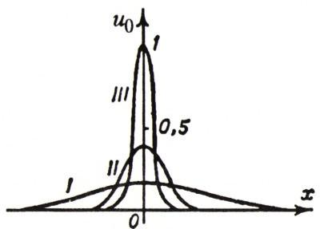
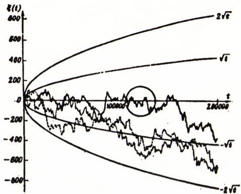
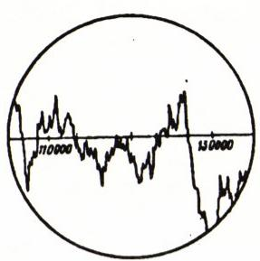

# 关于控制论、维纳与维纳过程

> **原标题**：О кибернетике, Винере и винеровском процессе
> **作者**：В. Тихомиров（V. 季霍米罗夫，1935—　，苏联／俄罗斯数学家，莫斯科大学教授）
> **译自**：Квант 1995, № 2（纪念诺伯特·维纳百年诞辰专题）
> **原文扫描**：https://www.kvant.digital/data/kvant_1995_2/jpg/0003.jpg
> **主题**：控制论的兴衰、维纳其人其事、维纳过程（布朗运动）的历史与数学
> **难度**：★★★（叙事性回忆＋数学物理概念：热传导方程、δ 函数、布朗运动、随机游动、马尔可夫过程）
> **译者**：Claude（初译）／ 2026-06-25

---

> *本篇刊于《Квант》1995 年第 2 期「纪念诺伯特·维纳百年诞辰」专题。前半为季霍米罗夫的回忆与思想评述，后半简要回顾从傅里叶、爱因斯坦到维纳关于布朗运动的数学脉络。同期另有 В. Никифоровский 撰写的《诺伯特·维纳传记片段》，本译文据 OCR 底稿迻译，文末附其起始段。*

## 控制论在苏联的命运

> 「控制论（源自希腊语中意为『舵手、掌舵者』的词）是一种反动的伪科学，于第二次世界大战之后产生于美国，并在其他资本主义国家得到广泛传播……控制论鲜明地体现了资产阶级世界观的基本特征之一——它的非人道性，即企图把劳动者变成机器的附庸、变成生产与战争的工具。与此相伴，控制论还有一个帝国主义式的乌托邦——无论是在生产中还是在战争中，都用机器去取代活生生的、会思考的、为自身利益而斗争的人。」

这段话出自一本简明哲学辞典（引自 1954 年第四版），在数年之内，这本辞典竟是我们了解这一新科学方向的唯一资料来源。

而被冠以「反动伪科学之父」之名的，正是美国科学家诺伯特·维纳（Norbert Wiener）。在《控制论》一书问世（1948 年）之前，他只被那些从事通信理论应用研究的数学家与工程师所知晓。

第一个把「控制论」（кибернетика）一词作为术语、用于指称广义上的「控制」的人，是古希腊思想家柏拉图（公元前 4 世纪）。其后，安培（在上个世纪）提议以此称呼研究人类社会管理的那门科学。维纳则用这一术语来命名研究生物机体与各类机器、自动机中的控制与信息联系的科学。

在我国，对控制论的彻底否定，忽然之间转变成了异乎寻常的热烈拥护（尽管某些「极端的」控制论思想，至今仍被许多人心怀敌意与拒斥地看待）。

那么，控制论究竟是什么？它的「极端思想」又是什么？

也许可以这样回答：控制论是一种科学的世界观，它使我们对下面的问题得以作出肯定的回答：

「机器能否繁衍出与自身同类的机器，而且在自我繁衍过程中能否发生渐进式的进化，从而造出比原来的机器更为完善的机器？

机器能否体验情感——能否欢喜、悲伤、对某事感到不满、想要得到某物？机器最终能否自行提出那些设计者并未交给它的任务？」

Н. 维纳的《控制论》一书在全世界上获得了史无前例、闻所未闻的成功。从骤然展现的前景中人们屏住了呼吸。诸如宇宙、思维乃至生命本身，这些奠基性的概念，都受到了这一新颖而非凡的见解的审视。从维纳的《控制论》所引发的智能爆炸的威力，可由它对 А. Н. 柯尔莫哥洛夫所产生的印象中窥见一斑。

为了以最尖锐的形式把维纳的思想传达给听众，А. Н. 柯尔莫哥洛夫在他 1961 年 8 月 6 日于莫斯科大学礼堂所作的演讲《自动机与生命》中，提出了上文我所援引的那些问题。

控制论的意识形态与 А. Н. 柯尔莫哥洛夫颇为投契。对他所提出的问题，他都作了肯定的回答。不仅如此，他还认为——而且并非在无穷遥远的未来，而是指日可待——创造出「一种新的、同样高度组织化的生命，尽管它可能十分独特、与我们的生命大不相同」是现实的。

某些因对控制论的思索而萌发的想法，在安德烈·尼古拉耶维奇内心里激起了深沉而隐秘的共鸣。例如，他对一个素不相识之人所说的话¹便足以印证这一点。「正因如此，我希望，」柯尔莫哥洛夫写道，「在我的控制论……演讲中……有一部分听众能领悟到一种人道主义（гуманизм）的世界观：它深知人类文化那不朽的价值，并深知这种价值并不需要借助于对灵魂不朽的信仰、对灵魂的『非物质性』、对创造的根本上的非理性等等的信仰来加以支撑。」（对于我曾与之讨论过这一话题的许多人而言，这类见解是无法接受的。诚然，它们与宗教观念不相容。但即便是那些并无坚定宗教信仰的人，也很难割舍关于「创造的根本上的非理性」之类的幻想。然而，计算机在智能上的种种成就如今已司空见惯。就在不久以前，卡斯帕罗夫还自信满满地断言机器永远无法战胜他。可他到底还是输给了它！）

如今，关于控制论、关于「机器能否思考」等等的激烈争论早已成为旧事，许多人或许会带几分讥诮地看待讨论这类话题的企图本身。如今大多数人另有关切。而那时——五十年代末六十年代初——突然透出了一缕微弱的希望之光：人类或将选择一条通往和平而幸福的兄弟情谊之路，这条路建立在以人的理性与机器理性相结合所成的力量为根基的原则之上……（唉，事情在这条路上并没有走得太远。）在这里，或许应当说一句：人们对维纳的态度向来不是单一的。这同样适用于他的代表作。

## 维纳的数学成就

许多数学家对维纳的代表作抱着相当大的怀疑态度。一个佐证是：由著名荷兰数学家兼数学随笔作家汉斯·弗赖登塔尔（Hans Freudenthal）执笔、收入卷帙浩繁的多卷本科学家传记百科全书中的那篇维纳传记短文。弗赖登塔尔违背了一切撰写百科传记的原则，竟以下面这段话作结：「即使以维纳本人的标准来衡量，《控制论》也是一部组织得很糟糕的著作。它本身便是印刷错误、错误的数学论断、不正确的公式、华而不实却支离破碎的思想以及逻辑荒诞的大杂烩。令人遗憾地不得不承认，恰恰是这本书给维纳带来了最大份额的社会声名。」（为公允起见，应当说，同样的评语也适用于许多对人类起过强烈震撼作用的书。）

维纳的数学创造，与我国最杰出的数学家——А. Н. 柯尔莫哥洛夫和 И. М. 盖尔范德——的创造紧密相连。维纳为马尔可夫随机过程理论奠下了第一块基石（参见本文最后部分关于维纳过程的叙述），而马尔可夫过程的一般理论则由柯尔莫哥洛夫所建立。维纳关于傅里叶级数理论的一条出色定理（若连续函数

$$
x(t) = \sum_{k \in \mathbf{Z}} x_{k} e^{ikt}
$$

具有这样的性质：

$$
\sum_{k \in \mathbf{Z}} |x_{k}| < \infty,
$$

且处处不为零，则函数 $x^{-1}(t)$ 可表示为级数

$$
\sum_{k \in \mathbf{Z}} y_{k} e^{ikt},
$$

并且同样有

$$
\sum_{k \in \mathbf{Z}} |y_{k}| < \infty
$$

），构成了盖尔范德的巴拿赫代数理论的奠基之一。（无论是马尔可夫过程理论，还是巴拿赫代数理论，都是 20 世纪数学的无争议的顶峰。）

第二次世界大战期间，维纳从事电网、计算技术、射击理论的研究。在为高射炮的火控设计前置预测系统时，维纳建立了随机过程的预测理论，而这一理论在很大程度上已由柯尔莫哥洛夫所预见（柯尔莫哥洛夫关于这些主题的论文早在战前就发表于法国科学院《通报》。维纳在自己的书中以极不寻常的敬意谈到柯尔莫哥洛夫）。也正是在这几年间，他与生理学家、医学家开始了交往。如此多方面、高强度的创造活动，使维纳能够在四十年代末形成控制论的一般概念，并由此为他赢得了科学家中罕见的知名度。但他对纯数学本身的贡献也是非常可观的：几乎没有哪个数学家没听说过维纳过程、维纳测度、维纳—霍普夫方程。他与巴拿赫（Banach）同时开创了赋范空间理论的雏形，在调和分析、位势论、随机过程滤波理论方面都做了大量工作。

……六十年代初，维纳访问了莫斯科。他将在综合技术博物馆作演讲的消息已经公布。有人给我打电话，说维纳非常想与柯尔莫哥洛夫见面。与他联系安德烈·尼古拉耶维奇的几次尝试都未果，于是请我帮忙。我便去了科马罗夫卡——莫斯科近郊的一处别墅，帕维尔·谢尔盖耶维奇·亚历山德罗夫（著名数学家、拓扑学家、院士）和安德烈·尼古拉耶维奇·柯尔莫哥洛夫都在那里度过相当多的时间。我在科马罗夫卡见到了柯尔莫哥洛夫，转达了维纳的请求，但安德烈·尼古拉耶维奇婉拒了这次会面。

那时的我还太年轻，不便直接询问拒绝的原因。我只能谈一谈我自己的猜测。也许，安德烈·尼古拉耶维奇不愿意与维纳见面，是因为他担心对方会以略带居高临下、庇护式的口吻对待他——这种口吻往往是名流所特有的。（在学术界，柯尔莫哥洛夫所处的地位至高无上，维纳无法与之相提并论。但事实终究是事实：我们大多数同胞正是从维纳的书中才第一次知道有一位名叫柯尔莫哥洛夫的科学家。这令安德烈·尼古拉耶维奇感到懊恼。）

又或许，是帕维尔·谢尔盖耶维奇对维纳所持的几分讥讽态度起了作用。

再没有什么比少年时代的名声更牢固的了。从前，有一个少年来到了格丁根（Göttingen）——那个时代的数学麦加——一座居住着、并创作着我们这个世纪最伟大的「数学先知」大卫·希尔伯特（David Hilbert）的城市。这个少年，从幼年时起便沉浸在科学之中，在没有同龄玩伴、没有欢乐的游戏与嬉闹、没有伙伴相聚与童年淘气的环境里长大。他所受的教育并不完整。他时不时做出一些荒唐、可笑、笨拙的举动。关于他的趣闻轶事流传甚多。下面便是从 П. С. 亚历山德罗夫那里听来的两则。

……有一次，少年维纳想和诺特（Noether）讨论些什么。（关于谁是最杰出的女数学家这一问题，人类分成了两派：一派认为是埃米·诺特（Emmy Noether），其余的人则认为是我国的索菲娅·柯瓦列夫斯卡娅。）诺特小姐说：「请您明天六点左右到我这里来吧。」于是维纳在早上六点钟登门拜访，把女主人从睡梦中叫醒，把她吓了一跳，她披着睡衣跑了出来……而这位可怜的神童怎么也不会想到（否则他大概会再核实一下，或问一问什么人），从一位可敬的女士口中说出的「六点钟」，理所当然指的是傍晚六点！

还有一则流传极广的故事。它记于康斯坦丝·里德（Constance Reid）所著《希尔伯特》一书²，但我要重述的，是我以为更为生动的、П. С. 亚历山德罗夫的版本。

有一次，维纳在希尔伯特的讨论班上作报告。报告结束后，按惯例大家都下到一间小地下室里，就着一杯啤酒继续进行学术上的和其他的讨论。突然，费利克斯·克莱因（Felix Klein）——当时德国数学界的泰斗——「下临」到此。他问希尔伯特：「报告作得怎么样？」希尔伯特以他惯常的、不紧不慢的口吻答道：「在我漫长的数学生涯中，我听过许许多多各种各样的报告。其中既有内容与形式俱佳的精彩报告，也有内容绝佳却极其难懂的报告，也有形式精美而内容贫乏的报告，还有那种内容之贫乏再加以表达之拙劣的报告……」所有人都急不可耐地等着结局，尤其是那个目光炯炯的孩子——他在家里早已习惯了被宠爱与称赞。结局终于来了：「可是像这样糟糕透顶的报告，我还从未听过！」

安德烈·尼古拉耶维奇·柯尔莫哥洛夫与诺伯特·维纳，终究没有见面。

……出乎我意料的是，要混进维纳在综合技术博物馆的演讲竟十分容易。而当时在（并不算大的）大厅里还有许多空位。（而柯尔莫哥洛夫的《自动机与生命》演讲则挤满了拥有 2000 个座位的大学礼堂，当连过道都挤满之后，便不再让人进入。为前来听讲的人，临时启用了两间巨大的阶梯教室并紧急装上了扩音广播，才勉强够用。）事情为何如此，很难说。也许，是因为对控制论的兴趣已经开始衰退了。

综合技术博物馆的集会由著名的苏联心理学家亚历山大·罗曼诺维奇·卢里亚（А. Р. Лурия）主持。他热情地向维纳致了欢迎辞。随后，伊斯雷尔·莫伊谢耶维奇·盖尔范德（И. М. Гельфанд）也讲了几句关于这位客人的好话。

在自己的报告之前，维纳答谢了欢迎辞。这是一段非常得体的讲话。维纳慷慨地盛赞了我国的科学家，感谢了主席，指出他个人的学术经历在许多方面与 И. М. 盖尔范德的经历是平行的（巴拿赫代数、物理学、生物学与医学）。随后他作了一场在形式和内容上都非常精彩的报告。（如此看来，自从维纳在希尔伯特的讨论班上作报告以来所过去的四十年，并没有白费。）报告结尾，报告人生动有趣地回答了各种问题。

我对那一天保留着最温暖的回忆。维纳给我留下了深刻的印象——一位真正的科学家，一位善良而令人感动的人。

## 维纳过程：从傅里叶到爱因斯坦再到维纳

而现在，作为收尾，我想谈几句也许是维纳最重大的发现——维纳过程。为此，不得不作一段小小的历史回顾。

1822 年，著名的法国科学家让·巴蒂斯特·傅里叶（Jean Baptiste Fourier）出版了他的论著《热的解析理论》。书中描述了热量在各种介质中的传播过程。在均匀的导热杆中，温度 $u(t,x)$（作为点的坐标 $x$ 与时间 $t$ 的函数）满足热传导方程

$$
\frac{\partial u(t,x)}{\partial t} = \frac{1}{2} \frac{\partial^{2} u(t,x)}{\partial x^{2}}.
$$

（热传导方程通常就是数学家们这样写的。记号 $u(t,x)$ 对他们而言也是标准的。物理学家则用字母 $T$ 记温度，并把方程的右端乘上一个「量纲」系数 $\dfrac{2K}{c\rho}$，其中 $K$ 是热传导系数，$\rho$ 是密度，$c$ 是比热容。）容易验证，函数 $u_{0}(t,x) = (2\pi t)^{-1/2} e^{-x^{2}/2t}$ 是热传导方程的一个解。此时，若令 $t$ 趋于零，则这一函数会越来越「像」所谓的狄拉克 δ 函数（狄拉克是量子力学的创立者之一），他是这样定义它的：这个函数处处为零，唯有在原点处等于无穷大，而其积分等于 1（图 1）。（注意到

$$
\int_{-\infty}^{\infty} u_{0}(t,x)\, dx
$$

对任意 $t>0$ 的确等于 1。）

所有这一切，「在物理学的严格性水平上」意味着：若在初始时刻给一根无限长（沿 $x$ 轴放置的）杆输入单位数量的热量（例如，在坐标原点处用一根极细的灼热针触碰它一下），则在时刻 $t$、在点 $x$ 处，杆的温度将等于 $u_{0}(t,x)$。

*图 1. 函数 $u_{0}(t,x)$ 在三个具体的 $t$ 值处的形状：6,25；1；0,16*

我们这一路上的下一个名字，是阿尔伯特·爱因斯坦（Albert Einstein）。时间——1905 年——正是爱因斯坦发表他的第一篇相对论论文、以及阐释光电效应的量子论短文（他因此于 1921 年获诺贝尔奖）的同一年。但除此之外，爱因斯坦还在同一年对分子动理论作出了奠基性的贡献。我们现在要谈的，就是他那篇题为《由分子动理论所要求的、悬浮在静止液体中的微粒的运动》的论文。文中，爱因斯坦建立了关于极小的（仅在显微镜下可见的）悬浮粒子在静止液体中那种混沌、无序运动的理论。爱因斯坦导出了关于粒子数密度的方程，并发现它恰好就是热传导方程。

稍晚一些，杰出的波兰物理学家马利安·斯莫卢霍夫斯基（Marian Smoluchowski）也独立地达到了同样的思想。他大大推进了爱因斯坦的理论。还应指出，法国物理学家让·佩兰（Jean Perrin）从爱因斯坦的研究出发，给出了一种独立于其他方法的、关于阿伏伽德罗常数（一摩尔物质中的分子数）的实验测定；它约等于 $6 \cdot 10^{23}$。

这是那个科学事件层出不穷的年代中轰动一时的成就之一：分子的物质结构理论得到了实验上的证实，居然「称量」出了一个「单独取出的」分子！佩兰因这些研究而于 1926 年获诺贝尔奖。至于问题的理论方面，爱因斯坦所设想的乃是这样的一个过程模型：悬浮在液体中的粒子经受着与液体分子的混沌碰撞，正因如此它处于永不停歇的混沌运动之中。（这一现象最早由英国植物学家布朗（Brown）于 1827 年所描述，并被称为布朗运动。）布朗运动的离散类比，便是直线上这样一种最简单的随机游动：粒子只在 $\Delta t$ 的整数倍那些离散时刻改变自己的位置。若粒子在某时刻位于点 $x$，则在下一时刻它以相等的概率向右或向左移动 $\Delta x$（而与它先前的行为无关）。现在，若取 $\Delta t = 1/n$（$n$ 充分大），取 $n$ 个粒子，让它们从原点出发彼此独立地游动，每次位移 $\Delta x = \sqrt{\Delta t} = 2/\sqrt{n}$，则在 $n$ 步之后（即经过一个单位时间之后），位于坐标 $x'$ 与 $x''$ 之间的粒子数将近似等于

$$
\int_{x'}^{x''} (2\pi)^{-1/2} e^{-x^{2}/2}\, dx.
$$

这一事实自拉普拉斯（Laplace）时代起便已为人所知，它与爱因斯坦的结果完全相符——只要对 $n$「取极限」。而恰恰是这个极限过渡，是由维纳所完成的。

让我们画出上述随机游动的若干条轨迹。最典型的轨迹具有非常「曲折」的外观。当 $n$ 趋于无穷时的极限，便是连续的随机游动。它就叫作维纳过程。图 2 中画出了通过离散模拟所得的维纳过程的三条轨迹。维纳为上述的极限过渡赋予了精确的含义。维纳过程的「实现」，原来是连续的、却又非常「曲折」、处处不可微的曲线。佩兰在其著作《原子》一书中，便曾描述过布朗粒子的这种性状。

*图 2. 三条布朗粒子的轨迹*

*诺伯特·维纳*

正是对布朗运动轨迹的描述，维纳最引以为豪。他在自传中写道：「在爱因斯坦与斯莫卢霍夫斯基的那些奠基性工作中……所研究的，或者是某个粒子在某个确定时刻的行为，或者是大量粒子集合的依赖于时间的统计特征。而个别粒子轨道的数学性质，则未被触及……很自然地要把布朗运动加以理想化，假定分子无限小、碰撞连续发生。我所研究的，正是这种理想化了的布朗运动……在这一理论的框架内，我得以证实佩兰的论断：除去一个总概率为零的集合中的情形以外，布朗运动的所有轨迹都是连续的、处处不可微的曲线。」于是，精微的数学理论与对自然现象的解释，在研究中融合为一了。

最后只需补充：马尔可夫过程的一般理论的开端（维纳过程是它的一例特例，尽管是最重要的特例），不久之后便由安德烈·尼古拉耶维奇·柯尔莫哥洛夫所奠定，而他们对这一数学物理分支的共同贡献，成为本世纪科学的最大成就之一。在其中，傅里叶的热理论、拉普拉斯的中心极限定理、爱因斯坦与斯莫卢霍夫斯基的布朗运动理论，重新汇合在了一起。

---

## 诺伯特·维纳传记片段

**В. 尼基福罗夫斯基**

能够开创科学新方向的人，本就不多。而能够开创出全新科学的人，就更少了。诺伯特·维纳便是这样的巨人之一——去年末是他百年诞辰。他的产儿——控制论，即关于机器与生命机体中的控制与联系的科学——诞生于先前彼此并不相交的数学与生物学、社会学、经济学的融合。为了不留未交代清楚之处，我们立刻就指出：维纳在这一领域中所成就的一切，以及他的许多论断，都是如此之不寻常、如此之与我们占主导地位的意识形态相抵触，以至于在苏联，控制论被宣布为伪科学。这导致我国在计算技术及一切与之相关的领域中，远远落后于其他国家。

维纳对「纯粹」数学的贡献，也是无可争议的。

他的研究对象包括：数学基础、数学分析、概率论、谱综合问题、调和分析、相对论与量子论、位势论、布朗运动、电网理论、遍历定理。

维纳是为数不多的、亲自详细写下自己生平的科学家之一。他出版了两本关于自己生活与创作的精彩著作——《昔日神童》（1951）和《我是一个数学家》（1956）；后者……

> **译者注**：本篇同期杂志中 В. 尼基福罗夫斯基 所撰《诺伯特·维纳传记片段》紧随季霍米罗夫一文之后刊出，原 OCR 底稿仅录至其第二部著作「Я — математик」开篇处（杂志后文延续），译文至此亦止，以与底稿一致。

---

¹ 此处信件原文用大写字母强调「人道主义」一词，柯尔莫哥洛夫借此申明：人道主义的世界观并不依赖于对灵魂不朽、创造之非理性等信念的支撑。
² Констанс Рид（Constance Reid），《希尔伯特》（«Гильберт»）。

---

## 译者注与校对说明

1. **OCR 校正**：本文由 MinerU 对扫描页（p3–p6）做俄文 OCR 后翻译。已校正若干 OCR 错误：
   - 首段引文开头「КИБЕРНЕТКА」实为「КИБЕРНЕТИКА」（控制论）的扫描漏字，译文已补；
   - 第 4 段「Винер использоватал этот термин」中「использоватал」为「использовал」（使用）的 OCR 误植，译文从正字；
   - 第 5 页「зоздал ученым нашей страны」中「зоздал」为「отдал」（致敬／献给）的 OCR 误植（з/о 混淆），译文从正字；
   - 热传导方程的 δ 函数记号、随机游动步长 $\Delta x = \sqrt{\Delta t} = 2/\sqrt{n}$ 等公式均与扫描页核对；俄文小数逗号（6,25；0,16）按规范保留；
   - 维纳定理中 $x^{-1}(t)$、$\sum |y_{k}|<\infty$ 等显示符据上下文还原。
2. **术语**：本文核心概念——**控制论**（кибернетика）、**马尔可夫过程**（марковский случайный процесс）、**维纳过程**（винеровский процесс）、**布朗运动**（броуновское движение）、**热传导方程**（уравнение теплопроводности）、**δ 函数 / 狄拉克 δ 函数**（δ-функция Дирака）、**随机游动**（случайное блуждание）、**中心极限定理**（центральная предельная теорема）、**巴拿赫代数**（банаховы алгебры）、**赋范空间**（нормированные пространства）、**位势论**（теория потенциала）等，均按《01_工作规范.md》对照表迻译；人名（维纳、柯尔莫哥洛夫、盖尔范德、希尔伯特、克莱因、诺特、傅里叶、爱因斯坦、斯莫卢霍夫斯基、佩兰、弗赖登塔尔）首次出现时附俄文与原名。
3. **图表**：原文两幅插图（图 1：函数 $u_{0}(t,x)$ 的三条曲线；图 2：三条布朗粒子轨迹）由 MinerU 从整页扫描中自动裁出，存于 `images/ext_X50/fig_p5_01.png`、`fig_p6_01.png`；另有一幅维纳肖像（`fig_p6_02.png`，原图无图号、无图注）据上下文置于图 2 之后。所有图片路径前缀为 `../images/ext_X50/`。
4. **苏联时代用语**：首段所引 1954 年哲学辞典对控制论的定性（「反动的伪科学」「资产阶级世界观」「帝国主义式的乌托邦」等），以及正文中关于苏联将控制论「宣布为伪科学」、导致「在计算技术上落后于其他国家」等表述，均保留时代语感，忠实迻译，不加删改亦不加注评。
5. **节段标题**：原文除大标题外另含一节《Страницы биографии Норберта Винера》（尼基福罗夫斯基作），并换作者署名。为便于阅读，译文对季霍米罗夫的长文按内容加了若干小标题（控制论在苏联的命运／维纳的数学成就／维纳过程：从傅里叶到爱因斯坦再到维纳），均为译者所加，并非原文所有。

## 建议讨论题

1. 季霍米罗夫开篇所引 1954 年哲学辞典把控制论斥为「反动的伪科学」，而短短数年之后它又被「异乎寻常地热烈拥护」。从彻底否定到盲目追捧，这种大起大落反映了怎样的科学与社会互动？今天的我们是否还在某些议题上重蹈类似的覆辙？
2. 维纳过程是把离散随机游动「取极限」得到的连续过程，其轨道是「连续却处处不可微」的曲线。请对照图 2 思考：为什么典型的随机游动轨迹会越来越「曲折」？「处处不可微」在直觉上对应着布朗粒子的什么物理特征？
3. 文中提到，维纳与柯尔莫哥洛夫终其一生未曾谋面，柯尔莫哥洛夫还婉拒了维纳的会面请求。结合亚历山德罗夫所讲的两则维纳轶事，你如何评价「少年时代的名声」对一位学者一生际遇的影响？
4. 傅里叶的热传导方程、爱因斯坦与斯莫卢霍夫斯基的布朗运动理论、拉普拉斯的中心极限定理，最终在维纳过程与柯尔莫哥洛夫的马尔可夫过程理论中「重新汇合」。请梳理这条贯穿近一个世纪的脉络，并说明数学抽象（如 δ 函数、极限过渡）在其中所起的作用。

---

> **版权说明**：原文版权归 MCCME（莫斯科连续数学教育中心）及作者继承者所有。本译文为非商业、自用、数学圈内部参考，未获授权不得公开分发。原文扫描见 [kvant.digital](https://www.kvant.digital/data/kvant_1995_2/jpg/0003.jpg)。

> **复用说明**：本译文的俄文 OCR 原文与所有插图均存档于 `ocr/ext_X50/`（`ru.md` 为合并 OCR 文本，`meta.json` 为图映射，`images/ext_X50/` 为扫描页与裁出的插图）。如对译文质量不满意，可直接基于 `ocr/ext_X50/ru.md` 重译，无需重跑 MinerU。
