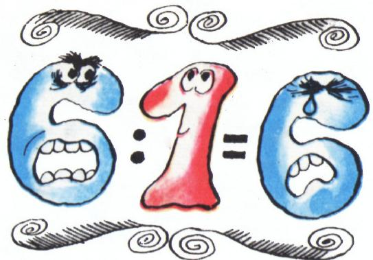
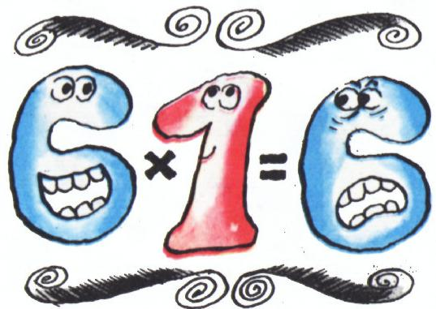
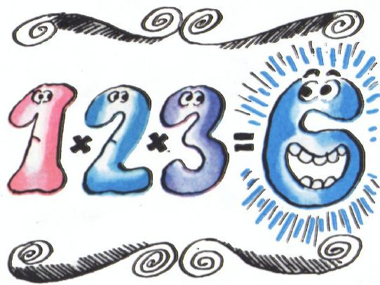
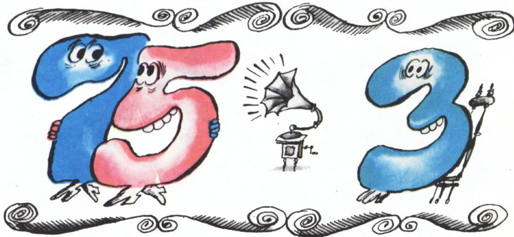

# 算术公主的舞会

> **原标题**：Бал у принцессы Арифметики
> **作者**：А. Д. Бендукидзе（本杜基泽）
> **译自**：Квант 1974, № 7
> **栏目**：Квант для младших школьников（小学）
> **原文**：https://www.kvant.digital/issues/1974/7/bendukidze-bal_u_printsessyi_arifmetiki-5f4d7cf4/
> **主题**：算术/数论（童话式讲解自然数性质）
> **难度**：★（小学高年级可读）
> **译者**：Claude（AI 初译，2026-06）

---

算术公主迎来了客人——她的亲妹妹几何，还有她的两位表妹哲学和音乐。公主为这次来访高兴极了——姐妹们从小就结下了深厚的友谊。

为了款待贵客，宫中举办了一场舞会。遵照公主的吩咐，所有的自然数都受到了邀请。它们川流不息，纷纷走进算术那座宏伟的大厅。

瞧，首先走来的是「一」。他为自己得到的这份荣幸而骄傲——能第一个走进大厅，向公主和客人们致意。紧随其后的是「二」「三」「四」，依此类推。它们彼此竟如此不同！

舞会开始了。几乎所有的数都参加了这场庆典……

主人也玩得十分开心。突然，她发现音乐似乎心事重重——她一会儿惊讶地盯着这个数，一会儿又打量着那个数，仔细端详它们结成的一个个小团体……

——怎么了，亲爱的？你为什么不开心呢？瞧，多么丰富多彩呀！——算术向她问道。

——噢，亲爱的！正是这种丰富多彩，引得我思绪万千。你的这些臣民举止如此奇特，我简直什么也看不懂！

——这有什么可奇怪的呢？它们个个都不同，不光是模样和社会地位不同，性格也各不相同。想不想让我给你讲讲它们的故事？——公主一边问，一边亲切地吻了吻妹妹。

——那我可太感谢你了。我想，你的这番话也一定会引起几何和哲学的兴趣。是不是呀，两位亲爱的？——音乐转头问一直在专心观察着数的几何和哲学。

——当然，当然，——她们应声道，——靠我们自己，恐怕是理不出头绪来的。

——好吧，那我就来满足你们的好奇心，——算术说。——不过，等等，我有个主意：咱们请毕达哥拉斯来替我讲吧——数的王国里一切奥秘，他可全都知道。

姐妹们对毕达哥拉斯再熟悉不过——他不止一次来做客。四人一起走到了他跟前。

——睿智的毕达哥拉斯，——公主对他说，——我们尊贵的客人对我的臣民们很感兴趣。我本想亲自给她们讲讲这个——按她们的说法——奇特的王国，可我又改了主意：毕竟你讲起来肯定比我强得多。劳驾啦，可别推辞我们的请求；我也乐意听你讲——你一定又有些新鲜事儿要告诉我们。

——很荣幸为您效劳，亲爱的公主。听凭您的差遣，——毕达哥拉斯鞠了一躬，便开始讲述起来。

——世上再没有比数更有趣的事物了！每一个数都是独一无二的，身上都藏着许多了不起的性质。就拿「一」来说吧。你们当然都看到了，他走进大厅时是多么神气。我们的「一」有这份资格——他是自然数队列里的第一名，而且拥有与众不同的性质：任何一个自然数都能被他整除，而他本人却只能被自己整除——这也是唯一一个只有一个约数的数。还有一点特别之处：别的数除以一、或者乘以一，都不会改变。大家都尊重他、看重他。他象征着平等，而「二」呢，却是不平等的开端。「三」也拥有非凡的性质：它不仅是一个三角形数\*)，而且还是第一个奇数的素数。可还不止这些：「三」是唯一一个等于前面所有数之和的数：$1 + 2 = 3$。「四」和「五」也各有有趣的性质。不过，「六」的性质就更了不起了。你们瞧，他多么神气地在厅里踱来踱去，分明感到了自己的优越。

——那么，这种优越又表现在哪儿呢？——哲学问道。

——表现在：这个数恰好等于自己所有真约数之和。它的约数是 $1$、$2$、$3$，而它们之和 $1 + 2 + 3 = 6$。这简直就是完美！所以我就把它叫做**完全数**\*\*)。

——太妙了！难道再没有别的这样的数了吗？——几何问。

——有的，——毕达哥拉斯微笑着回答，——可是少得很。这也合乎情理：所谓完美，就是美；而美嘛，可惜并不那么常见。我所知道的完全数有四个：

一位数的一个——$6$；两位数的一个——$28$；三位数的一个——$496$；四位数的——$8128$。我估计在五位数和六位数当中，没有完全数。你们有没有注意到，我所列举的这些数都是偶数？迄今为止我还没有找到任何一个奇数的完全数。我深信，这样的数并不存在。

——这确实令人赞叹！——哲学惊呼起来，随即转向算术请求道：——亲爱的，吩咐你的仆役们继续去寻找完全数吧！

——当然，当然，我们尊敬的毕达哥拉斯的研究一定会继续下去，——算术说罢，又狡黠地眯起眼睛问姐妹们：——难道你们对 $220$ 和 $284$ 这一对数的行为不感到惊奇吗？

——怎么不惊奇，——音乐说，——我一眼就看到这两个数

一直形影不离。可为什么——我就不知道了。

——它们是真正的朋友，——毕达哥拉斯说，——谁也无法把它们拆散。我把它们叫做**亲和数**，理由是这样的：它们各自真约数之和，正好等于对方。请看，$220$ 的真约数是 $1$、$2$、$4$、$5$、$10$、$11$、$20$、$22$、$44$、$55$、$110$，它们之和等于 $284$：

$$1 + 2 + 4 + 5 + 10 + 11 + 20 + 22 + 44 + 55 + 110 = 284.$$

而 $284$ 的真约数是 $1$、$2$、$4$、$71$、$142$，它们之和又等于 $220$：

$$1 + 2 + 4 + 71 + 142 = 220.$$

前几天有人问我：什么是朋友？我回答他说：「朋友就是另一个我」，并举了 $220$ 和 $284$ 这两个数作为例子。你们大概会问：除了它们，还有没有别的亲和数对呢？有，我还知道另外三对，就在大厅的尽头；不过那都是非常大的数。

——我还注意到一件事：舞会一开始，数们似乎就以奇特的方式两两配成了对。比方说，$11$ 和 $13$，$17$ 和 $19$，$29$ 和 $31$。可 $5$ 呢，一会儿跟 $3$ 跳，一会儿又跟 $7$ 跳。这又是怎么回事？——几何好奇地问。

——噢，这很简单，——毕达哥拉斯微微一笑，——只有**孪生素数**才会成对地跳舞。你们想必知道，如果 $p$ 和 $p+2$ 都是素数，它们就叫做一对孪生素数。这样的数自然就凑到了一块儿。至于「五」嘛，它既是「三」的孪生，又是「七」的孪生，所以一会儿跟这个跳，一会儿跟那个跳。

——唉，我怎么就没能看出来呢？我对素数可熟悉得很呀！——几何遗憾地说。

——没什么，妹妹，——算术安慰她，——别难过。咱们还是先谢谢我们亲爱的毕达哥拉斯，然后一起去跳舞吧。

公主们向毕达哥拉斯道了谢；而毕达哥拉斯也向她们保证：今后他将一如既往，忠心耿耿地为他所钟爱的算术、几何、哲学与音乐效劳。

A. Д. Б.（本杜基泽）

---

> **译者注（脚注 \*)）**：**三角形数**——能把若干个点排成一个等边三角形的数，例如 $1, 3, 6, 10, 15, \ldots$。$3$ 个点可以排成一行 $2$ 个、上面一行 $1$ 个的小三角形，故 $3$ 是三角形数。
>
> **译者注（脚注 \*\*)）**：**完全数**（совершенное число）——等于自己所有真约数之和的自然数。最小的几个是 $6, 28, 496, 8128$。截至本文发表的 1974 年，已知的完全数均为偶数；奇数完全数是否存在，至今仍是数论中一个著名的未解之谜（事实上此后几十年间仍未找到，也未被证明其不存在）。
>
> **译者注**：文中毕达哥拉斯断言「五位数和六位数中没有完全数」，这一说法并不正确——事实上 $33\,550\,336$（八位数）才是下一个完全数；而真正的第五个完全数远比他所列举的更大。原文保留了这位古希腊数学家认知的局限，体现了童话的叙事口吻，译文照译，供小读者对照思考。
>
> **译者注**：**亲和数**（дружественные числа）——两数各自真约数之和恰好等于对方。除 $220$ 与 $284$ 外，较小的一对是 $1184$ 与 $1210$。
>
> **译者注**：**孪生素数**（простые числа-близнецы）——相差为 $2$ 的一对素数，如 $(3,5)$、$(5,7)$、$(11,13)$、$(17,19)$、$(29,31)$。孪生素数是否有无穷多对，同样是一个著名的未解问题。
