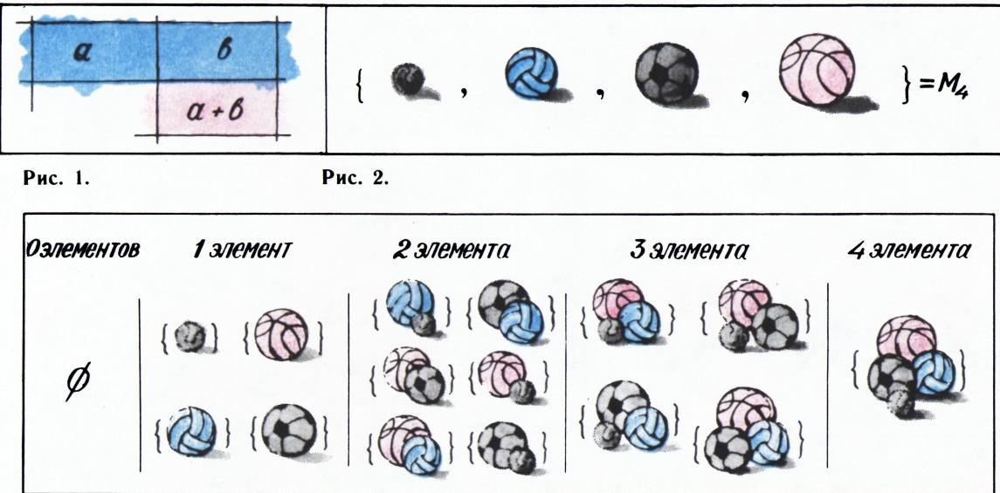
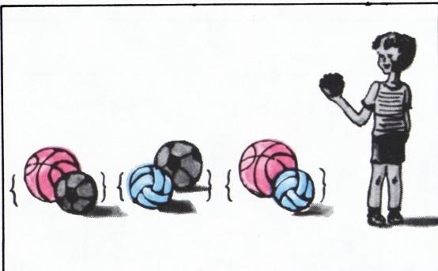
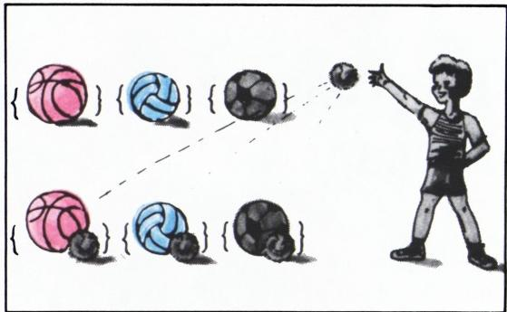
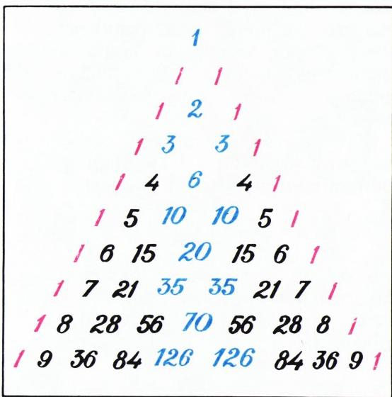
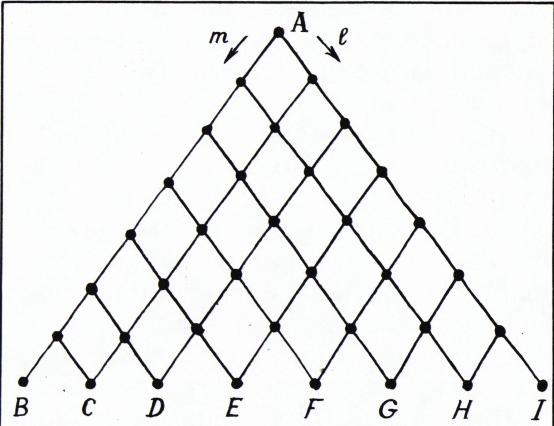
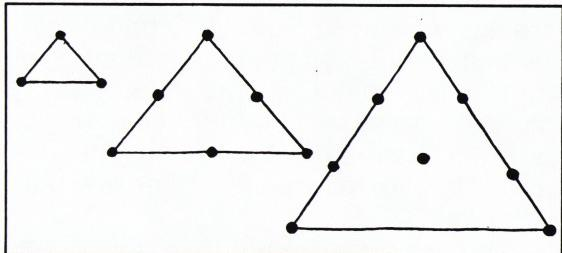

# 帕斯卡三角形

> **原标题**：Треугольник Паскаля
> **作者**：А. Д. Бендукидзе（本杜基泽）
> **译自**：Квант 1982, № 10
> **栏目**：Квант для младших школьников（小学）
> **原文**：https://www.kvant.digital/issues/1982/10/bendukidze-treugolnik_paskalya-13aab871/
> **主题**：算术 / 数论（组合数与杨辉三角）
> **难度**：★（小学高年级可读）
> **译者**：Claude（AI 初译，2026-06）

---

拿一张纸，在上面画一张 $10\times 10$ 共 100 个方格的正方形表格（十行、十列）。画的时候注意把格子画得稍微大一点，因为待会儿要在格里填数，其中有些会是三位数。

怎么样，画好了吗？

太好了！现在开始填表。

在第一列的每个格子里都写上数字 1；第一行的格子里（除了最左边那格——它已经是 1 了）都写上 0。其余的格子按从左到右、从上到下的顺序一个一个地填，遵循图 1 所示的「过渡规则」。例如，第二行第二格应该写 1（因为 $1+0=1$），第三行第二格写 2（因为 $1+1=2$），依此类推。为了让你对照检查，这里给出第四行和第九行——如果你没算错，你得到的应该是一样的：

> 1　3　3　1　0　0　0　0　0　0
>
> 1　8　28　56　70　56　28　8　1　0

现在请仔细看看得到的这张表。表里的那些 0 拼成了一个三角形：它的两条边（一条竖直、一条斜）由一串 1 组成，第三条（水平的）边是

> 1　9　36　84　126　126　84　36　9　1

（当然，这个表既可以继续往下画，也可以不到第十行就停下。）

这样得到的三角形叫做**帕斯卡三角形**，是为了纪念伟大的法国学者布莱兹·帕斯卡（Blaise Pascal，1623—1662）——他设计并研究了这个三角形。它到底有什么了不起呢？我们马上就来瞧一瞧。

## 数一数子集

考虑由四个不同的球——网球、排球、足球、篮球——所组成的集合 $M_{4}$（图 2）。我们来找出它的所有子集（包括空集 $\varnothing$ 和整个集合 $M_{4}$ 本身），并按每个子集里所含元素的个数分组（图 3），然后把每一组的子集个数写成一行：

> 1　4　6　4　1

看着眼熟吗？没错，这正是帕斯卡三角形的第五行。这可不是巧合。要是我们取一个有三个元素的集合 $M_{3}$，按同样办法做一遍，就会得到「1　3　3　1」——帕斯卡三角形的第四行。一般地，如果取一个有 $n$ 个元素的集合 $M_{n}$，然后依次写下它的「0 元素子集的个数」「1 元素子集的个数」「2 元素子集的个数」……「$(n-1)$ 元素子集的个数」「$n$ 元素子集的个数」，那么得到的就是帕斯卡三角形的第 $(n+1)$ 行。

我们再对 $n=0,1,2$ 验证一下：确实没问题（图 4）。

要证明上面这件事在一般情况下也对，只要验证一件事：每一行都是按照和帕斯卡三角形一样的「过渡规则」由上一行得到的。而这确实如此。

举个例子，看看 $M_{4}$ 的「2 元素子集」的个数是怎么来的。我们暂时把网球藏进口袋——剩下的就是集合 $M_{3}$ 了。它里面已经有三个「2 元素子集」了（图 5）。

要得到其余的 2 元素子集，只需把网球从口袋里掏出来，再把它分别加到 $M_{3}$ 的三个「1 元素子集」上（图 6）：

这样就得到 $3+3=6$，正和过渡规则所预言的一样。显然，这段讨论是普遍成立的——对任何 $k\leqslant n$，它都告诉我们怎样从「一个 $n$ 元集合中 $k$ 元素子集的个数」过渡出来。

现在，如果想求「一个八元集合中有多少个五元子集」，再也不必费力地一个个去数了。现成的答案（70）就写在帕斯卡三角形第九行的第五个位置上。

不过，帕斯卡三角形的好处还不止这一点。

## 展开括号

只要逐步展开括号、合并同类项，就不难算出

$$
\begin{array}{l}
(1+x)^{2}=1+2x+1x^{2},\\
(1+x)^{3}=1+3x+3x^{2}+1x^{3},\\
(1+x)^{4}=1+4x+6x^{2}+4x^{3}+1x^{4}.
\end{array}
$$

用这种办法去算 $(1+x)^{5}$ 就有点麻烦了，至于 $(1+x)^{8}$，恐怕再勤快的小朋友也不愿意算。可话说回来，真有必要去算吗？答案是不是早就替我们存好在帕斯卡三角形相应的某一行里了？

我们看，展开式系数这几行的开头

> 1　2　1
>
> 1　3　3　1
>
> 1　4　6　4　1

恰好就是帕斯卡三角形开头的那几行。要想证明往后也一直如此，又只需找出这里所服从的过渡规则就够了。比如

$$
(1+x)^{5}=(1+x)(1+x)^{4}=(1+x)(1+4x+6x^{2}+4x^{3}+1x^{4});
$$

当展开最后一个括号时，比如 $x^{3}$ 这一项的系数，是由上一行里 $x^{2}$ 的系数和 $x^{3}$ 的系数相加而成的——得到 $10=6+4$，正好和帕斯卡三角形一样。显然，这个论证也是普遍成立的。

于是我们得出结论：在二项式 $(1+x)^{n}$ 的展开式中，按 $x$ 的次数从低到高排列的各项系数，恰好等于帕斯卡三角形的第 $(n+1)$ 行。

帕斯卡三角形又一次替我们省下了时间：瞄它一眼，不必动笔就能写出

$$
\begin{array}{c}
(a+b)^{9}=a^{9}+9a^{8}b+36a^{7}b^{2}+84a^{6}b^{3}+126a^{5}b^{4}+126a^{4}b^{5}\\
\quad+84a^{3}b^{6}+36a^{2}b^{7}+9ab^{8}+b^{9}.
\end{array}
$$

## 帕斯卡三角形的性质

把表格里的 0 都扔掉，可以把它改写成更对称的、真正的三角形形式：

我们来指出这张表的两条性质：

1. 每一行都关于自己的正中间对称。
2. 第 $n$ 行各数之和，等于上一行各数之和的两倍，也就是 $2^{n}$。

这两条性质都可以从过渡规则出发来证明。不过它们各有另外两种证法——一种走「子集个数」这条路，一种走「二项式系数」这条路。请你把这些证法自己动手写一写。

要想进一步了解帕斯卡三角形，可以读一读 В. А. 乌斯宾斯基的小册子《帕斯卡三角形》（《数学通俗讲座》第 43 辑，莫斯科，科学出版社，1978）。

## 习题

1. 一行 $2^{7}$ 个人从路口 $A$ 出发，沿着一张道路网走。从 $A$ 开始，每到一个岔路口，到达那里的人就一分为二——一半走 $l$ 方向，一半走 $m$ 方向。问：分别有多少人到达 $B,C,D,\ldots,I$ 各点？

   

2. 一共有多少个（а）两位数；（б）三位数，它们的各位数字是按从大到小的顺序排列的？

3. 所谓**三角形数**，是指像图 8 那种三角形里格点（整数点）的个数。在帕斯卡三角形里怎样才能找到三角形数？

   

4. 把下列各式展开成单项式的和：
   - （а）$(a-b)^{6}$；
   - （б）$(x-2y)^{5}$。
