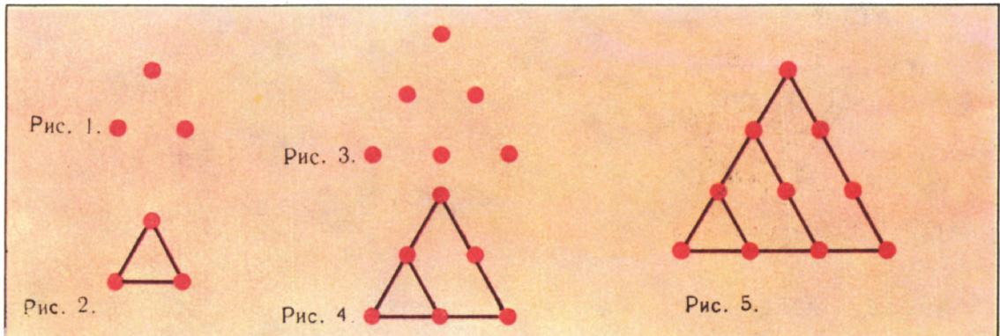
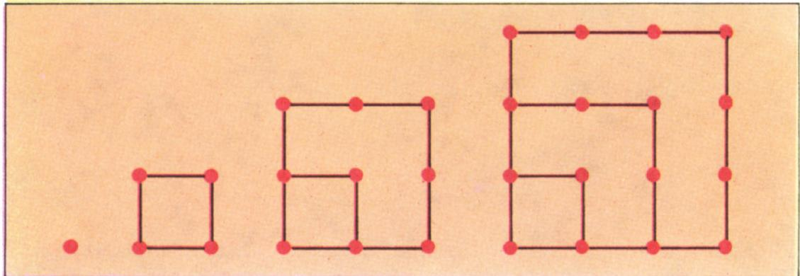
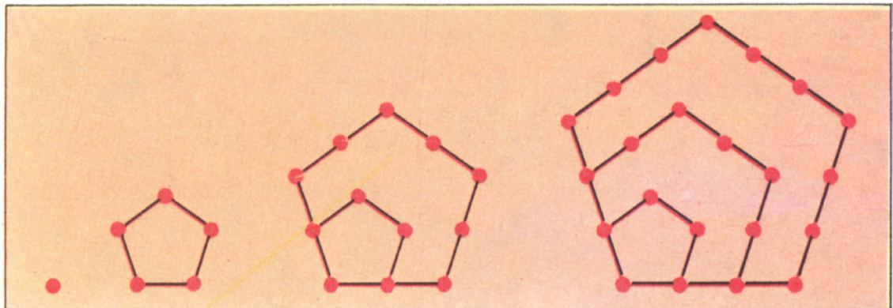
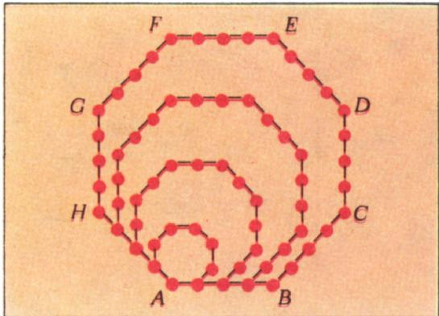
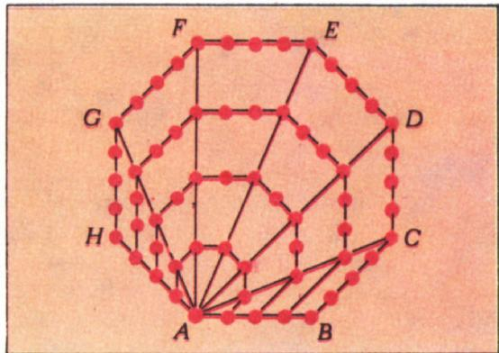

# 形数（三角形数、平方数）

> **原标题**：Фигурные числа
> **作者**：А. Д. Бендукидзе（本杜基泽）
> **译自**：Квант 1974, № 6
> **栏目**：Квант для младших школьников（小学）
> **原文**：https://www.kvant.digital/issues/1974/6/bendukidze-figurnyie_chisla-559ab51a/
> **主题**：算术 / 数论（三角形数、平方数等图形数）
> **难度**：★（小学高年级可读）
> **译者**：Claude（AI 初译，2026-06）

---

# 形数

А. Д. 本杜基泽

我在纸上画了三个点（图 1）。画的方式是这样：如果把它们两两相连，就会得到一个正（也就是等边的）三角形（图 2）。其实，即便不连线，这三个点本身也已经给人以一种「三角形」的感觉了。

那么，如果有四个点，能不能也按类似的方式排列呢？答案是——不能；这一点你可以自己验证。五个点也不行。可是六个点，就已经可以按所要求的次序排好了（图 3）。这时新得到的「六点三角形」，是把原来的「三点三角形」整体放大两倍得到的；放大自然就需要补上新的点（图 4）。

为了保持这种「三角形的感觉」，还要再加几个点呢？答案不难找到：四个。相应的三角形——它是把原来的三角形整体放大三倍得到的——画在图 5 中。

这样不断往下加点，就会得到一个又一个的新三角形。具体地说：在已有的十个点上再加五个，然后在得到的十五个点上再加六个，再加七个，依此类推（请你自己画一画！）。

现在我们试着来弄清楚：到底要有多少个点，才能摆成一个「三角形阵列」呢？

在我们的例子中，点的数目先是 $3,\ 6,\ 10$，接着是 $15,\ 21,\ 28,\ \ldots$。这些数，道理很明白，叫做**三角形数**。我们想弄清楚三角形数到底长成什么样子。只要注意到下面这件事，这件事就不难办到：

$$
\begin{array}{r l}
3 &= 1 + 2 \\
6 &= 1 + 2 + 3 \\
10 &= 1 + 2 + 3 + 4 \\
15 &= 1 + 2 + 3 + 4 + 5
\end{array}
$$

组成这些数的规律，一眼就能看出来。可以证明，这一规律往后也照样成立。也就是说，如果把第 $n$ 个三角形数记作 $T_{n}$，并且规定 $T_{1}=1$，那么就有下面的公式：

$$
T_{n} = 1 + 2 + 3 + \dots + n.
$$

这公式看上去挺简单，可真要拿它来算，并不方便。要把它化成便于计算的样子，我们注意一件事：在等号右边那一串加数里，离首尾两端等远的两个加数，相加都等于同一个数，也就是 $n+1$。

这下就很简单了：把我们这个公式抄两遍，第二遍把加数的次序倒过来：

$$
\begin{array}{r l}
T_{n} &= 1 + 2 + 3 + \dots + (n-2) + (n-1) + n, \\
T_{n} &= n + (n-1) + (n-2) + \dots + 3 + 2 + 1.
\end{array}
$$

把这两个等式「按竖式」相加；左边得到 $2T_{n}$，右边则得到 $n+1$ 这个数，一共取了 $n$ 次。于是 $2T_{n}=n(n+1)$，从而

$$
T_{n} = \dfrac{1}{2}\,n(n+1).
$$

这里所用的算法，让我们把一个挺啰嗦的式子化简了。

说到这里，忍不住要讲一个老故事，故事里有个名叫卡尔的小男孩，在解一道类似的题目时，漂亮地用上了这个办法。

「有一天，卡尔就读的那所小学的老师，想多让学生们忙活一会儿，就给他们出了一道难题：把 $1,\ 2,\ 3$ 这样一直加到 $100$。同学们纷纷埋头算了起来……小卡尔却发现，$1$ 和 $100$、$2$ 和 $99$、$3$ 和 $98$ 这样成对的数，加起来都等于 $101$。他在心里一数，这样的对子共有 $50$ 对，便在自己的小石板上写下答案——$5050$，然后把石板递给了老师。老师大吃一惊……」

后来的事情证明，老师本来不该吃惊的：那个小卡尔，长大以后成了大名鼎鼎的卡尔·弗里德里希·高斯，生前就被尊称为「数学之王」！

## 2

除了三角形数，还有**平方数**（四边形数）、**五边形数**、**六边形数**等等。它们分别与正方形、正五边形、正六边形……相联系。

把第 $n$ 个平方数记作 $K_{n}$，第 $n$ 个五边形数记作 $\Pi_{n}$；那么

$$
K_{n} = n^{2},\qquad \Pi_{n} = \dfrac{1}{2}\,n(3n-1).
$$

图 6

要得到这两个等式，需要把 $K_{n}$ 和 $\Pi_{n}$ 各自表示成相应的加数之和（见图 6 和图 7），然后再用我们已经熟悉的「加数配对」法。具体的演算，请你自己做一做。

图 7

同理也可以求出六边形数、七边形数等的表达式。我们这里来解一个更一般的问题——求任意 $k$ 边形数（$k$-угольное число）的公式。

## 3

设 $F_{n}^{(k)}$ 表示第 $n$ 个 $k$ 边形数。我们来看产生这个数的那个 $k$ 边形（见图 8）。取这多边形的一个顶点，比方说 $A$，从它出发画出所有的对角线。一共能画几条呢？我们来数一数。

顶点 $A$ 可以与其余 $(k-1)$ 个顶点中的每一个相连；

图 8

但是当 $A$ 与和它相邻的两个顶点相连时，得到的不是对角线，而是多边形的边。所以，只有当 $A$ 与 $(k-1)-2=k-3$ 个顶点相连时，得到的才是对角线。这就是对角线的条数。

从顶点 $A$ 画出对角线以后，我们就把 $k$ 边形分成了 $k-2$ 个三角形（见图 9）。这每一个三角形都与第 $n$ 个三角形数 $T_{n}$ 相联系。既然知道了 $T_{n}$，我们就能算出这个 $k$ 边形里点的总数，也就是求出 $F_{n}^{(k)}$ 的公式。事实上：每个三角形里有 $T_{n}$ 个点，而三角形共有 $k-2$ 个，合计就是 $(k-2)\,T_{n}$ 个点。不过，落在对角线上的点我们算了两次——因为一条对角线是两个相邻三角形的公共边；

图 9

至于顶点 $A$ 这一点，它对所有 $k-2$ 个三角形都是公共的，所以被算了 $k-2$ 次。

我们来把这个数法校正一下：每条对角线上有 $n$ 个点，去掉点 $A$ 不算就是 $n-1$ 个点；于是共有 $(n-1)(k-3)$ 个点被我们算了两次；而点 $A$ 被我们算了 $k-2$ 次，这样比应当算的次数多了 $k-3$ 次。因此，从 $(k-2)\,T_{n}$ 这个数里，要减去 $(n-1)(k-3)$ 和 $(k-3)$。这样就得到 $F_{n}^{(k)}$ 的表达式：

$$
F_{n}^{(k)} = (k-2)\,T_{n} - (n-1)(k-3) - (k-3).
$$

把 $T_{n}$ 的值代进去，经过简单的变形，就得到所要的公式：

$$
F_{n}^{(k)} = \dfrac{1}{2}\,n\bigl[(k-2)\,n + 4 - k\bigr].
$$

特别地，在这个公式里令 $k=3,\ 4,\ 5$，就分别得到 $T_{n}$、$K_{n}$、$\Pi_{n}$ 的公式。

## 4

多边形数——人们又常叫它们**形数**（фигурные числа）——早在远古时代就已经为人所知了。一般认为，它们最早出现于公元前 6 世纪，出现在毕达哥拉斯学派之中。后来的许多数学家都对这些数产生过兴趣。关于它们，已经证明了许多重要而艰难的定理。我们引述其中一条：

> **任意一个自然数，或者是最多三个三角形数之和，或者是最多四个平方数之和，或者是最多五个五边形数之和，依此类推。**

这条定理，是 17 世纪最伟大的数学家之一皮埃尔·费马在没有证明的情况下提出来的。它吸引了许多杰出数学家的注意——欧拉、拉格朗日、勒让德、高斯。他们每个人都为它的证明作出了自己的贡献，但这条定理的完全证明，直到 19 世纪才由法国数学家柯西完成。

---

> **译者注（关于原文末尾的无关内容）**：本篇 OCR 文本末尾混入了 **P. Ю. 格尔马诺维奇（П. Ю. Германович）** 所撰写的 **《解题消遣（Решите на досуге）》** 栏目（含 4 道算术谜题），该栏目属同期杂志的邻页内容，与本篇正文无关，故依翻译指南第五节予以剔除，不译。正文（第 1–4 节）完整译出，未作删节。
