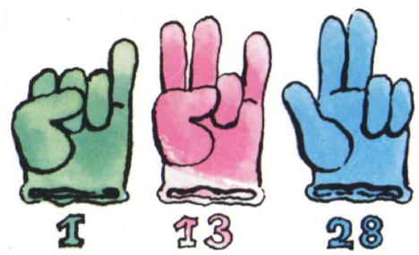

# 论二进制

> **原标题**：О двоичной системе счисления
> **作者**：А. Д. Бендукидзе（本杜基泽）
> **译自**：Квант 1976, № 6
> **栏目**：Квант для младших школьников（小学）
> **原文**：https://www.kvant.digital/issues/1976/6/bendukidze-o_dvoichnoy_sisteme_schisleniya-145140da/
> **主题**：算术 / 数论（二进制计数法）
> **难度**：★（小学高年级可读）
> **译者**：Claude（AI 初译，2026-06）

---

# 关于二进制计数法（给谢尔查的第二封信）

> **译者注**：原文是一封写给小朋友谢尔查（Серёжа）的信。原刊标题中的"второе письмо Серёже"意为"给谢尔查的第二封信"。本译文 OCR 源标题拼写有误，实际即《论二进制计数法》。

你好，亲爱的谢尔查！

前几天收到了你的来信，可真把我高兴坏了。你写道，你已经仔仔细细读了《量子》杂志 1975 年第 8 期上那篇《论计数制》的小文章，并把里面的所有题目都做完了。这怎么能不相信呢？因为信的末尾分明写着：「书于莫斯科，某星期日，30400 年 9 月 112 日」\*。哎哟，谢尔查你可真是个有创意的人！不过我有点不太明白，你为什么把日期和年份用了两种不同的计数制来写。当然了，这件事你自己做主。

好，现在我们言归正传。

## 1. 二进制

正如我答应过你的，今天我们要谈谈**二进制计数法**。这是所有计数制里最简单的一种。它一共只有两个数字：$0$ 和 $1$。数字 $2$（也就是这个计数制的「底数」）写作 $10$。这一点你当然早就知道了。

下面是十以内各数在二进制中的写法：

$$
1,\ 10,\ 11,\ 100,\ 101,\ 110,\ 111,\ 1000,\ 1001,\ 1010.
$$

二进制的**加法表**只有一条等式：$1+1=10$。（而 $0+0=0$、$0+1=1+0=1$ 这两条可以省掉——加零又不改变数！）

那**乘法表**呢？说真的，二进制里压根儿没有什么乘法表——你只要记住：任何数乘以 $0$ 都等于 $0$；而乘以 $1$，数本身不变。

多位数的四则运算，二进制和十进制是按完全相同的规则来做的。我们来看几个具体例子。

**(1) 把 $101101$ 和 $10100$ 相加。** 把两个数按位对齐写好：

$$
\begin{array}{r} 1\,0\,1\,1\,0\,1 \\ +\quad 1\,0\,1\,0\,0 \end{array}
$$

$1+0=1$；$0+0=0$；$1+1=10$，写下 $0$，把 $1$ 记在「心里」（即进位）；接着 $1+0=1$，再加上进位的那 $1$，得 $10$——又写 $0$，又记 $1$ 在心里；最后 $1$ 再加上进位的那 $1$，又得 $10$。于是结果是：

$$
\begin{array}{r} 1\,0\,1\,1\,0\,1 \\ +\quad 1\,0\,1\,0\,0 \\ \hline 1\,0\,0\,0\,0\,0\,1 \end{array}
$$

我们来验算一下对不对。为此把这两个数换成十进制来看：

$$
\begin{array}{rl} 101101_{2} & = 1\cdot 2^{5} + 0\cdot 2^{4} + 1\cdot 2^{3} + 1\cdot 2^{2} + \\ & + 0\cdot 2^{1} + 1\cdot 2^{0} = 45_{10}, \end{array}
$$

$$
\begin{array}{rl} 10100_{2} & = 1\cdot 2^{4} + 0\cdot 2^{3} + 1\cdot 2^{2} + 0\cdot 2^{1} + \\ & + 0\cdot 2^{0} = 20_{10}. \end{array}
$$

两数之和应当等于 $65$。果然如此：$1000001_{2} = 1\cdot 2^{6} + 0\cdot 2^{5} + 0\cdot 2^{4} + 0\cdot 2^{3} + 0\cdot 2^{2} + 0\cdot 2^{1} + 1\cdot 2^{0} = 65_{10}$。

**(2) 把 $1101$ 乘以 $110$。** 我们有：

$$
\begin{array}{r} 1\,1\,0\,1 \\ \times\quad 1\,1\,0 \\ \hline 1\,1\,0\,1\,0 \\ 1\,1\,0\,1 \\ \hline 1\,0\,0\,1\,1\,1\,0 \end{array}
$$

下面这几道题的验算，以及下面两个例子的计算：

$$
\begin{array}{cc} -\dfrac{1\,1\,1\,0\,1\,0\,1\,1\,1}{1\,1\,0\,0\,0\,0\,1} & \quad -\dfrac{1\,1\,1\,1\,0\,0}{1\,0\,1\,0} \;\Bigg|\; \dfrac{1\,0\,1\,0}{1\,1\,0} \\ \hline 1\,0\,1\,1\,1\,0\,1\,1\,0 & \quad \underline{\text{一}}\ \ \underline{\text{二}} \end{array}
$$

> **译者注**：这两个式子分别是一道减法题（被减数 $11110111$，减数 $1100001$，求差）和一道除法题（被除数 $111100$，除数 $1010$，商为 $110$，余数为 $\text{一}$、$\text{二}$ 两段部分商）。原文在最后用「一」「二」标出要做两步演算。请你**自己做一做**。

此外，下面的题目也请你做一做，并验算答案：

$$
10101 + 101,\quad 111110 + 1011,\quad 101101 - 111,
$$

$$
10101\cdot 101,\quad 11011 : 11,\quad 1001110001 : 1111101.
$$

## 2. 二进制的妙处

你看，二进制确实非常简单。当然，它写起来比十进制要长不少；可是它也有一些独到的长处。下面我只讲其中之一。

**图 1**

假设我们用……手指头来表示数字。比如篮球裁判就这么干：他们「用手指」比划出那个吃到了个人犯规的球员的号码。要是号码不超过十，裁判就简单地伸出相应根数的手指；要是号码比十大，裁判就把一只手攥成拳头——这一只拳头就代表「十」，另一只手再伸出几根手指——代表「个位」。这样他就能表示 $11$、$12$、$13$、$14$、$15$ 这些号码。可要是球员更多（也就是说，比赛不是篮球，而是比方说足球）怎么办呢？

现在你不妨设想一下：这位裁判用的不是十进制，而是**二进制**。你猜，他光用一只手能表示哪些数？要是我说他能表示从 $1$ 到 $31$（含 $31$）之间的任何一个整数，你多半不肯相信吧。然而这是事实。说到底：我们约定，**弯曲**的手指代表 $0$，**伸直**的手指代表 $1$。这样一来，我们就能表示从 $00001_2$ 到 $11111_2$ 之间所有的数；而最后这个数就是 $31_{10}$。

图 1 上画的就是几个「用手指写出来」的数。

> **译者注**：原文此处写的是「从 $00001_2$ 到 $1111_2$」，疑为漏印一位，应为「从 $00001_2$ 到 $11111_2$」（五根手指五位数）。译文按正确位数译出。

你来想一想：如果两只手的手指全都用上，一共能「写」出多少个数呢？

## 3. 一个小魔术

亲爱的谢尔查，最后我想给你讲一个小魔术：巴统第七中学的同学们在他们的「数学节」上把这个魔术表演得非常成功。

> **译者注**：巴统（Батуми）是格鲁吉亚的城市。

取 $15$ 个名称——比方说，取一些几何图形的名称：点、直线、射线、线段等等，列成**表 1**。

把表 1 中所列的名称再排成另外四张表（**表 2 至 表 5**）。

| **表 1**（全部 15 个图形名称） |
|:--|
| 1. 点 |
| 2. 直线 |
| 3. 射线 |
| 4. 线段 |
| 5. 折线 |
| 6. 角 |
| 7. 三角形 |
| 8. 四边形 |
| 9. 平行四边形 |
| 10. 矩形 |
| 11. 菱形 |
| 12. 正方形 |
| 13. 梯形 |
| 14. 圆周 |
| 15. 圆盘 |

> **译者注**：原文 OCR 把不少图形名称印错了（如把「射线 Луч」印成「草地 Луг」、「折线 Ломаная」印成「Поманая」等），译文按正确的几何术语译出。原文中圆周用 окружность，圆盘用 круг，二者有别。

| **表 2** |
|:--|
| 点 |
| 射线 |
| 折线 |
| 三角形 |
| 平行四边形 |
| 菱形 |
| 梯形 |
| 圆盘 |

| **表 3** |
|:--|
| 直线 |
| 射线 |
| 角 |
| 三角形 |
| 平行四边形 |
| 菱形 |
| 圆周 |
| 圆盘 |

| **表 4** |
|:--|
| 线段 |
| 折线 |
| 角 |
| 三角形 |
| 正方形 |
| 梯形 |
| 圆周 |
| 圆盘 |

| **表 5** |
|:--|
| 四边形 |
| 平行四边形 |
| 矩形 |
| 菱形 |
| 正方形 |
| 梯形 |
| 圆周 |
| 圆盘 |

> **译者注**：表 2—5 是按二进制编出来的。把表 1 中每个图形的编号 $1\sim 15$ 写成四位二进制：第 1 位（最低位）是 $1$ 的所有数都进表 2（编号 1, 3, 5, 7, 9, 11, 13, 15）；第 2 位是 $1$ 的进表 3（2, 3, 6, 7, 10, 11, 14, 15）；第 3 位是 $1$ 的进表 4（4, 5, 6, 7, 12, 13, 14, 15）；第 4 位是 $1$ 的进表 5（8—15）。「魔术师」只要听到观众说出图形出现在哪几张表里，就能反推出它对应的二进制编号，再换算成十进制，立刻报出图形的名称。

「魔术师」先把汇总表（表 1）展示给观众，请某一位观众在心里默想一个图形的名称。然后他背对着表 2—5，请一位观众告诉他：你想的那个图形出现在表 2—5 的哪几张里。得到回答以后，他立刻就能说出对方想的是哪个图形。接着他请下一位观众，又准确无误地报出对方心里想的图形……如此反复。观众们个个目瞪口呆。

这有什么好奇怪的呢？这个小魔术的窍门就在于：会**把二进制的数换算成十进制**。我相信你早就看穿它了。要是还没看穿，再想想——你一定能找到开门的钥匙。（顺便说一句，名称的数量也可以取得更多，比如 $31$ 个、$63$ 个、$127$ 个等等。但那样一来，表的张数也就不是四张，而是相应地要排五张、六张、七张。）

好了，话就说到这儿。希望这封信能勾起你进一步了解各种计数制（尤其是二进制）的兴趣。我可以向你推荐两本参考书：一本是 С. В. Фомин（福明）的《计数制》（«Системы счисления»，莫斯科，1975 年版）；另一篇是 Р. С. Гутер（古捷尔）的文章《计数制与电子计算机的算术基础》（«Системы счисления и арифметические основы работы электронных вычислительных машин»），收在《数学课程补充章节》一书中——这是一本为 7—8 年级同学开设的选修课教材；不过书里不少内容，5—6 年级的同学也能看得懂。

> **译者注**：\* 谢尔查在信末把日期写成了「30400 年 9 月 112 日」，是用了一种奇怪的计数制在调皮。「30400」若按某种进制换算，等价于十进制中的某个普通年份；「112」也类似。这是他在跟通信对象玩计数制的游戏。

我迫不及待地等着你的下一封信。祝你一切顺利！

**А. 本杜基泽**

---

## 译者后记

- 本文 OCR 源（`primary/ocr/P04/ru.md`）在标题、正文段落及表格部分存在大量字词识别错误（例如把 Система счисления 印成 "система очисления"，把 Таблица 印成 "Мобинца/Поблица/Мобуна"，把 Луч 印成 "Луг"，把 Ломаная 印成 "Поманая"，把 Ромб 印成 "Роят/Ремб"，把 Квадрат 印成 "Эвадрат/Кваррат" 等）。译文一律按上下文还原为正确的俄文术语后再译出，未跳节。
- 本文未串入任何邻页无关内容；OCR 页标记 p67/p68/p69 三页内容已全部翻译完毕。
