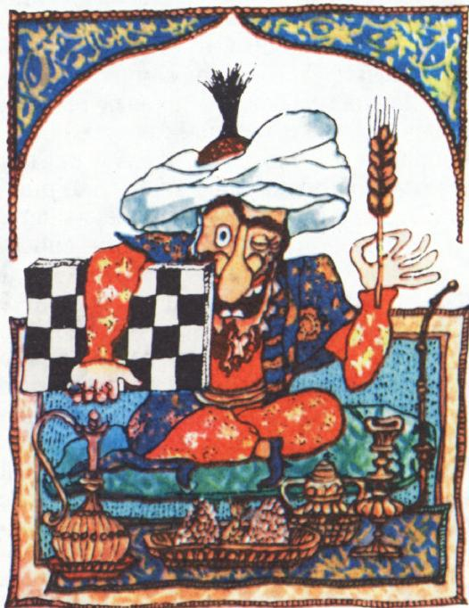
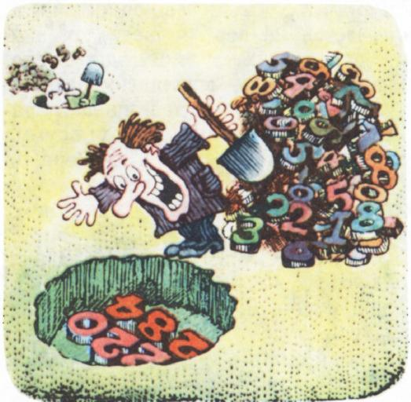

# 完美数与亲和数之谜

> **原标题**：Тайны совершенных чисел и дружественных пар
> **作者**：М. Гарднер（马丁·加德纳）；А. С. Варпаховский（A. S. 瓦尔帕霍夫斯基）改写
> **译自**：Квант 1973, № 10
> **栏目**：Квант для младших школьников（小学）
> **原文**：https://www.kvant.digital/issues/1973/10/gardner-taynyi_sovershennyih_chisel_i_druzhestvennyih_par-37e89c69/
> **主题**：算术 / 数论（完美数、亲和数）
> **难度**：★（小学高年级可读）
> **译者**：Claude（AI 初译，2026-06）

---

1971 年第 8 期我们的杂志曾刊登过 И. Я. 德普曼（И. Я. Депман）的一篇短文，讲述所谓"完美数"——也就是等于自己所有约数之和的数——的历史。作为这个话题的延续，我们在这里刊出马丁·加德纳（М. Гарднер）一篇文章的改写稿，讲讲这些数令人惊叹的性质。本文由 А. С. 瓦尔帕霍夫斯基为《Квант》整理改编。

也许，没有任何一类数，能像完美数以及它们最亲近的"亲戚"——亲和数那样，拥有一段如此引人入胜的历史。

完美数理论建立过程中迈出的第一个重要步伐，要归功于欧几里得。他指出：只要括号里的那个因子是素数，公式 $2^{n-1}(2^{n}-1)$ 就会给出一个完美数（为此 $n$ 必须是素数；不过，对于绝大多数素数 $n$ 而言，$2^{n}-1$ 并不一定也是素数）。

下面是欧几里得定理的证明。设 $2^{n-1}(2^{n}-1)$ 中括号里的那个因子是素数。那么，除这个数本身之外，它的所有约数是

$$
\begin{array}{c} 1,\ 2,\ 4,\ \dots,\ 2^{n-1}, \\ (2^{n}-1),\ 2(2^{n}-1),\ 4(2^{n}-1),\ \dots,\ 2^{n-2}(2^{n}-1). \end{array}
$$

把这些约数全都加起来：

$$
\begin{array}{rl}
& (1+2+4+8+\dots+2^{n-1}) \\
+& (1+2+4+8+\dots+2^{n-2})(2^{n}-1) \\
=& (2^{n}-1) + (2^{n-1}-1)(2^{n}-1) \\
=& 2^{n-1}(2^{n}-1).
\end{array}
$$

所以，$2^{n-1}(2^{n}-1)$ 是一个完美数。

两千年后，莱昂哈德·欧拉（Леонард Эйлер）证明了：欧几里得公式给出了**所有**的偶完美数。有趣的是，至今没有人找到一个奇完美数，也许这样的数根本就不存在。因此，下文凡说到"完美数"，我们指的都是偶完美数。欧几里得那条惊人的公式，与公比为 2 的等比数列（1、2、4、8、16、……）密切相关。还记得那个关于波斯国王和象棋发明者的古老故事吗？国王被这游戏迷住了，就让发明者自己挑一份奖赏。那人似乎提了一个十分朴素的愿望：在棋盘第一格里放一粒麦子，第二格放两粒，第三格放四粒，依此类推，把 64 个格子都填满。结果，最后一格里的麦粒数等于 $9\,223\,372\,036\,854\,775\,808$，而把这个数加倍再减 1，就等于整张棋盘上的麦粒总数——比全世界一年的小麦收成还要多好几千倍。如果在棋盘每个格子里写下本应放在该格的麦粒数，再从每个格子里各拿走一粒，你就会看到，格子里剩下的麦粒数正是欧几里得公式中 $2^{n}-1$ 形式的数。如果这个数是素数，把它乘以上一格里的麦粒数（即 $2^{n-1}$），就得到一个完美数（见图 1）。

形如 $2^{n}-1$ 的素数，叫作**默森数**（числа Мерсенна），得名于 17 世纪研究它们的一位法国数学家。\*）图 1 中涂黑的格子，正是"减去 1 之后得到默森数"的格子。这样的格子共有 9 个，对应着前 9 个完美数。

完美数有一连串既神秘又奇妙的性质。例如，**所有的完美数都是"三角形数"**。这就是说，假如我们取完美数那么多个小球，就能把它们摆成一个等边三角形。

换句话说，每个完美数都可以写成 $1+2+3+4+\dots+n$ 的形式。

同样容易看出，除 6 之外，每个完美数都是奇数立方数数列 $1^{3}+3^{3}+5^{3}+\dots$ 的一个部分和。

完美数还有一个性质：它的所有约数的倒数之和（把它自己也当作约数之一），永远等于 2。比如对 28，有

$$
\dfrac{1}{1}+\dfrac{1}{2}+\dfrac{1}{4}+\dfrac{1}{7}+\dfrac{1}{14}+\dfrac{1}{28}=2.
$$

直到今天，还有两个重要问题没有答案：是否存在奇完美数？是否存在最大的偶完美数？至今没有找到任何一个奇完美数，但同样也没有人能证明它不存在。第二个问题的答案，取决于默森素数数列是不是无穷的，因为这个数列里的每一个素数都能造出一个完美数。人们曾发现：把前四个默森数（3、7、31、127）代入公式 $2^{n}-1$ 中的 $n$，得到的仍然是默森数。七十多年来，数学家们都盼着这条规律能推出"默森素数数列无穷"的结论。可是 1953 年，计算机打碎了他们的希望。人们发现，当 $n=2^{13}-1=8191$（这本身是个默森素数）时，$2^{8191}-1$ 却并不是素数。于是，默森数列究竟有没有尽头、究竟是不是无穷，到今天仍是一个谜。

奥列（Оре）在《数论及其历史》一书中，引用了彼得·巴洛（Питер Барлоу）1811 年出版的《数论》里一句有趣的话。巴洛算出了第九个完美数后断言："这是人们将来能找到的最大完美数，因为完美数不过是一种猎奇之物，恐怕谁也不会再动念头去找更大的了。"然而 1876 年，法国数学家爱德华·卢卡斯（Эдвард Лукас）——四卷本经典《趣味数学》的作者——宣布发现了第十二个完美数 $2^{126}(2^{127}-1)$。后来卢卡斯一度怀疑 $2^{127}-1$ 究竟是不是默森素数，但最终它的素性得到了证实。$2^{127}-1$ 是不靠计算机找到的最大默森数。表 1 列出了已知的 23 个完美数的欧几里得公式，并写出了前八个的具体数值（再往后的数位数太多），还标出了每个数的十进制位数。当时已知最后一个完美数共有 $22\,425$ 个约数，它诞生于 1963 年——那一年，伊利诺伊大学的计算机找到了第 23 个默森数。为纪念这件事，该大学数学系寄出的邮件上都盖着这样一枚邮戳："$2^{11213}-1$ 是素数"。

完美数的一种推广，就是**亲和数**。任取一个数，把它的所有约数相加，得到第二个数；再把第二个数的约数相加……就这样一直做下去，盼着最后能回到最初的那个数。如果只走一步就回到了原数，那么这条"链"只有一节，这个数本身就是一个完美数。如果链有两节，那两个数就构成一对**亲和数**：其中一个数的约数之和，恰好等于另一个数。最小的一对亲和数是 220 和 284。

1636 年，皮埃尔·费马（Пьер Ферма）找到了另一对亲和数：$17\,296$ 和 $18\,416$。他和勒内·笛卡儿（Рене Декарт）各自独立地给出了构造亲和数对的法则，可他们并不知道，早在 9 世纪，一位阿拉伯天文学家就已经提出过这条法则。\*）第三对亲和数是笛卡儿找到的：$9\,363\,584$ 和 $9\,437\,056$。到了 18 世纪，欧拉发表了一份含有 64 对亲和数的清单，不过后来核对发现他弄错了两处。1830 年，阿德里安·马里·勒让德（Адриен Мари Лежандр）又找到了一对。1867 年，一个 16 岁的意大利少年 Б. И. 帕加尼尼（Паганини）惊动了整个数学界——他宣布 $1184$ 和 $1210$ 是一对亲和数。这是按大小排第二的一对，竟被所有人都漏看了。虽然帕加尼尼也许是靠一次次试错才找到它的，但他的名字已永远写进了数论的历史。

如今已知的亲和数对已超过 600 对；其中不少数都超过了 30 位。已知最新一对是 1964 年由电子计算机算出来的。表 2 列出了从 0 到 $100\,000$ 之间的所有亲和数对。

已知所有亲和数对，要么两个数都是偶数，要么（更少见）两个数都是奇数。但是没有人证明过不存在"一奇一偶"的混合亲和数对。布拉特利（Брэтли）和麦凯（Мак-Кэй）提出过一个猜想：所有奇数的亲和数都能被 3 整除，而亲和数对中两数之和都能被 9 整除。至今没有人给出能涵盖所有亲和数对的一般公式，也不知道这样的数对究竟是有限还是无穷。

目前，已知能"绕回原数"且节数多于 2 的链，只有两条。1918 年，法国数学家 П. 普列（П. Пуле）找到了一条 5 节链（$12\,496 \to 14\,288 \to 15\,472 \to 14\,536 \to 14\,264$），以及一条惊人的 28 节链（28 本身是个完美数），它从 $14\,316$ 出发。至于三节链，尽管动用计算机进行了大规模搜索，至今一条也没找到。这样的搜索还会继续下去，直到要么真的找到一条三节链，要么有数论学家证明三节链根本不存在。

**表 1. 已知的 23 个完美数（按欧几里得公式给出；写出前八个的具体数值及各数的位数）**

| 序号 | 欧几里得公式 | 完美数 | 位数 |
|:-:|:-:|:-:|:-:|
| 1 | $2^{1}(2^{2}-1)$ | $6$ | 1 |
| 2 | $2^{2}(2^{3}-1)$ | $28$ | 2 |
| 3 | $2^{4}(2^{5}-1)$ | $496$ | 3 |
| 4 | $2^{6}(2^{7}-1)$ | $8\,128$ | 4 |
| 5 | $2^{12}(2^{13}-1)$ | $33\,550\,336$ | 8 |
| 6 | $2^{16}(2^{17}-1)$ | $8\,589\,869\,056$ | 10 |
| 7 | $2^{18}(2^{19}-1)$ | $137\,438\,691\,328$ | 12 |
| 8 | $2^{30}(2^{31}-1)$ | $2\,305\,843\,008\,139\,952\,128$ | 19 |
| 9 | $2^{60}(2^{61}-1)$ | — | 37 |
| 10 | $2^{88}(2^{89}-1)$ | — | 54 |
| 11 | $2^{106}(2^{107}-1)$ | — | 65 |
| 12 | $2^{126}(2^{127}-1)$ | — | 77 |
| 13 | $2^{520}(2^{521}-1)$ | — | 314 |
| 14 | $2^{606}(2^{607}-1)$ | — | 366 |
| 15 | $2^{1278}(2^{1279}-1)$ | — | 770 |
| 16 | $2^{2202}(2^{2203}-1)$ | — | 1 327 |
| 17 | $2^{2280}(2^{2281}-1)$ | — | 1 373 |
| 18 | $2^{3216}(2^{3217}-1)$ | — | 1 937 |
| 19 | $2^{4252}(2^{4253}-1)$ | — | 2 561 |
| 20 | $2^{4426}(2^{4427}-1)$ | — | 2 663 |
| 21 | $2^{9688}(2^{9689}-1)$ | — | 5 834 |
| 22 | $2^{9940}(2^{9941}-1)$ | — | 5 985 |
| 23 | $2^{11212}(2^{11213}-1)$ | — | 6 751 |

> **译者注**：原表 OCR 中第 9 行指数 $2^{80}$、第 15—23 行若干指数（如 $2^{1.279}$、$2^{2.203}$ 等）均为识别错误，本译文已按"指数 $2^p$、底数对应 $2^{p}-1$"的数学事实更正（如第 9 项应为 $2^{60}(2^{61}-1)$，对应已知的第 9 个默森素数 $M_{61}$）。

**表 2. $0\sim 100\,000$ 之间的亲和数对**

| 序号 | 第一个数 | 第二个数 |
|:-:|:-:|:-:|
| 1 | $220$ | $284$ |
| 2 | $1\,184$ | $1\,210$ |
| 3 | $2\,620$ | $2\,924$ |
| 4 | $5\,020$ | $5\,564$ |
| 5 | $6\,232$ | $6\,368$ |
| 6 | $10\,744$ | $10\,856$ |
| 7 | $12\,285$ | $14\,595$ |
| 8 | $17\,296$ | $18\,416$ |
| 9 | $63\,020$ | $76\,084$ |
| 10 | $66\,928$ | $66\,992$ |
| 11 | $67\,095$ | $71\,145$ |
| 12 | $69\,615$ | $87\,633$ |
| 13 | $79\,750$ | $88\,730$ |

> **译者注（脚注 \*）**：原文两处带星号脚注在 OCR 中未保留脚注内容。其一指默森（М. Mersenne, 1588–1648），法国修士、数学家，他系统研究了形如 $2^{n}-1$ 的素数；其二指 9 世纪的阿拉伯天文学家萨比特·伊本·库拉（Thābit ibn Qurra, 826?–901），他率先给出构造亲和数对的著名公式。

> **译者注（作者署名）**：原文页眉署名为 А. С. Варпаховский（瓦尔帕霍夫斯基），他据马丁·加德纳原作改写后发表于《Квант》。本译文按项目元数据保留两位作者信息。
