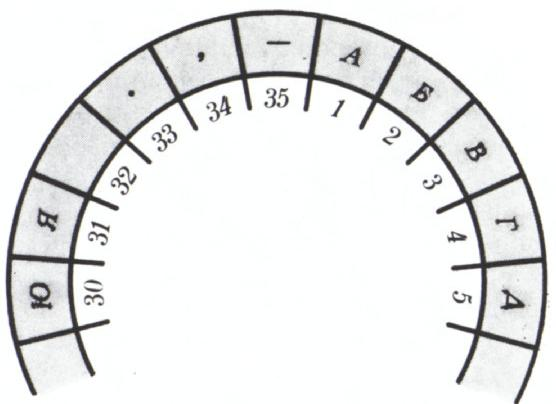

# 数学与密码

> **原标题**：Математика и шифры
> **作者**：Н. Я. 维连金（Виленкин Н. Я.）
> **译自**：Квант 1977, № 8
> **栏目**：Квант для младших школьников（小学）
> **原文**：https://www.kvant.digital/issues/1977/8/vilenkin-matematika_i_shifryi-2dda3bf9/
> **主题**：算术/数论
> **难度**：★★（内容偏深，需要一点初中预备知识）
> **译者**：Claude（AI 初译，2026-06）

---

> 「一个人发明出来的东西，另一个人就能看明白。」——福尔摩斯
>
> 阿瑟·柯南·道尔《跳舞的小人》

## 秘密文字（「塔拉巴尔公文」）

很久很久以前，人们就在想办法不让外人看到自己写的信。比如有一位古代国王：他把信使的头发剃光，在头皮上写下要传的话，等头发长出来再把信使派去盟友那里——这样路上谁也看不出信藏在哪儿。后来化学进步了，人们有了更方便的工具：**密写墨水**，写出来的字要等纸被加热，或者用某种化学药剂处理后，才会显现出来。不过，**最常用的保密办法还是「密码」**。外交官用它来保守谈判的秘密；将军用它来隐藏自己下达的命令；侦察员也用它……古时候，海盗用它标记藏宝的地点，炼金术士、商人、密谋家也都用过它。

最早的密码其实并不复杂。比如 15—16 世纪的俄罗斯外交官就用过一种叫「**塔拉巴尔公文**」（тарабарская грамота）的密码：所有**元音字母都不变**，**辅音字母则按下表互相替换**：

$$
\begin{array}{ccccccc} \text{б} & \text{в} & \text{г} & \text{д} & \text{ж} & \text{з} & \text{к} \\ \updownarrow & \updownarrow & \updownarrow & \updownarrow & \updownarrow & \updownarrow & \updownarrow \\ \text{щ} & \text{ш} & \text{ч} & \text{ц} & \text{х} & \text{ф} & \text{т} \end{array}
\quad
\begin{array}{cccc} \text{л} & \text{м} & \text{н} & \text{п} \\ \updownarrow & \updownarrow & \updownarrow & \updownarrow \\ \text{с} & \text{р} & \text{п} & \text{л} \end{array}
$$

（第一行辅音按字母表的正常顺序，第二行则反过来。）例如，「**Великий государь**」（伟大的沙皇）加密后就变成了「**Шеситий чолуцамь**」。

> **译者注**：俄语字母表里辅音替换是上下两两对应的。读者可以照表试着把自己名字的拼音「加密」一下。

这种密码非常简单——有人甚至能用「塔拉巴尔公文」流利地说话。后来保密技术逐渐变复杂，可是即便到了 17 世纪末，索菲娅公主与瓦西里·戈利岑通信时用的密码也还是相当简单——几年前《科学与生活》杂志刊登了她的一封信，许多读者都成功破译了它。叛徒马泽帕也用过密码。普希金在长诗《波尔塔瓦》中写道：

> 「他们在黑夜中像贼一样，
> 进行着自己的谈判，
> 彼此勾结图谋背叛，
> 编造着各种密文通告……」

## 一份好密码应当满足什么

写密码要满足几个条件。**第一**，不同的字母要用不同的符号表示——不然收信人就只能瞎猜某个符号究竟代表好几个字母里的哪一个。**第二**，密码要**难破解**——简单的密码只有在「对手没时间去破解」时才可以用。**第三**，密码的保密性要和「加密/解密操作相对简便」结合起来——否则光顾着加密就要花掉好多时间，等到信送出去，里面的消息早就过时了\*）。要是解密太费劲，那情形就像传说中那个东方集市上的代书先生：他替人写信要收一笔钱，可送信还得再收一笔——他硬说，自己写出来的东西除了他本人，谁也看不懂。

> \*) 所以密码学里有个专门的方向，专门研究怎样让加密解密既快又安全。

「塔拉巴尔公文」属于**替换密码**这一类：每个字母都被换成某个固定的符号——可能是另一个字母、一个数字，或者一幅小图。柯南·道尔《跳舞的小人》里芝加哥的匪徒，以及爱伦·坡《金甲虫》里的海盗（海盗还额外用了密写墨水）都是用这种办法藏信的。有时候，为了让密码更难破译，人们会使用**冗余码**——同一个字母可以用不同的符号来表示。这样一来，就算对手猜出了某个符号的意思，他也未必能用这个去破译别处的文字——因为同一个字母在别处又是另一个写法。

不过，冗余有时也会自然而然地出现。当古文字学家去破译几千年前**卡里亚人**（生活在小亚细亚的一个民族）留下的铭文时，他们发现符号的数量对一个字母表来说太多了。于是他们猜测：有些符号代表单个字母，有些符号代表音节。但这条路走不通。直到苏联学者 В. В. 舍沃罗什金换了个思路——他去研究这些符号分别出现在哪些地方（很多卡里亚人在埃及等国当雇佣兵，在那里也留下了铭文），才发现：**每个地区使用的不同符号不超过三十来个**，也就是说，它终究是一种字母文字，只不过在不同地方，某些字母的写法不同罢了。正是这一点让卡里亚铭文变得那么难破译。

## 密码与组合数学

因为一套密码里所用到的不同符号是**有限**的，所以我们可以把这些符号编号，然后用编号来代替符号本身。为了简单起见，我们只讨论**没有冗余**的密码。此时，符号的个数等于字母表中字母的个数，再加上一些标点符号（比如词与词之间的空格、句号、逗号）。俄语用 **35 个符号**就够了：31 个字母（е、ё、й 不区分），加上空格、句号、逗号、破折号。如果加密时使用的符号也有 35 个，那么每一种这样的密码就对应着**一个 35 元集合到另一个 35 元集合的一一对应**。组合数学里证明：这种一一对应的个数等于 $35!$，也就是从 1 乘到 35 的连乘积。这个数字大到难以想象——大约等于 $10^{40}$。

但是，要直接处理字母表与标点集合 $A = \{a_{1}, a_{2}, \ldots, a_{35}\}$ 到密码符号集 $B = \{b_{1}, b_{2}, \ldots, b_{35}\}$ 的**任意**一个对应 $f$，并不方便：这种对应很难记在脑子里，而随身带着一张「对应表」——也就是密码的「**密钥**」——又很不安全。最好有一条**简单的规则**，告诉我们「已知字母编号 $k$，怎么算出 $f(k)$」。这种规则正是数学提供给我们的——遇到各种复杂问题，没有什么比用数学方法更管用。

## 密码与「同余」

数学很早就被用在密码学里了。早在 16 世纪末，破译法王亨利三世政敌之间通信的人，正是**现代代数的奠基者之一**——弗朗索瓦·韦达。17 世纪的英国保王党密谋家们也惊叹：克伦威尔怎么能那么快就探知他们的阴谋？他们以为自己用的密码谁也破不了，怀疑一定是有同伙告了密。直到共和国覆灭、查理二世复辟之后，他们才知道：破译这些密码的人，是当时最优秀的数学家之一——牛津大学教授**沃利斯**；沃利斯还自诩为一门新学科——**密码学**（cryptographia）的创始人。

下面介绍一种加密方法。把一个**圆环**等分成 35 份，依次编号，每份上标一个字母或标点（见下图）。然后我们挑一个数 $a$（密码的「**密钥数**」），把圆环绕着中心**顺时针**转动 $a$ 格。这就给出了一种密码——把集合 $A = \{a_{1}, a_{2}, \ldots, a_{35}\}$ 对应到密码符号集 $B = \{01, 02, \ldots, 35\}$（一位数前面要补 0，否则 「15」究竟是「十五」还是「一、五」就分不清了）。

例如，若 $a = 11$，那么标着「01」的那一份就会转到标着「12」的位置——这意味着字母 «A» 加密后对应的数是 **12**。同样地，字母 «B» 对应的数是 **14**，依此类推。

最后得到一封信，每个字母或符号都写成了一个**两位数**。收信人要解密时，把这一长串数字两位两位地切开，每个数都**减去密钥数**，再把得到的编号 $k$（也就是 $a_{k}$ 的编号）换回相应的字母或标点。

不过，加密解密的规则其实没那么简单——因为如果 $k$ 比 24 大，那 $k + 11$ 就比 35 还大，可 $B$ 里最大的数才 35。这时候就要记得：我们不是把数写在一条直线上，而是写在一个**圆环**上；圆环没有起点也没有终点——**35 后面就是 1**。换句话说，过了 35 之后就从头来。也就是说，如果算出来的和超过 35，就要再减去 35。得到的差，就是 $a_{k}$ 真正变成的那个数。比如 $a_{27}$（字母 «ы»）不是变成 38，而是变成 **03**；$a_{32}$（空格）变成 **08**，依此类推。这样一来，

$$
f(a_{k}) = \begin{cases} k + 11, & \text{如果 } k \leqslant 24, \\ k - 24, & \text{如果 } 25 \leqslant k \leqslant 35. \end{cases}
$$

而解密则按下面的公式进行：

$$
g(n) = \begin{cases} a_{n-11}, & \text{如果 } 12 \leqslant n \leqslant 35, \\ a_{n+24}, & \text{如果 } 1 \leqslant n \leqslant 11. \end{cases}
$$

如果把「加法」理解成一种特别的含义，加密规则还可以写得更简洁。

我们把所有整数分成若干**类**：除以 35 后**余数相同**的数算作同一类。比如 $-32$、$3$、$38$、$73$ 都属于同一类——它们除以 35 的余数都是 $3$。这一类数的一般形式是 $3 + 35k$，其中 $k$ 是整数。把所有这样的「类」组成的集合记作 $Z_{35}$。不同的类一共有 35 个（除以 35 的余数是 $0, 1, 2, \ldots, 34$），我们可以就用相应的余数来给它们命名，只是头上加一条短横。比如 $\bar{5}$ 表示的不是数 $5$，而是包含 $5$ 的那个类，也就是集合 $\{\ldots, -30, 5, 40, 75, \ldots\}$。特别地，$\bar{0}$ 表示包含 $35$ 的那个类。

现在我们就可以写：$\bar{27} + 11 = \bar{3}$——意思是，把 $\bar{27}$ 这一类的每一个数都加上 $11$，得到的恰好是 $\bar{3}$ 这一类的数。所以，**如果把字母的编号和密码符号都看成 $Z_{35}$ 里的类**，那么加密和解密的公式就可以写成：

$$
f(a_{\bar{k}}) = \bar{k} + 11,
$$

$$
g(\bar{n}) = a_{\overline{n-11}}.
$$

这种「**余数算术**」在许多别的问题里也很有用。比如，现在分针指着 25 分。过 176 分钟后，它会指在哪儿？要回答这个问题，只要注意到：每过 60 分钟，分针就回到原位。所以，只要算出 $25 + 176 = 201$ 除以 $60$ 的余数就行。算出来余数是 $21$——也就是说，分针会指在 **21 分**。

为了方便做「除以 $m$ 余数算术」里的加减法，可以编一张**加法表**：拿普通的加法表，把其中每个数都换成它除以 $m$ 的余数。

这种算术通常叫做「**模 $m$ 算术**」，而除以 $m$ 后余数相同的两个数叫做「**关于模 $m$ 同余**」。如果 $a$ 与 $b$ 关于模 $m$ 同余，就写成

$$
a \equiv b \pmod{m}.
$$

例如，

$$
215 \equiv 40 \pmod{7},
$$

因为 $215$ 和 $40$ 除以 $7$ 的余数都是 $5$。

如果我们已经知道：一份密码是把所有字母的编号**加上同一个数**得到的，那么只要猜出**哪怕一个字母**对应的是什么（最好多猜几个），就能破译它。比如，已知信里提到莫斯科，而信中反复出现字母组合「УХШСИЗ」，那就不难猜到：加密时每个字母的编号都被加了 $7$。

把「加」换成「**乘**」，就能得到更复杂的密码。比如，把所有字母的编号都乘以 $2$。当然，乘出来的积如果超过 $35$，就换成它除以 $35$ 的余数。例如字母 «Ч» 的编号是 $24$，$24 \times 2 = 48$，$48$ 除以 $35$ 余 $13$，所以 «Ч» 加密后对应的编号就是 **13**。这种变换比「加法」更绕人，我们可能会担心：会不会有两个不同的字母加密后变成了同一个字母？幸运的是，这里并不会——这个密码是「**非退化**」的。证明这一点用到了一个事实：**两个数的乘积能被 $2$ 整除，当且仅当至少有一个因数是偶数**。可要是我们把字母编号不乘 $2$，而是乘 $5$（$5$ 是 $35$ 的约数），就会得到一个**退化的**密码（请你自己验证一下！）。如果把「乘」换成「**乘方**」，还能得到更有趣的密码。这时候会出现什么样的密码，就与**数论**中的问题有关了。

## 密码与统计

我们刚才讨论的各种密码，都是对字母编号做一些**算术运算**。这些密码有一个共同的、致命的缺点——**同一个字母不管出现在信里的哪个位置，都变成同一个符号**。要破译这类密码，可以借助**数理统计**。俄语字母表中每个字母，以及空格，在长文章里出现的频率（平均值）是相对固定的：

| 字母 | 频率 | 字母 | 频率 | 字母 | 频率 | 字母 | 频率 |
|---|---|---|---|---|---|---|---|
| （空格） | 0.175 | Р | 0.040 | Я | 0.018 | Х | 0.009 |
| О | 0.090 | В | 0.038 | Ы | 0.016 | Ж | 0.007 |
| Е, Ё | 0.072 | Л | 0.035 | З | 0.016 | Ю | 0.006 |
| А | 0.062 | К | 0.028 | Ь, Ъ | 0.014 | Ш | 0.006 |
| И | 0.062 | М | 0.026 | Б | 0.014 | Ц | 0.004 |
| Т | 0.053 | Д | 0.025 | Г | 0.013 | Щ | 0.003 |
| Н | 0.053 | П | 0.023 | Ч | 0.012 | Э | 0.003 |
| С | 0.045 | У | 0.021 | Й | 0.010 | Ф | 0.002 |

> **译者注**：表中「频率」表示该字母（或空格）在长文章里平均每 1000 个字符里出现的次数比例。例如空格大约占 17.5%。

所以，我们可以拿一份待破译的密文，统计每个符号出现的频率，然后据此判断这个符号代表什么。比如，**出现得最频繁的那个符号**，很可能就是空格；不是空格的话，也很有可能是字母 «О»（出现频率排第二）。还可以研究相邻符号的组合——比如，**紧挨着元音的常常是辅音**。即便是一段不算太长的文字，要分清「哪些符号代表元音、哪些代表辅音」也并不困难。这些想法，都能让基于「简单替换」的密码变得容易被破解。

按某种规则**把字母重新排列**得到的密码，破译起来也相对容易。

为了把密码搞得更难破，人们还发明了「**凭书密码**」——密文里的数字代表某一本书**指定页**上某行某字的位置，而具体用哪一页，则可以根据写信的日期来变动。这种情况下，要是不知道加密用的是哪本书，密码就极难破解。

如今，加密和破译密码都用上了**电子计算机**。二战期间还没有电子计算机，那时候加密解密用的是**机械式密码机**。在破译当时法西斯密码员所用密码的过程中，杰出的英国数学家、逻辑学家**艾伦·图灵**发挥了巨大作用——他也是「**算法理论**」的奠基人之一。

---

**OCR 说明**：俄文源 `ru.md` 末尾（p56）附有「Задачи наших читателей」（本刊读者习题）栏目第 1—3 题，与本篇主题（数学与密码）无关，属于 OCR 串入的邻页常规栏目内容，按翻译指南第五节予以剔除。本文正文至此完结。
