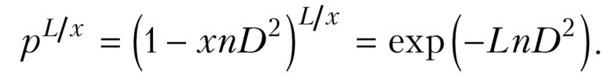
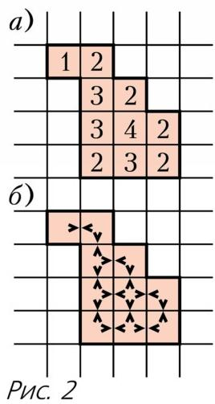
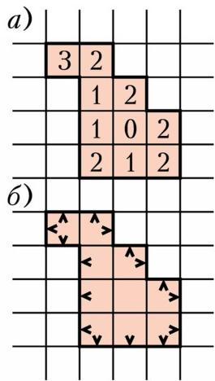
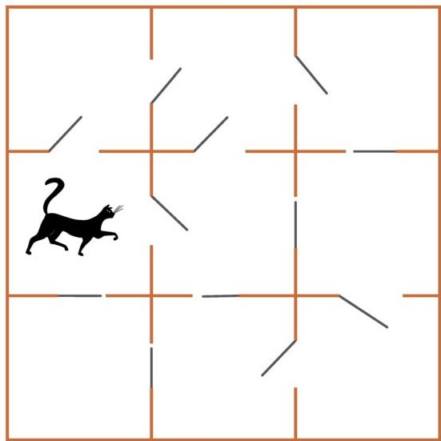

# 格点上的周长与面积

> **原标题**：Периметр и площадь на клеточках
> **作者**：Е. Бакаев（巴卡耶夫）
> **译自**：Квант 2019, № 12
> **栏目**：Квант для младших школьников（小学）
> **原文**：https://www.kvant.digital/issues/2019/12/bakaev-perimetr_i_ploschad_na_kletochkah-8c4b0287/
> **主题**：几何（格点图形）
> **难度**：★★（小学高年级可读，部分推理偏深）
> **译者**：Claude（AI 初译，2026-06）

---

在这篇文章里，我们要讨论的是「格点图形」——也就是由方格纸上的小格子拼成的图形。这种图形的面积和周长之间有什么关系呢？在所有面积相同的格点图形中，哪一种的周长最大？这就是我们要弄清楚的主要问题。

文中的「练习」不一定要做也能读懂后面的内容，但做一做能帮你把学过的东西弄得更明白，所以建议大家花点时间想一想。练习的答案和提示放在杂志末尾。各道「题」的解答就紧跟在题目后面，但最好还是先自己动脑想一想。

我们约定，下面所说的图形都是「连通」的。也就是说，从图形里的任何一个格子出发，都能通过共边的相邻格子走到另外任何一个格子。例如，图 1 中的格子集合 A、Б、В 都是图形，但是 Б 和 В 合在一起并不算同一个图形，

因为从 Б 的格子没法用上面说的方式走到 В 的格子。

图形的**周长**是指它边界的长度。例如，图形 A 的周长是 8，而 Б 和 В 的周长都是 16。

有些（注意：并不是所有！）格点图形是多边形（提醒一下：多边形的边界必须是一条不自交的封闭折线，换句话说，多边形是「没有洞」的图形）。例如，图形 A 是多边形，而 Б 和 В 不是。

我们来引入几个新概念。在图形的每个格子里写上一个数：这个格子有几条边位于图形的内部。我们把它叫做图形的「内部数组」。例子见图 2, а。

**练习 1.** 是否存在这样的图形，它的内部数组是：

а) $1,1,1,1,4$;

б) $0,1,2,3,4$;

в) $1,1,1,1$;

г) $2,2,2,2,3,3,3,3,4$?

**题 1.** 证明：一个图形的内部数组中，所有数之和总是偶数。

> **解答.** 在内部数组的和（记作 $\sum_{\text{внутр}}$）里，每一条格子之间的「内部隔墙」都被数了恰好两次（图 2, б）。所以 $\sum_{\text{внутр}} = 2i$，其中 $i$ 是内部隔墙的条数。因此这个和是偶数。

现在，在图形的每个格子里写上另一个数：这个格子有几条边位于图形的边界上。我们把它叫做图形的「外部数组」。例子见图 3, а。

**练习 2.** 是否存在这样的图形，它的外部数组是：

а) $0,3,3,3,3$;

б) $0,2,3,3$;

в) $0,0,2,2,2,2,2,2,2,2,2,2,3,3,3,3,3$;

г) $1,1,1,1,1,1,1,1,1,1,1,1,1,1,1,1$?

**题 2.** 怎样由外部数组求出图形的周长？

> **解答.** 在外部数组里，周长上的每一个单位线段都被数了恰好一次（图 3, б）。所以外部数组的和就等于周长：$\sum_{\text{внешн}} = p$。

下面，我们用内部数组和外部数组的这些性质，推出一条很有用的公式。

**题 3.** 设 $s$ 是图形的面积，$p$ 是它的周长，$i$ 是内部隔墙的条数。找出并证明联系这三个量的公式。

> **解答.** 我们来看内部数组和外部数组之间有什么关系。一种情形下，我们对每个格子数「有几条边在内部」；另一种情形下，我们数「有几条边在边界上」。所以把两个数组里所有的数加起来，就把 $s$ 个格子中每个格子的 4 条边都数过了。因此
> $$\sum_{\text{внутр}} + \sum_{\text{внешн}} = 4s.$$
> 代入前面两题的结论，得到：
> $$2i + p = 4s.$$

**练习 3.** 找出所有周长大于面积：

а) 5 倍；б) 4 倍；в) 3 倍

的图形。

由刚才证明的公式，立刻得到下面这条性质。

**题 4.** 证明：格点图形的周长总是偶数。

> **解答.** 从公式 $2i + p = 4s$ 看，$p$ 是两个偶数 $4s$ 与 $2i$ 的差，所以它也是偶数。

在下面的练习里，「把各部分的周长相加时，切口会被数两次」这个想法又会帮上忙。

## 练习

4. 把一个 $5 \times 5$ 的正方形切成若干个多边形，已知所有切口的总长度是 12。这些多边形的周长之和可能等于多少？

5. 把一块 $6 \times 6$ 的棋盘切成若干个 $1 \times 2$ 的小长方形。切口的总长度可能是多少？

6. 把一个 $8 \times 8$ 的正方形切成若干个「四连块」（由四个格子组成的图形）。已知切口的总长度是 60。这些四连块中可能有多少个是正方形？

下面我们来讨论这样一道题。

**题 5（Н. 斯特列尔科娃）.** 一套 $3 \times 3$ 的公寓由 9 间 $1 \times 1$ 的正方形房间组成。每两间相邻的房间之间都有一扇门相连。一只猫呆在其中一间房间里。为了让它能自在地走遍整套公寓，至少要打开多少扇门？

我们把「彼此之间能够自由走动」的房间归为一个「区域」。如果从一间房间没法走到另一间，它们就属于不同的区域。（在图 4 的例子中，猫所在的区域由 5 间房间组成，而区域的总数是 3。）

**第一种解法（看猫的区域大小）.** 一开始，把所有的门都关上，然后一扇一扇地打开。打开的顺序由猫来决定：它可以走到任意一扇关着的门前喵喵叫，我们就给它打开这扇门。如果这扇门通向一间新房间，猫的区域就增加一间；如果这扇门通向的房间，猫本来就能绕别的路走到，那么区域不变。也就是说，每打开一扇门，猫的区域最多增加 1。一开始区域是 1 间房，最后是 9 间。所以至少要打开 8 扇门。

题做完了。想一想：为什么要让猫来挑门，而不是我们自己挑？这一步到底用在了哪里？

**第二种解法（数区域的个数）.** 同样先把所有门关上，再一扇扇打开。这次我们数区域的总数。一开始每间房各自是一个区域，所以共有 9 个区域；最后所有房间合成 1 个区域。一扇门要么连接两个不同的区域——打开它，区域数就减少 1；要么连接的是同一个区域自己——打开它，区域数不减少。同样得到：至少要打开 8 扇门。

下一道练习也用同样的办法。

**练习 7.** 在一个 $6 \times 6$ 的方形迷宫里，从任何一个格子都能走到另外一个格子。这个迷宫里最多可能有多少条内部隔墙？

下面把这个思路用到格点图形上。

**题 6.** 面积为 $s$ 的图形，内部网格线段最少可能有多少条？

> **解答.** 任取一个面积为 $s$ 的图形，把它全部染成白色。从中选一个格子，染成黑色。接下来，每次把一个白格子染成黑色，要求新的黑格子至少有一条边与已经染黑的部分相邻。（这样的格子总能找到：只要还存在一个白格子和一个黑格子，那么在从其中一个走到另一个的路上，就一定会出现一对相邻但颜色不同的格子。）每染一次，黑色图形里的内部网格线段至少增加一条。最后所有格子都变成黑色。所以原来图形的内部网格线段不少于 $s-1$ 条。

注意，这里「逐个添加格子」的办法，和猫那道题里的办法是一模一样的。

很容易举出一个内部线段正好这么多的例子：比如长方形 $1 \times s$。

**题 7.** 面积为 $s$ 的图形，周长最大可能有多大？

> **解答.** 我们已经证明了公式 $2i + p = 4s$。从公式可以看出：当 $s$ 固定时，$p$ 越大，$i$ 就越小。所以周长最大的时候，就是内部线段最少的时候。我们已经知道，最少是 $i = s - 1$。把它代入 $2i + p = 4s$，得到 $p = 2s + 2$。也就是说，面积为 $s$ 的图形，周长不会超过 $2s + 2$。能达到这个上界的例子，和刚才一样（长方形 $1 \times s$）。

下面几道练习，请你也试着用「一个一个添加格子」的思路来做。

## 练习

8. 一个由 20 个格子组成的图形里，能剪出一个 $3 \times 3$ 的正方形。证明：它的周长不超过 34。

9. 已知某个格点图形能切成 5 个 $2 \times 2$ 的正方形。它的周长最大可能是多少？

10. 请各画出 10 个不同的图形，要求它们的周长都等于 14，而面积分别等于：а) 6；б) 7。

в) 为什么 б) 中的图形都含有一个 $2 \times 2$ 的正方形，而 а) 中的图形却没有？

下面我们来看一道可以用题 7 中周长估计的题。

**题 8.** 能不能把一个 $5 \times 5$ 的正方形切成两个格点多边形，使它们每一个的周长都等于 28？

> **解答.** 假设能这样切。下面有两种做法。
>
> **第一种解法.** 两个图形的面积之和是 25，所以其中至少有一个图形的面积不超过 12。由上一题，它的周长不超过 $2 \cdot 12 + 2 = 26$。与「周长等于 28」矛盾！
>
> **第二种解法.** 设切口的长度为 $v$。那么两个图形的周长之和等于 $20 + 2v$，而由条件它等于 $28 \cdot 2$。由此解得 $v = 18$。因为只切成了两部分，所以切口只有一条，不能分叉——它是一条从正方形 $5 \times 5$ 内部沿着格点走的、连成一串的折线。（详细说明一下：如果一个格点位于切口上，那么从它出发恰好有两条切口线段。因为不可能只有一条，也不可能有三条或四条——毕竟只切成了两部分，切口必须把两个不同的图形分开。所以，只要从边界沿着切口走，就会一直走一条没有分叉的线。）
>
> 这条切口由 18 条单位线段连成，所以它上面有 17 个格点。可是 $5 \times 5$ 正方形内部一共只有 $4 \times 4 = 16$ 个格点——比最少需要的还少 1 个。矛盾！

最后顺便提一句：题 5 和题 6 实际上说的是图论里的一条定理——一个有 $n$ 个顶点的连通图，至少有 $n - 1$ 条边。相应地，这条定理也可以仿照题 5 来证。关于图，我们就不多讲了；想深入了解的同学，可以读一读 П. 科热夫尼科夫和 А. 沙波瓦洛夫的文章《与图打交道》（«Свяжитесь с графом»，《Kvant》2014 年第 4 期），里面专门讲那些藏着这条定理的题目。

---

> **译者注（OCR 修正说明）**：原文 OCR 在 p22 处串入了一段与本文无关的邻页内容（关于「电池内阻取最大功率」「牛奶脂肪颗粒尺寸估算」的物理题解答，题号 Ф2584 等），与本文主题（格点几何）无关，按翻译指南第五节已剔除。此外，原文图 1 用 HTML 表格表示 A、Б、В 三组格子，本译文依据原页面排版改用对应图片 `images/043d18b0...jpg` 作为图 1（该图即原文 Рис.1 的实际图像）。原文中字母「Б/В」在两处作图形标签使用，文中按俄文原样保留。
