# 方格纸上的算术（毕克定理入门）

> **原标题**：Арифметика на клетчатой бумаге
> **作者**：С. Гиндикин（金迪金 S. G.）
> **译自**：Квант 1979, № 4
> **栏目**：Квант для младших школьников（小学）
> **原文**：https://www.kvant.digital/issues/1979/4/gindikin-arifmetika_na_kletchatoy_bumage-9d916a6a/
> **主题**：几何 / 数论（形数、毕达哥拉斯三元组、三角形数）
> **难度**：★★（小学高年级可读，部分内容偏深）
> **译者**：Claude（AI 初译，2026-06）

---

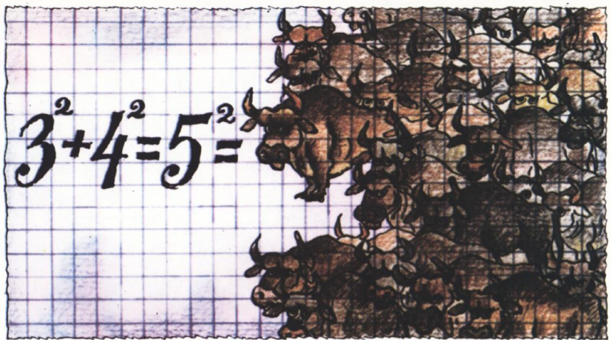

**С. 金迪金**

## 方格纸上的算术

为什么数学作业本要画成方格的？一年级的小朋友有时会问这个问题，因为把数字塞进一个个小方格里写起来并不方便。后来他们会明白：在方格纸上画几何图形很方便。原来，在方格纸上画各种图形，还能让我们知道许许多多关于**算术**的趣事！

用方格纸上的图形来表示数，这个方法可以追溯到很久很久以前——古巴比伦、古埃及和古希腊的数学。当然，那时的数学家不会在泥板或纸草上画格子，他们是把许多小点子摆成图形。下面我们就用方格纸来试一试。

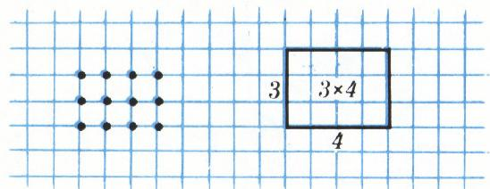
*图 1.*

古希腊人把两个自然数相乘得到的结果叫做**平面数**（плоское число），它对应于排成长方形网格的小点子（图 1）。我们这里约定：把一个平面数画成方格纸上的一个长方形，然后数一数里面有几个小方格。

乘法的各种性质，用方格图来展示会非常清楚。例如，**分配律**（也就是去括号的规则）就相当于把一个长方形切成几个小长方形（图 2）。如今「平面数」这个老名字已经不用了，但「平方」（квадрат）这个表示「两个相同因数相乘」的词，却一直沿用至今。

## 平方与拐角形（gnomon）

古希腊人画奇数时，用的是一个厚度为一格的「拐角形」（希腊文叫 *gnomon*，读音大致是「诺蒙」）（图 3）。下面要讲的第一个推理，正是关于平方数和拐角形的，它属于公元 1 世纪前后的尼科马库斯（Никомах Геразский）。

| $3\times(2+2)=3\times2+3\times2$ | $(1+3)\times(2+4)=1\times2+1\times4+3\times2+3\times4$ |
|:---:|:---:|

*图 2.*

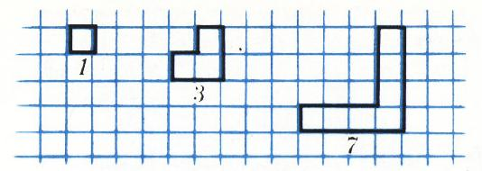

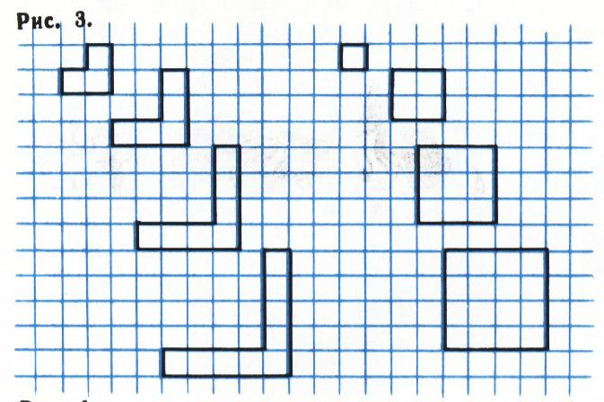

我们连续画几个平方数和拐角形（图 4）。你看，是不是每一个拐角形都让人想用一个平方数去补一补它，补完之后正好得到下一个平方数（图 5）？这条观察告诉我们：**每一个奇数，都等于两个相邻平方数的差**。

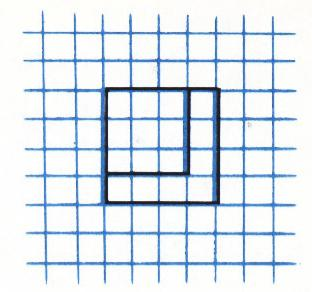

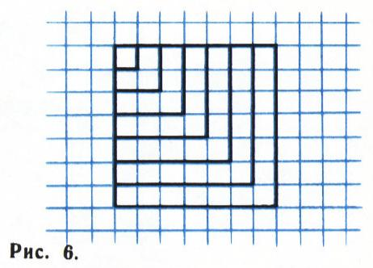

现在，我们把从最小那个开始的几个拐角形一个接一个地加起来。结果会得到一个平方数（图 6）。也就是说：**从 1 开始的连续奇数之和是一个平方数**：

$$1+3=4,\quad 1+3+5=9,\quad 1+3+5+7=16,\quad\dots$$

## 毕达哥拉斯与毕达哥拉斯学派

毕达哥拉斯（公元前 6 世纪）是半传说式的智者。他喜欢四处游历，他的许多学问都来自东方的智慧。

毕达哥拉斯学派对数字有一种近乎神秘的态度。他们热衷于收集各种「数字奇观」，认为其中显现着神的力量。他们善于用数字形象来抒发自己的思想和感情。偶数被叫做「女性数」，奇数被叫做「男性数」。他们特别钟爱数字

$$10=1+2+3+4$$

（图 7），称之为「完满数」或「四元数」（тетрада），并发誓说：「以那把四元数放进我们灵魂、它是永恒自然之根与源者为誓」。等于自己（真）约数之和的数，叫做**完全数**（例如 $6=1+2+3$）；尼科马库斯知道四个完全数：$6$、$28$、$496$、$8128$。象征着友谊的，是一对**亲和数**——这两个数中，每一个都等于另一个的真约数之和。例如 $284$ 和 $220$ 就是一对亲和数：

$$284=1+2+4+5+10+20+11+22+44+55+110,\quad 220=1+2+4+71+142.$$

可是，既然有「好数」，那也该有「坏数」。一个数如果什么优点都没有，就是「坏」的；如果它正好被一些有趣的数夹在中间，那就更糟。对 $13$（「魔鬼打」）的恐惧，至今仍让人惊叹地顽强。不过也有些东西被遗忘了。普鲁塔克写道：「毕达哥拉斯学派讨厌数字 $17$。因为 $17$ 正好夹在 $16$（一个完全平方数）和 $18$（一个平方数的两倍）之间；而这两个数是仅有的『平面数』中满足（长方形）周长等于面积的……」换言之，可以证明：如果两个（自然）数的乘积等于它们和的两倍，那么这对数要么是 $3$ 和 $6$，要么是 $4$ 和 $4$（想一想，为什么？）。

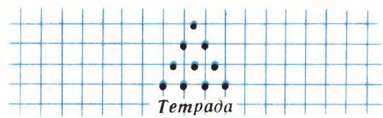
*图 7.*

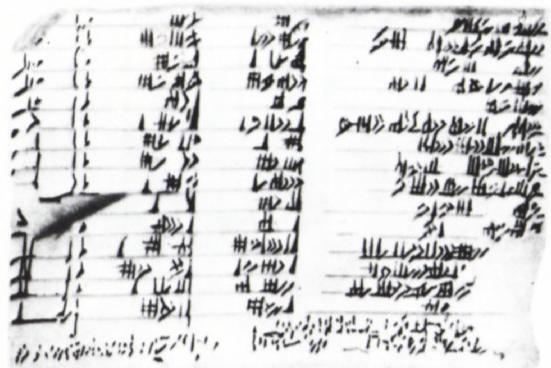
*图 8. 古巴比伦的楔形文字泥板。*

## 毕达哥拉斯三元组

有一个传说：毕达哥拉斯为了庆祝自己的某项发现，献祭了一头牛（也有人说是一百头牛）。维特鲁威断言，让毕达哥拉斯觉得如此重要的发现，是找到了两个平方数，它们的和等于第三个平方数。这就是关系式

$$3^{2}+4^{2}=5^{2}.$$

如今，凡是满足 $a^{2}+b^{2}=c^{2}$ 的三个自然数 $a,b,c$，都叫做**毕达哥拉斯三元组**。原来，毕达哥拉斯三元组早在古巴比伦就已经为人所知（图 8）。希腊数学家们后来也陆陆续续找到了它们。

我们来想想，怎样能找到毕达哥拉斯三元组。还记得吧：**每一个奇数都能写成两个相邻平方数之差**。那么，一个奇数的平方，加上「它作为差的两个平方数」，就构成一组毕达哥拉斯三元组。例如（图 9）

$$3^{2}=9=2\cdot4+1=5^{2}-4^{2}.$$

这样就得出了三元组 $3,4,5$。类似地

$$5^{2}=25=2\cdot12+1=13^{2}-12^{2},\quad\text{所以}\quad 12^{2}+5^{2}=13^{2};$$

$$7^{2}=49=2\cdot24+1=25^{2}-24^{2},\quad\text{所以}\quad 24^{2}+7^{2}=25^{2}.$$

这样就能得出所有满足 $c=a+1$ 的毕达哥拉斯三元组 $a,b,c$。它们的一般形式是

$$
a=\dfrac{m^{2}-1}{2},\quad b=m,\quad c=\dfrac{m^{2}+1}{2}
$$

（$m$ 是奇数！）。请你自己证明一下。那又该怎样找出**所有**的毕达哥拉斯三元组呢？

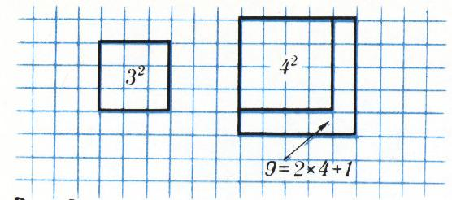
*图 9.*

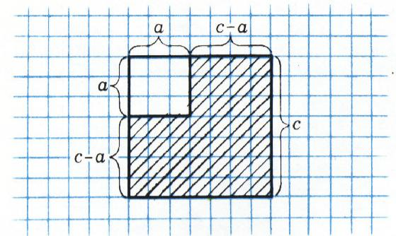
*图 10.*

## 毕达哥拉斯三元组的一般问题

前面的经验提示我们：要去研究任意两个（不一定是相邻的）平方数的差 $c^{2}-a^{2}$，其中 $c>a$。这样得到的是一个厚度为 $c-a$ 格的「**厚拐角形**」（рис. 10）。于是问题就归结为：把平方数 $b^{2}$ 用所有可能的方式变成（小方格数不变！）某个「厚拐角形」。

第一个观察是：厚拐角形可以改造成一个长方形（也就是一个「平面数」！），它的两边长分别是 $m=c-a$ 和 $n=c+a$（图 11）。这其实就是公式

$$c^{2}-a^{2}=(c-a)(c+a)$$

的一个几何证明。问题是：哪些平面数可以改造成「厚拐角形」呢？显然，$m=c-a$ 和 $n=c+a$ 彼此不相等，并且要么同为偶数、要么同为奇数；除此之外没有别的限制。所以，给定一个**不是正方形**的长方形，只要它的两边 $m$ 和 $n$ 奇偶性相同，就能把它改造成一个厚拐角形，从而写成两个平方数之差：

$$
c^{2}=\left(\dfrac{m+n}{2}\right)^{2}\quad\text{与}\quad a^{2}=\left(\dfrac{m-n}{2}\right)^{2}
$$

（在我们的假定下，$m+n$ 和 $m-n$ 都是偶数，而且都不为零）。

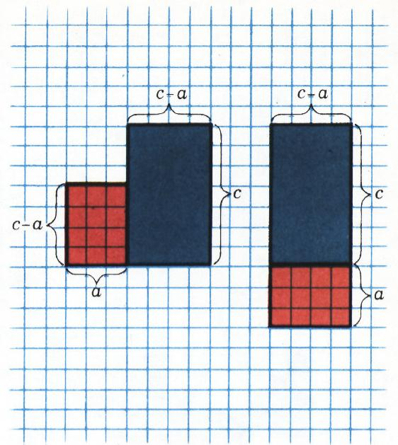
*图 11.*

这样，我们就把「找毕达哥拉斯三元组」这个问题，转化成了下面这个更简单的问题：平方数 $b^{2}$ 怎样变成一个两边 $m$、$n$ 奇偶性相同（且 $m\neq n$）的长方形。这个问题很容易解决。设 $r\neq b$ 是 $b^{2}$ 的一个约数（不一定是 $b$ 的约数），并且 $\dfrac{b^{2}}{r}$ 与 $r$ 奇偶性相同。这时 $r$ 必须与 $b$ 同奇偶，不过这个条件并不充分（想一想，为什么？）。于是两边长 $m=r$、$n=\dfrac{b^{2}}{r}$ 的长方形就能改造成一个厚拐角形，也就是两个平方数之差：

$$
c^{2}=\left[\dfrac{b^{2}/r+r}{2}\right]^{2}\quad\text{与}\quad a^{2}=\left[\dfrac{b^{2}/r-r}{2}\right]^{2}.
$$

请注意，$r$ 可以等于 $1$，而且我们只需考虑 $r<b$ 的约数（为什么？）。

总之，**所有的毕达哥拉斯三元组**都具有下面的形式：

$$
a=\dfrac{b^{2}-r^{2}}{2r},\quad b,\quad c=\dfrac{b^{2}+r^{2}}{2r},
$$

其中 $1\leqslant r<b$ 是 $b^{2}$ 的一个约数，使得 $r$ 与 $b^{2}/r$ 奇偶性相同（这个奇偶性也就是 $b$ 的奇偶性）。按照这条规则，可以像机器一样自动列出毕达哥拉斯三元组。请你试一试；下表是 $b$ 取 $1$ 到 $10$ 时的毕达哥拉斯三元组，供你对照：

| $b$ | $r$ | $a$ | $c$ |
|:---:|:---:|:---:|:---:|
| 3 | 1 | 4 | 5 |
| 4 | 2 | 3 | 5 |
| 5 | 1 | 12 | 13 |
| 6 | 2 | 8 | 10 |
| 7 | 1 | 24 | 25 |
| 8 | 2 | 15 | 17 |
| 8 | 4 | 6 | 10 |
| 9 | 1 | 40 | 41 |
| 9 | 3 | 12 | 15 |
| 10 | 2 | 24 | 26 |

表里有几组三元组 $a,b,c$ 只是 $a$ 和 $b$ 调换了位置——这是因为在毕达哥拉斯三元组里，$a$ 和 $b$ 本来就可以互换。此外我们还能看到：**不存在以 $b=2$ 为中项的毕达哥拉斯三元组**，因为此时找不到合适的约数 $r$（满足 $r<2$ 的自然数只有 $r=1$，而 $1$ 是奇数）。而对其余的 $b$，至少存在一组三元组。如果 $b$ 是奇数，可以取 $r=1$，得到的 $a$ 和 $c$ 相差 $1$（这正是我们一开始研究的那种情形）。如果 $b$ 是偶数且 $b\neq2$，可以取 $r=2$，这时得到的三元组满足 $c-a=2$（想一想，为什么？）。

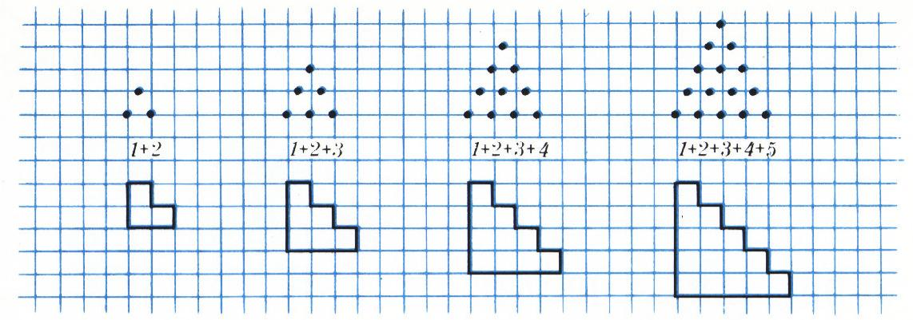
*图 12.*

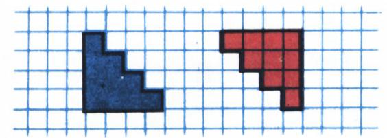
*图 13.*

## 三角形数

在古巴比伦人的楔形文字泥板上，记载着一种计算前 $n$ 个自然数之和 $1+2+3+\dots+n$ 的方法。这种和被称为**三角形数**，因为把每个加数对应的小点子排起来，正好能排成一个三角形（图 12）。在方格纸上，更方便的画法是画一个像「楼梯」一样的图形（图 13）：每往下一层，格子就比上一层多一个。要数清这座「楼梯」里一共有多少格（也就是所求的和），我们可以再画一座一模一样的楼梯，但把它倒过来放，然后把两座楼梯「错位拼起来」（图 14）。两座楼梯的齿牙正好咬合，拼出一个长方形：它的一边长 $n$，另一边长 $n+1$。这个长方形里一共有 $n(n+1)$ 个格子；而每座楼梯里——

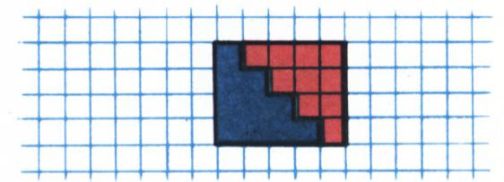
*图 14.*

只有它的一半，也就是 $\dfrac{n(n+1)}{2}$。

于是

$$
1+2+3+\dots+n=\dfrac{n(n+1)}{2}.
$$

**题 1**　借助「楼梯」的方法，求下面几个和：

- 前 $k+1$ 个奇数之和 $1+3+5+\dots+(2k+1)$；
- 前 $k$ 个偶数之和 $2+4+6+\dots+2k$；
- 形如 $3k+1$ 的数之和 $1+4+7+\dots+(3k+1)$。

（第一个和我们已经用拐角形的方法求过了。）

下一个题目，与尼科马库斯的另一个有趣观察有关。

**题 2**　请验证：作为**相邻两个三角形数之平方差**的那个「拐角形」，恰好是一个立方数，确切地说，

$$
\left[\dfrac{n(n+1)}{2}\right]^{2}-\left[\dfrac{(n-1)n}{2}\right]^{2}=n^{3}.
$$

尼科马库斯正是从这个关系式出发，得到了立方数求和的公式：

$$
1^{3}+2^{3}+\dots+n^{3}=\left[\dfrac{n(n+1)}{2}\right]^{2}.
$$

要证明它，只要把对应于相邻三角形数的所有「拐角形」一个一个地叠起来就够了。
