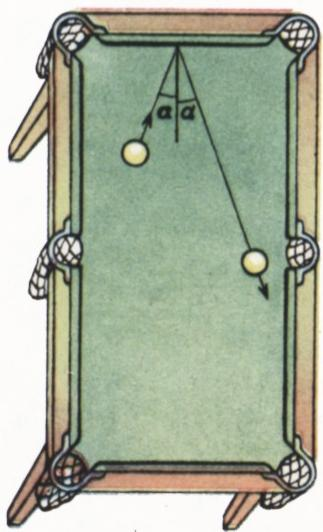
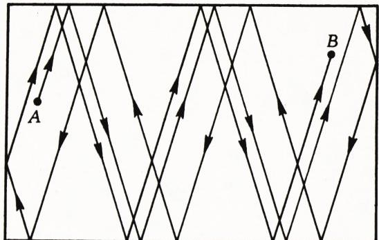
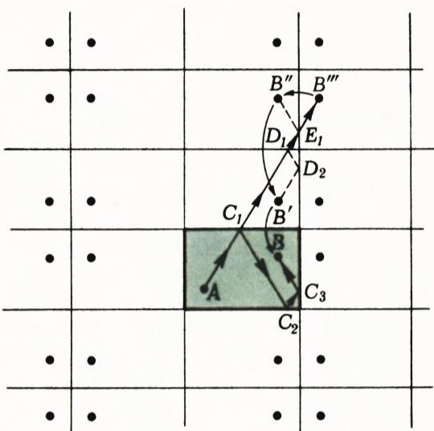
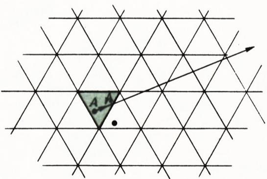
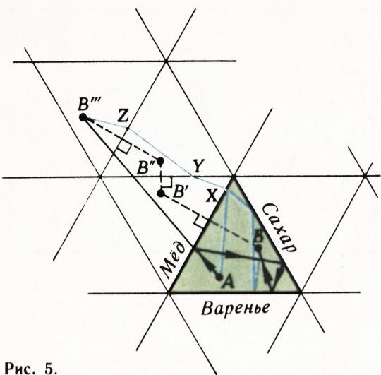
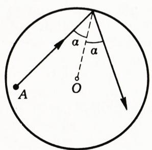
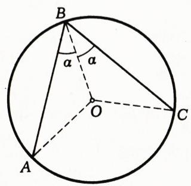
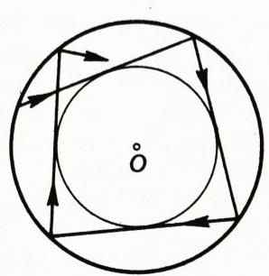
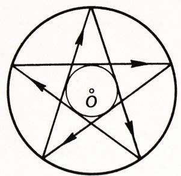
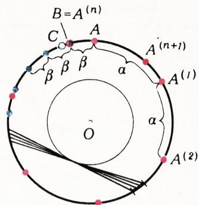

# 台球（数学台球模型）

> **原标题**：Бильярд
> **作者**：Гальперин Г. А.（加尔佩林·Г. А.）
> **译自**：Квант 1981, № 4
> **栏目**：Квант для младших школьников（小学）
> **原文**：https://www.kvant.digital/issues/1981/4/galperin-bilyard-1b986d19/
> **主题**：几何
> **难度**：★★（小学高年级可在家长引导下阅读；圆台球证明一节偏深）
> **译者**：Claude（AI 初译，2026-06）

---

Г. 加尔佩林

## 台球

> 打台球的时候，我同时在上着一堂物理课和一堂几何课。
>
> —— С. М. 布琼尼

你打过台球吗？就算没打过，多半也看过别人打。

我们来盯住一个滚动中的球看。只要它还没撞到台边或者别的球，它走的就是一条直线。撞到台边时，球会弹开，弹开的方式几乎和光线照到平面镜上反射回去一样：**入射角等于反射角**（图 1）。

真实的台球桌上是有摩擦的，球在碰撞中会损失一部分机械能；如果球杆打得不正，或者撞到了别的球，球还会一边走一边旋转。法国物理学家科里奥利在他写的《台球游戏的数学理论》一书中，描述了球在台桌上的运动理论。

我们在本文里要讨论的是**理想台球**：也就是把球看作一个点，没有摩擦，碰撞时（无论撞台边还是撞别的球）都不损失机械能。

图 2 画出了一条曲曲折折的轨迹——一个球被球杆击出后走过的路。这条轨迹可能会在球落袋时结束，可能会……

图 1

……回过头来接成一个闭合的圈，也可能会无穷无尽地一直绕下去，越走越占满整张台桌。

我们来研究这样一个问题：台桌上只有一个球，要从 $A$ 点出发，撞台边指定的次数后正好到达 $B$ 点（比如落袋），该朝什么角度打出去？

## 镜面反射法：把台球轨迹「拉直」

解这道题，以及许多类似的台球问题，最关键的一招是 **「镜面反射」**（也叫 **「把台球轨迹拉直」**）：

把原来的矩形台桌（原台桌）对它的每一条边都对称地翻一份出去；再把得到的所有矩形，又对它们各自的每一条边对称地翻一份；这样一直翻下去，无穷无尽（图 3 里也画出了 $B$ 点在所有这些对称翻折后得到的「像」）。经过这样一番翻折，原本折来折去的轨迹就被「拉直」了。

例如图 3 中，轨迹 $AC_{1}C_{2}C_{3}B$ 经过翻折，会依次变成 $AC_{1}D_{1}D_{2}B'$，再变成 $AC_{1}D_{1}E_{1}B''$，再变成 $AC_{1}D_{1}E_{1}B'''$。

如果这条「拉直后的轨迹」正好经过某个矩形里 $B$ 的像，那么很显然，原台桌里那条折回的轨迹就会经过 $B$。

所以，要想从 $A$ 点把球打出去、让它撞台边指定的次数后到 $B$，只要从 $A$ 出发画一条线段，终点落在某个 $B$ 的像上，并且这条线段恰好穿过「方格平面」上同样条数的格线就行。再把这条线段「折回去」，就还原成原台桌里我们要找的轨迹了（图 3）。

图 2

图 3

图 4

除了常见的矩形台桌，我们也可以研究别的形状。比如，**等边三角形**的台桌。既然一模一样的等边三角形可以既不留缝也不重叠地把整张平面铺满，「拉直轨迹」的办法在这里照样能用（图 4）。

## 一道经典趣题：蜜蜂的最短路线

台球轨迹可以解下面这道大家都熟悉的趣题：

> 一只蜜蜂要从等边三角形里的 $A$ 点爬到 $B$ 点。途中它要先到三角形的一条边上舔一口蜂蜜，再到另一条边上舔一口糖，最后到第三条边上舔一口果酱。**应该走哪条最短的路**？
>
> （假设每一条边上都满满地涂着对应的甜食。）

答案见图 5。这张图里还用蓝色画出另一条任意的、**不是台球轨迹**的蜜蜂路线；翻折之后它变成一条蓝色折线 $AXYZB'''$，长度都比不上从 $A$ 直接到 $B'''$ 的那段直线段——也就是台球轨迹被拉直后的那条线段。

## 圆台球桌

**圆形台桌**上的轨迹格外有意思（图 6,а）。

第一，从第一次反弹开始，轨迹每一小段（每一「 звено 」，即两相邻反弹点之间的直线段）的长度都一样。这一点很容易从 $\triangle OAB \cong \triangle OCB$ 推出来（图 6,б，其中 $O$ 是圆心）。

第二，每一段中点到圆心的距离都相等，也就是说，这些中点都落在同一个圆心相同的圆上。于是整条台球轨迹就乖乖地待在一个**圆环**里（图 6,в）。

这种轨迹有可能是闭合的，这时它要么形成一个内接于圆的正多边形，要么形成一颗自我交叉的「星」（图 7）。这样的轨迹叫做**周期性轨迹**。

图 6（а）

图 6（б）

图 6（в）

图 7

显然，「从圆周上的 $A$ 点把球打出去，让它反弹 $n$ 次后正好回到 $A$」这个问题，就等价于「**怎样作出一个以 $A$ 为一个顶点的正 $(n+1)$ 边形**」。

古希腊数学家为后面这个问题苦苦钻研了很久，却始终没找到答案。直到 19 世纪初，伟大的德国数学家**卡尔·弗里德里希·高斯**才指出：什么情况下这个作图可以用圆规和直尺完成，什么情况下不可能（详见《Квант》1977 年第 8 期，第 5 页）。

> **译者注**：高斯证明了，正 $n$ 边形能用尺规作出，当且仅当 $n$ 是「若干个不同的费马素数之积」乘上 $2$ 的若干次方，例如正 17 边形可以作出，正 7、9、11 边形则不能。

如果轨迹**不闭合**，它就会几乎填满整个圆环——也就是说，它会走到圆环里随便哪一点附近，要多近有多近。

## 一个证明：圆周上的反弹点「密密地」填满整圈

我们来证明这件事。

固定圆周上一个反弹点，记为 $A$。从 $A$ 出发，我们会在圆周上陆续得到一个个新的反弹点，它们之间相隔同样的（弧长）距离 $\alpha$，一直到我们「跨过」$A$ 点为止。把「跨过 $A$ 之前」和「跨过 $A$ 之后」离 $A$ 最近的那一个点记为 $B$。弧 $AB$ 的长度 $\beta$ 不超过 $\dfrac{\alpha}{2}$：

$$\beta \leqslant \dfrac{\alpha}{2}.$$

从 $B$ 点开始走，过若干步我们会落到一个离 $B$ 距离为 $\beta$ 的点上；再过若干步，落到离 $B$ 距离为 $2\beta$ 的点上；以此类推（图 8）。也就是说，现在我们相当于在圆周上一步一步地走，每一步大小是 $\beta$——它至少比原来从 $A$ 出发时的步长小了一半。

经过若干步后，我们会**第一次**跨过 $B$ 点。把「跨过 $B$ 之前」和「跨过 $B$ 之后」离 $B$ 最近的那一点记为 $C$。设弧 $BC$ 长为 $\gamma$，那么

$$\gamma \leqslant \dfrac{\beta}{2} \leqslant \dfrac{\alpha}{4}.$$

照上面的办法继续做下去，就能把「步长」缩小到 $\gamma$。把上述过程重复 $k$ 次，步长就缩小到不超过 $\dfrac{\alpha}{2^{k}}$。

可当 $k$ 很大的时候，$\dfrac{\alpha}{2^{k}}$ 变得非常非常小，小到我们一定会**走进**圆周上任意一段我们随手挑出的、要多短有多短的弧里。

图 8

于是我们证明了：反弹点**密密地**填满了整圈圆周。再从每个反弹点向圆环内侧那个圆作切线，整条台球轨迹也就**密密地**填满了整个圆环。证毕。

## 尾声

台桌还可以做成各种各样的形状，它们都有一个共同的「台球定律」：**入射角等于反射角**。

台球的种种想法，常常会跳出来用在现代数学的许多领域里，有时还出人意料——比如在**数论**里。而台球游戏本身，也是真实物理过程的一个好模型：你看，气体分子在容器壁之间、彼此之间撞来撞去，行为就跟绿色台呢上滚来滚去的球一模一样。

想进一步了解台球与数学之间更深的联系，可以读 A. 泽姆利亚科夫的两篇文章——《Квант》1976 年第 5 期和 1979 年第 9 期。

---

## 题目

1\. （题目文字散落在文末 OCR 中，原杂志此处题目编号从 2 开始，第 1 题正文未见，此处据 OCR 文字译出第 2 题之后部分。）

> **译者注**：原文 OCR 在「题目」一节出现编号跳号（无第 1 题、第 2 题题干亦不完整），疑排版/扫描串页所致；以下据可见文字译出。

2\. （а）轨迹能不能有 **4 段**？如果能，那么台桌的长宽要比是多少？

（б）那能不能有 **5 段？6 段？17 段？1980 段？**

3\*. 在矩形台桌上，从 $A$ 点沿平行于对角线的方向打出一个点球。试在台桌上找出所有这样的点 $M$：如果另有一个球从 $M$ 点同时、以同样的速度（大小和方向都相同）被打出，它会和第一个球相撞。

4\. 在等边三角形（$\triangle XYZ$）形状的台桌上，找出这样的 $A$、$B$ 两点：从 $A$ 打出的球，依次撞到边 $XY$、$YZ$、$ZX$（**就是这个顺序！**）后，正好进到 $B$，并且走过的总路程要**尽可能长**。这条路最长能比三角形的边长长多少倍？

5\. 在圆台球桌上，一个点球沿轨迹 $\gamma$ 运动。已知台球轨迹里有某两段互相平行。轨迹 $\gamma$ 可能是**闭合**的、并且有 **1717 段**吗？可能**不闭合**吗？

6\. 一个角的大小是 $\alpha$，一颗粒子飞进来，在它的两边上反弹尽可能多的次数后，便不再撞到边上。已知这个最大反弹次数是 **1800**。$\alpha$ 可以在什么范围内取值？
