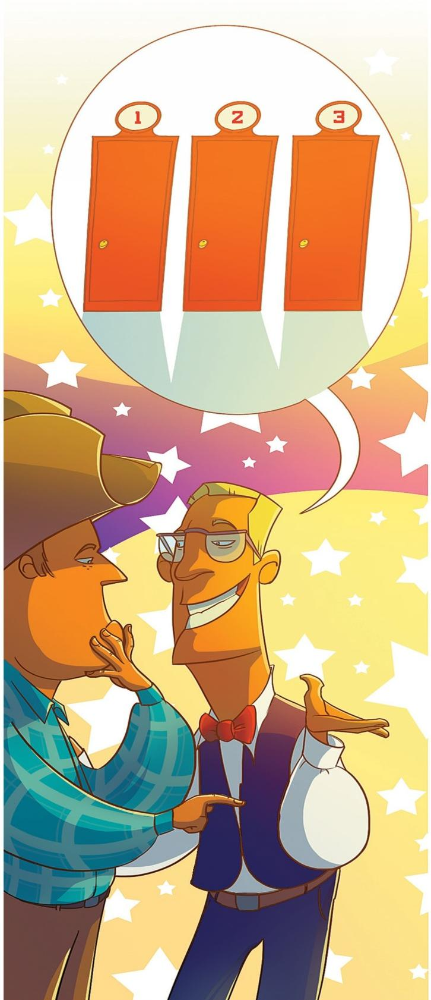
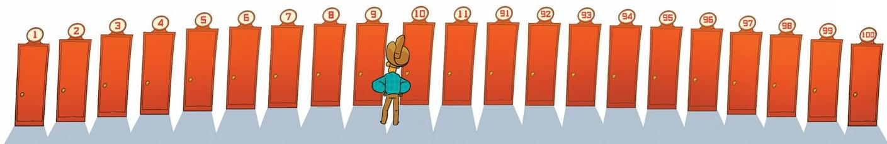

# 三门后的奔驰（蒙提霍尔问题）

> **原标题**：Мерседес за тремя дверями
> **作者**：С. А. Дориченко（多里琴科 · 谢 · 阿）
> **译自**：Квант 2012, № 5/6
> **栏目**：Квант для младших школьников（小学）
> **原文**：https://www.kvant.digital/issues/2012/5-6/dorichenko-mersedes_za_tremya_dveryami-754abe76/
> **主题**：谜题/游戏（概率）
> **难度**：★★（小学高年级可读，关键处需细想）
> **译者**：Claude（AI 初译，2026-06）

---

## 一切的开头……

「你想想看，我转那个该死的转盘，竟然落在了『有奖』那一格！」比尔两眼放光，正给老朋友约翰讲他最近去参加「幸运转盘」节目的事。

「我当然高兴坏了。可主持人把我领到三扇门前，说：『没那么简单哦。三扇门后面有一扇后面是一辆奔驰，比尔，这辆车可能就是你的。随便选一扇吧。』我紧张得满头大汗。心想，豁出去了，就指了指右边那扇。谁知道主持人却走到中间那扇门前，一把把它打开了——里面空空如也。『比尔啊，』他接着说，『我决定帮你一把。我知道奔驰藏在哪儿。为了让你机会更大些，我打开了其中一扇空门。』我心想，是啊，谢谢啦，可这对我有什么用？这时他又来了一句：『现在是关键，比尔——我允许你改主意。你可以指另一扇门。当然，你要是不想也行。你自己决定！』我一下就打了个寒颤。原先我的胜算明摆着是一比三。现在只剩两扇门了——左边和右边。那不就是一比二了？我一开始还挺高兴，可一琢磨：那改不改动有什么区别？反正两边机会一样。我又怀疑他在使诈，就没改主意，按原计划开了右边那扇门。结果啥也没赢。这下我难受坏了——是单纯运气不好呢，还是当时真该改去拉左边那扇？」

## 约翰的回答

「我看啊，老兄，你这次可是失策了。」约翰摇摇头，「要是你改主意，胜算会大得多。」

「怎么会呢，约翰？明明只剩两扇门，机会应该一样啊。」

「可主持人呢，他总能从你那两扇没选的门里挑出一扇空门打开。所以对你那扇门来说，他什么也没告诉你。原来这扇门后藏着奔驰的概率是 $\dfrac{1}{3}$，现在还是 $\dfrac{1}{3}$。」

「不对，这没道理。打开的那扇门后面什么都没有，那它的概率不就立刻变成 $0$ 了？剩下的两扇，每扇不就各是 $\dfrac{1}{2}$ 吗？」

「凭什么要平分呢？这样，咱们不急，慢慢算。你先看你没选的那两扇门：奔驰藏在它们背后的概率是多少？」

「……就是还没开门之前？大概是 $\dfrac{2}{3}$ 吧。」

「对。主持人从这两扇里挑了一扇空的打开。这种事他当然永远能做到——总有一扇是空的嘛。所以他只是……」

……给你挑明：这两扇门里头，这一扇后面没有奔驰。但奔驰在这两扇门之一后面的概率，依然是 $\dfrac{2}{3}$。而你对自己当初选的那扇门，没有获得任何新的信息。原先那种「奔驰到底在你选的那扇门后，还是在另外两扇门后」的不确定性，原封不动地保留着！

「那这能说明什么呢？既然这 $\dfrac{2}{3}$ 还呆在那两扇门里头，可其中一扇已经确定是空的了，那这 $\dfrac{2}{3}$ 岂不就全都搬到另一扇门上去了？」

「正是如此。而你最初选的那扇门，概率还是 $\dfrac{1}{3}$。」约翰得意地往椅背上一靠，伸手去端鸡尾酒。比尔却陷入了沉思。

## 第二次尝试

「我想，我早该明白的，」比尔想了半天开口说，「可我对概率这玩意儿不在行，总还是有点儿不肯信……」

「耐心，关键就是耐心。」约翰几乎听不见地嘟囔了一句，他已经开始有点儿压不住火了。「好吧，比尔，咱们换个法子试试。你想象一下：你整整一个月天天去参加这个节目，每次都完全随机地选一扇门，然后把它打开。你能赢到多少辆奔驰？」

「要是他们不作弊，三十天里大概能赢十辆左右。」

「没错。这就说明你的胜算是 $10$ 比 $30$，也就是 $1$ 比 $3$，换句话说，概率是 $\dfrac{1}{3}$。」

「可我不明白你想说什么。」

「这样，你想象自己又整整去了一个月。每次随机选一扇门，而且死犟着不改主意。主持人在那儿忙前忙后，又给你各种提议，你就岿然不动。你能赢多少辆？」

「大概也是十辆上下吧。」

「可你刚才不是说，主持人一旦打开一扇门，你的机会就变大了吗？」

「是啊，因为剩两扇关着的门，每扇的概率就是 $\dfrac{1}{2}$ 了嘛。」

「那要是主持人每次都打开一扇门，你一个月岂不是能拿到 $15$ 辆奔驰了？」

「好像是这么回事。」约翰不踏实地拖长了腔调。

「可这对你来说什么都没改变啊！」约翰几乎要控制不住自己了。「哪怕他把你的门打开，哪怕把三扇全打开：你反正不改主意！」

「喂喂，你悠着点儿，老兄。他要是把我那扇门打开，我立刻就知道自己是赢还是输。」

「对，比尔，对。每一次具体情形，你要么输、要么赢。但如果你整整一个月都随机指一扇门，而且不管之后开什么门都不改主意，那你大概能赢 $10$ 辆奔驰。」

「真的吗？」

「以前其实也是把三扇门全给你打开，好检查你猜得对不对。现在只不过是把开门这件事稍微提前了一点儿：在你已经选好、但还没『最后定下来』的时候开。可你又不改主意。你完全可以这么想：他们只不过开始用开门来核对你有没有猜中而已。」

「看来我一个月之后也就能拿到那十辆左右……虽然听着有点怪。」

「太好了！」约翰掏出手帕擦了擦额头上的汗。「现在，比尔，集中精神回答：要是你每次都改主意，能赢多少辆？」

「我哪知道？」

「行，咱们这么办。想象咱俩一起去玩这倒霉节目。每次都是你来选门，而且不改主意。我呢，恰恰相反——主持人一提议，我每次都把你的选择改掉（就当是我在心里偷偷改）。这样你一个月能拿到 $10$ 辆，对吧？」

「大概是这样，约翰。」

「那我能拿多少？」

「你？就是『在心里』改，是吗？」

「对，在心里，在心里。」

「那你……嗯，要是我赢了，你就两手空空。要是我运气不好，那奔驰就在另一扇还关着的门后面。嘿，那这车不就归你了！奔驰一共 $30$ 辆，我赢了 $10$ 辆，那你能赢……$20$ 辆？这可太不公平了，约翰！」

「你还想要怎样呢？你坚持自己的选择，等于在三扇门里随机开一扇——所以你拿到的是属于你的那三分之一。而我每次改主意，就等于是把剩下两扇门都打开了：一扇由主持人替你开，另一扇由你自己开。原本只能随机开一扇，现在能开整整两扇。胜算翻倍，有什么好奇怪的？」

「天才！」比尔喊出声来，又陷入了沉思。被顿悟点亮的脸渐渐又阴沉下去。约翰紧张地盯着他。最后，比尔犹犹豫豫、像在赔不是似的，对约翰抛出了下面这番话。

## 最后一个理由

「是的，约翰，看来你是对的。你讲得非常明白，可我还是没完全弄懂……」

「比尔！」约翰差点儿没犯心脏病。「老天，你快闭嘴！我又想到一招，这回保准讲得你透彻明白。你想象一下，这次节目有 $100$ 扇门。」

「哇，整整 $100$ 扇，太棒了。可那样的话，机会就太渺茫了。」

「是的，比尔，$100$ 扇门。但不是『机会渺茫』，而是 $\dfrac{1}{100}$——小是小，可多少还有点儿。就这样，比尔，你选好一扇门以后，那位又善良又无所不知的主持人会打开——你猜多少——$98$ 扇后面什么都没有的门！没错，比尔，他把除了两扇以外的门全打开了：一扇是你选的那扇，另一扇是不知道哪来的一扇。然后他让你改主意，或者坚持原来的选择。你怎么办？」

「我怎么办，约翰？要是我改主意，那么凡是奔驰藏在另外 $99$ 扇（也就是除了我最初那扇之外的所有门）背后的情形，我都能猜中；要是不改主意，那只有我一开始就猜中才能赢。可奔驰当然更可能在那 $99$ 扇……」

……门后，而不是在我随手一指的那一扇后面。所以当然得改主意，这傻子都明白。

「嗯，看来你总算明白点儿了。行啦，今天的概率课到这儿吧，我得走了。」约翰赶忙和比尔告辞，趁他还没再起疑心。

## 新的谜题

第二天一早，比尔一头闯进约翰家，门还没进就上气不接下气地讲开了。

「约翰，又有这么一桩事儿。在泰德——就是当典狱长那个——的监狱里，关着三个老犯人，其中两个决定提前释放。可到底放哪两个，暂时还不告诉他们本人。泰德是知道的，可按规定不能说。其中一个犯人是泰德的朋友，一个劲儿地求他：『你不愿意直接说我——那就不说吧，可你好歹告诉我一个要被放的人的名字。』泰德差不多要答应了，他这位朋友却突然改了主意：『不，等等！现在我出狱的机会是 $\dfrac{2}{3}$，可一旦我知道那两个人里头有一个要被放，我的机会立刻就跌到 $\dfrac{1}{2}$ 了。』约翰，我明白这家伙错在哪儿了！」

你明白了吗？

> **译者注**：本文讲述的是著名的「蒙提霍尔问题」（Monty Hall problem），又称「三门问题」。规则是：参赛者面对三扇门，其中一扇后是汽车（奔驰），另两扇后是空的。参赛者先选一扇，主持人（知道汽车在哪）会从剩下两扇中打开一扇空门，然后问参赛者要不要改选另一扇未开的门。答案是：**应该改**——改选的胜算是从 $\dfrac{1}{3}$ 提升到 $\dfrac{2}{3}$。结尾的「三个犯人」谜题与三门问题等价，常被用来考察读者是否真正理解了思路。

---

**关于本译文**：本文俄文源（`primary/ocr/P10/ru.md`）由 MinerU OCR 生成，含完整正文（开头故事 + 约翰的回答 + 第二次尝试 + 最后一个理由 + 新的谜题）。OCR 在第 40 页之后串入了一篇与本主题无关的邻页内容——「Конкурс имени А.П.Савина «Математika 6—8»」（A. P. 萨温纪念赛「数学 6—8」第 6–10 题及投稿说明），按翻译指南第五节已剔除，未译入。
