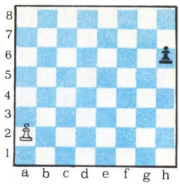
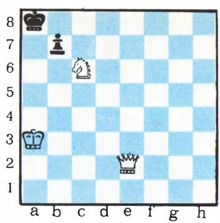
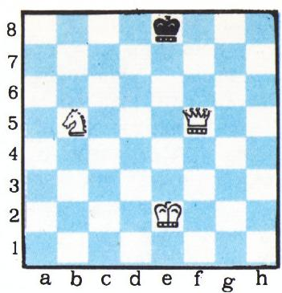
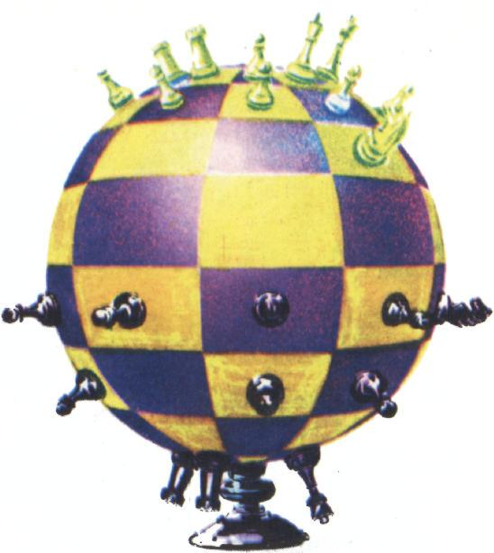
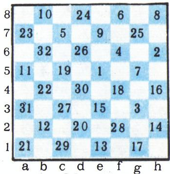

# 棋盘上的数学游戏

> **原标题**：Математические игры на шахматной доске
> **作者**：Е. Я. Гик（Е. Я. 吉克）
> **译自**：Квант 1975, № 4
> **栏目**：Квант для младших школьников（小学）
> **原文**：https://www.kvant.digital/issues/1975/4/gik-matematicheskie_igryi_na_shahmatnoy_doske-31bc5120/
> **主题**：谜题/游戏
> **难度**：★★（内容偏深，适合初中预备；棋类爱好者高年级也可读）
> **译者**：Claude（AI 初译，2026-06）

---

国际象棋这项游戏经过了许多个世纪的演变，规则也一再被修改。可是从数学的角度看，棋子的走法和棋盘的形状其实完全可以是另外一副样子。在长方形棋盘上玩的游戏数不胜数，它们的理论在数学文献里占有相当重要的位置。光是跳棋一类，就已知的就有十多种：俄式跳棋、百格跳棋、拉斯克跳棋（见《Kvant》1970 年第 4 期）、让子跳棋（поддавки）、归角跳棋（уголки）等等。即使是现代国际象棋，也有许多变种。例如，M. 加德纳在《数学谜题与娱乐》（莫斯科《Mir》出版社，1971）一书中就介绍过日本象棋（将棋 sogi）、中国象棋（qiún ki）和朝鲜象棋（tyán keuí）。下面我们就来讲几种棋类游戏和题目（其中都含有数学成分），它们的棋盘或规则和普通国际象棋不一样。

## 谁先「将军」谁赢

这盘棋一切都和真正的国际象棋相同，只是赢家不是第一个把对方「将死」的人，而是第一个喊出「将军」（шах）的人。在通常的初始局面下，白方有强制胜法，而且不超过第 5 步就能取胜：

1. Kb1—c3。威胁下一步把马跳到 e4、d5 或 b5，将军无可避免；黑方只有一个应着：1...e7—e6。接下来走 2. Kc3—e4

Kpe8—e7 后，第二只马也带着决定性的力量投入战斗：3. Kg1—f3 Фd8—e8 4. Kf3—e5，下一手即成将军。

要让这盘棋「活」起来，可以稍微改一改初始局面：例如把白兵从 c2 推到 c3，把黑兵从 c7 推到 c6。这样一来 1. Kc3 就走不成了，上面那个变化也就作废。已经找不到强制取胜的走法了，例如：1. Фb3 d5! 2. Фb4 Фd6! 3. Фa4 Cd7 4. Фh4 Kf6，黑王的防线十分稳固。

## 两步国际象棋

这种棋里，白方和黑方的每一「手」都由两个普通的着法组成。看起来它一点也不比真正的国际象棋简单。可奇怪的是，下面这个不太显眼的事实居然能被证明：在两步国际象棋里，只要双方都走得不差，白方至少能保住一盘和棋。

下面是有些资料里给出的证明。假设相反：双方都走最佳着法时，白方会输。那么走完 1. Kb1—c3—b1 之后，棋盘又回到了初始局面，而轮走权却已经交给了黑方。事实上现在等于换黑方在「下白棋」，按假设就该黑方输了。矛盾！

这个证明并不完全严谨。白方第一手走完，局面的确是重复了，可是处境并不一样！例如：1...Kg8—f6—g8 2. Kb1—c3—b1，此时白方还不能要求判和，而黑方倒可以了——因为 2...Kg8—f6—g8 之后，初始局面在轮到白方走的情况下已经第三次出现。所以不能

<!-- ===== OCR page: p55 ===== -->

认为走完 1. Kb1—c3—b1 之后「黑方就等于在下白棋」——双方的处境并不对等。顺带一提，关于「五十步规则」也能举出类似的例子。

下面给出严格的证明。仍假定双方都走得完美时黑方能赢。我们同时在两块棋盘上下棋。在第一块棋盘上走 1. Kb1—c3—b1，然后把黑方的应着搬到第二块棋盘上，当作白方的着法来下；接着把第二块棋盘上黑方的应着再搬回第一块棋盘当白方下；再把第一块棋盘上黑方的应着搬到第二块棋盘上当白方下，依此类推。按我们的假设，黑方必胜，也就是说一定会到这样一个时刻：在第一块棋盘上，黑方下一步就将死白王了。可是，把这一步照搬到第二块棋盘上当白方走时，被将死的反而成了黑王！然而黑方在第二块棋盘上也是没有走错的呀——矛盾。

数学家会说，上面这个证明是「非构造性」的。我们只证明了白方在两步国际象棋里不会输，却没有说白方到底该怎么走。更有甚者：万一将来发现白方其实有强制取胜的着法（就像「谁先将军谁赢」那样），那么走 1. Kb1—c3—b1 这一手就反而是输棋了！也就是说，我们这套「白方不会输」的证明，完全可能是用一个「输棋之手」来完成的！

## 没有楚茨旺的国际象棋

如果在一盘普通对局里出现这样一种局面：我们怎么走都输，那就叫处于「楚茨旺」（цугцванг，源自德语 Zugzwang，意为「被迫走子之苦」）之中（如果对手怎么走也都输，那就是双方互为楚茨旺）。没有楚茨旺的国际象棋，只是在普通规则上多加了一种着法——「原地不走」的着法（一步「空着」）。在这种棋里永远不会出现楚茨旺，因为随时可以把走子权让给对手。

上面那套「只要走得对，白方保和」的证明，对「没有楚茨旺的国际象棋」也完全成立。不过，跟两步国际象棋不同，在这种棋里想直接把对方将死，是毫无指望的事！要知道，即使在真正的国际象棋里（据统计白方胜算明显更高），也并没有人证明得了：只要白方走得最好，就至少能保和。

莫斯科大学力学数学系的学生们很爱玩下面这种井字棋。在一张形状任意（甚至「无限大」也行）的方格纸上，两人轮流画圈和打叉。

谁先把自己的五个记号连成一条直线（横、竖、斜都行），谁就获胜。和两步国际象棋、没有楚茨旺的国际象棋一样，可以证明：只要先手走得无懈可击，就不会输。当然，这里的证明比国际象棋那两种要难一些。

## 让子跳棋（поддавки）

这种玩法在跳棋里更流行，不过它的国际象棋版本也很有意思。这里的赢家是能把己方所有棋子都送出去（被吃掉）的人。吃子是强制性的（连王也得在被吃时被吃），如果有多种吃法可选，则由吃子方任选。顺带一提，国际象棋特级大师 D. 布龙斯坦下起「象棋让子棋」来，丝毫不亚于他下真正的国际象棋。

让子棋的理论相当别致，和普通国际象棋的规律截然不同。我们来看一个最简单的残局（图 1）。盘上只有两只兵，可你瞧这局面里藏着多少门道。1. a2—a3！注意不能走 1. a4，因为白兵必须比黑兵晚一些变后。1...h6—h5 2. a3—a4 h5—h4。3. a4—a5 h4—h3 4. a5—a6 h3—h2 5. a6—a7 h2—h1Л！注意是变成车（Л＝Ладья），因为黑兵若是变后、变象或变马，白方就能放上一只后并立刻（或下一手）把它送掉。6. a7—a8C！！只能变象（C＝Слон），否则黑方很容易把自己的车送出去。此后无论黑车怎么走，

<!-- ===== OCR page: p56 ===== -->

都接 7. Ca8—h1！，白方就把象送出去了。

下面这两个图（图 2）画的是一只马在 $4 \times 4 \times 4$ 立体棋盘所有格子上的巡回路线，每个格子上标着马走到该格的步数（请按四个水平层依次阅读，从上层到下层）：

$$
\begin{array}{c c c c} \hline 5 7 & 3 0 & 4 7 & 3 6 \\ \hline 4 8 & 3 3 & 5 8 & 3 1 \\ \hline 2 9 & 6 0 & 3 5 & 4 6 \\ \hline 3 4 & 4 5 & 3 2 & 5 9 \\ \hline \end{array}
$$

$$
\begin{array}{c c c c} \hline 4 2 & 3 7 & 5 6 & 5 1 \\ \hline 5 5 & 5 2 & 4 3 & 4 0 \\ \hline 3 8 & 4 1 & 5 0 & 5 3 \\ \hline 4 9 & 5 4 & 3 9 & 4 4 \\ \hline \end{array}
$$

$$
\begin{array}{c c c c} \hline 2 7 & 6 2 & 1 5 & 2 \\ \hline 1 4 & \text{   ♡   } ^ {1} & 2 6 & 6 3 \\ \hline 6 1 & 2 8 & 3 & 1 6 \\ \hline 4 & 1 3 & 6 4 & 2 5 \\ \hline \end{array}
$$

图 2：马在 $4 \times 4 \times 4$ 立体棋盘上经过全部格子的巡回路线。

请大家自己来评价一个让子棋的残局，并解一道棋题。

**练习 1**. 白方有一只兵在 d7，黑方有一只马在 f5（盘上无其他棋子）。这盘让子棋的结局如何：

a) 轮到白方走时；

b) 轮到黑方走时？

**练习 2**（H. 克吕弗、K. 法贝尔）. 白王在 f3，黑方有两枚棋子——王在 d7、后在 c8。白方先走，并且白方「输」（即在让子棋里获胜）。

## 长方形棋盘上的国际象棋

只要换成 $m \times n$ 的长方形棋盘（m 和 n 取各种值），就能衍生出许许多多的游戏和题目。绝大多数已知的「棋盘数学」问题与谜题——关于棋子走法、巡回路线、布子方式、棋子威力——都不难搬到这样的棋盘上去（见《Kvant》1971 年第 8、10 期；1973 年第 1 期；1974 年第 6 期）。还可以在「无限大」的棋盘上和「射影」棋盘上下棋（见《Kvant》1974 年第 3 期）。所有这些棋盘，连同我们熟悉的棋盘一样，都是平面的。

## 立体国际象棋

这种棋下在一块三维棋盘上：棋盘是一个 $m \times n \times k$ 的长方体，它的一块块小立方体就是棋盘的格子。

有一道欧拉研究过的著名题目：让马走遍 $8 \times 8$ 棋盘上每一格，每格只到一次（见《Kvant》1971 年第 9 期）。我们来看一道类似的、放在立体棋盘上的题：让马走遍 $4 \times 4 \times 4$ 立体棋盘的全部 64 个格子（和普通棋盘格子数相同），每格只到一次。

这块棋盘可以方便地看成四层水平叠放的正方形。图 2 画的就是这四层各自「表面」的样子，并给四层编了号。要找到所求的巡回路线，只需给出这样一种编号：相邻编号的两个小立方体之间恰好相隔「一步马」。这样的编号是存在的，就画在图 2 里。

**练习 3**. 在 $8 \times 8 \times 8$ 立体棋盘的「表面」上找出一条马的巡回路线。这里马实际上是在六块平面棋盘上移动。这道题的主要难点，在于把六条普通的巡回路线在「接缝」处衔接起来；用立方体的展开图来求解会很方便。

## 圆柱国际象棋

把一块普通棋盘卷起来，原则上可以做出两种圆柱形棋盘（另见《Kvant》1970 年第 5 期、1971 年第 8 期）。把「a」列和「h」列粘在一起，就得到「竖直圆柱棋盘」；把第 1 行和第 8 行粘在一起，就得到「水平圆柱棋盘」。

<!-- ===== OCR page: p57 ===== -->

| 10 | 7 | 22 | 17 |
|----|----|----|-----|
| 21 | 18 | 9 | 6 |
| 8 | 11 | 20 | 23 |
| 19 | 24 | 5 | 12 |

换成圆柱棋盘后，有些在普通棋盘上有解的题目就解不出来了。例如那道高斯研究过的「八后问题」：在普通棋盘上有 92 个解，而在圆柱棋盘上一个解都没有！

**练习 4**. 证明：在圆柱棋盘上，无法摆上八只后而使它们互不威胁。

图 3 同时画出了三道题的初始局面：普通棋盘、两种圆柱棋盘各有各的解法：

a) 在普通棋盘上：1. Фe2—e8 将死；

b) 在竖直圆柱上：1. Фe8 只是将军，因为有 1...Kpa8—h7！的应着；真正能将死的是 1. Фe2—g8（白后沿 e2—a6—h7—g8 这条路线绕了过去）；

c) 在水平圆柱上：1. Фe8+ 同样没用，因为有 1...Kpa8—a1！的应着；能将死的是 1. Фe2—a2！

## 环面国际象棋

把普通棋盘的两对对边都粘在一起，就得到「环面（torus，像甜甜圈那样的曲面）棋盘」。

我们来解图 4 上的那道题。走完 1. Фf5—h7！之后，黑方有两种应法：

a) 1...Kpe8—f8（d1、e1、f1 三格由白王从 e2 控制——因为在环面上水平圆柱的规则同时生效！）2. Фh7—g6 Kpf8—e7 3. Kpe2—e1 Kpe7—d7（此时白王从 e1 控制了 d8 和 f8）4. Фg6—e8 将死！

b) 1...Kpe8—d8 2. Фh7—c7+ Kpd3—e8 3. Kb5—h6！（这只马在环面上像在竖直圆柱上一样地走）3...Kpe8—f8 4. Фc7—e1 将死！（f7 和 g8 由白马控制，其余各格由后控制）。

## 千奇百怪的棋盘

由普通棋盘经过几何变换得到的棋盘，还可以举出许多种。有多维棋盘，有「二对二」对弈用的棋盘（在这上面下所谓「四国象棋」），还有「三人对弈」的棋盘（这里获胜者是吃掉另外两方两只王的人）。

也可以同时在两块平行的棋盘上下棋——每块棋盘上都用普通规则，此外棋子还可以像乘电梯一样从一块棋盘走到另一块上去。如果在粘合棋盘时把它拧半圈，那么得到的就不再是圆柱，而是「莫比乌斯带」了！在莫比乌斯带上，一只棋子走一步就可能回到原来那格——只不过是另一面！

图 5 画的是一块非常有趣的棋盘，它曾在法国先锋派艺术展上展出过！

<!-- ===== OCR page: p58 ===== -->

## 童话棋

在国际象棋排局里，把那些规则奇特、棋盘非标准、棋子非同寻常的题目和游戏，归入「童话（或幻想）象棋」这一门类。我们已经讲过几种在奇形怪状棋盘上下「童话棋」的游戏。下面再来讲几种最受欢迎的「童话棋子」。

把车（Ладья）、象（Слон）、马（Конь）的普通走法组合起来，就能得到一批童话角色。一共有四种组合：车＋象（这就是后）；车＋马（称为「宰相」канцлер）；象＋马（称为「半人马」кентавр）；车＋象＋马（称为「玛哈拉贾」магараджа，或「亚马孙女战士」амазонка）。

玛哈拉贾威力极大，远胜于后（请用《Kvant》1974 年第 6 期介绍的方法试着算一算玛哈拉贾的实力）。有一种很流行的游戏就和玛哈拉贾有关。

一方拿一整套摆在初始位置的棋子，另一方只拿一只玛哈拉贾，把它放在任意一格上。如果玛哈拉贾被吃掉，玛哈拉贾一方就输；如果它将死了对方的王，玛哈拉贾一方就赢。

这种棋里禁止兵升变，否则取胜就太容易了——只要把两只边兵都推进升变成后，三只后加两只车就能轻松围歼玛哈拉贾。在加了这条限制后，玛哈拉贾会顽强抵抗，没经验的玩家还可能输给它。尽管如此，拿整套棋子的一方仍然有强制取胜之法。M. 加德纳在《数学小说》（莫斯科《Mir》出版社，1974）一书中给出了一个 25 步围歼玛哈拉贾的方案。不过，至少能提前 10 步就达到目的。

不管玛哈拉贾怎么走，白方连走下列 14 步：a4、h4、Ла3、Лh3、Kc3、Kf3、Лb3、Лg3、d4、Фd3、Фe4、Лb7、Фd5、Лg8（容易看出，在此期间玛哈拉贾不可能吃掉任何一只白棋，也不可能将死白王）。此时玛哈拉贾只剩下两个安全格子——a6 和 f6。在前一种情况下，它死于 15. Cg5；在后一种情况下，死于 15. e4。你能把这个纪录改得更好吗？

**练习 5**. 在 $10 \times 10$ 的棋盘上摆 10 只玛哈拉贾，使它们互不吃掉（在更小的棋盘上是必定办不到的）。

## 童话马

选取 $a$、$b$ 的不同数值，从「广义马 $(a, b)$」就能得到各种童话棋子。这种马沿一个方向走 $a$ 格、再沿垂直方向走 $b$ 格。普通马是 $a=1,\ b=2$。

$(1,3)$ 叫作「骆驼」，$(1,4)$ 叫作「长颈鹿」，$(2,3)$ 叫作「斑马」。若 $a$、$b$ 中有一个为 0，得到的就是「走固定格数」的车；若 $a=b$，得到的就是具有相应性质的象。

<!-- ===== OCR page: p59 ===== -->

一手里连跳好几个「马步」的，则冠以「骑士」的头衔。M268 题（见《Kvant》1974 年第 6 期）就是一道有趣的游戏题：双方共用同一只棋子，一方按普通马走（每手两步），另一方按骆驼走。结果马竟然比骆驼更狡猾！

涉及童话棋子的数学游戏和题目还有很多，上面提到的那些主题（巡回、布子、棋子威力等等）都能轻松搬到这类棋子上来。

## 象跳棋（Шашматы）

这种棋是国际象棋和跳棋的混血儿，由美国数学家 S. 戈洛姆（Golomb）发明，他在我国更以「多联骨牌」（полимино）游戏闻名。象跳棋用的是国际象棋的棋子，但只能在黑格里下（像跳棋那样）。普通马在这里一步也走不了（它一迈腿就落到了被禁用的白格上），于是改用「骆驼」——也就是 $(1,3)$ 马——来代替，因为骆驼不改变所站格子的颜色。

图 6 给出了骆驼在象跳棋棋盘所有格子上的一条闭合巡回路线。我们知道，在普通国际象棋棋盘上最多能摆 32 只互不威胁的马（把它们全摆在白格或全摆在黑格上即可）。在象跳棋棋盘上，「和平共处」的骆驼最多能有 16 只，也就是说它们也能占满棋盘的一半。可以把骆驼摆在图 6 中编号全是偶数或全是奇数的格子上。这样一来，这张图就同时给出了象跳棋棋盘上两道题的答案。关于象跳棋更详细的介绍（包括开局前的布子方式），可以参看 M. 加德纳上述两本书中的第二本。

最后再讲几种「什么都不像」的童话棋子。**蚱蜢**（сверчок）像后一样走，但要跳过己方或对方的棋子，落在被跳过的棋子紧后方。**狮子**（лев）则不同：它落在被跳过棋子后方任意一个空格上。还有**中立棋子**，白方和黑方都可以走它。**突击型棋子**只允许走「带吃子」的着法。突击马叫**河马**（гиппопотам），突击后叫**恐龙**（динозавр）。**外交官**自己不会走，但也不能被吃；更要命的是，外交官身边的己方棋子也是碰不得的！而**神风敢死队**（камикадзе，自杀者）一旦吃子，就跟着被吃掉的棋子一起从盘上消失！

讲到现在说的都是棋子。其实兵也有很多变种。**变色龙兵**在吃掉对方棋子的同时，变成和被吃棋子同样种类、但是己方颜色的棋子。**超级兵**沿直线可走任意格数、沿斜线也可吃任意格数。**出租车兵**既能前进也能后退。最后，在每盘棋里可以允许一只兵升变成「**原子弹**」。这件武器一出场就可以放到棋盘任意一格，并以 $r$ 格为半径（$r$ 的数值事先约定）把周围一切全部炸毁。

