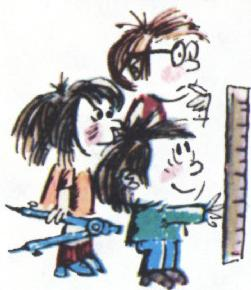
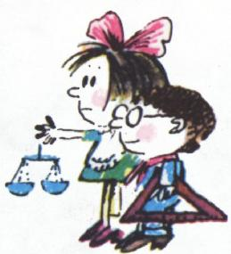
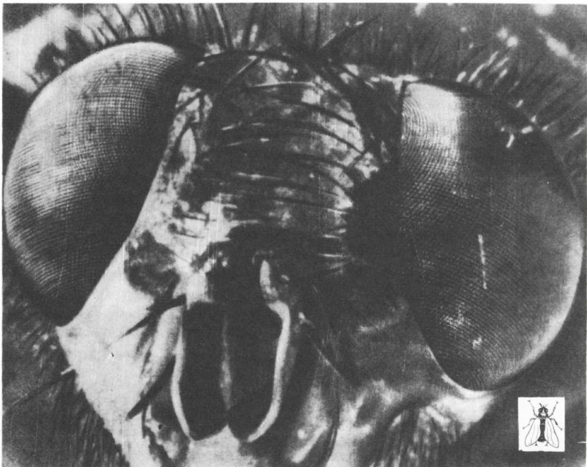
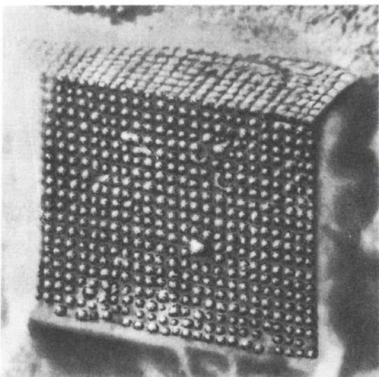
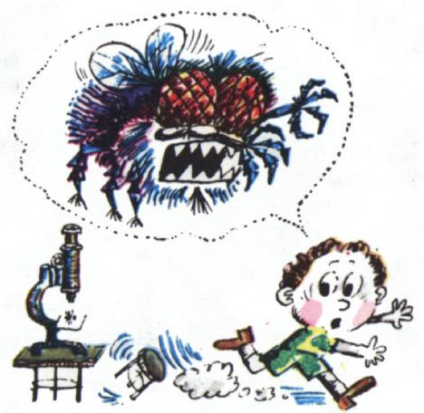

# 怎样测量分子？

> **原标题**：Как измерить молекулу?
> **作者**：Н. А. Родина（罗金娜）
> **译自**：Квант 1974, № 6
> **栏目**：Квант для младших школьников（小学）
> **原文**：https://www.kvant.digital/issues/1974/6/rodina-kak_izmerit_molekulu-e9fb221f/
> **主题**：物理（分子动理论、分子大小的测量）
> **难度**：★★（小学高年级在指导下可读；内容偏深）
> **译者**：Claude（AI 初译，2026-06）

---

<!-- ===== OCR page: p57 ===== -->

# Н. А. 罗金娜

关于分子，我们最基本的知识可以用几句很简单的话来概括：

1. 一切物体都由极小的微粒——原子和分子——组成。

2. 原子和分子处于永不停息的运动之中。这种运动是永恒的，在任何条件下都不会停止。

3. 一切物体的分子之间都会彼此作用。在不同物质里，这种作用各不相同，既取决于分子的种类，也取决于分子之间的距离。

这三条，就叫做**分子动理论的基本观点**。

在科学中，恐怕很少有哪些知识领域，能像关于分子的知识这样，拥有如此悠久、又如此丰硕的发展史。早在公元前 12 世纪的古文献里，就能找到关于物质微粒的记载。这就是说，这些知识的积累，前后已经有 32 个世纪，也就是 3200 年了！许多伟大的科学家都为分子动理论的建立付出了辛勤的劳动。到了今天，人们对分子的结构和它的行为，已经研究得相当透彻，甚至能够「改造」分子，制造出性质事先设计好的物质。人们已经造出了人造红宝石、人造橡胶、塑料、药品和维生素。你们也许读到过，从前要得到这些天然物质有多么不容易：红宝石要从地底下开采出来，橡胶要从热带树木的汁液里一点一点收集，而塑料，古人压根儿就不知道。

所以，分子已经被研究得很好了，而且直到今天仍在继续研究。不仅如此，现代物理学发展的几个主要方向，都离不开关于物质结构的知识。这一点，凡是将来打算学习物理学的小朋友，都应该记在心里。

我们这篇关于分子的故事，就专门讲一讲：**怎样测出分子的大小**。

那么，这些尺寸到底有多小，能不能在脑海里想象出来呢？比方说，空气分子之间的距离，大约是分子本身直径的 10 倍——你能用手指比划出这段距离来吗？

分子的大小，已经在许多实验中被测定。下面我们讲其中一个实验：大约 60 年前，英国科学家罗伯特·瑞利（Рэлей）做过这个实验。

在一个洗得很干净的大容器里倒满水，在水面上滴一滴橄榄油。这滴油在水面上摊开，形成了一层圆形的薄膜。起初，薄膜的面积一点一点变大；可后来，摊开的过程停止了，面积也不再变化。瑞利猜想：这时候分子已经排成了一层，也就是说，薄膜的厚度正好等于一个分子的尺寸——

<!-- ===== OCR page: p58 ===== -->

图 1

于是他决定去测出这层薄膜的厚度。当然，这里要考虑到：薄膜的体积，就等于原先那一滴油的体积。

根据瑞利实验得到的数据，我们来算一算薄膜的厚度，看看油分子的线度（「直径」那样的长度）到底等于多少。这滴油的体积是 $0{,}0009\ \text{см}^3$，而它摊成的薄膜面积是 $5500\ \text{см}^2$。于是薄膜的厚度为

$$
d = \dfrac{V}{S} = \dfrac{0{,}0009}{5500}\ \text{см} = 0{,}00000016\ \text{см}.
$$

在瑞利的实验里，这滴油的体积，是先称出它的质量、再除以油的密度得到的。这滴油的质量是 $0{,}0008\ \text{г}$，油的密度是 $0{,}9\ \text{г/см}^3$。请你根据这些数据，自己算一算这滴油的体积。

许许多多的实验都表明，不同物质的分子，大小是不同的。但是，当人们想要（粗略地）估计分子的直径时（假设分子是一个个小球），通常取这样一个数：$0{,}00000001\ \text{см}$。\*)

这么小的尺寸，你能想象得出来吗？

请看图 1——那是一张在很大放大倍数下拍摄的、普通家蝇头部的照片。在头的两侧，你能看到苍蝇的眼睛；它们由许许多多小单元组成，这些小单元叫做「小眼面」（фасетка）。照片上每个小眼面的直径大约是 $1\ \text{мм}$。再看一眼这张照片旁边的、按真实大小画出来的苍蝇：它的整只眼睛，直径还不到一毫米。

<!-- ===== OCR page: p59 ===== -->

现在请你努力想象一下，每个小眼面到底有多大。要知道——一个分子，比这样的一个小眼面，还要小大约 100 000 倍呢！

当然，这么小的微粒，肉眼是看不见的。那么，显微镜底下能看见吗？要看见它，显微镜得放大多少倍才行？

一滴直径为 $0{,}5\ \text{см}$ 的水滴，如果放大 2000 倍，它的尺寸就和一间教室差不多大了；可即便到了这个份上，你仍然分辨不出其中一个个单独的分子。要是再放大 2000 倍，这滴水在直径上就有 20 公里那么宽，它那「颗粒状」的结构，才开始隐隐约约地显露在我们眼前。可是，要想最终看清水分子本身的结构，还得再放大 250 倍才行。然而……这样大的放大倍数（总共 $10^{9}$ 倍，也就是十亿倍）是做不到的。

如今，借助一些专门的显微镜（电子显微镜），人们已经能够拍到这样的照片：在照片上可以分辨出一个一个的分子，不过能分辨出来的，只是那些比水分子大得多的分子。

在图 2 的照片上，你们看到的是蛋白质的分子，它们的直径大约是水分子的 100 倍。已知这张照片的放大倍数是 73 000 倍，请你粗略地估算一下：蛋白质分子的直径大约是多少？

最后，我们建议你们亲自动手做一做这个测量油分子大小的实验。当然，重复瑞利的实验并不容易，因为它需要一种特别的油，还需要做很精确的测量。可是，还是请你们试一试吧！你的奖赏将是：你亲手测出了一个量，它的大小，已经可以和分子的大小相比较了。

做这个实验，用干净的机油很方便。先测出一滴这种油的体积。请你自己动动脑筋：怎样用一支滴管（也叫「滴瓶」）和一个量筒（也可以用那种量药水的小量杯）来做到这件事。

图 2

在一个盘子里倒上水，在水面上（当然，还是用同一支滴管！）滴一滴油。等油滴摊开以后，把一把尺子横搁在盘子边上，量出油膜的直径。如果薄膜的形状不是圆的，那你就再等一等，等到它变成圆形；不然的话，就多量几次，求出它的平均直径。然后，算出薄膜的面积，再算出它的厚度。你算出来的是多少？它比油分子的尺寸（$0{,}0000002\ \text{см}$）大多少倍呢？

---

> **译注**：
>
> - 文中数值按俄文习惯用逗号作小数点（如 $0{,}0009$），即中文的 $0.0009$；长度单位 см=厘米，мм=毫米，г=克，см³=立方厘米。
> - 文末标 \*) 的「$0{,}00000001\ \text{см}$」，即 $10^{-8}\ \text{см}=10^{-10}\ \text{м}$，这就是常用的「一个埃」（1 Å）的数量级——分子直径大约在 $10^{-10}$ 米这个量级。
> - 俄文原文最后一段还有一个练习性的提问：把量出的薄膜厚度与 $0{,}0000002\ \text{см}$ 比较——这个数和正文中算出的 $0{,}00000016\ \text{см}$ 同一量级，二者略有差异是正常的（不同实验、不同油种）。

> **OCR 修正说明**：原文公式中 `c m`（空格分隔）实为 `см`（厘米）的 OCR 误识；`єе` 为 `её`（她的）的 OCR 误识；正文中算式 `0, 0 0 0 0 0 0 1 6` 数字间多余空格为 OCR 噪声，已按 $0{,}00000016$ 还原。文中无邻页无关内容串入。
