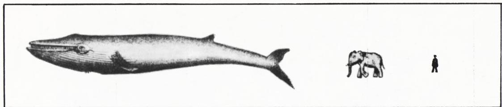
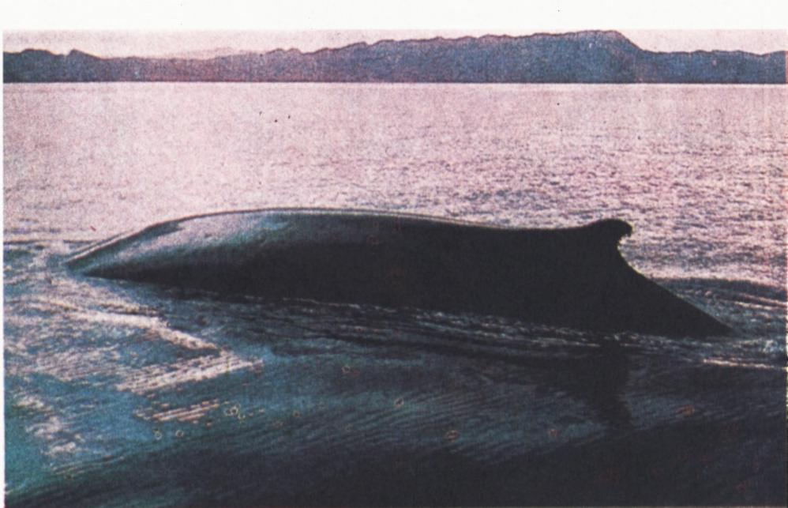

# 阿基米德浮力与鲸

> **原标题**：Архимедова сила и киты
> **作者**：Н. Родина（罗季娜）
> **译自**：Квант 1982, № 8
> **栏目**：Квант для младших школьников（小学）
> **原文**：https://www.kvant.digital/issues/1982/8/rodina-arhimedova_sila_i_kityi-9bdc238c/
> **主题**：物理（浮力）
> **难度**：★★（小学高年级可读，部分计算偏深）
> **译者**：Claude（AI 初译，2026-06）

---

Н. 罗季娜

## 阿基米德浮力与鲸

在陆地上，鹅给人的印象是一种慢吞吞、笨手笨脚的鸟。"红脚的鹅沉甸甸……"——普希金就是这样写的，他用"沉甸甸"这个很传神的词来形容这只鸟。可是一进水里，鹅就游了起来……这时我们看到的，已经是一只轻盈、优雅的鸟，又快又自如地活动。哪怕只是一阵微风，也能改变它游动的速度。为什么会有这样的变化呢？

物体在水中的这些特别表现，和水里**摩擦力很小**、又有一种把它往上托的**浮力**（也叫阿基米德力）有关。

把一块软木塞（或塑料瓶盖）放在桌上，从侧面吹它，它一动不动。再把软木塞放到水面上——轻轻一吹，它就漂走了。你一定会发现：水里的摩擦力，比固体之间的摩擦力小得多。

而软木塞能浮在水面上，是因为有两个方向相反的力同时作用在它身上，而且彼此相等：一个是**重力**，一个是**浮力**。

地球上最大的动物——鲸——它的身体简直是为水中生活"量身打造"的。鲸目动物里个头最大的，是蓝鲸。一头蓝鲸的体重可以大到 130 吨，但它在水里能跑出每小时 20 海里（"节"）的速度。

> **译者注**：1 节 = 1 海里/小时；1 海里 = 1.852 千米，所以 1 节 ≈ 1.852 千米/小时。拿来比一比：MKM 型摩托艇最高时速约 30 千米/小时，差不多就是 16 节。

抹香鲸体重约 60 吨，却能从水里一跃而起，腾出水面好几米高。

关于这些海洋动物的许多行为，我们都可以用物理学里的定律和概念来解释。不过，先来认识一些关于鲸的数据。著名的海洋探险家、法国科学家雅克-伊夫·库斯托（水肺——也就是"水肺潜水器"——就是他发明的）在他的《海洋的强大主宰》一书中写道：

> "很难形容一个人第一次在水中遇见鲸时的感受……首先让你震撼的是它的体型。那超过了人们在动物世界里见惯的一切，也超过了人们的想象。"

图 1。

图 1 让我们直观地看到，蓝鲸比大象和人各大了多少倍。这种鲸的体长可达 33 米，比一节客运车厢还长出近 10 米！（难怪俄罗斯童话里会有"奇迹鱼鲸"这种说法，说它的背上能坐下一整座村庄。）

鲸的体重我们已经说过了。人们捕到的最大的一头鲸，重达 150 000 千克；而最大的陆生动物——大象——体重在 3 000 到 6 000 千克之间（这差不多只相当于某些鲸的舌头那么重！）。有人算过：如果大象的体重再大一倍，它的腿就得加粗一倍——而大象现在的腿，每条腿底面积已经达到 4 平方分米了。（想一想，并解释一下：为什么陆生动物需要这么粗的腿？）

一个物体能浮在水里，是因为作用在它身上的浮力和重力彼此相等。让我们来算一算作用在鲸身上的浮力，再和它的重力比一比。

浮力等于被浸入物体排开的液体所受的重力，也就是

$$
F _ {\mathrm{A}} = g \, \varrho_{\text{ж}} \, V,
$$

其中 $g \approx 10$ 牛/千克，$\varrho_{\text{ж}}$ 是液体的密度，$V$ 是物体的体积。鲸的体积怎么算呢？我们这样办：把鲸的身体看作一个圆柱体。那么体积就等于 $V=\pi d^{2}h/4$，其中 $d$ 是圆柱的直径，$h$ 是它的高。在我们这里，"高" $h$ 就是鲸的身长。那么，我们这头"圆柱鲸"的直径是多少呢？我们把它当作鲸身体的平均直径。这个平均直径，可以用图 1 来估一估：在图上量好几处——比如十处——鲸身的直径，量头部、量尾部、量中部……把这些测量值取算术平均，就当作鲸的直径。不过别忘了，图 1 是按一定比例画的：图上鲸的长度约 $7.5$ 厘米，而实际身长是 30 米，所以图的比例尺是 1:400。

请你接着把剩下的计算做完，你就会发现：把鲸托在水里的浮力，要用几百万牛顿来计数。（当然，这种估算是非常粗略的，没法精确说出到底有多少牛顿；但可以肯定，这个数在一百万到一千万牛顿之间。）难怪这样大的力，能稳稳托住几百吨重的身体——蓝鲸就是这么重。鲸在水里几乎是"没有重量"的，因为作用在它身上的重力同样要用几百万牛顿来计数（要算重力，就把 $9.8$ 牛/千克乘上鲸的质量）。

当然，鲸是没法待在陆地上的。有过这样的情况：鲸出于某些至今还没完全弄清的原因，会冲上海岸。这时，巨大的重力（超过一百万牛顿）把它的身体死死压向地面。鲸的骨架承受不住这么重的份量；它甚至连呼吸都做不到——因为要吸一口气，它就得扩张肺、抬起围在胸腔周围的肌肉，而在空气中，这些肌肉重达几万牛顿。

图 2。

库斯托写道：

> "……在陆地上，巨人们面对着无法解决的难题……呼吸要费极大的力气……在陆地上，鲸的骨架撑不住肌肉和脂肪层的重量；而在密度大的水环境里，骨架却能出色地为鲸服务。"

有一次考察中，库斯托和他的伙伴们试图救一头搁浅的小鲸，它的体重"只不过"两吨。为了把它抬上船，不得不使用一种特制的吊带，因为即使是刚出生的小鲸，如果身下没有均匀的支撑，也会在自身的重力下"被压断"。

图 2 是一头在水里睡觉的鲸的照片。它并没有完全泡在水里。这就是说，作用在它身上的浮力，应该比完全浸没时小（毕竟浮力等于鲸所排开的水所受的重力）。可是重力没变。看起来，平衡应该被打破才对。然而鲸在水面上睡得很安稳，并不下沉。可见，浮力和重力依然彼此相等。怎么解释这个看似矛盾的现象呢？

现在正好讲一讲，鲸是怎样下潜、又怎样浮上来的。

鲸的尾鳍是水平展开的，它能发出高达 500 马力的功率。

> **译者注**：1 马力 ≈ 736 瓦。拿来比一比：这差不多是 AN-2 飞机发动机功率的一半，却是 DT-75 拖拉机发动机功率的七倍。

当一头游动的鲸用身体蹭到一个潜水员时，"那感觉就像被一列飞驰的火车头撞了一下"。

鲸用尾巴有力地一摆，把自己的身体送进海洋深处——它下潜了。下潜的深度可达几十米，而抹香鲸能潜到 1 000—1 200 米深。在那么深的地方，水的压强非常大（请你来算一算，记住海水的密度是 $1030$ 千克/米³）。鲸的肺在这个压强下被压缩到所谓的"余气量"。以人为例：在 60 米深处，那里的压强是大气压的 4 倍，肺的体积会缩小到原来的四分之一——从水面上的 6 升缩到 1.5 升；也就是说，对人的肺来说，60 米深处的"余气量"是 1.5 升。肺一被压缩，鲸身体的体积就变小，于是——

——浮力也随之变小。

当鲸从深处浮向水面时，浮力会稍稍变大（为什么？）。一出水面，鲸就吸进空气，身体的体积变大；于是浮力也变大。此时与重力相平衡的浮力，和在液体内部游泳时作用在鲸身上的浮力一样大；可现在，鲸要想获得同样大的浮力，已经不必完全没入水中了——因为它的体积变大了。所以：吸入空气后，鲸身体体积增大到这样的程度，以至于它再也不用整个儿泡进水里，就能让排开的水所受的重力等于作用在自己身上的重力。

顺着这个思路，请你想一想下面这道题。已知鲸有时会游进楚科奇半岛沿岸一些被大大淡化了的潟湖里。假设图 2 照片里那头鲸游进了淡水里。如果除了水的成分以外，其他条件都不变，那么在这种情况下，鲸在水里的位置会发生什么变化？

最后，作为这篇故事的结尾，再问几个问题。

如果把鲸的质量除以它的体积，我们就得到它身体的平均密度。能不能说：无论鲸在哪里游——在海洋深处、在中间水层、还是在水面——它身体的平均密度总是等于水的密度？平均密度的变化，靠的是什么？

为了观察和拍摄鲸，人们用过一种热气球，靠燃气炉把空气加热来充气。为什么这种气球（蒙哥尔菲叶气球）能升到空中？

随着气球升高，人们调节燃气炉的火焰，结果发现气球可以在空中达到平衡：在无风的天气里，它能长时间地悬停在海上同一点的正上方。在这种情况下，被气球排开的空气的质量，和气球本身连同观察者的质量之间，是什么关系呢？

请试着解释库斯托观察到的这样一个现象：

> "……前方的水冒起了泡，像汽水一样。那是一群小鱼，一会儿钻进深处，一会儿又浮上水面，从鱼鳔里放出空气。"

小鱼们为什么要从鱼鳔里放出空气？它们又是在什么时候放——是钻下去的时候，还是浮上来的时候？

---

「Квант」微笑

## 大学生的词典

在学生用的词汇里，有不少是"外国出身"。它们的"祖先"曾经在哪种语言里生活过，又是什么意思呢？

这类词当中，大多数是"罗马人"（来自拉丁语）。下面是它们祖先的字面翻译：

- Абитуриент（报考者）——"该走的人"。
- Аспирант（研究生）——"孜孜以求的人"。
- Аудитория（教室/听众）——"听"。
- Декан（系主任）——"十夫长"。
- Интуиция（直觉）——"仔细端详"。
- Конспект（提纲）——"概览"。
- Курс（课程）——"奔跑"。
- Студент（学生）——"用功的人"。
- Семинар（课堂讨论）——"苗圃"。
- Сессия（考期）——"坐着"。
- Факультет（系/学院）——"可能性"。
- Экзамен（考试）——"称重量"。

至于 стипендия（奖学金）这个词，因为它深受同学们的喜爱，值得我们单独说一说。最早发放 stipendium（薪饷）的是罗马共和国，时在公元前 406 年，那时是给出征的士兵发饷银。可以想象，罗马的战士们对它也是喜爱有加——因为在那之前，他们出征都得"自掏腰包"。

有几个词更古老，来自希腊语。首先是 диплом（毕业文凭）——本义是"对折起来的纸"；还有 кафедра（教研室/讲席）——在那个遥远的年代，它不过是一把"椅子"。

最后还有一个挺年轻的、来自波兰语的词：шпаргалки（小抄）——本义是"没用的、写满了字的纸片"。这一点就让人看不懂了。要知道，如果在"称重量"（考试）的关键时刻，这样一张纸片恰好被发现，它确实能让日子好过得多，也让人离拿到那张"对折起来的纸"（毕业文凭）更近一步。

附注。但凡有点文化的人，借助上面这个词典，都不难明白：

- Деканат（系办公室）——"十夫长的办公室"。
- Первокурсник（大一新生）——"头一回跑腿的人"。
- Заведующий кафедрой（教研室主任）——"椅子主管"。

欢迎读者把这个清单继续写下去。（摘自莫斯科物理技术学院院报《为了科学》）

---

> **译者说明**：原文 OCR 中混入了一段《小学经典》栏目之外的内容——文末的「Квант улыбается / Словарь студента」（"Квант 微笑·大学生的词典"）。该段在原页（p53）紧接本文之后排版，与本文主题（浮力与鲸）无关。鉴于任务卡要求"完整翻译不跳节"，且该段与本文同页、属于同一页面 OCR 产物，已一并译出附于文末，以备查考；如需严格剔除"非本文"内容，可删去"「Квант」微笑"小节及之后全部内容。
