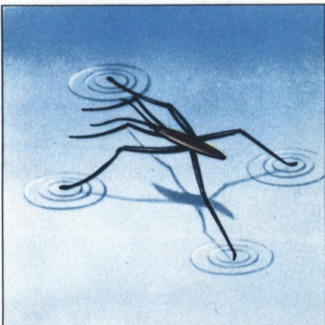
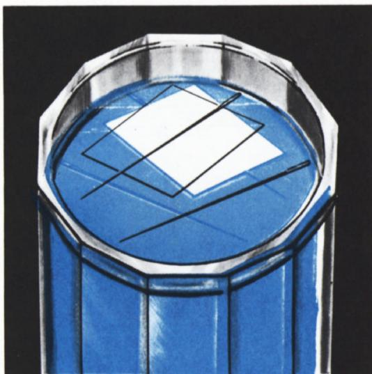
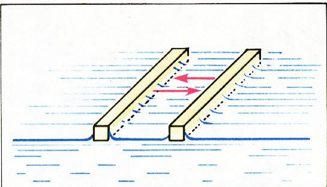
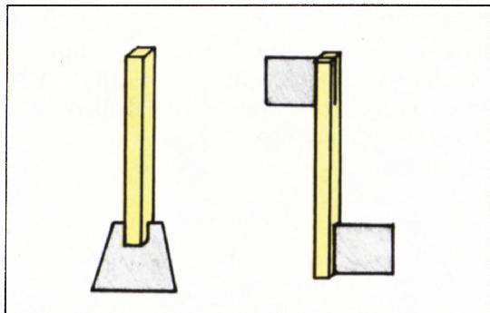
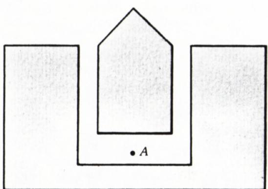
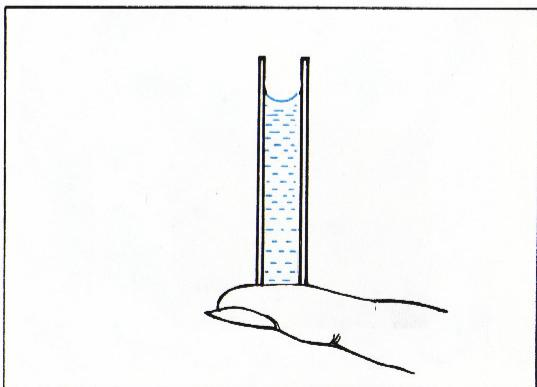
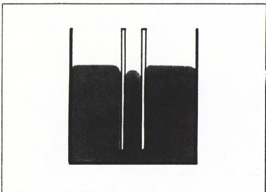

# 能用筛子提水吗？

> **原标题**：Можно ли носить воду в решете?
> **作者**：А. А. Дозоров（A. A. 多佐罗夫）
> **译自**：Квант 1979, № 10
> **栏目**：Квант для младших школьников（小学）
> **原文**：https://www.kvant.digital/issues/1979/10/dozorov-mozhno_li_nosit_vodu_v_reshete-a7a43f66/
> **主题**：物理（表面张力、毛细现象、润湿）
> **难度**：★★（小学高年级在家长或老师协助下可做实验；原理部分略深）
> **译者**：Claude（AI 初译，2026-06）

---

有一次我们带了一只煤油炉，但从那以后再也不带了！整整一个星期，我们仿佛都住在一间煤油铺子里。煤油渗得到处都是。我从没见过有什么东西能像煤油这样到处渗。我们把它放在船头，它就从那儿一直渗到船尾的舵柄，浸透了整条船和船上所有的东西。它漫到了整条河面，霸占了整个景色，还把空气都熏坏了。

—— 杰罗姆·K·杰罗姆《三人同舟，不算狗》。

> **译者注**：杰罗姆·K·杰罗姆（1859—1927）是英国幽默作家。这段引文出自他的代表作《三人同舟》。文中的"水黾（mǐn）"等小生物，正是本文要讲的主角。

还记得那只急急忙忙赶回家的小蚂蚁的故事吗？很多朋友都帮过它。比如，水黾就帮它过了河。水黾是一种昆虫，你多半见过它好多次。水黾能稳稳当当地站在水面上，不沉下去（图 1）。不过你要是仔细看，会发现它脚下的水面被微微压凹了下去。

那么，这只昆虫为什么不会沉呢？
水，真的会被压凹吗？

原来，这一切都跟液体的**表面层**有关。这一层有许多奇特的性质。只要做几个非常简单的实验，你就能亲自体会到。

## 1. 让针浮在水面

在盘子里倒一点水。拿一根针（细一点的更好），小心地把它平放到水面上——针不会沉（图 2）。如果第一次没成功，别灰心。用手指捋一捋针（也可以薄薄地抹一点油，更妙的办法是用针蹭一蹭蜡烛），再做一遍。

顺着水面看过去。看到针旁边的水面是弯的吗？看起来，针就像躺在一层薄膜上。

这个比方其实打得不错。液体的表面层确实有点像一张绷紧的、有弹性的薄膜（虽然表面层有这些特殊性质的原因，跟真正的薄膜并不一样）。我们来解释一下。

在液体的内部，每个分子都被周围的邻居紧紧包围，它们朝四面八方拉这个分子的力，彼此抵消。可是表面层的分子，上方没有邻居，所以它们只受到下面分子向下的吸引。于是液体总是力图让自己的表面分子尽可能地少。结果，表面层就像一张绷紧的弹性薄膜那样，处在被拉紧的状态。下面我们有时会把液体表面叫做"薄膜"，但每次都会给它加上引号，提醒大家这是打比方。

所以，不光是水黾，就连比它密得多的物体——比如我们实验里的金属针——也能浮在液面上。这里说"浮"并不准确：它们不是普通意义上"漂"在水里，而是被液体的**表面张力**托住的。

当然，如果你把针越换越粗，到了一定程度，重力就会超过表面张力，针就会沉下去。（有意思的是，针的长短几乎没什么影响。）

## 2. 不同液体的"薄膜"张力不一样

把一根针放到水面上。再拿一根火柴，掐掉它的火药头（主要是为了不弄得脏兮兮的），把火柴杆的尖端在肥皂上蹭一蹭，然后伸到水里，离针大约 $1\text{ см}$（约 1 厘米）远。针会立刻从火柴身边"弹"开。

> **译者注**：原文 $1\text{ см}$ 即 1 厘米。

这是为什么呢？因为肥皂水里的分子，对针的吸引力比纯净水的分子弱。针的两边受到的力大小不同，它就被力大的一边"拉"过去了。我们通常说：**纯净水的表面张力比肥皂水大**。

你可以这样赶着针在盘子里到处跑。一定要把它赶到盘边，再做一次。这回针又会怎样呢？

要注意，肥皂在水面上扩散得非常快，所以要常换盘子里的水。

不用针也行，把一根火柴放到水面上，拿火柴做实验。（针一不小心就会沉，做实验会变得很麻烦。）

拿两根火柴，并排、平行地放到水面上。两根火柴会慢慢靠拢（图 3）。再把它们分开，用第三根火柴的尖端（先在肥皂上蹭一蹭）分别碰一碰两边的水面。火柴会怎么动呢？

照这个道理，可以做出几件简单的小玩具，表演给小朋友看。

把火柴的一头劈开一点，夹一片小纸片（图 4）。在肥皂碟里把肥皂搓成糊糊，把纸片的端头小心地蘸上肥皂糊。把火柴轻轻放到水面上——火柴会游起来。你看出它是朝哪个方向游的吗？

现在按图 5 那样，在火柴的两头各夹一片小纸片，都蘸上肥皂糊。把火柴放到水面上——火柴会转起来。

图 6 是一尊"小炮"的模型，你可以用硬纸板剪出来。想让小炮"开炮"，只要拿火柴蘸了肥皂的那一头去碰一下水面上的 $A$ 点就行。

> **译者注**：图 5 与图 6 的原图在 OCR 中混用了同一张图，译文按原文意思分别给出图注；若需精确图样可参照原刊。

试试用别的东西代替肥皂。有一回，在夏令营里能看到这样一幅画面：一群孩子围着一小滩水。他们手里都拿着小木片。木片的一头蘸上松脂，比赛谁的木片在水上滑得又快又怪。

## 3. 表面张力能把液体举高

找一根内径非常细的玻璃管（$d \ll 1\text{ мм}$，即直径远小于 1 毫米），这就是所谓的**毛细管**。把毛细管的一头插进装水的杯子里——水会顺着管子爬上去，比杯里的水面还要高。毛细管越细，水爬得越高。你如果去医院从手指上采过血，就见过这个：护士用一根细小的毛细管来收集那一小滴血。

毛细现象到处都能看到。方糖里那些细小孔洞会吸水往上送，煤油灯的灯芯会把煤油吸上来，植物根从土壤里吸收水分……这些都是。

用不太细的管子也能做一个简单些的实验。往管子里灌满水，用手指堵住管子下端（图 7）。你会看到，管子里的水面是弯的。这是因为水分子跟管壁分子的相互吸引，比水分子彼此之间的吸引更强。这种情况我们就说：**液体润湿了固体**。

再做一个实验。把茶喝完，杯底留一点点带茶叶的水。用茶匙或火柴轻轻碰一下水面。水面会立刻"爬"上去，连带着把茶叶也拽上来。

## 4. 不润湿与"用筛子提水"

并不是所有的液体在任何管子里都会"扒"住管壁。有时正好相反：毛细管里的液面会比宽口容器里的液面更低，而且液面是凸出来的。我们就说：这种液体**不润湿**固体的表面。这时候液体分子彼此之间的吸引，比液体对管壁分子的吸引更强。比如玻璃毛细管里的水银，就是这样（图 8）。

用滴管吸一点水。在干净的玻璃上小心地滴一滴，再在抹了奶油的面包上滴一滴。第一滴会摊开，第二滴（在奶油上）却不会。结论是：水润湿玻璃，但不润湿油。

那么，那个老问题——"能用筛子提水吗？"——你会怎么回答呢？拿一把筛子，抹上油，或者更好——用蜡烛蹭一蹭。往筛子里倒一点水——水不漏！原来，是表面那层由"不润湿"造成的"薄膜"把水兜住了。如果你手头没有筛子，也可以用擦菜板，或者一个钉了细密小孔的罐头来代替。

你已经看到：不润湿的液体不会在表面摊开，而是聚成一滴；液体越少，这滴水的形状就越接近一个球。这是为什么呢？正是因为液体分子之间彼此吸引得很强，液体总想让自己的表面积尽量小。而同样体积下，表面积最小的形状，正是球面。

最后这一点，在**失重状态**下看得最清楚。宇航员如果把水从容器里放出来（在失重时，不能像在地球上那样说"倒出来"），水会变成一个球。让熔化的金属短暂地处于失重状态——从很高处自由落下——这一招早就被用来造铅弹了。液态金属的小水珠在下落时变成球形，冷却以后就定住了形状。小铅弹就是这么来的。

你在家里也能做类似的实验。把一根点燃的蜡烛举在一个盛凉水的盆上方，让蜡油一滴一滴地滴进水里——你会得到一颗颗小小的"弹丸"。蜡烛最好拿得离水面尽量近，这样蜡油就会在水面上冷却定形。

## 5. 用手就能摸到的表面张力

表面张力的作用有时强烈到，你用手就能直接感觉到它。

拿两块一样的玻璃片。把它们擦干净，对到一起。两块玻璃很容易分开。现在把其中一块沾上水，再把两块合上。这回要把它们分开可就难了（除非让两块玻璃互相平行地错开）。这就是表面张力在起作用。

通过这些简单的实验，你已经认识了液体表面层的几样特别之处。这样的实验还能做很多很多。不过请记住：**最让你喜欢的，永远是你自己想出来的那个实验**。
