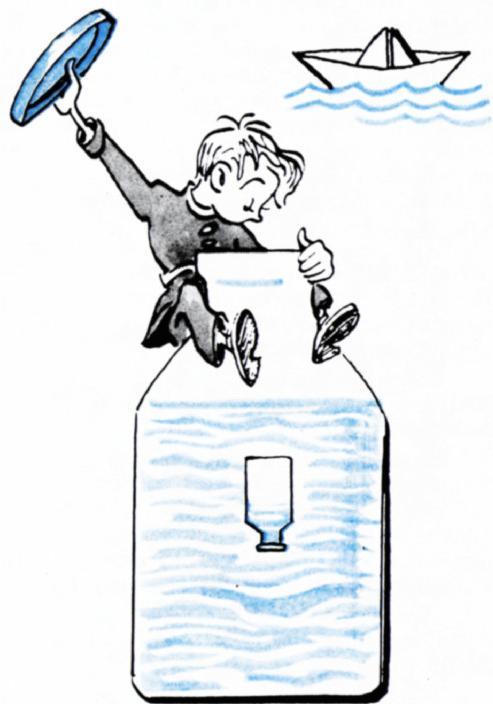

# 笛卡尔浮沉子

> **原标题**：Картезианский водолаз
> **作者**：А. Н. Виленкин（维连金）
> **译自**：Квант 1973, № 2
> **栏目**：Квант для младших школьников（小学）
> **原文**：https://www.kvant.digital/issues/1973/2/vilenkin-kartezianskiy_vodolaz-ab10f913/
> **主题**：物理
> **难度**：★（小学高年级可读）
> **译者**：Claude（AI 初译，2026-06）

---

## 笛卡尔浮沉子

纸折的小船很容易浮在水面上，可是一旦纸被水浸湿，小船就沉下去了。干燥的小船之所以能浮在水面上，是因为船舱（船底的「穹顶」下方）里藏着空气。要是这层「穹顶」被水浸软、散开了，里面的空气就会跑出来，小船也就沉了。那么，我们能不能想个办法，让空气一会儿从「穹顶」下跑出去、一会儿又跑回来，让小船一会儿沉、一会儿浮——全都听我们的指挥呢？

原来，是可以的。最早做出这种玩具的，是法国伟大的科学家、哲学家勒内·笛卡尔（René Descartes），所以这种玩具现在就叫做「笛卡尔浮沉子」（在拉丁文里，勒内·笛卡尔读起来是 Renatus Cartesius，所以叫「картезианский」，也就是「笛卡尔的」意思）。只不过在这种玩具里，空气并不是跑进跑出，而是被压缩或者膨胀。

「浮沉子」的构造如插图所示。找一只牛奶瓶、一个小药瓶，再找一个可以吹气的橡皮气球（这个气球得牺牲一下）。把牛奶瓶里几乎装满水，装到接近瓶口。把小药瓶口朝下按进水里，再把它倾斜一下，让里面灌进一点水。要仔细调节小药瓶里的水量，让它刚好能浮在水面上，可是只要轻轻一推，它就会潜到水下去（一个方便的办法：拿一根吸管，从水下往小药瓶里吹气，一直吹到它开始上浮为止）。然后用气球的橡皮薄膜蒙住牛奶瓶的瓶口，再用细线绕瓶口扎紧。

用手按一下薄膜——「浮沉子」就向水底沉下去。一松手——「浮沉子」又浮了上来。它下沉的道理是这样的：当你按压薄膜时，薄膜下面的空气被压缩，瓶里的压强变大，于是把更多的水压进了小药瓶。小药瓶变重了，就往下沉。你一松开薄膜，瓶里的压强变小，小药瓶里被压缩的空气把多余的水挤出去，「浮沉子」就浮上来了。

现在，请你试着解下面这道题（如果你做好了「浮沉子」，还可以亲手做做实验）。

**题**：当水面上的空气压强增大时，「笛卡尔浮沉子」就会下沉。那么，当压强只是稍微增大一点点的时候，「浮沉子」会一直沉到水底吗？还是说，它有可能「半路停下」，沉不到底呢？（换句话说，我们能不能拿掉那块橡皮薄膜，把这个玩具当成一个气压计来用：在瓶子上标出「浮沉子」下沉的深度，让它对应水面上不同的压强？）
