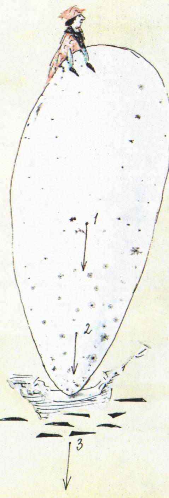

# 比哥伦布更巧妙

> **原标题**：Искуснее Колумба
> **作者**：Я. Перельман（雅·别莱利曼）
> **译自**：Квант 1990, № 7
> **栏目**：Квант для младших школьников（小学）
> **原文**：https://www.kvant.digital/issues/1990/7/perelman-iskusnee_kolumba-bb6e774b/
> **主题**：物理（重心与平衡的小实验）
> **难度**：★（小学高年级可读）
> **译者**：Claude（AI 初译，2026-06）

---

# 比哥伦布更巧妙

## 雅·别莱利曼

「克里斯托弗·哥伦布是一位伟大的人物，」一个小学童在课堂作文里这样写道，「他发现了美洲，还立起了一枚鸡蛋。」在这位小学生的眼里，两件壮举同样令人惊叹。而美国幽默作家马克·吐温却不觉得发现美洲有什么了不起：「要是他到了那儿竟然没找着美洲，那才叫奇怪呢。」而我倒要大胆地说一句：这位大航海家的第二件壮功，其实也没多大了不起。你知道哥伦布是怎样立鸡蛋的吗？不过是把鸡蛋往桌上一按，把底下那头的蛋壳压破了事。这么一来，他当然——

——改变了鸡蛋的形状。那么，能不能**不改变鸡蛋的形状**就把它立起来呢？这位勇敢的水手终其一生也没能解开这道难题。

我们这里给你支三招：一招用于熟鸡蛋，一招用于生鸡蛋，还有一招生熟通用。

要让一枚**煮熟的**鸡蛋立起来，只要用一只手的手指，或者两只手掌夹住鸡蛋，像**抽陀螺**那样使劲一捻：鸡蛋就会竖着旋转起来，并且在旋转的整个过程中始终保持直立。试上两三次，这个把戏就很容易成功。

用这种办法立**生**鸡蛋可不行；也许你早已发现，生鸡蛋转起来总是不利索。顺带说一句，这恰恰是——

——**不打破蛋壳就能分辨熟鸡蛋和生鸡蛋**的万无一失的办法。生鸡蛋里液态的内容物不会像蛋壳那样被带着一起飞速旋转，于是对旋转形成很大的阻力。我们只好另想立蛋的法子。法子是有的：把鸡蛋用力来回摇晃若干次；这样一摇，蛋黄就会撑破自己那层娇嫩的薄膜，散到整个鸡蛋里。然后你把鸡蛋竖在它较钝（圆）的那一头上，并在这一姿势下保持一会儿，那么——比蛋白更重的蛋黄——就会顺着鸡蛋向下流，并集聚在底部。这么一来，鸡蛋的重心被压低了，它就比未经这般处理的鸡蛋要稳当得多。

最后，还有第三种立鸡蛋的办法。比方说，把鸡蛋搁在一只有盖的酒瓶瓶口的软木塞上，再在鸡蛋顶上放一只软木塞，木塞上插着两把餐叉。这整个「系统」（要是让物理学家来说，他会这么称呼它）——

相当稳当，哪怕你小心地把酒瓶慢慢倾斜，它都还能保持平衡。可为什么软木塞和鸡蛋不会掉下来呢？这和把一枝铅笔竖直地用笔尖立着、再在铅笔上插一把折叠小刀就不掉是同一个道理。「系统的重心位于支撑点的下方，」物理学家会这样解释。意思是：重力作用所集中的那一点，落在系统所倚靠之处的下方。你可以在许许多多的例子里亲自验证这条平衡定律：把几样东西连接起来，让沉重的部分位于支撑点之下，它们就会在最让人意想不到的姿态里稳稳地立着。

如此一来，在立鸡蛋这门手艺上，你比哥伦布占了三项优势。而在发现新大陆这件事上，他比起你来只多了一项优势：不过是他先发现了美洲罢了。

---

> **译者注（OCR 修正说明）**：本文 OCR 文本中（p46 末尾数行与 p47 中段）混入了同期杂志另一篇文章《Сети Чебышева》（切比雪夫网络）的若干段落，与本主题无关，已按翻译指南第五节剔除，仅译《Искуснее Колумба》正文。
