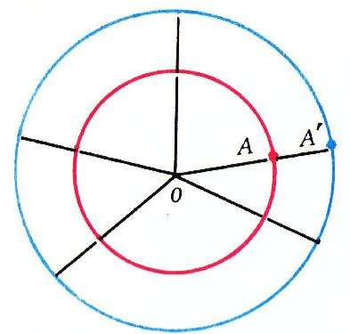
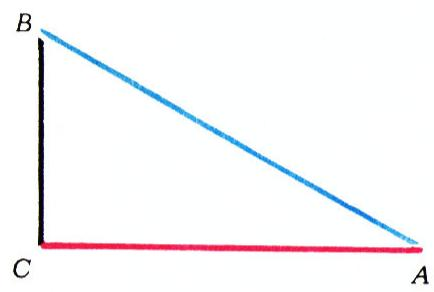

# 部分能等于整体吗？

> **原标题**：Может ли часть равняться целому?
> **作者**：А. Д. 本杜基泽（Бендукидзе А. Д.）
> **译自**：Квант 1976, № 9
> **栏目**：Квант для младших школьников（小学）
> **原文**：https://www.quant.digital/issues/1976/9/bendukidze-mozhet_li_chast_ravnyatsya_tselomu-725d5c04/
> **主题**：算术／集合与无穷
> **难度**：★★（小学高年级在引导下可读；无穷对等概念略深）
> **译者**：Claude（AI 初译，2026-06）

---

有一天，塔穆妮娅和格奥尔基跑到我这儿来，两人抢着话头问：

—— 部分能等于整体吗？

—— 部分——等于整体？——我说，——当然不能。部分总是小于整体。顺便说一句，古希腊伟大的数学家欧几里得，他写出了第一部系统的几何学教科书，就把"整体大于部分"这句话当作一条公理（也就是不加证明就接受的基本规定）。

—— 可是今天有一位大学生卡哈，他是我同学的哥哥，路过我们学校时进来看了看，说并不是这样：有时候部分就等于整体。他还给我们举了个例子呢，——格奥尔基说。

—— 那你们还记得这个例子吗？

—— 记得，记得清清楚楚，您听好……——他们齐声说。

—— 好啊，我洗耳恭听。不过咱们按顺序来，别互相打断。好，塔穆妮娅，你先讲，当时说的是什么。

—— 是这样的。我们取所有自然数组成的集合

$$
\{1,\;2,\;3,\;4,\;\ldots\}
$$

在它里面，再取所有偶数组成的子集

$$
\{2,\;4,\;6,\;8,\;\ldots\}.
$$

第二个是第一个的一部分，对吧？

—— 当然。

—— 可是啊，原来它们是相等的！您看，——她说着，画出了下面这张表：

| 1 | 2 | 3 | 4 | … | 100 | 101 | … | 500 | 501 | … |
|---|---|---|---|---|---|---|---|---|---|---|
| 2 | 4 | 6 | 8 | … | 200 | 202 | … | 1000 | 1002 | … |

在这张表里，每个自然数下面都写着一个确定的偶数，而且没有一个偶数漏掉，也没有一个偶数重复。结果就是：偶数的个数和自然数的个数一样多，也就是说，这两个集合是相等的！

—— 你刚才说——"相等"？难道你不记得什么样的两个集合才叫相等吗？

—— 我记得：两个集合 $A$ 和 $B$ 叫做相等的，是指集合 $A$ 的每一个元素也都属于集合 $B$，反过来，集合 $B$ 的每一个元素同时也属于集合 $A$，也就是说，这两个集合由完全相同的元素组成。

—— 那么你想想看，自然数集合和偶数集合相等吗？

—— 不相等，可是……结果它们的元素个数却一样多……

—— 对，对，——格奥尔基接过话来，——这两个集合在元素的"个数"上是相等的，那也就是说，部分还是等于整体啰。

—— 就算这样吧。我们说，部分在"数量上"等于整体。那么，如果对这两个集合我再排出这样一张表，你们又怎么说呢：

| 1 | 2 | 3 | 4 | … | 100 | 101 | … | 500 | 501 | … |
|---|---|---|---|---|---|---|---|---|---|---|
|  | 2 |  | 4 | … | 100 |  | … | 500 |  | … |

在这第二行里写出了所有的偶数，可是还空着一些格子，而且不难猜到，空格子的数目是无穷多的。这样一来，偶数好像又比自然数少了！

—— ??

塔穆妮娅和格奥尔基一下子懵了——他们惊讶地互相看看，又带着疑问地看着我。

—— 怎么啦，——我说，——咱们来把这事儿弄明白。先从有限集合说起。假定给了我们两个有限集合，要比较它们的多少，也就是弄清它们含有的元素是不是一样多。你们想想，该怎么办？

—— 数一数这两个集合的元素个数，——格奥尔基想都没想就说。

—— 当然是数一数，然后再把得到的两个数比一比，——塔穆妮娅补充道。

—— 对。这是最先想到的办法。毫无疑问，数数原则上能解决问题。可是如果较真地想一想，就会发现：数数这个办法并不是最好的。除了它不能用到无穷集合上之外，它还有别的毛病。

第一，数数会给我们带来多余的、我们并不需要的信息——我们根本不关心每个集合里到底有多少个元素，只要弄清楚两个集合的元素是不是一样多就够了。

第二，这个办法并不总是方便。比方说，想象你正在办一场趣味数学晚会，请了邻校的同学来参加。客人来了很多，主人也不少。大家都聚在学校的大礼堂里，沿墙摆着一圈椅子。你要弄清楚：椅子够不够所有人坐。难道你会把在场的人都数一遍——一、二、三、四、五……？

—— 不会，那太不方便了，——我的两位小听众说。

—— 既不方便，也不省事，——我接着说，——可是到底该怎么办呢？要是不够，总得赶紧再去搬椅子来呀！

—— 要是请大家都坐下呢？——塔穆妮娅想了想说，—— 这样马上就能看出谁没有座位……

—— 对了！应该请大家就座，而且要安排成"一张椅子坐一个同学"。格奥尔基，你说说，会有哪几种情况？

—— 大家都坐下了，没有空椅子——这是第一种；大家都坐下了，还有空椅子剩——第二种；椅子全坐满了，可还有人站着——第三种。一共三种！

—— 完全正确。第一种情形，人这个集合和椅子这个集合的元素一样多；第二种情形，人比椅子少；第三种情形，则正好反过来。这样我们就找到了一个比较两个有限集合多少的办法，而且这个办法很容易搬到无穷集合上去。下面看看怎么搬。给我们两个集合：$A$ 和 $B$。它们有限还是无限，都不要紧。我们说集合 $A$ 能**一一对应**到集合 $B$ 上，是指存在这样一种对应关系：集合 $A$ 的每一个元素 $a$，都对应着集合 $B$ 中一个确定的元素 $b$，而且每一个 $b$ 也只对应唯一的一个 $a$。显然，这时候就能用集合 $A$ 和 $B$ 的元素配成一对对 $(a,\,b)$，并且满足下面两个条件：

1) 一对里的第一个成分是集合 $A$ 的元素，第二个是集合 $B$ 的元素；

2) 集合 $A$ 的每个元素、集合 $B$ 的每个元素，都进入且只进入一对之中。

反过来当然也对：如果集合 $A$ 和 $B$ 的元素能按上述条件配成一对对 $(a,\,b)$，那么 $A$ 就一一对应到 $B$ 上。我举个例子。设

$$
A = \{m,\;o,\;p,\;e\},\quad B = \{1,\;2,\;3,\;4\}.
$$

配成这样的对子：$(m,\,1),\;(o,\,2),\;(p,\,3),\;(e,\,4)$。它们满足刚才说的条件，也就是说，$A$ 一一对应到 $B$ 上。

—— 那能不能换一种方式配对呢？比如 $(m,\,4),\;(o,\,3),\;(p,\,2),\;(e,\,1)$，或者 $(m,\,1),\;(o,\,2),\;(p,\,4),\;(e,\,3)$？——塔穆妮娅问。

—— 当然可以。重要的是上面那两个条件要满足。在我们这个例子里，配对的方式一共有 $24$ 种。这也说明：一般来讲，一个集合到另一个集合上的一一对应（如果做得到的话）可以有好几种不同的做法。我们与其每次都说"集合 $A$ 一一对应到 $B$ 上"，不如简短地说："$A$ 等势于 $B$"，并记作 $A \sim B$。显然，如果 $A \sim B$，那么也有 $B \sim A$。你们想想，两个有限集合在什么条件下等势？

—— 当它们的元素个数一样多时，——两人不假思索地回答。

—— 对。反过来显然也对：如果两个有限集合等势，那么……

—— 它们的元素就一样多，——格奥尔基下了结论。

—— 也就是说，两个有限集合等势，当且仅当它们含有的元素个数相同，——塔穆妮娅做了总结。

—— 完全正确！可见，对于有限集合，事情非常简单；本来也用不着引入"等势"这个概念，要不是……存在着无穷集合的话。无穷集合可有意思多了。在这里我们会遇到一种简直叫人难以置信的情形。就拿自然数集合和（正）偶数集合来说吧。瞧瞧你画的那张表，——我对塔穆妮娅说，——我们看到，这两个集合的元素能够按要求一一配对，也就是说，自然数集合等势于它自己的一部分——偶数集合。这种事在有限集合里是绝对不可能发生的！

—— 可是从您的那张表看，这两个集合又好像不等势了……——塔穆妮娅怯生生地说。

—— 我就料到你会问这个。确实，看起来好像这两个集合既等势、又不等势，其实不然——这里一切都没错，根本没有矛盾。关键在于：所谓 $A$ 等势于 $B$，是指 $A$ **可以**（我着重强调——"可以"）一一对应到 $B$ 上。也就是说，如果能找到一一对应，那两个集合就等势；如果找不到，那就

![图 3：两条线段 $[AB]$ 与 $[A'B']$。可以通过几何作图在两条线段的点之间建立一一对应。](../images/P19/fig_p75_03.png)

不等势。而我们既然已经知道，自然数集合到偶数集合之间确实存在一一对应，那么这两个集合就是等势的。

下面再举几个等势集合的例子。考虑两个同心圆 $(O,\,r)$ 和 $(O,\,R)$。它们是等势的（别忘了，圆周本身就是由点组成的集合！）。事实上，在圆周 $(O,\,r)$ 上任取一点 $A$，作半径 $OA$（图 1）。让这条半径的延长线交 $(O,\,R)$ 于点 $A'$。这样，每一个 $A \in (O,\,r)$ 都对应着一个由此得到的点 $A' \in (O,\,R)$。我们就得到了从 $(O,\,r)$ 到 $(O,\,R)$ 的一一对应，也就是 $(O,\,r) \sim (O,\,R)$。

> **译者注**：原文"作半径 $OA$"在俄文中误写为"раднус"（应为"радиус"，即"半径"），此处据数学含义径改。

第二个例子，我们取线段 $[0,\,1]$ 和线段 $[a,\,b]$，其中 $a$、$b$ 是任意两个数。把这两条线段都看作由数组成的集合，它们竟然也是等势的，哪怕 $[a,\,b]$ 可能比 $[0,\,1]$ 长出（或短出）许多倍。可以这样来证明它们的等势性：考察函数 $y = a + (b - a)\,x$，它的定义域是 $[0,\,1]$。当 $x$ 在定义域内从 $0$ 变到 $1$ 时，$y$ 就从 $a$ 变到 $b$，所以这个函数的值域恰好是 $[a,\,b]$。又因为

$$
x = \dfrac{y - a}{b - a},
$$

所以每一个 $y$ 都只对应唯一的一个 $x$。

我们的谈话到此就结束了。塔穆妮娅和格奥尔基都十分满意。临走时我给他们留了几道题，现在也出给你们。

1. 证明：自然数集合与所有 10 的倍数组成的集合等势。

2. 证明：在直角三角形 $ABC$ 中，直角边 $AC$ 上的点集合与斜边 $AB$ 上的点集合等势（图 2）。

3. 用几何方法指出线段 $[AB]$ 的点集合与线段 $[A'B']$ 的点集合之间的一一对应（图 3）。请尽量想出两种不同的方法。

4. 证明：整数集合 $Z$ 与自然数集合 $N$ 等势。
