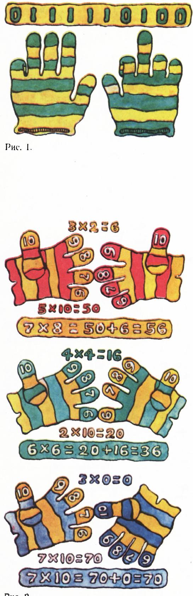
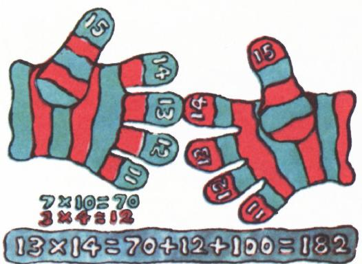
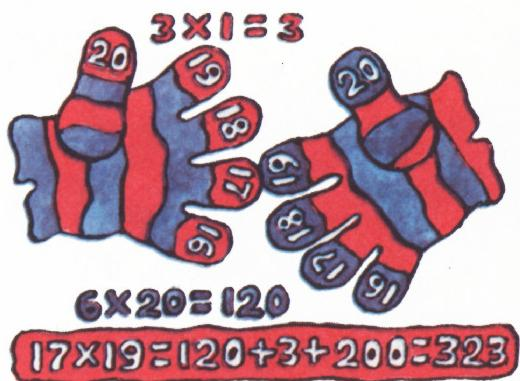

# 手指——计数机

> **原标题**：Пальцы — счётная машина
> **作者**：Гарднер М.（马丁·加德纳，Martin Gardner）
> **译自**：Квант 1973, № 6
> **栏目**：Квант для младших школьников（小学）
> **原文**：https://www.kvant.digital/issues/1973/6/gardner-paltsyi_schetnaya_mashina-46bd1adc/
> **主题**：算术/数论（手指计算、二进制、乘法速算）
> **难度**：★★（小学高年级可读，二进制与乘法推广部分需细想）
> **译者**：Claude（AI 初译，2026-06）

---

## 手指——计数机

人类学会计数的历史十分悠久，人类学家至今仍在寻找那个"完全不会数数"的原始部落。很长一段时间里，学者们相信原始部落只能数到二，因为他们的语言里只有"一""二"这两个词，再往上的数统统叫作"多"。可令人吃惊的是，这些部落里的人只要扫一眼羊群，就能立刻发现少了一只羊。人们曾以为这是古人惊人的记忆力在起作用——他们能记住整群羊的"样子"，甚至记得每一只羊的长相。后来更深入的研究才弄清楚：用一个词统称"大于二的所有数"，并不等于他们分不清五块石头和六块石头；正如用一个词同时表示"蓝"和"绿"，也不等于他们看不出绿草与蓝天在颜色上的差别。词汇贫乏的部落，往往都有一套精心设计的、用手指和脚趾来计数的方法。

各个原始部落不仅在"以几为底数"上各有不同，连数数的方式也五花八门。因为大多数人的右手更灵活，所以数数通常从左手开始——从左手的大拇指或小指起头，用右手去碰左手的指头；或者把左手的指头一根根弯下去；又或者把原先攥成拳头的手指一根根竖起来。也有一些部落用别的方法。比如孟加拉湾一些岛屿上的居民从小指开始数，每数一个指头就去碰一下自己的鼻子；而在澳大利亚与新几内亚之间的那座岛上，人们先用左手指头数到五，接着并不换到右手，而是顺着左手腕、左肘、左肩、左胸一路数下去，然后再从身体右侧按相反顺序数回来。数学家们还注意到一个有趣的区别：一根根地敲击指头，多半用来表示**序数**（第一、第二……）；而一把把指头竖起来，则多半用来表示**基数**（一、二、三……共有多少个）。

虽然绝大多数手指计数法都以十为底（也就是我们今天所说的"十进制"），但用手指来表示别的底数也照样容易。手指特别适合用来表示最简单的一种进制——二进制 *)。一根伸直的指头与一根弯曲的指头，恰好像一台现代电子计算机里的"触发器"（电子开关），而计算机内部用的正是二进制。用手指表示二进制时，伸直可以代表 1，弯曲可以代表 0。这样一来，双手十根指头所能表示的最大数就是 $1111111111$（二进制），也就是十进制里的

$$
2^{10}-1 = 1023,
$$

其中最末一位（最低位）对应右手的小指。二进制里的"二"写成 $10$，也就是右手小指弯曲、无名指伸直；若再把小指也伸直，就变成 $11$，也就是十进制里的三。

> **译者注**：原文此处提到"图 1 画出了怎样用双手十指把十进制的 500 表示成二进制"，但本期 OCR 备料中并未收录该二进制指法插图（原图 1 在扫描/OCR 环节缺失）。下文图 2、图 3、图 4 均与原文对应。

只要稍加练习，你不仅能用手指把任意十进制数表示成二进制，还能直接用手指在二进制下做加法和减法。

早在中世纪，人们就已经知道一种用手指算 $6$ 到 $10$（也就是大于 $5$ 的数）相乘的方法。1492 年，有人总结出了一套使用"补数"来相乘的完整规则。（一个数 $n$ 的补数就是 $10-n$。）要算 $7 \times 8$，先取它们的补数：$3$ 和 $2$。任选一个原始数，减去与它"配不上对"的那个补数，所得到的差就是答案的十位数字——在本例中是 $5$；而两个补数相乘的积，则给出答案的个位数字，即 $2 \times 3 = 6$。合起来就是 $50 + 6 = 56$。

把这个道理用到手指上，做法是这样的：两只手从每只手的小指开始，依次编号为 $6, 7, 8, 9, 10$。要算 $7 \times 8$，就把一只手上编号为 $7$ 的指头与另一只手上编号为 $8$ 的指头相对接（图 2）。$7$ 的补数就是对接处上方那只手剩下的 $3$ 根指头，$8$ 的补数就是上方另一只手剩下的 $2$ 根指头。两只手上**对接处及以下**所有指头的总数，就是答案的十位数字——这里是 $5$。再用 $50$ 加上上方两组指头的乘积 $2 \times 3 = 6$，便得到 $56$。

*图 2*

这种用手指算任意两个 $6$ 到 $10$ 之间数字之积的简便方法，在文艺复兴时期曾广为流传；据说直到今天，欧洲一些地方的农民仍在使用。

我们也可以不用"补数到 10"的说法，而直接把 $7$ 和 $8$ 写成两项和的形式 $(5+2)$ 与 $(5+3)$，然后照下面的办法相乘：

$$
\begin{array}{r}
\phantom{00}5+2 \\
\underline{\times\;\,5+3} \\
25+10 \\
\underline{+\,15+\phantom{0}6} \\
25+25+5=56
\end{array}
$$

这种手指乘法很容易推广到接下来的几个"半旬"（即 $11$–$15$、$16$–$20$ 等）。不过对于以 $5$ 结尾的半旬，要用的是略加修改的规则。我们来看半旬 $11$–$15$：要算 $14 \times 13$。把两只手的指头从 $11$ 编号到 $15$，再把编号为这两个数的指头相对接（图 3）。对接处及以下的指头共有 $7$ 根，乘以 $10$ 得 $70$。再算对接处以上两组指头的乘积 $4 \times 3 = 12$，于是 $70 + 12 = 82$。最后加上 $100$，最终答案是 $182$。这条规则的解释可以有好几种，最简单的还是把它看作两项和的相乘：

$$
\begin{array}{r}
\phantom{0}10+3 \\
\underline{\times\,10+4} \\
100+30 \\
\underline{+\,40+12} \\
100+70+12=182
\end{array}
$$

若半旬以零结尾，则按第一种方法相加；而对于半旬 $16$–$20$，对接处及以下的每一根指头都值 $20$，最后还要加上 $200$。例如算 $17 \times 19$（图 4）：对接处及以下共 $6$ 根指头，乘以 $20$ 得 $120$；对接处以上两组指头的乘积为 $3$，于是

$$
17 \times 19 = 120 + 3 + 200 = 323.
$$

*图 3*

> **译者注**：原文此处图 3 的文件名与图 2 完全相同（OCR 重复），上图为按原文位置保留的图引用，实际应为一幅展示半旬 11–15 指法的插图。

*图 4*

用手指也可以把分属不同半旬的两个数相乘，但步骤就要复杂得多，因为同一根指头在两只手上代表不同的数值。不过，遇到大数时总可以把它拆成几个小数，分别相乘后再把结果加起来。例如：

$$
9 \times 13 = (9 \times 6) + (9 \times 7).
$$

乍一看，用手指算数似乎挺麻烦。可只要稍微练一练，我相信读者一定会发现：这套手指算法其实相当方便。

---

*) 与现代电子计算机中的触发器相类比：触发器也只有两个状态——"通"和"断"，恰如一根指头的"伸"和"屈"。
