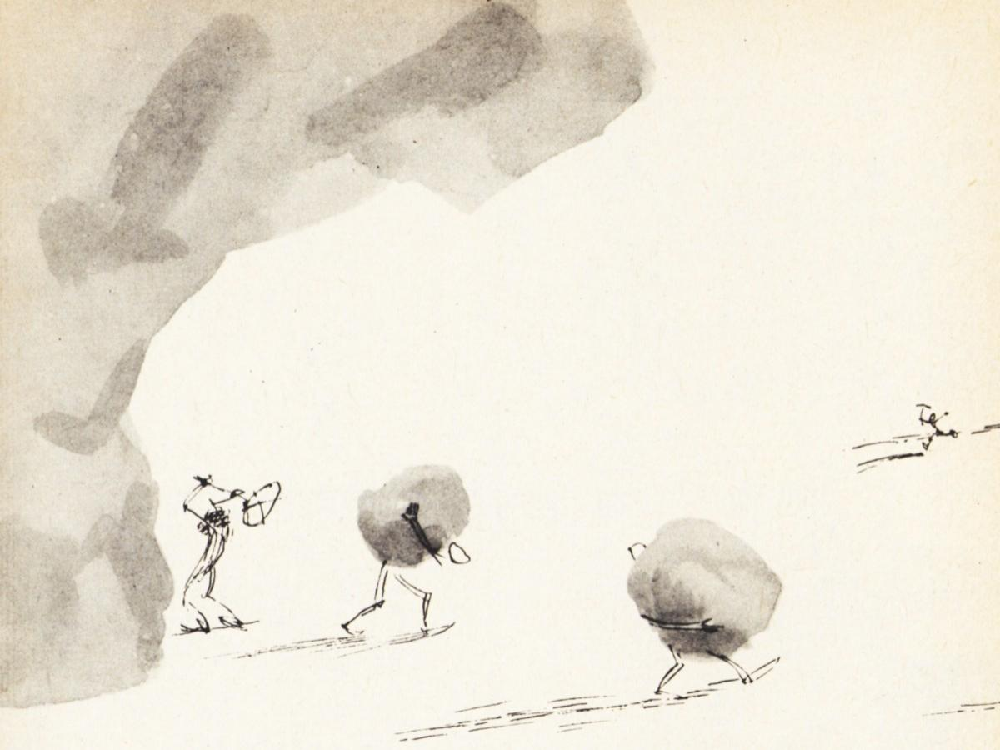
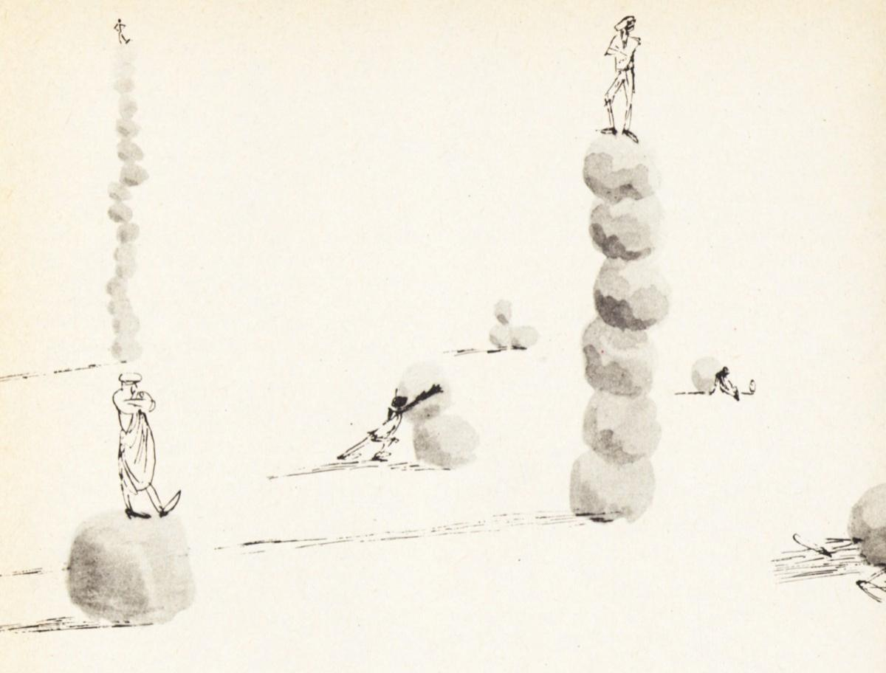

# 分数小史

> **原标题**：Из истории дробей
> **作者**：Н. Я. Виленкин（维连金 · 尼古拉 · 雅科夫列维奇，物理学-数学博士）
> **译自**：Квант 1987, №5
> **栏目**：Квант для младших школьников（小学）
> **原文**：https://www.kvant.digital/issues/1987/5/vilenkin-iz_istorii_drobey-fb2851db/
> **主题**：算术/数论（分数的历史）
> **难度**：★（小学高年级可读）
> **译者**：Claude（AI 初译，2026-06）

---

人们认识的第一种分数是「一半」。后来各种分数的名字都和它们的分母有关（三是「三分之一」，四是「四分之一」，等等），唯独「一半」不是这样——在所有的语言里，「一半」这个词都和「二」没有任何关系。在半之后，出现的是「三分之一」。这些分数，以及另外几种分数，都出现在我们今天能看到的最早的数学文献里——这些文献写于五千多年以前，包括古埃及的纸草书和古巴比伦的楔形文字泥板。无论埃及人还是巴比伦人，对 $\dfrac{1}{3}$ 和 $\dfrac{2}{3}$ 都有专门的记号，这和别的分数的记号都不一样。

埃及人尽量把所有的分数都写成「单位分数」（也就是形如 $\dfrac{1}{n}$ 的分数）之和。唯一的例外是 $\dfrac{2}{3}$。例如，他们不写 $\dfrac{8}{15}$，而写成 $\dfrac{1}{3}+\dfrac{1}{5}$。这样做有时还挺方便的。在一位名叫阿赫美斯的埃及书吏所写的纸草书里，有这样一道题：把七块面包分给八个人。如果每一块面包都切成 8 份，一共要做 49 次切割。而按埃及人的办法，这道题是这样解的：先把 $\dfrac{7}{8}$ 写成单位分数之和 $\dfrac{1}{2}+\dfrac{1}{4}+\dfrac{1}{8}$。这样一来就很清楚了：4 块面包对半切，2 块面包切成 4 份，只有 1 块要切成 8 份（一共只做 17 次切割）。

可是，要把写成单位分数之和的分数相加，就不方便了。因为两个加数里可能会出现相同的单位分数，那么相加之后就会出现形如 $\dfrac{2}{n}$ 的分数，而埃及人是

不允许这样的分数出现的。所以阿赫美斯纸草书一开始就是一张表：把从 $\dfrac{2}{5}$ 到 $\dfrac{2}{99}$ 所有形如 $\dfrac{2}{n}$ 的分数，都写成单位分数之和。借助这张表，还能做整数除法。比如，他们是这样把 5 除以 21 的：

$$
\begin{array}{r l} & \dfrac{5}{21} = \dfrac{1}{21} + \dfrac{2}{21} + \dfrac{2}{21} = \dfrac{1}{21} + \left(\dfrac{1}{14} + \dfrac{1}{42}\right) + \\ & + \left(\dfrac{1}{14} + \dfrac{1}{42}\right) = \dfrac{1}{21} + \dfrac{2}{14} + \dfrac{2}{42} = \dfrac{1}{7} + \\ & + \dfrac{1}{21} + \dfrac{1}{21} = \dfrac{1}{7} + \dfrac{2}{21} = \dfrac{1}{7} + \dfrac{1}{14} + \dfrac{1}{42}. \end{array}
$$

埃及人也会做分数的乘法和除法。但做乘法时，免不了要把单位分数乘单位分数，然后也许又要查那张表。除法就更麻烦了。

巴比伦人走的则完全是另一条路。原来，巴比伦的记数制度是「六十进制」的——后一位的一个单位是前一位一个单位的 60 倍。例如，记号 $14''\ 42'\ 38$ 表示的数是 $14\cdot 60^2+42\cdot 60+38$，也就是我们今天所写的 52958（只不过巴比伦人用的不是我们的数字，而是用楔形拼成的另一些记号）。所以巴比伦人的分数也不是十进制小数，而是六十进制小数。说到底，我们今天在表示时间和角度大小时，用的就是这种分数。例如，时间「3 时 17 分 28 秒」也可以写作 $3,17'28''$ 时（读作：3 整、十七个六十分之一、二十八个三千六百分之一小时）。他们不说「六十分之一份」「三千六百分之一份」，而是说得更简短：「第一小份」「第二小份」。我们的「分」（拉丁语原意是「更小的」）和「秒」（拉丁语原意是「第二个」）这两个词，就是从这里来的。可见，巴比伦的分数记法一直用到了今天。

正如并非所有分数都能写成有限十进制小数一样，也并非所有分数都能写成有限的六十进制小数。例如 $\dfrac{1}{7}$、$\dfrac{1}{11}$、$\dfrac{1}{13}$ 这样的分数，就不能写成六十进制的形式。但是可以用任意需要的精度，用六十进制小数去逼近它们。巴比伦人正是这样做的。

从巴比伦继承下来的六十进制分数，被希腊和阿拉伯的数学家、天文学家一直沿用。可是，一边是按十进制记的自然数，一边是按六十进制记的分数，混在一起工作很不方便；而要直接使用普通分数（分子分母形式），就更糟糕了——你不妨试试把 $\dfrac{785}{2213}$ 和 $\dfrac{8917}{3411}$ 这两个分数相加或相乘。

所以，荷兰的数学家兼工程师西蒙 · 斯泰文在 1585 年提议改用十进制小数。一开始它的写法相当繁琐，后来才慢慢变成今天的写法。其实，比斯泰文早一个半世纪，在撒马尔罕的兀鲁伯天文台工作的天文学家 al-Kashi（卡西）就已经引入了十进制小数，只可惜他的工作没有被欧洲数学家所知。

如今的电子计算机用的是「二进制小数」。在二进制记数法里，后一位的一个单位是前一位一个单位的 2 倍。这样一来，记数时只需要两个数字：0 和 1。例如，记号 100101 表示的数是 $1\cdot 2^5 + 0\cdot 2^4 + 0\cdot 2^3 + 1\cdot 2^2 + 0\cdot 2 + 1$，也就是 37。这样写虽然长一些，却只需要两个数字。用电流来在计算机里实现这种记法，要容易得多（比如：1 表示「通电流」，0 表示「不通电流」）。二进制小数也长这个样子，例如 $0{,}101101$（你来读读看，它表示的是什么？）。有趣的是，古罗斯其实就在本质上使用着二进制分数——他们有「一半」「稍稍」「半四分之一」「半半四分之一」这样的分数名称。

古罗马有一套很有意思的分数制度。它是把重量单位「阿斯」（as）分成 12 份来作为基础的。阿斯的十二分之一叫做「昂西亚」（uncia，盎司）。他们把路程、时间等等，都拿一件直观的东西——重量——来比较。例如，一个罗马人可能会说自己走了「七昂西亚的路」，或者读了「五昂西亚的书」。

当然，这里说的并不是真的去称一称路程或书有多重。它只是说：走了路程的 $\dfrac{7}{12}$，或者读了书的 $\dfrac{5}{12}$。而对那些由分母为 12 的分数约简得来的分数，或者把十二分之一再细分成更小的份所得的分数，也各有专门的名字。

直到今天，人们有时还会说「他一丝不苟地（scrupulously）研究了这个问题」。这是说问题已经被研究到底了，再小的一点不清楚之处也没有剩下。而「一丝不苟」这个怪词，正来自罗马人对阿斯的 $\dfrac{1}{288}$ 的称呼——scrupulus（scrupulus，小石子）。当时通用的名字还有：semis——半个阿斯；sextans——它的六分之一；semiuncia——半个昂西亚，也就是阿斯的 $\dfrac{1}{24}$，等等。一共用到 18 个不同的名字。要拿这些分数做运算，就得把它们的加法表和乘法表都背下来。所以罗马商人都牢牢记得：把 triens（阿斯的 $\dfrac{1}{3}$）和 sextans（阿斯的 $\dfrac{1}{6}$）相加，得到的是 semis（阿斯的 $\dfrac{1}{2}$）；把 bes（阿斯的 $\dfrac{2}{3}$）乘上 sesquiuncia（$1\dfrac{1}{2}$ 个昂西亚，即阿斯的 $\dfrac{1}{8}$），得到的是一个昂西亚。同时他们也很明白：相乘的不是重量本身（重量乘重量是没有意义的），而是表示这些重量的分数。为了便于运算，当时还专门编了一些表，其中有些一直流传到了今天。

可见，60 这个数在古巴比伦所起的作用，2 这个数在古罗斯所起的作用，到了古罗马就由 12 这个数来扮演了——罗马的分数和度量制度是「十二进制」的（虽然他们记数时用的是十进制，只是写法跟我们不一样）。正因为形如 $\dfrac{1}{10^{n}}$ 的分数不能写成有限的十二进制分数，罗马人就不会把「除以 10、100 等等」的结果用分数表示出来。比如，有一位罗马数学家在把 1001 个阿斯除以 100 时，先得到 10 个阿斯，再把阿斯细分成昂西亚，如此继续下去，可是余数自然始终消不掉。

在希腊人的数学著作里，本来是看不到分数的。希腊学者认为，数学只应该研究

---

> **译者注**：本页（OCR 第 54 页）紧接正文第 34—36 页之后。原文中间夹杂了一篇与本主旨无关的几何题解（题目 6、7 等，与「分数小史」无关），译时已按翻译指南第五节剔除。

整数。至于分数，他们就让商人、手艺人，以及丈量土地的人、天文学家和机械师去摆弄了。可是有句老话说得好：「你把大自然从门里赶出去，它又会从窗户飞进来。」所以就连希腊人那些严格的科学著作里，分数也照样「从后门」溜了进去。原来，除了算术和几何之外，希腊数学里还包括……音乐。希腊人所说的「音乐」，其实是我们今天算术中讲「比和比例」的那一部分。

为什么会有这么怪的名字呢？原来，希腊人还创立了一门关于音乐的学问。他们知道：绷紧的弦越长，发出的声音就越低沉、越「浑厚」；而短弦发出的声音就高。但任何一件乐器都不止一根弦。要让这些弦在演奏时听起来「协和」、悦耳，它们发声部分的长度之间就要有一定的比。例如，要让两根弦发出的音高相差一个八度，它们的长度之比就必须是 $1:2$。类似地，纯五度对应的是 $2:3$ 这个比，纯四度对应的是 $3:4$ 这个比，等等。所以，希腊人就把关于比、关于分数的学问，跟音乐联系在一起了。

我们今天用的「分子在上、分母在下」的分数记法，是印度人创立的。只不过在印度，分母写在上面，分子写在下面，而且不写中间的分数线。至于完全像今天这样来书写分数，则是阿拉伯人开始的。
