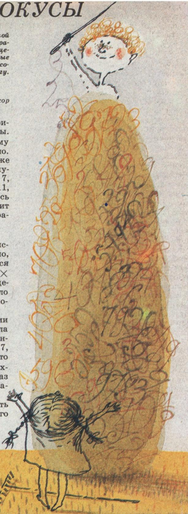

# 数字戏法

> **原标题**：Числовые фокусы
> **作者**：И. Депман（И. 杰普曼）、Н. Виленкин（Н. 维连金）
> **译自**：Квант 1991, № 2
> **栏目**：Квант для младших школьников（小学）
> **原文**：https://www.kvant.digital/issues/1991/2/depman_vilenkin-chislovyie_fokusyi-55b7a6e4/
> **主题**：算术/数论
> **难度**：★★（初中预备；戏法本身小学高年级可玩，理解原理需要一点数论）
> **译者**：Claude（AI 初译，2026-06）

---

本文摘自刚刚出版的《数学课本之外》（«За страницами учебника математики»，莫斯科：Просвещение 出版社，1989 年）一书中的一个小片段。我们觉得，这些有趣的数字戏法同学们一定会喜欢，也建议大家读一读这本好书。

И. 杰普曼 教授（博士），
物理-数学博士、教授 Н. 维连金

---

## 戏法一：写出三位数，变回来

你可以用数字戏法让同学们大吃一惊。下面就是其中一个。

请一位同学在心里想一个**三位数**写下来；请第二位同学在这个数后面**再写一遍同样的数**（于是得到一个六位数）；请第三位同学把这个六位数**除以 7**；请第四位同学把得到的商**再除以 11**；请第五位同学把结果**再除以 13**，然后把最后的数传回给第一位同学——他就会看见自己原来想的那个数！

秘密就藏在这条等式里：

$$
1001 = 7 \cdot 11 \cdot 13.
$$

这是为什么呢？因为在一个三位数后面再写一遍同样的数，就等于把这个三位数**乘以 1001**。例如：

$$
289\,289 = 289 \times 1001.
$$

接下来依次除以 7、11、13，也就是除以 $7 \times 11 \times 13 = 1001$，于是又把 1001 除掉了，原来的那个三位数就又出现了。

**类似的戏法**对两位数也成立，只不过要把两位数**写三遍**（得到一个六位数），再依次除以 3、7、13、37。道理是一样的：

$$
10\,101 = 3 \cdot 7 \cdot 13 \cdot 37.
$$

对四位数呢？把四位数**写两遍**（得到一个八位数），再依次除以 73 和 137。秘密在

$$
10\,001 = 73 \cdot 137.
$$

## 戏法二：猜被立方的心

请一位同学想一个两位数，然后**把它立方**（自乘三次）。

只要你一听到结果，就能**瞬间**说出原来想的是什么数！不过，这有一个小小的代价：你得先把 0 到 9 这十个数的立方**背得滚瓜烂熟**：

$$
0^{3}=0,\ 1^{3}=1,\ 2^{3}=8,\ 3^{3}=27,\ 4^{3}=64,\ 5^{3}=125,\ 6^{3}=216,\ 7^{3}=343,\ 8^{3}=512,\ 9^{3}=729.
$$

请留意一个有趣的规律：

- $0,1,4,5,6,9$ 这几个数字，**立方后末尾还是同一个数字**（例如 $4^{3}=64$ 末尾是 4，$9^{3}=729$ 末尾是 9）；
- $2$ 和 $8$、$3$ 和 $7$ 则组成**一对**：一个数字的立方末尾恰好是另一个数字（$2^{3}=8$ 末尾是 8，$8^{3}=512$ 末尾是 2；$3^{3}=27$ 末尾是 7，$7^{3}=343$ 末尾是 3）。

**举个例子。** 假设同学想的数是 67，他把 67 立方得到 $67^{3}=300\,763$。你一听到 300 763，就这样判断：

- 百位以上的部分是 300，它夹在 $216$ 和 $343$ 之间，也就是夹在 $6^{3}$ 和 $7^{3}$ 之间，所以**十位数字是 6**；
- 答案的末位是 3，而谁的立方末位是 3？是 7，所以**个位数字是 7**。

合起来就是 67——猜中啦！稍微练一练，你就能做到一听即答。

## 戏法三：用五次方猜数（更厉害！）

更让人惊叹的是：根据一个两位数的**五次方**来猜原数。把一个数取五次方，要连乘四次，答案可能是**十位数**那么大！可是猜起来却比立方还顺手。

窍门是这样的：把 $0,1,2,\dots,9$ 这十个数字各自取五次方，结果的**末位数字恰好就是被取幂的那个数字**。比如：

$$
1^{5}=1,\quad 2^{5}=32,\quad 3^{5}=243,\quad 4^{5}=1024,\quad 5^{5}=3125,\quad \dots
$$

> **译者注**：原文写作 $1^{5}=1^{5}$（左右相同），应是排版笔误；这里按上下文保留为 $1^{5}=1$。

此外，还要把下面这张表背下来，它告诉你「一个两位数的五次方大约从多少开始」：

| 两位数的首位 | 五次方大约从多少开始 |
|---|---|
| 10 | 约 10 万 |
| 20 | 约 300 万 |
| 30 | 约 2 400 万 |
| 40 | 约 1 亿 |
| 50 | 约 3 亿 |
| 60 | 约 7.77 亿 |
| 70 | 约 15 亿 |
| 80 | 约 30 亿 |
| 90 | 约 60 亿 |
| 100 | 约 100 亿 |

> **译者注**：原表用俄式简写（如 100 тыс. = 10 万，3 млн. = 300 万，1 млрд. = 10 亿）。表中已换算成中文习惯读法。注意：这里的「十、二十……」指的正是所猜两位数的**十位数字**（×10）。

于是，一听到「某个两位数的五次方等于 $8\,587\,340\,257$」，你立刻就能算：

- 80 多亿夹在「60 亿」和「100 亿」之间，对应表里 60 和 100 之间，所以**十位数字是 9**；
- 答案末位是 7，而五次方的末位就等于原数的末位，所以**个位数字也是 7**。

合起来：想的就是 **97**。

## 戏法四：黑板上的多位数加法

黑板上写着一个**五位数**。两个同学轮流上来：

1. 第一位同学任意写一个五位数；
2. 第二位同学也写一个五位数；
3. 第一位再写一个；第二位再写一个；
4. 第一位又写一个；第二位又写一个。

写完后，第二位同学**一眼就能写出**黑板上所有这些数的总和。

这个戏法的秘密是：每当第一位同学写完一个数，第二位就写一个「**9 的补数**」——也就是每一位都和第一位写的数凑成 9。比如第一位写 $40\,817$，第二位就写 $59\,182$（因为 $4+5=9,\ 0+9=9,\ 8+1=9,\ 1+8=9,\ 7+2=9$）。这样一对数的和永远是

$$
99\,999.
$$

所以三个来回下来，除了黑板上**最初**那个五位数之外，一共有 **6 个**数（三对），它们的总和是

$$
3 \times 99\,999 = 299\,997 = 300\,000 - 3.
$$

也就是说：在最初那个五位数**前面添一个 3**，再**减去 3**，就是答案！

为了让观众识不破，还可以做点小手脚：把某一个加数的**首位**故意少写几，同时在**总和里**相应的那一位也少写同样的数。例如下面这一组：

| 加数 | 数值 |
|---|---|
| 1 | 76 281 |
| 2 | 14 391 |
| 3 | 65 608 |
| 4 | 24 380 |
| 5 | 75 619 |
| 6 | 95 073 |
| 7 | 4 926 |
| 8 | 356 278 |

这里就把第三个加数的**首位**偷偷减了 2（本应是 85 608，写成 65 608），所以总和里相应的那一位也减了 2。观众对着「改过」的加数算，照样算出对的答案，看不出破绽。

---

> **说明**：译文依据 `primary/ocr/P22/ru.md` 完整翻译，未发现 OCR 串入的无关邻页内容。原文仅含 1 处图片引用，已加中文图注；图片目录中另有 1 张图片未在本文中被引用，未予纳入。
