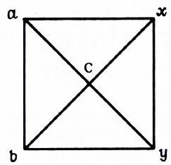
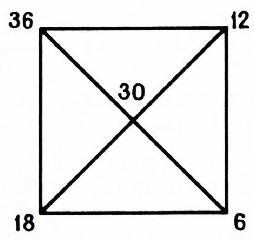

# 皮尔森方块（比例算法）

> **原标题**：Квадрат Пирсона
> **作者**：А. П. Азия（阿·彼·阿齐亚）、И. М. Вольпер（伊·米·沃尔珀）
> **译自**：Квант 1973, № 3
> **栏目**：Квант для младших школьников（小学）
> **原文**：https://www.kvant.digital/issues/1973/3/aziya_volper-kvadrat_pirsona-4af944ea/
> **主题**：算术 / 数论（比例混合问题）
> **难度**：★★（小学高年级可读，公式推导部分需稍作思考）
> **译者**：Claude（AI 初译，2026-06）

---

## 皮尔森方块

在 Я. И. 别莱尔曼（Я. И. Перельман）的《趣味代数》里，有一道挺有意思的题，题目叫《在理发店里》。题目里讲，作者有一次进了一家理发店，看到师傅们正手忙脚乱地想配出 12% 的双氧水（过氧化氢溶液）。他们手头只有两种：3% 的和 30% 的，怎么配都配不出 12% 的来。

别莱尔曼写的这道题，可不光出现在理发店里。

比如，给蓄电池充电时，要配电解液，里面得含 24% 的硫酸。可是手边只有 92% 和 10% 两种硫酸溶液，怎么配？再比如，罐头厂腌菜要 6% 的醋来调味汁，可仓库里只有 3% 和 10% 两批醋，又该怎么对？……这样的例子还能举出很多。

要解这一类「按比例混合」的问题，用「皮尔森方块」特别方便。具体怎么用呢？

先画一个正方形，再画它的两条对角线（图 1）。把两种原配料中**浓度较大**的那个数记作 $a$，写在左上角；另一个浓度记作 $b$，写在左下角；两条对角线的交点处写上**想要的混合物浓度** $c$。然后做减法：沿着第一条对角线算 $a-c$，得到的数就是**第二种配料应取的份数** $y$；再从中心沿着第二条对角线算 $c-b$，得到**第一种配料应取的份数** $x$。把 $x$ 和 $y$ 各自写在对应配料的那一行上。结论是：**取 $x$ 份第一种配料、$y$ 份第二种配料，混起来浓度正好是 $c$**。

举个例子。有两批奶油：一批含脂肪 36%，另一批含脂肪 18%。现在想配出含脂肪 30% 的混合奶油，两批各取多少？按上面说的办法（图 2）一算，得到

$$
\begin{array}{l} y = a - c = 36 - 30 = 6, \\ x = c - b = 30 - 18 = 12, \end{array}
$$

也就是说：取第一批奶油 12 份、第二批奶油 6 份，混在一起，脂肪含量就是 30%。

这个办法之所以成立，是因为我们对「混合后的总份数」做了一个特殊的约定——让它正好等于两个原配料浓度之差。这样的约定完全合理，因为我们关心的并不是配出的混合物**到底有多少**，而是两种配料之间的**相对比例**。

具体算一下：混合物的总份数是

$$
x + y = (c - b) + (a - c) = a - b
$$

份。其中「纯」物质（也就是真正的有效成分）的份数是

$$
\begin{array}{r l} \dfrac{x \cdot a}{100} + \dfrac{y \cdot b}{100} & = \dfrac{(c - b) a + (a - c) b}{100} = \\ & = \dfrac{a c - b c}{100} \end{array}
$$

份，所以混合物的浓度是

$$
\dfrac{a c - b c}{100(a - b)} = \dfrac{c(a - b)}{100(a - b)} = \dfrac{c}{100},
$$

也就是 $c\%$，正好就是想要的浓度。皮尔森方块算得没错！

> **译者注**：
> 1. 文中 `a + c` 在原文公式里应为 `a - c`（正负号笔误），译文已按上下文更正，否则后面推导不成立。这是 OCR/排版造成的差错，非原意。
> 2. 最后一步原文直接写成 $\dfrac{ac-bc}{100(a-b)}=\dfrac{c}{100}$，跳了一步。为让小读者看懂，译者补出了「提出公因式 $c$」这一中间步骤。
> 3. 别莱尔曼（Яков Исидорович Перельман，1882—1942）是苏联著名科普作家，《趣味代数》《趣味物理》《趣味几何》等书在国内有多种中译本，趣味十足。
