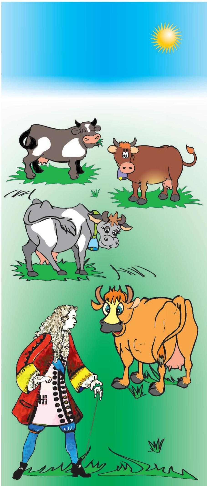

# 牛顿的牛（趣味方程）

> **原标题**：Коровы Исаака Ньютона
> **作者**：И. Акулич（伊·阿库利奇）
> **译自**：Квант 2016, № 3
> **栏目**：Квант для младших школьников（小学）
> **原文**：https://www.kvant.digital/issues/2016/3/akulich-korovyi_isaaka_nyutona-b8db3cb8/
> **主题**：算术／数论（应用题、方程）
> **难度**：★★（小学高年级在引导下可读，列方程部分偏深）
> **译者**：Claude（AI 初译，2026-06）

---

正如雅·伊·别莱利曼在《趣味代数》一书（第二章《牧场上的牛》一节）中所写，据某些记载，下面这道农业题目是艾萨克·牛顿本人提出的，或者至少出自他同时代的某个人之手：

> 整片牧场上的草长得一样密、一样快。已知 70 头牛能在 24 天里把草吃光，而 30 头牛能在 60 天里吃光。问：多少头牛能在 96 天里把整片牧场的草吃光？

直接而看起来很自然的解法，会碰上过不去的难关。真的，96 天比 24 天正好大 4 倍。所以，假如 70 头牛 24 天吃完，那么要让这顿"大餐"拖长到 4 倍之久，牛的数量也得相应减到原来的四分之一，于是变成 $70:4=17{,}5$。一得到这个答案，立刻让人想起维克多·佩列斯图金笔下那个出名的"一个半挖土工"$^{1}$——不过这还算小事。更糟的是另一件事：要是我们改用题中另一组数据，即不用 70 头牛、而用 60 天吃完草的那 30 头牛来算，那么 $96:60=1{,}6$，于是所需的牛数变成 $30:1{,}6=18{,}75$。结果就让人有一种走投无路的灰暗感觉，唯一的安慰是觉得：题目条件大概就是写错了，那这道题也就不值得去做了。

然而题目里并没有错。细心的人一眼就会注意到第一句话——关于"草还在长"的那句。奥秘正在这里$^{2}$：原来，牛一边吃、草一边长，所以牧场上的饲料储备是会增加的（虽然还不至于让牛永远吃不完）。

那这种题该怎么解呢？雅·伊·别莱利曼在同一本书里就给出了一种思路。我们引用他的推理如下。

引进一个辅助未知数，用它表示草一天的增量占牧场原有草量的几分之几。一天长出 $y$，24 天就长出 $24y$；如果把原有草的总量记作 $1$，那么在 24 天里牛群一共吃掉 $1+24y$。于是一天里——

整个牛群（70 头牛）一天吃掉 $\dfrac{1+24y}{24}$，所以一头牛一天吃掉 $\dfrac{1+24y}{24\cdot 70}$。同样地，由"30 头牛能在 60 天里吃光同一片牧场的草"推出：一头牛一天吃掉 $\dfrac{1+60y}{30\cdot 60}$。可是同一头牛一天吃掉的草量，对两个牛群来说应当相同。所以

$$
\frac{1+24y}{24\cdot 70}=\frac{1+60y}{30\cdot 60},
$$

由此 $y=\dfrac{1}{480}$。求出 $y$（也就是草每天的长量）之后，就容易算出一头牛一天吃掉了原有草量的几分之几：

$$
\frac{1+24y}{24\cdot 70}=\frac{1+24\cdot\dfrac{1}{480}}{24\cdot 70}=\frac{1}{1600}.
$$

最后，为了完成原题，再列一个方程：设所求的牛数为 $x$，则

$$
\frac{1+96\cdot\dfrac{1}{480}}{96x}=\frac{1}{1600},
$$

解得 $x=20$。也就是说，**20 头牛**能在 96 天里把草吃光。

解法就是这样。不能不说，做得扎实、严谨。可是实在太啰嗦了——读到结尾，开头都快要忘光了。难道就不能短一点吗？

可以。而这件事最大的帮手，不是故事里的主角——牛，而是……出题人本人！艾萨克·牛顿不但是天才的数学家，还是同样天才的物理学家（牛顿定律自己会说话！）。这位伟大的科学家把"运动的相对性原理"放到了严格的数学轨道上，并且巧妙地用它解决了很多问题。那么，让我们也来把题目改写一下，让它的物理本质走到台前。为此，我们把"长草的牧场和牛"换成"流淌的河和汽艇"。于是得到下面这道题。

我们把汽艇在静水中航行的速度叫做它的**自身速度**（船速）。如果一艘汽艇以 $70$ 千米/小时的自身速度逆流而上，那么它 $24$ 小时能到达目的地；如果以 $30$ 千米/小时的自身速度航行，则要 $60$ 小时才到。问：它要以多大的自身速度航行，才能恰好用 $96$ 小时到达目的地？

在这里，"牛的数量"变成了"汽艇的速度"，而"不停生长的草"变成了"迎面而来的水流"（当然，这些具体数值在现实中并不靠谱，但有谁在乎呢）。接下来，不偏离别莱利曼太远，我们用 $x$ 记汽艇的自身速度，用 $y$ 记水流的速度。那么同一段路程（汽艇要走的距离）可以用三种方式写出来，这就给出了下面这组方程：

$$
(70-y)\cdot 24=(30-y)\cdot 60=(x-y)\cdot 96.
$$

它解起来比煮萝卜还容易，而最要紧的是既简单又直观。答案当然和前面算出来的一样：$x=20$（$y$ 的值我们其实并不关心；不过要是好奇去算一算，会发现 $y=3\dfrac{1}{3}$；请你自己琢磨琢磨，为什么这个值跟前面算出的 $\dfrac{1}{480}$ 不一样）$^{3}$。

由此可见，那句著名的剧场欢呼——"叫作者出来！"——在解数学题时也能大显身手。在此我们也祝愿小读者们都能这样用上它。最后，为了确认你确实把这个窍门掌握得牢牢的，请试着解一道更难一点的题，它同样出自别莱利曼的《趣味代数》：

> 有三片牧场，草长得一样密、一样快，面积分别是 $3\dfrac{1}{3}$ 公顷、$10$ 公顷和 $24$ 公顷。第一片曾在 $4$ 周里养活了 $12$ 头牛；第二片在 $9$ 周里养活了 $21$ 头牛。问：第三片在 $18$ 周里能养活多少头牛？

不出所料，别莱利曼书里给出的解答，足足占去了将近两页篇幅（这里就不照抄了）。但你，当然，用不着花那么大力气。动手吧！

---

> **译者注 1**：维克多·佩列斯图金是苏联儿童文学作品《瓦尼亚·佩列斯图金历险记》里不爱学习的小主人公，他算出过"一个半挖土工"这种荒唐答案，是俄语里形容算术出错时常用的典故。

> **译者注 2**：俄语习语"狗就埋在这里"（вот где зарыта собака）意为"奥秘就在这里／问题症结就在此"，与狗无关。

> **译者注 3**：原文为 $y=3\dfrac{1}{3}$。注意：前一段用"草的日增量占原草量几分之几"作 $y$，得到 $\dfrac{1}{480}$；这里改成"水流速度"作 $y$，是另一种标度，二者并不直接相等。题目把两种模型作了类比对应，但变量含义不同，所以数值也不同——这正是作者让读者"自己琢磨"的点。

---

**OCR 修正说明**：原文公式经 OCR 后存在多余空格（如 `\frac {1 + 2 4 y}`、`(7 0 - y)` 等），译文中已合并为规范的 `\frac{1+24y}`、`(70-y)` 等，保证 LaTeX 可正常渲染。OCR 中出现的小数点写作逗号（俄文习惯，如 `17,5` 即 $17.5$），译文中按数学排版惯例保留 `$17{,}5$` 写法。meta.json 显示本文真正属于正文的图仅 1 张（`fig_p25_01`，对应 hash `591ae84…`）；images/ 目录下其余 4 张 jpg 为 OCR 串入的邻页图片，已按翻译指南第五节剔除，未译入。
