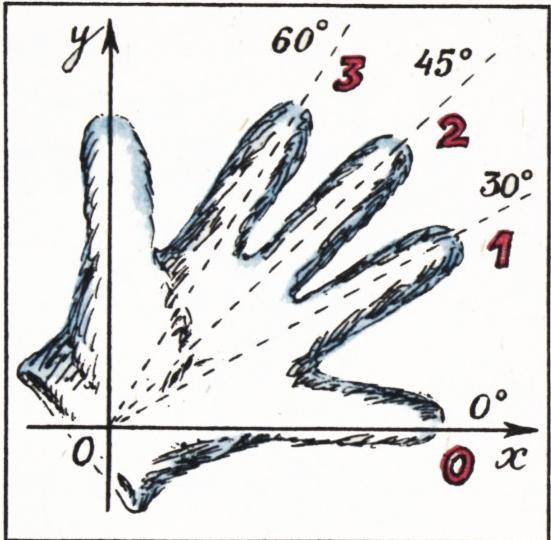

# 心算与指算（读者来信综述）

> **原标题**：В уме и на пальцах (обзор писем)
> **作者**：А. П. 萨文（Савин А. П.），物理-数学副博士
> **译自**：Квант 1984, № 1
> **栏目**：Квант для младших школьников（小学）
> **原文**：https://www.kvant.digital/issues/1984/1/savin-v_ume_i_na_paltsah-e51dc81c/
> **主题**：算术 / 数论（速算窍门）
> **难度**：★★（部分证明用到代数展开，小学高年级可读懂算法，证明宜初中预备）
> **译者**：Claude（AI 初译，2026-06）

---

## 心算与指算

## （读者来信综述）

## 物理-数学副博士 А. П. 萨文

去年《Kvant》第五期上刊登了 Р. Ш. 达涅利亚（Данелия）的文章《用手指和心算》。那篇文章讲了如何用手指做一位数乘法，以及一些两位数的心算速乘窍门（特别讲了末位是 5 的两位数如何速算平方）。文章最后写道：「要是你们还想得出别的速算乘法窍门——请写信告诉我们！」

读者们热烈响应了这个号召。来自顿涅茨克的数学老师 Ф. И. 韦妮科娃（Венникова）写道：

> **1.** 要把第五个十位段里的数（41、42、……、49）求平方，只要把它的个位数加上 15，再在所得的和后面接上「个位数与 10 之差的平方」（如果这个平方只有一位，就在前面补一个 0）。
>
> 例如：
> $$
> \begin{array}{l} 4 3 ^ {2} = (1 5 + 3) \cdot 1 0 0 + 7 ^ {2} = 1 8 4 9, \\ 4 8 ^ {2} = (1 5 + 8) \cdot 1 0 0 + 2 ^ {2} = 2 3 0 4. \end{array}
> $$
>
> **2.** 把第六个十位段里的数（51、52、……、59）求平方就更简单了。只要把它的个位数加上 25，再在所得的和后面接上个位数的平方。
>
> 例如：
> $$
> \begin{array}{l} 5 4 ^ {2} = (2 5 + 4) \cdot 1 0 0 + 4 ^ {2} = 2 9 1 6, \\ 5 7 ^ {2} = (2 5 + 7) \cdot 1 0 0 + 7 ^ {2} = 3 2 4 9. \end{array}
> $$

证明如下：

$$
\begin{array}{r l} (4 0 + a) ^ {2} & = 1 6 0 0 + 8 0 a + a ^ {2} = \\ & = 1 5 0 0 + 1 0 0 + 1 0 0 a - \\ & - 2 0 a + a ^ {2} = \\ & = (1 5 0 0 + 1 0 0 a) + \\ & + (1 0 0 - 2 0 a + a ^ {2}) = \\ & = (1 5 + a) \cdot 1 0 0 + \\ & + (1 0 - a) ^ {2}. \end{array}
$$

$$
\begin{array}{r l} 2. \quad (5 0 + a) ^ {2} & = 2 5 0 0 + 1 0 0 a + a ^ {2} = \\ & = (2 5 + a) \cdot 1 0 0 + a ^ {2}. \end{array}
$$

$$
\begin{array}{c c c} * & * & * \end{array}
$$

来自哈尔科夫的老师 В. В. 哈佐诺夫（Хазанов）提出了下面这种速乘末位是 5 的两位数的方法：先把两个数按从小到大排列，用较小数的十位数字去乘「较大数的十位数字加 1」，再加上两个十位数字差的一半的整数部分；最后，如果差是偶数，就在末尾接上 25，如果差是奇数，就接上 75。我们这段话听起来挺啰嗦，但方法本身非常简单，看下面的例子就明白了：

$$
\begin{array}{r l} 3 5 \cdot 7 5 & = (3 \cdot 8 + \dfrac {7 - 3}{2}) \cdot 1 0 0 + 2 5 = 2 6 2 5, \\ 2 5 \cdot 5 5 & = (2 \cdot 6 + [ \dfrac {5 - 2}{2} ]) \cdot 1 0 0 + \\ & + 7 5 = 1 3 7 5. ^ {*} \end{array}
$$

> **译注**：记号 $[\,x\,]$ 表示取 $x$ 的整数部分（向下取整）。

证明这条规则成立这件事，我们留给读者当作练习。

\* \* \*

格鲁吉亚苏维埃社会主义共和国萨姆特列季亚区纳巴凯维中学十年级学生玛娜娜·万索夫斯卡娅（Манана Вансовская），提出了一个把末位是 25 的三位数速算平方的方法：

> 要把一个末位是 25 的三位数求平方，就在末尾写下 625，然后把它的百位数字乘以 5；把所得乘积的最后一位写在 625 前面，第一位则记在心里。之后把原来那个数的百位数字平方，再加上刚才记在心里的那一位数字，把所得结果写在前面已经写好的那些数字的最前面。

例如，求 325 的平方时，先算 $3 \cdot 5 = 15$，在 625 前面写 5，并记住 1：

$$
\begin{array}{r l} (3 2 5) ^ {2} & = 1 0 0 0 0 \cdot (3 ^ {2} + 1) + 1 0 0 0 \cdot 5 + \\ & + 6 2 5 = 1 0 5 6 2 5. \end{array}
$$

玛娜娜还给出了一个类似的、用于把末位是 125 的四位数速算平方的方法。我们请读者们来论证玛娜娜所讲的、末位是 25 的三位数平方方法为什么成立，并自己试着想出她所说的四位数情形的那个「类似方法」。

\* \* \*

莫斯科州叶戈里耶夫斯克市第二中学七年级学生米沙·佩尔瓦科夫（Миша Перваков），想出了一个非常有趣的用手指帮助记忆正弦、余弦主要角度的数值和正负号的办法：

> 我们看着左手的手心，给手指这样编号：小指为 0、无名指为 1、中指为 2、食指为 3、大拇指为 4。当手指尽量张开时，它们大致对应着第一象限里那些「主要」角度：0°、30°、45°、60°、90°（见图 1）。这些角度的正弦值，就等于「分给那根手指的编号」的平方根的一半。

例如，

$$
\begin{array}{r l} \sin 4 5 ^ {\circ} & = \dfrac {1}{2} \sqrt {\text {中指的编号}} = \\ & = \dfrac {1}{2} \sqrt {3}. \end{array}
$$

> **译者注**：这里原文笔误。中指编号是 2，所以按此法应是 $\tfrac{1}{2}\sqrt{2}$；$\sin 45^\circ = \tfrac{\sqrt{2}}{2}$ 才对。原文例子取 $\sqrt{3}$ 与所给规则不符。下表给出的是正确数值。

余弦值的求法完全类似，只是要把手指反过来编号：大拇指为 0，……，小指为 4。

这些数值可以整理成一张很好记的表，这张表是 Л. Ф. 别洛夫（Белов）老师（伏尔加格勒州杜博夫卡市）寄到编辑部来的：

| $\alpha$       | $0^\circ$        | $30^\circ$       | $45^\circ$       | $60^\circ$       | $90^\circ$       |
|----------------|------------------|------------------|------------------|------------------|------------------|
| $\sin \alpha$  | $\sqrt{0/2}$     | $\sqrt{1/2}$     | $\sqrt{2/2}$     | $\sqrt{3/2}$     | $\sqrt{4/2}$     |
| $\cos \alpha$  | $\sqrt{4/2}$     | $\sqrt{3/2}$     | $\sqrt{2/2}$     | $\sqrt{1/2}$     | $\sqrt{0/2}$     |

> **译注**：表中 $\sqrt{k/2}$ 即 $\dfrac{\sqrt{k}}{2}$，如 $\sin 30^\circ = \dfrac{\sqrt{1}}{2} = \dfrac{1}{2}$，$\sin 60^\circ = \dfrac{\sqrt{3}}{2}$。整张表的规律是：正弦从 $0$ 到 $\sqrt{4}$ 递增，余弦则反过来递减——非常好记。
