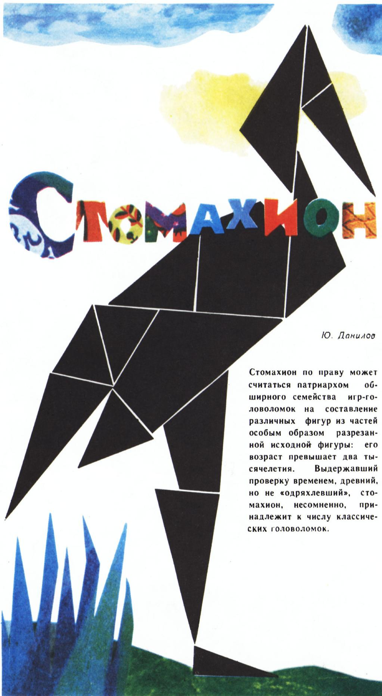
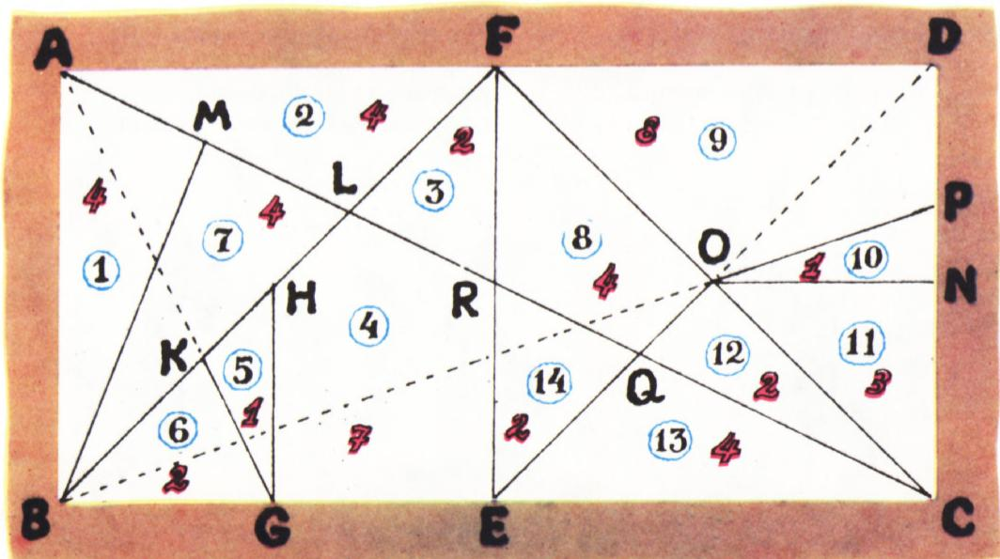
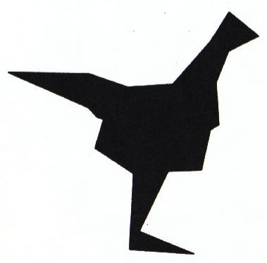
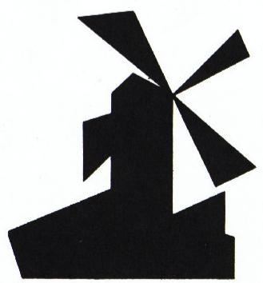
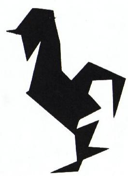
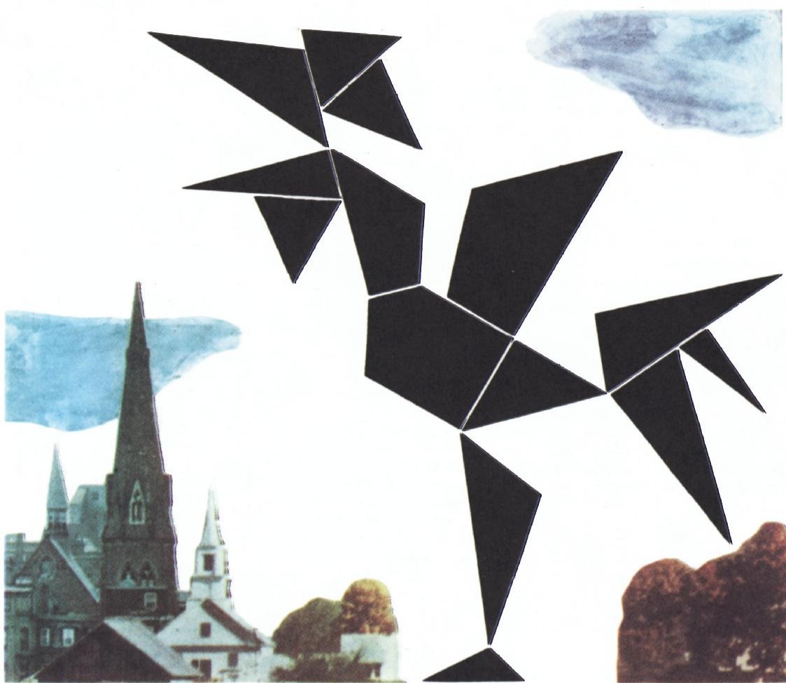

# 十四巧板（阿基米德游戏）

> **原标题**：Стомахион
> **作者**：Ю. А. Данилов（尤·阿·丹尼洛夫）
> **译自**：Квант 1978, № 8
> **栏目**：Квант для младших школьников（小学）
> **原文**：https://www.kvant.digital/issues/1978/8/danilov-stomahion-b4798a66/
> **主题**：几何
> **难度**：★★（小学高年级可读，部分证明偏深）
> **译者**：Claude（AI 初译，2026-06）

---

10. 丹尼洛夫

十四巧板（стомахион）堪称一大家族拼图游戏的「老祖宗」——这类游戏的玩法都是把一种按特殊方式切开的图形，重新拼成各种各样的形状。十四巧板的年龄已经超过两千年。它经住了时间的考验，古老却并不「老朽」，毫无疑问属于经典拼图之列。

## 开始玩游戏吧

图 1 给出了最常见的十四巧板「毛坯」的切割方式：一个长宽比为 $1:2$ 的长方形 $ABCD$。除了这种长方形，有时也用正方形，甚至用任意平行四边形。无论用哪种原图形，分割方法都是一样的。

设 $ABCD$ 是任意平行四边形，$F$、$E$ 分别是边 $AD$ 和 $BC$ 的中点。连一条线段 $EF$，就把原平行四边形分成两个平行四边形 $ABEF$ 和 $FECD$。再连对角线 $AC$、$BF$ 和 $FC$。设 $L$ 和 $R$ 分别是对角线 $AC$ 与对角线 $BF$、与线段 $EF$ 的交点。过线段 $BE$ 的中点 $G$ 作一条与原平行四边形的边 $AB$ 平行的直线，与对角线 $BF$ 交于点 $H$；再连线段 $GK$ 沿直线 $GA$（其中 $K$ 是直线 $GA$ 与对角线 $BF$ 的交点）。最后，把顶点 $B$ 与线段 $AL$ 的中点 $M$ 用一条直线段连起来，这样平行四边形 $ABEF$ 就被分成了 7 块。

设 $N$ 和 $O$ 分别是线段 $CD$ 和 $FC$ 的中点。连线段 $ON$ 和 $OE$。设 $Q$ 是线段 $OE$ 与对角线 $AC$ 的交点，$P$ 是直线 $BO$ 与原平行四边形边 $CD$ 的交点。连线段 $OP$。平行四边形 $FECD$ 也被分成了七块。

这样一来，原平行四边形 $ABCD$ 就被分成了 14 块。

拼新图形时，可以把零件翻过来，「正面」朝下。唯一要盯紧的是：拼出来的图形必须包含十四巧板的全部零件——一个都不能少，一共 14 块。图 2—4 里那些小图形，都是遵守了这条铁规矩拼出来的。等你掌握了「十四巧板马赛克」的窍门（也就是看懂这些小图形是怎么搭起来的），你就能拼出属于自己的作品了。

## 一点历史

在几何拼图里，十四巧板不仅以「年纪大」出名，它的来历也很特别。

「十四巧板」这种游戏在公元前就有了。我们在公元 4—6 世纪一些罗马作家的著作中也能找到对它的提及。人们一直把十四巧板的发明者认作阿基米德，可是很长时间都找不到文献证据。

1899 年，瑞士历史学家海因里希·祖特（Heinrich Suter）在柏林和剑桥的缩微胶片库里，发现了一份阿拉伯文手稿，内容是一部著作的残篇，书名叫《阿基米德论十四巧板图形分为与其成有理关系的 14 部分》。有人

图 1.

怀疑这部著作到底是不是阿基米德写的。但是当著名的丹麦数学史家伊·海伯格（J. L. Heiberg）——而且足不出户，就在自己书房里——发现了这部阿基米德著作若干残篇的古希腊文原稿时，一切疑虑都烟消云散了。

引起海伯格注意的，是耶路撒冷图书馆目录 1899 年第 4 卷上登的一则短讯，作者是圣彼得堡大学编外讲师帕帕多普洛—凯拉梅夫斯（Papadopulo-Keramevs），讲的是君士坦丁堡「圣母安息」修道院里的一份手稿。这份手稿大部分是一种所谓「重写本」（palimpsest），也就是写在羊皮纸上、而原来的字迹已经被洗掉再重新写上别的字的本子。据苏联著名史学家西·雅·卢里叶（С. Я. Лурье）记载：「由于他在数学和精密科学史方面一窍不通，帕帕多普洛只对上面那一层基督教文字感兴趣；至于下面那层被洗掉的、其实并不难辨认的文字，他在耶路撒冷图书馆目录里只引了一小段。可是对大名鼎鼎的丹麦数学史家海伯格来说，这一小段就足够让他断定：被洗掉的，正是阿基米德的文字。」

海伯格到 1906 年才亲眼看到手稿原件。在 177 张羊皮纸中，只有 29 张找不到任何原有文字的痕迹；另有 9 张，早先的字迹在被洗去时已无可挽回地损毁，只能勉强认出零星几个字。其余各页的「下层」文字都相当清晰。

通过研究手稿原件及其照片副本，海伯格弄清了手稿主体部分的内容。

海伯格的这项学术壮举，让下列几部几乎从无到有地被抢救回来的阿基米德著作重见天日：《论球与圆柱》（大部分）、《论螺线》（几乎完整）、《圆的度量》与《论平面图形的平衡》（残篇）、《论浮体》以及《致埃拉托色尼的信》（相当一部分）。在被抢救回来的文字里，还有阿基米德十四巧板一书中的两条定理。

海伯格的发现，终结了一场由来已久的争论：阿基米德的这个游戏到底该叫什么名字——「стомахион」（意为「令人抓狂的」），还是「остомахион」（「骨片之战」），或者「синтемахион」（「碎片的集合」）？在海伯格找到的那段残篇里，白纸黑字写的是「стомахион」。

> **译者注**：这三个候选名字来自希腊语词根：στομάχιον（与「口、怒气」相关）、ὀστομάχιον（ὀστόν「骨头」+ μάχη「战斗」）、συνθεμαχιον（σύν「合」+ τέμαχος「切片」）。中文里习惯统称「十四巧板」。

## 《阿基米德论十四巧板》一书摘录

「既然所谓的十四巧板包含了若干关于拼组其组成图形的研究，那么关于十四巧板的各个部分，我认为首先必须说明：它由几部分组成，每一部分又与什么图形相似。接着我阐述了：要拼成直角，需要什么样的角，使两两相配。然后我打算仔细讨论十四巧板各部分彼此相邻的所有可能情形，并判定相邻部分的边是否落在

图 2. 母鸡。

图 3. 风车。

图 4. 公鸡.

图 5.

同一条直线上，或者与直线的偏离小到肉眼难以察觉。这些问题都需要严谨的证明；而如果与直线的偏离很小、肉眼难以察觉，那么这种「不完全贴合」就应当被看作是可以接受的。

既然可以用一块与另一块相等、且各角也相等的零件去替换它，那么就能拼出许许多多不同的图形……有时，两块图形合起来，与某一块图形相等且相似；或者两块图形合起来，与另外两块图形相等且相似——正是这一点，使得在重新摆放零件时，可以拼出许许多多的图形。」

## 阿基米德的题目

阿基米德所给出的「十四巧板图形」（图 1）的分割方式有这样一条性质：全部 14 块的面积，与原图形面积之比都是有理数。

**题 1.** 试证：原图形（原平行四边形）各块的面积，若以原图面积的「四十八分之一」为单位来表示，所得数值正如图 1 中红色数字所标的那样。

下面这道题取自埃米尔·富雷（Émile Fourrey）的《几何谜题与诡辩》（Одесса, «Mathesis», 1912）一书：

**题 2.** 把十四巧板的零件重新分组，使新分出的每一块的面积（仍以原平行四边形面积的「四十八分之一」为单位）分别为：

а) 三个相等的整数；

б) 三个连续的整数；

в) 从 1 到 8 的整数，再加上数 12。

请注意，本题的三个小问都不必把原平行四边形拆散，只要在各零件之间画上分割线就能解决。
