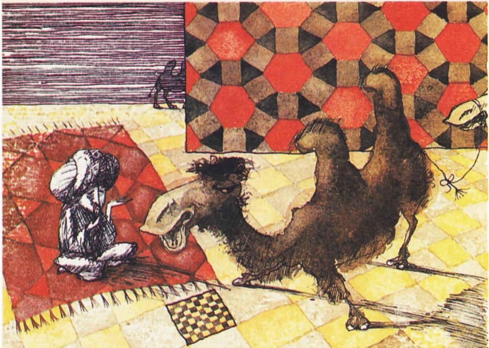
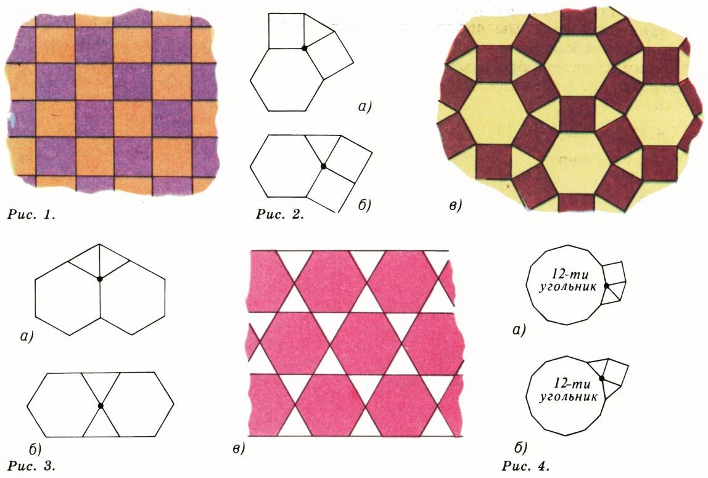

# 分数—骆驼—铺砌

> **原标题**：Дроби — верблюды — паркеты
> **作者**：В. Л. Гутенмахер（古滕马赫尔 V. L.）
> **译自**：Квант 1989, № 1
> **栏目**：Квант для младших школьников（小学）
> **原文**：https://www.kvant.digital/issues/1989/1/gutenmaher-drobi_verblyudyi_parketyi-ad424cf1/
> **主题**：几何、算术
> **难度**：★★（小学高年级可在指导下阅读）
> **译者**：Claude（AI 初译，2026-06）

---

常常会有这样的情形：同一道数学题，会自然地出现在完全不相干的场合里——从智力游戏到实际计算。今天我们就来谈谈这样一道题。

## 一道算术题

求出所有的自然数四元组 $(p, q, r, s)$，使下面这个等式成立：

$$
\frac{1}{p} + \frac{1}{q} + \frac{1}{r} + \frac{1}{s} = 1.
$$

我们约定 $p \leqslant q \leqslant r \leqslant s$。那么最小的数 $p$ 不会超过 4（否则 $\dfrac{1}{p} + \dfrac{1}{q} + \dfrac{1}{r} + \dfrac{1}{s} < 1$），当然也不会小于 2。所以要分三种情况讨论：$p = 2$、$p = 3$、$p = 4$。

设 $p = 2$。那么 $\dfrac{1}{q} + \dfrac{1}{r} + \dfrac{1}{s} = \dfrac{1}{2}$。再估计最小的数 $q$：它不能大于 6（否则 $\dfrac{1}{q} + \dfrac{1}{r} + \dfrac{1}{s} < \dfrac{1}{2}$），并且不能小于 3。

现在把四个可能的 $q$ 值代入等式 $\dfrac{1}{q} + \dfrac{1}{r} + \dfrac{1}{s} = \dfrac{1}{2}$：$q=3$、$q=4$、$q=5$、$q=6$，再估计 $r$，然后讨论所有可能的 $r$，从而求出 $s$。

另外两种情况（$p=3$ 和 $p=4$）也可以照这个办法做。

读者只要自己把所有可能都试一遍，就会发现一共存在 14 个不同的四元组 $(p, q, r, s)$。它们是：

$$
\begin{array}{lll}
(2,3,7,42), & (2,4,5,20), & (3,3,4,12), \\
(2,3,8,24), & (2,4,6,12), & (3,3,6,6), \\
(2,3,9,18), & (2,4,8,8), & (3,4,4,6), \\
(2,3,10,15), & (2,5,5,10), & (4,4,4,4). \\
(2,3,12,12), & (2,6,6,6), &
\end{array}
$$

奇妙的是，这个结果（以及一些相近的结果，例如三元方程 $\dfrac{1}{p} + \dfrac{1}{q} + \dfrac{1}{r} = 1$ 的自然数解）会和许多截然不同的问题有关系。下面我们来讲两个。

## 一个有趣的故事

很久以来就流传着一个分遗产的故事。

有一个人，留给三个儿子 17 头骆驼做遗产。他遗嘱中规定：大儿子得一半，二儿子得三分之一，小儿子得九分之一。

为了公平地分这份遗产，三兄弟去找一位以智慧闻名的法官。

法官的做法出人意料。他在 17 头骆驼上又加了一头——是他自己的骆驼。从这 18 头骆驼里，他分给大儿子一半——9 头，分给二儿子三分之一——6 头，分给小儿子九分之一——2 头。这样一来，他一共分出去了 $9+6+2=17$ 头，而自己的那一头又拿了回去。

三位继承人都很满意，因为每个人分到的比原本应得的还要少一些，原本应得分别是：$\dfrac{17}{2}=8\dfrac{1}{2}$、$\dfrac{17}{3}=5\dfrac{2}{3}$、$\dfrac{17}{9}=1\dfrac{8}{9}$ 头骆驼。

这个悖论其实不难解释：要么是父亲算术不好，要么是他心里还想着另一个人——因为他并没有把全部遗产都留给儿子。只要把应分给三兄弟的份额加起来就看出来了：

$$
\frac{1}{2} + \frac{1}{3} + \frac{1}{9} = \frac{17}{18}.
$$

由此也可以明白，为什么 18 头骆驼能"解决问题"——因为 18 是 2、3、9 的最小公倍数。法官是按照 $\dfrac{1}{2} : \dfrac{1}{3} : \dfrac{1}{9}$ 的比例来分配全部遗产的，因为没有别的继承人了。

我们来看一看，这个故事里的数能不能换成别的。设 $\dfrac{1}{p}$、$\dfrac{1}{q}$、$\dfrac{1}{r}$（$p \leqslant q \leqslant r$）是遗嘱中规定的份额，并设驼群共有 $s-1$ 头骆驼。法官添上一头骆驼，就变成了 $s$ 头。数 $s$ 必须能被 $p$、$q$、$r$ 整除，而且做除法得到的商加起来要等于 $s-1$（这样法官才能拿回自己的那头骆驼）。把这些条件写成一个等式就是：

$$
\frac{s}{p} + \frac{s}{q} + \frac{s}{r} = s - 1.
$$

这个等式可以改写成：

$$
\frac{1}{p} + \frac{1}{q} + \frac{1}{r} + \frac{1}{s} = 1.
$$

所有这样的四元组 $(p, q, r, s)$ 我们已经知道了，只要从中挑出 $s$ 能被 $p$、$q$、$r$ 整除的那些就行。在 14 个可能的四元组里有 12 个具备这种性质，它们是：

$$
\begin{array}{lll}
(2,3,7,42), & (2,4,5,20), & (2,6,6,6), \\
(2,3,8,24), & (2,4,6,12), & (3,3,4,12), \\
(2,3,9,18), & (2,4,8,8), & (3,3,6,6), \\
(2,3,12,12), & (2,5,5,10), & (4,4,4,4).
\end{array}
$$

经典故事里用的是四元组 $(2,3,9,18)$：$\dfrac{1}{2} + \dfrac{1}{3} + \dfrac{1}{9} + \dfrac{1}{18} = 1$。如果换用第一个四元组来编故事，那么驼群里就会有 41 头骆驼，三兄弟的份额分别是 $\dfrac{1}{2}$、$\dfrac{1}{3}$、$\dfrac{1}{7}$^\*)。

法官添上自己的一头骆驼（变成 42 头），分别给三兄弟 21、14、6 头（一共 41 头），再把自己的那头拿回去。

> **译者注**（对应原文星号脚注 \*）：这种"借一还一"的故事还有许多变体，可在数学游戏书中查阅。

## 一道实际题目

最简单的"正则铺砌"，就是把平面分成一个个方格（图 1）。有意思的是：除了这种之外，还有多少种这样的铺砌——在每个顶点处都聚拢着四个正多边形，而且所有顶点的构造都一样（"构造一样"是说，把整个铺砌平移一下，可以让任意一个指定顶点跑到另一个任意指定顶点的位置，并且所有边线都重合）。这可是一道实打实的实际题。

我们知道，正 $n$ 边形的内角和是 $180^\circ(n-2)$，所以每一个内角是

$$
\frac{180^\circ (n-2)}{n} = 180^\circ - \frac{360^\circ}{n}.
$$

设在一个顶点处聚拢着四个正多边形的角：$p$ 边形、$q$ 边形、$r$ 边形、$s$ 边形的角。这四个角加起来应当等于 $360^\circ$。把这个条件写出来：

$$
\left(180^\circ - \frac{360^\circ}{p}\right) + \left(180^\circ - \frac{360^\circ}{q}\right) + \left(180^\circ - \frac{360^\circ}{r}\right) + \left(180^\circ - \frac{360^\circ}{s}\right) = 360^\circ.
$$

不难看出，这个等式就化成了我们熟悉的那个关系：

$$
\frac{1}{p} + \frac{1}{q} + \frac{1}{r} + \frac{1}{s} = 1.
$$

如果约定 $p \leqslant q \leqslant r \leqslant s$，那么所有这样的四元组我们已经知道了——共 14 个。但这里说的是多边形，所以要把 $p = 2$ 的那些去掉（没有"二边形"）。这样就剩下四个：

$$
(4,4,4,4),\quad (3,4,4,6),\quad (3,3,6,6),\quad (3,3,4,12).
$$

第一个四元组对应的是全等的正方形铺砌（每个顶点处聚拢 4 个正四边形——见图 1）。

第二个四元组 $(3,4,4,6)$ 给出两种顶点的拼法（图 2，a、b），但其中只有图 2, a 那种能拼成正则铺砌——得到图 2, в。

第三个四元组 $(3,3,6,6)$ 也对应两种在顶点处的摆法（图 3, а、б），并且只有图 3, б 所示的第二种能拼成正则铺砌（图 3, в）。

第四个四元组 $(3,3,4,12)$ 对应的两个图（图 4, а、б）都不能拼成正则铺砌。

所以，在每个顶点处聚拢四个正多边形的正则铺砌，一共只有三种。

总的来说，不同的正则铺砌恰好有 11 种，而在一个顶点处聚拢的多边形个数可以是 3、4 或 6。《量子》杂志以前讲过这件事，不过那是很久以前了——奥·米哈伊洛夫的文章《十一种正则铺砌》（见《量子》1979 年第 2 期）。

---

**译者说明**：本文原版 OCR 中在正文之后串入了另一篇无关文章《避雷针、政治与……帽针》（Громоотвод, политика и... шляпки，作者 Л. Н. Крыжановский），属于同期杂志相邻页码的混入内容，与本篇主题无关，按翻译指南第五节予以剔除，未译。
