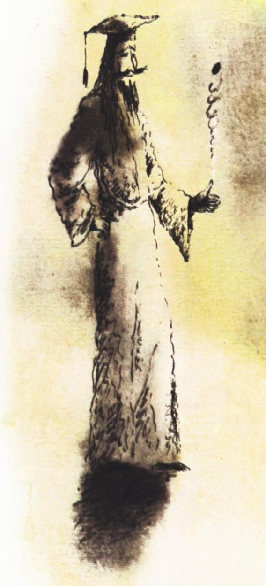
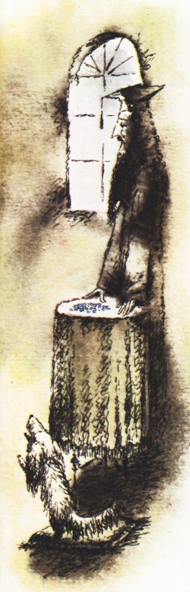
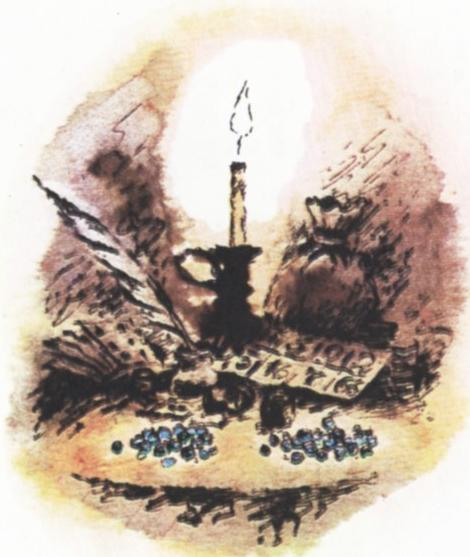

# 游戏大师做客 Kvant

> **原标题**：Магистр Игры в гостях у «Кванта»
> **作者**：В. Л. Гутенмахер（古滕马赫尔）
> **译自**：Квант 1983, № 4
> **栏目**：Квант для младших школьников（小学）
> **原文**：https://www.kvant.digital/issues/1983/4/gutenmaher-magistr_igryi_v_gostyah_u_kvanta-f4bedf18/
> **主题**：博弈论（取物游戏）
> **难度**：★（小学高年级可读）
> **译者**：Claude（AI 初译，2026-06）

---

我们请来了「游戏大师」做客 Kvant 编辑部——他是博奕论方面的知名专家，知道很多古老的游戏，也常常自己发明新的游戏。

——尊敬的大师，请您给我们讲讲游戏吧。

**大师**。我们就从一个最简单的游戏开始吧，把它叫做「入门游戏」。

> **入门游戏**。桌上放着 66 颗珠子。第一位玩家可以拿走 1 到 9 颗珠子；第二位玩家再从剩下的珠子里拿走 1 到 9 颗，如此轮流下去。**谁把最后的珠子全部拿走，谁就赢。**

这个游戏取名叫「入门游戏」，是有两层意思的。第一层：游戏本身简单，正适合用它向初学数学的小朋友展示思考的方法。第二层：在这个游戏里，**只要会正确地走，先走的人（也就是开局的那一位）就一定会赢**。

——如果您先走，您会怎么下？

**大师**。我会先拿 6 颗，桌上就剩下 60 颗。无论对手怎么走，接下来我都能设法让桌上剩下 50 颗，再下一步让桌上剩下 40 颗，然后是 30 颗……如此下去，直到剩下 0 颗。我赢了。

如果不是我先开局，而是先开局的对手懂得上面这套下法，那么他就赢了。所以，两位大师之间其实只要抛个硬币

来决定谁先走就够了。这之后他们甚至可以不下棋——胜负已经一目了然。

——那如果对手先开局，但他并不知道正确的下法，该怎么办呢？

**大师**。我们已经知道什么叫「**必胜局面**」——就是走完一步之后，桌上剩下的珠子数是 10 的倍数。我们要做的就是：一有机会，就把局面带入这样的位置。

——您是怎么识破这个游戏的秘密的？

**大师**。我是**从游戏的结尾倒过来想**的，而不是从开头顺着想。假定我赢了，也就是我把最后的珠子拿走了。要做到这一点，只可能是上一步对手在桌上留了 1 到 9 颗珠子。而要**逼**他这么做，我就得在自己再上一步走完后，给桌上留下正好 10 颗珠子。这就是一个必胜局面。同样地，再上一步（其实也就是更靠前的）必胜局面，是给桌上留下 20 颗珠子。这些必胜局面此后**按规律重复出现**。最末一个、也就是开局之后**最先要达到的那个必胜局面**，是给桌上留下 60 颗珠子。我们已经知道，第一步就可以拿走 6 颗珠子，正好走进这个局面。

你看，我的秘密很简单：**从游戏的结局倒着想，找出必胜局面**；当然，还要注意它们是怎样按规律重复出现的。

——谢谢大师。您能再给我们介绍几个别的游戏吗？

**大师**。刚才这个游戏很容易推广：我们设一开始桌上有 $N$ 颗珠子，每位玩家每次可以拿走 $1$ 到 $p$ 颗。给 $N$ 和 $p$ 取不同的具体数值，就得到各种具体的游戏。比如取 $p=9$、$N=66$，就得到了我们的「入门游戏」。

——那么，有没有一条**对任何这样的游戏都适用**的规则呢？

**大师**。有的。如果数 $N$ 不能被 $p+1$ 整除，那么在正确的下法下，**先走的人赢**。他要做的，是第一步先拿走若干颗珠子，使得剩下的数能被 $p+1$ 整除（也就是拿走 $r$ 颗，其中 $r$ 是 $N$ 除以 $p+1$ 的余数），此后就一直采用这套战术。

如果数 $N$ 能被 $p+1$ 整除（设 $N=k(p+1)$），那么**后走的人赢**。无论对手怎么开局，他都能始终把自己送到必胜局面：$(k-1)(p+1)$、$(k-2)(p+1)$，如此等等。

——这个「入门游戏」还能再改一改吗？

**大师**。能。比方说，有一种游戏叫「**偶数者胜**」。两位玩家同样轮流从一堆珠子里每次拿 1 到 $p$ 颗，但这堆珠子开始时是**奇数**颗。这一回，取胜的不是拿走最后一颗的人，而是当桌上的珠子全部被拿光之后，**自己手里的珠子总数是偶数**的那位玩家。这个游戏要有趣得多——想赢可难多了。

——据说即便如此，您在这种游戏里也是场场必胜，这是真的吗？

**大师**。只要让我先选择是开局还是后走，那我就一定能赢。我知道一条定理——在这一类游戏里，两位玩家当中必定有一位拥有「必胜策略」。这条博弈论的精彩结论给了我信心，于是我认真准备，结果真的找到了取胜的窍门。

> **译者注**：脚注 *) 原文标注此处为「**零和、完全信息、有限**」类游戏。意思是：双方利益完全对立（一人所赢即另一人所输）、规则和局面双方都看得见、游戏在有限步内一定结束。下棋、跳棋都属于这一类。原注 \*\*) 说：游戏大师找到的必胜窍门，将在本栏目的另一篇文章里专门介绍。原注 \*\*\*) 是这首小诗的出处说明。

为了说明这一点，我念一首我的朋友、同样身为「游戏大师」的约瑟夫·克内希特（Иозеф Кнехт）写的小诗：

> 你在纸上落笔，意义便已分明，
> 又随着笔尖的游走而固定。
> 它对后来者彻底透明——
> 因为游戏，正建立在规则之中。

——除了这些，还有别的有趣思路吗？

**大师**。我们再来看一个和「入门游戏」非常相像的游戏：

> **两堆珠子的游戏**。桌上摆着两堆珠子，每堆 66 颗。每一步可以从某一堆里拿走 1 到 9 颗。**谁拿到最后的珠子，谁就赢。**

——大概也得从结尾倒着想，然后在每一堆里都留下 10 的倍数吧？

**大师**。完全不是！这个游戏的窍门在于**对称**。**后走的人赢**。假定你先开局，从某一堆里拿了若干颗；那我就从另一堆里拿走**同样多**的颗数。你每走一步，我都有对应的一步可走，所以我赢。

