# 正方形的组合

> **原标题**：Комбинации квадратов
> **作者**：Е. Бакаев（巴卡耶夫·E.）
> **译自**：Квант 2018, № 7
> **栏目**：Квант для младших школьников（小学）
> **原文**：https://www.kvant.digital/issues/2018/7/bakaev-kombinatsii_kvadratov-ccbbad01/
> **主题**：几何
> **难度**：★★（初中预备；用到三角形全等、三角形内角和、正方形性质与旋转）
> **译者**：Claude（AI 初译，2026-06）

---

要解答本文中的题目，只要掌握七年级几何课的内容就够了：三角形全等的判定、三角形内角和，以及正方形是什么样的。带着这套"小几何学家的装备"，我们来一起走完一段路，一直走到一些并不简单、但希望也是相当漂亮的题目。

几何里的题目常常可以这样：同一道题有不同的解法。比如，本文许多题用向量或复数坐标可以很快解决。但我们的目标不是给出最短的解答，而是想让读者（也是解题者）看到一连串题目之间的联系，看到它们所共有的那种几何结构。

各题的解答都写得很简略。我们假定其中有些逻辑推理步骤并不是一目了然的，需要读者自己动脑筋想一想。

我们还建议：做这些题时，先不去管图形中各种对象的其他可能位置，就以题目配图所给的样子为准。不过，爱思考的小读者如果愿意自己琢磨一下——这些"其他情形"到底是什么样，以及证明要怎么写才能把它们也一并覆盖——一定会大有收获。

作者感谢 В. Н. 杜布罗夫斯基（Dubrovsky）建议用旋转法补充本文的解法，并提供了许多宝贵的写作意见。

## 题 1

图 1, а 中给了两个共一个顶点的正方形。求证：图中的虚线段相等并且互相垂直。

**提示**：找两个全等的三角形，或者用旋转。

**解**。

**第一种方法**。图 1, б 中涂出了两个全等的三角形。它们按第一判定法全等：有两对对应边相等，而它们所夹的角也相等，因为这个角都是把一个直角加到同一个角上得到的。所以，两条虚线段作为全等三角形的对应元素，是相等的。下面来证它们互相垂直。看图 1, в 中涂出的两个三角形。我们来证它们的角度集合相同（换句话说，这两个三角形相似）。有两个角是对顶角，所以相等；又有两个角是上面已经证过的那对全等三角形的对应角，所以也相等。三角形内角和是 $180^\circ$，于是第三个角也相等。所以两条虚线段之间的角是直角。

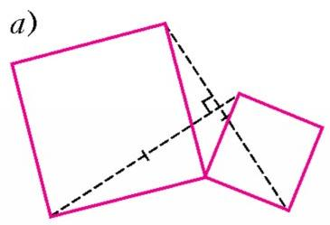

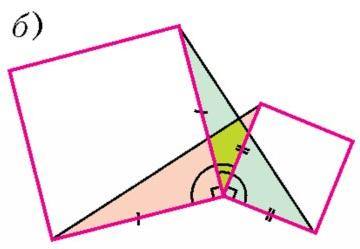

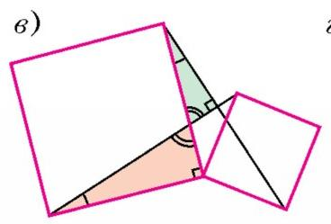

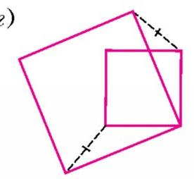

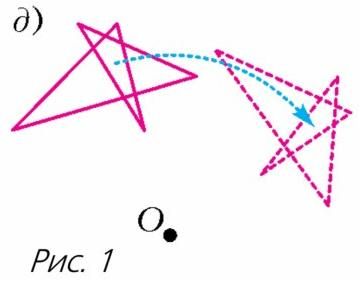

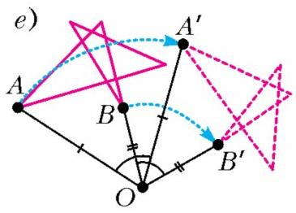

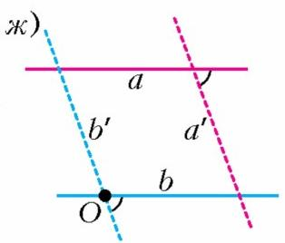

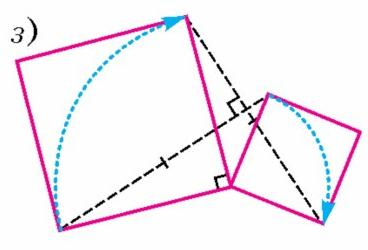

**练习 1**。当两个正方形如图 1, г 那样摆放时，证明同样的结论。

**提示**：把两条虚线段延长到它们相交。接下来的做法与图 1, а 的情形类似。

**第二种方法**。这种解法用到旋转。我们先说清楚什么叫旋转。把整个图描在一张透明薄膜上，盖在原图上，让两份完全重合。然后用一根大头针，把图和薄膜一起钉在桌面上。这时如果挪动薄膜，薄膜上的那份图就会绕着大头针所钉的那一点 $O$ 转动（图 1, д）。

我们来列举旋转的几条基本性质。设旋转是绕点 $O$ 进行的，点 $A$ 转到了点 $A'$，点 $B$ 转到了点 $B'$。那么：

1) 角 $\angle AOA'$ 与 $\angle BOB'$ 相等，换句话说，所有的点都转过了同一个角。这个角叫做**旋转角**（图 1, е）。

2) 图形被转成与它全等的图形。特别地，$OA = OA'$，$AB = A'B'$，$\triangle OAB = \triangle OA'B'$。

3) 直线（更准确地说，射线）$AB$ 与 $A'B'$ 之间的角，等于旋转角。

**练习 2**。证明性质 3。

**提示**：把直线 $AB$ 和 $A'B'$ 分别记作 $a$ 和 $a'$（图 1, ж）。过点 $O$ 作直线 $b \parallel a$。设旋转把 $b$ 变成 $b'$，那么 $a' \parallel b'$。这样我们就得到两组边互相平行的两个角。

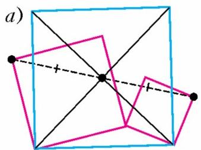

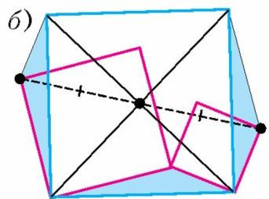

有了旋转的性质，我们回到题 1。把整个结构绕两个正方形的公共顶点旋转 $90^\circ$（图 1, з）。这时每个正方形里都有一条边的端点正好转到另一条的端点（因为正方形相邻的两条边相等且互相垂直）。相应地，一条虚线段就转到了另一条虚线段上。由性质 2，这两条线段相等；由性质 3，它们互相垂直。

想更多地了解旋转以及平面的其他变换，可以读一读 В. 布加坚科（Bugaenko）的文章《平面的运动与沙勒定理》，载《Kvant》2009 年第 4 期；或者 В. 菲什曼（Fishman）的文章《用几何变换解题》，载《Kvant》1975 年第 7 期。

## 题 2

现在看图 2, а 所画的三个正方形的组合。求证：蓝色正方形的中心，是把两个红色正方形的那两个顶点连起来的线段的中点。

**提示**：找三个全等的三角形。

**解**。在题 1 里，我们看的是两个共一个顶点的正方形，由此得到两个也共这个顶点的全等三角形。我们现在的结构里也有同样的"两个正方形"的配对，于是也就有与之相应的"两个全等三角形"的配对。把两对合起来，就得到三个全等的三角形（图 2, б）。问题就归到了下面这个：在一个正方形的两条对边上，各作了一个全等三角形（图 2, в），要证它们的顶点和正方形的中心在同一条直线上。

我们来考虑关于正方形中心的中心对称。

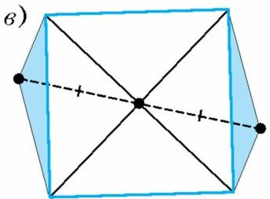

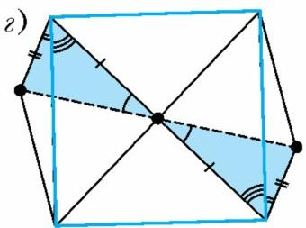

（中心对称其实就是绕中心转 $180^\circ$。）正方形和自己对称，而两个三角形则彼此对称。所以两个三角形的顶点不仅和正方形的中心在同一条直线上，而且到中心的距离相等。

不用对称也能证。图 2, г 中涂出的两个三角形按第一判定法全等：有两条边相等，是因为它们是（上面那对）全等三角形的边；又有两条边相等，是因为它们都是把正方形的顶点连到中心的线段；而它们所夹的角相等，因为这个角都是由一个 $45^\circ$ 的角加上一个全等三角形中相等的角组成的。由三角形全等得到这两个角相等；又因为它们的两条边落在同一条直线上，所以这两个角是对顶角。

## 题 3

图 3, а 中给了三个正方形。求证：绿色正方形的那个顶点，是把两个红色正方形的顶点连起来的线段的中点。

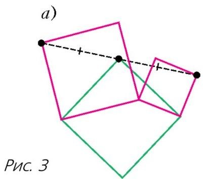

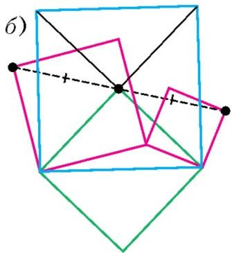

**提示**：用前面两道题。

**解**。

**第一种方法**。如图 3, б 那样再补一个蓝色正方形，就得到了题 2 中的结构，而题 2 中我们已经证过所需结论了。

**第二种方法**。对绿色正方形和其中一个红色正方形用题 1。得到两条标着同一种记号的线段相等并且互相垂直（图 3, в）。然后再看绿色正方形和另一个红色正方形，又得到一对相等且互相垂直的线段。所以题目要证的那两条虚线段相等，并且落在同一条直线上。

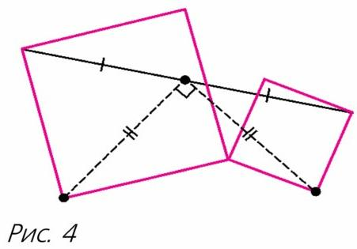

## 题 4

给了两个正方形和连接它们顶点的一条线段（图 4）。求证：两条虚线段相等并且互相垂直。

**提示**：用上一道题。

**解**。这道题是题 3 的逆。在题 3 里，我们已经证过：绿色正方形的那个顶点是把两个红色正方形的顶点连起来的线段的中点。但是一条线段只有一个中点，所以这里的两条虚线段相等并且互相垂直——因为它们正是题 3 中那个绿色正方形的两条边。

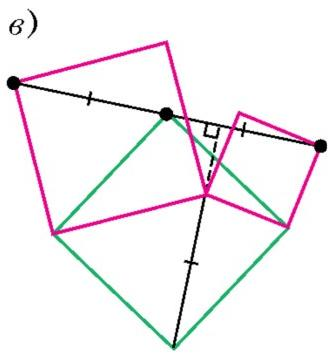

## 题 5

三个正方形如图 5, а 摆放。求证：两条虚线段相等并且互相垂直。

**提示**：用前面的题。

**解**。注意，这里的正方形组合与题 3 里的一样。所以我们可以用它，

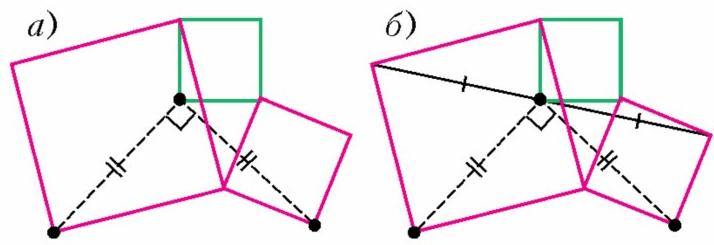

得到：绿色正方形的那个顶点是把两个红色正方形的顶点连起来的线段的中点（图 5, б）。知道了它是中点之后，再用题 4 即可。

## 题 6

蓝色正方形的一组相对顶点分别落在两个红色正方形的中心（图 6, а）。

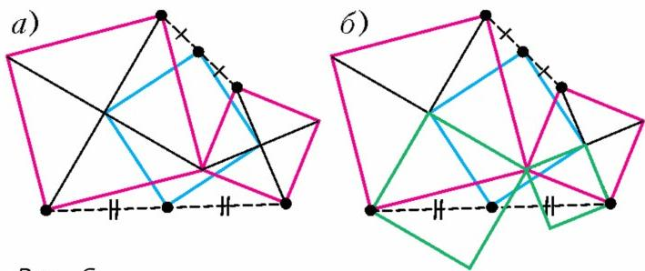

求证：蓝色正方形另外两个顶点，分别落在把两个红色正方形的顶点连起来的线段的中点上。

**提示**：想清楚应当把题 3 的结论用到哪两个正方形上。

**解**。看图 6, б 中的两个绿色正方形。对它们和蓝色正方形一起用题 3 的结论即可。对蓝色正方形的另一个顶点，证法类似，只是要把那两个绿色正方形改作在"另一边"。

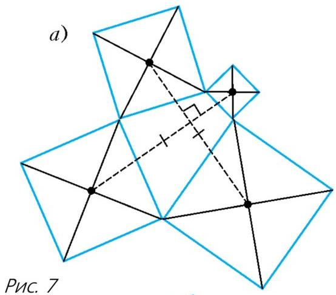

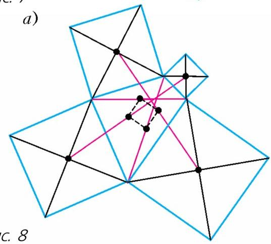

## 题 7

在一个四边形的各条边上，向四边形外侧各作一个正方形（图 7, а）。求证：连接相对两个正方形中心的那两条虚线段相等并且互相垂直。

**提示**：要更多的正方形！

**解**。看图 7, б 中那两个红色正方形，它们的一组相对顶点正好落在两个蓝色正方形的中心。由题 6，它们各自的顶点都落在四边形一条对角线的中点上，所以这两个红色正方形共一个顶点。对它们用题 1，就得到那两条虚线段相等并且互相垂直。

## 题 8

在一个四边形的各条边上，向四边形外侧各作一个正方形（图 8, а）。求证：四边形两条对角线的中点，与连接相对两个正方形中心的线段的中点，这四个点合起来构成一个正方形。

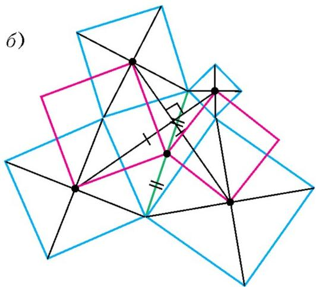

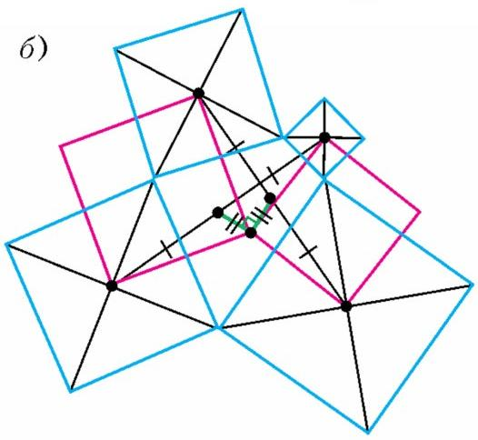

**提示**：用上一题解答中得到的结果。

**解**。考虑上一题证明中所用的那两个红色正方形（图 8, б）。

在题 1 的解里我们已经说明：两条线段在绕两个红色正方形公共顶点旋转 $90^\circ$ 时彼此转化。在这次旋转里，一条线段的中点转到了另一条线段的中点。所以，把这些中点和旋转中心连起来的线段相等并且互相垂直（由旋转的性质 2 和 3）。

这样一来，作为绿色线段三个端点的那三个点，构成一个等腰直角三角形。再看另一对红色正方形（它们的公共顶点在原四边形另一条对角线的中点上），用同样的办法可得到：另外三个点也构成一个等腰直角三角形，而且这两个三角形共用一条斜边。所以这四个点构成一个正方形。

## 自练题

下面这些题的提示登在本期杂志的末尾。各题的条件都由图 9—16 给出。对每一种正方形的组合，要么要证明两条虚线段互相垂直，要么要证明三个点落在同一条（虚线）直线上。

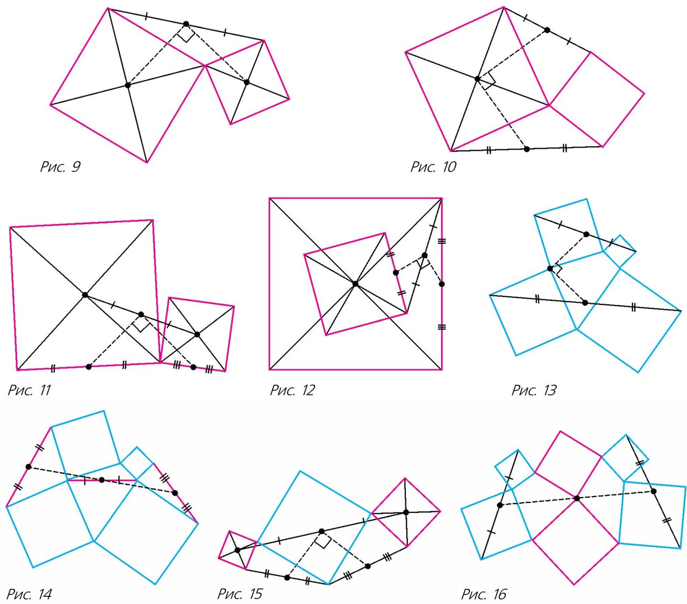

---

> **译者说明**：原文共 23 张配图，其中图 1（题 1）由多幅分图 а—з 组成，OCR 拆分为 8 个图片文件；图 2、图 3 各含多幅分图。译文按出现顺序为每个图片文件配了中文图注。文末图 9—16 为自练题配图，原杂志以一张合并图给出。
