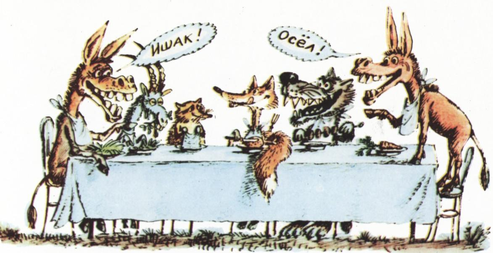
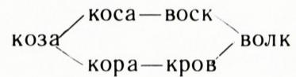

# 怎样把苍蝇变成大象？（字链谜题）

> **原标题**：Как сделать из мухи слона?
> **作者**：Гервер М. Л.（盖尔韦尔）
> **译自**：Квант 1981, № 7
> **栏目**：Квант для младших школьников（小学）
> **原文**：https://www.kvant.digital/issues/1981/7/gerver-kak_sdelat_iz_muhi_slona-63053933/
> **主题**：谜题/游戏（文字字链）
> **难度**：★★（小学高年级可读，俄文词例需对照阅读）
> **译者**：Claude（AI 初译，2026-06）

---

> **译者前注**：这是一种以**俄语单词**为材料的字链游戏，规则是「每一步只改一个字母，新得到的必须仍是一个俄语词」。本文里出现的一串串字母，都是俄文单词，**不能照字面译成汉语**——汉字没法「换一个字母」。
>
> 为了让小读者也能玩起来，译文中保留了俄文原词，并在难懂处用 `（…）` 给出释义或读音提示；想真正动手玩的话，可以把英文版同一游戏（叫 *Word Ladder*，单词阶梯）拿来玩：CAT → COT → DOT → DOG，把「猫」变成「狗」。阅读时，把俄文词当成「符号」即可，重点理解作者讲的**思路和方法**。

## 卡罗尔字链

гора（山）— нора（洞穴）— море（海）

—— 这就是把「山」变成「海」的一种办法。

коза（山羊）— поза（姿势）— пола（地板）— полк（团，军队）— волк（狼）—— 一只「山羊」就这样变成了「狼」。

把「狮子」（лев）变成「大狗」（дог），甚至有人编了一首儿童顺口溜：

> 百兽之王——漂亮的狮子（лев），
> 黄色小花——金鱼草（львиный зев），
> 大声一叫——捕猎成功（лов），
> 旧铁断件——新盖房屋（дом）……
> 换个去处——宽阔洼地（лог），
> 一只黑狗（дог）那里溜达。

里面就藏着这样一条字链：

$$
\begin{array}{r l} \text{лев} - \text{ев} - \text{ов} - \text{лов} - \\ & - \text{лом} - \text{дом} - \text{дог.} \\ & \text{лог} - \end{array}
$$

> **译者注**：原诗利用俄文词形相近作双关；中译只求意趣，俄文词形才是字链的真正材料。

这种字链游戏的发明者，据信是**刘易斯·卡罗尔**（Lewis Carroll，《爱丽丝漫游奇境记》的作者）。按照卡罗尔的规则——你从上面这些例子已经看明白了吧？——可以把「黑夜」（ночь）变成「白天」（день），把「螺丝」（винт）变成「螺栓」（болт），把「库尔德人」（курд）变成「波斯人」（перс）；可以让「手」（рука）变成「脚」（нога）（或者反过来——随你喜欢），可以从最后一个「便士」（пенс）变出一「磅」（фунт）（甚至从一枚异国的「元」юань 也行），还可以从一艘孤零零的船（不管是一条又大又快的「布里格」бриг，还是一只小小的「亚利克»ялик）变出一整支舰队……

真的真的！你自己试一试就知道了。

甚至可以——虽说稍微难一点——把「苍蝇」（муха）变成「大象」（слон）。

为什么说「稍微难一点」呢？因为这两个词里**元音字母的位置**不一样。要把「黑人」（негр）变成「阿拉伯人」（араб），或把「硫磺」（сера）变成「铀」（уран），你也会遇到同样的麻烦。

「大象」「阿拉伯人」「铀」属于同一组词，「苍蝇」「黑人」「硫磺」属于另一组：在每一组内部，词与词之间**比较容易**互相转换；而从一组跨到另一组，据我所知，只有**唯一的一座桥**。前面布置的最后三道题，要找的就是这座桥。

一旦找到了它，玩「卡罗尔字链」说老实话也就没什么意思了。

## 新规则

为了让这古老的游戏重新焕发活力，我们引入**新规则**来改造单词。仍然每步只换一个字母，但此外，**每一步还允许把字母重新排列**：

$$
\begin{array}{l} \text{река（河）— мера（度量）— море（海）,} \\ \quad (\kappa - \mathrm{м}) \quad (\mathrm{а} - \mathrm{о}) \\ \text{враг（敌人）— град（冰雹/城市）— друг（朋友）.} \\ \quad (\mathrm{в} - \mathrm{д}) \cdot (\mathrm{а} - \mathrm{у}) \end{array}
$$

用新规则把「苍蝇」变「大象」，简直不费吹灰之力：

乍一看，我们好像把一道好题给糟蹋了——把一个有趣的游戏换成了一个无聊的游戏。

其实不然。新规则一出台，立刻就冒出好几样新游戏和新题目。不过在把它们介绍给你之前，我想先出几道小题（让你习惯一下新规则）：

а) 把「驴」（осел）变成「山羊」（коза），「山羊」变「浣熊」（енот），「浣熊」变「狐狸」（лиса），「狐狸」变「狼」（волк），「狼」变「驴」（ишак），再把「驴」变回「驴」（осел）；

б) 用「锦缎」（парча）做一件「长袍」（халат）；

в) 用字链把「女士」（леди）和「勋爵」（лорд）连起来；

г) 给你一台「机床」（станок），请做出一根「细绳」（шпагат）；

д) 从「起点」（старт）走到「终点」（финиш）。

## 最短字链

有意思的是：你从「起点」到「终点」走了多少步？我连出它们的第一条字链，共有十五个词：

$$
\begin{array}{c} \text{старт} - \text{трест} - \text{перест} - \\ (а - е) \quad (р - п) \quad (е - о) \end{array}
$$

спорт — опрос（或 просо）—
（т — о）（р — к）

покос — кокос — кокон —
（п — к）（с — н）（о — а）

конка — гонка — книга —
（к — г）（о — и）（г — ф）

финка — финал — филин —
（к — л）（а — и）（л — ш）

финиш.

后来我又把它缩短到九个词：

старт — сатир — риска — кирка —

факир（或 фиакр）— финка — ……

另一种走法：сатир — тираж — жираф — рифма（或 фирма）— нимфа — финал — ……

还能更短。**纪录是 7 个词**。你能追平或打破它吗？试试找出 2～3 条最短的字链。

那么，字链的**最短长度**到底由什么决定呢？我们看几个例子。

先看把「浣熊」（енот）变成「狐狸」（лиса）。想象字母 е、н、о、т、л、и、с、а 都写在卡片上：前四张在桌上，后四张握在我们手里。我们需要做四次替换——所以这条字链**至少**要有五个词。可见，下面这条

енот — лето — село — сало — лиса — 已经是最短的了。

把「山羊」（коза）变成「浣熊」（енот），只要做三次替换（字母 о 是公有的），最短字链长度为 4。最短字链有：

$$
\mathrm{коза} - \mathrm{зона} \begin{array}{c} \text{нота} \\ \text{зонт} \end{array} \text{енот}
$$

把「山羊」（коза）变成「狼」（волк），看起来只要做两次替换：把 з 和 а 换成 в 和 л。假如下面四组替换里**有任何一组**得到一个有意义的词——

$$
з - \mathrm{в}; \quad з - \mathrm{л}; \quad а - \mathrm{в}; \quad а - \mathrm{л}
$$

——那我们就立刻得到了一条由三个词组成、把山羊变成狼的字链。然而，做了这些替换以后，分别得到的字母组合是

к, о, в, а；к, о, з, л；к, о, л, а；к, о, з, в——不管你怎么重新排列，**没有一个**能拼出有意义的词。所以这条字链的最短长度一定**大于三**。于是，下面这些

都是最短的。

**练习**：为上一节其余各题，找出最短字链。

那么，我们那个最要紧的变身——把「苍蝇」变「大象」——情况又如何？连接它们的字链至少要有 5 个词。前面我们已经找到一条只多出一个词的字链。下面这几条都只有五个词：

$$
\begin{array}{c} \text{муха} \\ \text{хлам — мало — сало} \\ \text{сума — само — сонм} \\ \text{слон} \end{array}
$$

可是它们当然要被**淘汰**：мало 是副词，само 是代词——而我们按照一条不成文的规矩，**只用普通名词、主格、单数**。\*)

那该怎么办呢？**去找，就会找到！**

## 意想不到的难处：孤词

出给你的那些字链题，都是这样安排的：给你两个词——把它们用字链连起来（不论长短，或要求最短）。词是特意挑过的——保证它们确实能彼此互变。

那么，挑这样的词对，一定很难吧？大多数词对，是不是都**没法**互变（不存在任何一条字链把它们连起来）？

你自己来挑挑看。如果你只取四个字母的词，会**吃惊地**发现：用上新规则，几乎总能把它们彼此互变。出乎意料的是，难处**不在于**找能用字链连起来的词，反而**在于**找四个字母的词、却**不能**用字链连起来。

长的词就不是这样了。它们之中常常出现「**孤词**」（слова-изгои，被放逐的词），这些词（即使按新规则）**无法**和任何别的词用字链连起来。顺便说一句，「孤词」изгой 这个词本身，似乎就是这样一个孤词。至少我没能把它变成任何五个字母的词（избой「小木屋」、иглой「针」、визой「签证」、изгоя——不是主格；розги「树枝」、мозги「脑子」是复数；козий「山羊的」不是名词——按我们的约定，这些都不算「词」）。你试试看，也许你能行？顺便也看看 добро（善）、зебра（斑马）、егоза（好动的人）、ягода（浆果）是不是孤词。

要在四个字母的词里找孤词，比在长词里要难得多——努力找几个吧；而三个字母的词里，看来**根本没有孤词**！不仅如此，看来**任何**两个三字母词都能彼此互变。

「看来」是什么意思呢？这件事能不能**严格证明**？「证明这样一句话」又究竟意味着什么？也许过些时候，我们还会回到这些问题上来。

---

\*) **译注**：原文用 `\*)` 标记的脚注意为「按惯例只用普通名词的主格单数」，已就近以 `（…）` 形式附于正文，无另起脚注。
