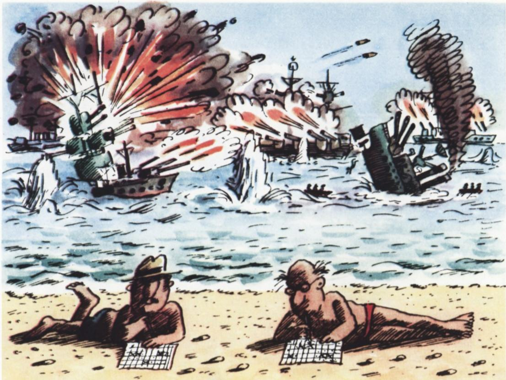
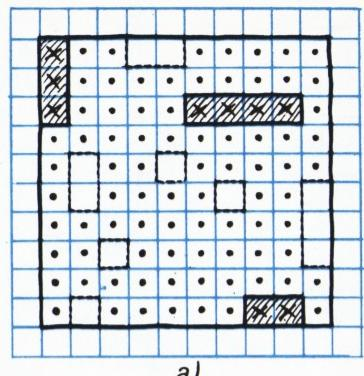
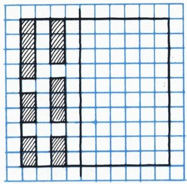
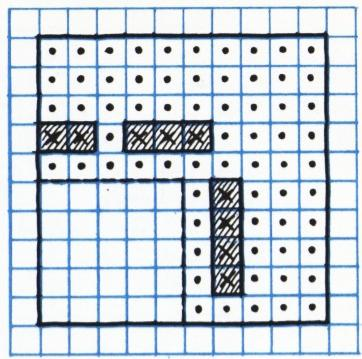

# 海战棋（数学）

> **原标题**：Морской бой
> **作者**：Е. Гик（叶·吉克）
> **译自**：Квант 1980, № 11
> **栏目**：Квант для младших школьников（小学）
> **原文**：https://www.kvant.digital/issues/1980/11/gik-morskoy_boy-09b5be08/
> **主题**：谜题/游戏
> **难度**：★★（内容偏深，初中预备更合适；小学高年级可在指导下阅读）
> **译者**：Claude（AI 初译，2026-06）

---

Е. 吉克

## 海战棋

大概很难找到一个人，一辈子从来没玩过"海战棋"。两个玩家，每人在一张方格纸上各画两块 $10 \times 10$ 的大棋盘。在其中一块上摆上自己的舰队，另一块则用来猜对方军舰摆在哪里。一支完整的舰队一共有十艘船：一艘战列舰（大小为 $4 \times 1$）、两艘巡洋舰（$3 \times 1$）、三艘驱逐舰（$2 \times 1$）和四艘小艇（$1 \times 1$）。船可以放在棋盘的任何位置，但是彼此之间既不能边挨边、也不能角挨角地接触。

摆好舰队之后，双方就开始轮流朝对方的军舰"开炮"——也就是喊出棋盘的格子名：a3、b7、k9 等等（棋盘的横行用数字 1 到 10 标号，竖列用字母 a 到 k 标号；见图 1）。每开一炮，对方都会告诉你结果：如果炮弹落在有船的格子上，就说"命中"；如果这一格是某艘船的最后一格（也就是这艘船其余的格子之前都已经中过弹了），就说"击沉"；如果格子是空的，就说"未中"。前两种情况下，你可以再补开一炮，如此继续，直到第一次"未中"，然后轮到对方走。谁先把对方十艘船全部击沉，谁就赢了。

> **译者注**：原书棋盘字母为俄文 а–к（共 10 个字母）。中文棋盘游戏也常用英文字母 a–k 标列。

海战棋里，通常用一个小圆点表示"打过这一格"，如果命中了船，圆点就改画成叉（被击沉的船还会用一个矩形圈起来）。当然，那些已经明确知道不可能属于任何一艘船的格子（比如位于"受伤"格子斜对角的格子，或者围在被击沉的船周围的格子），也会点上点。

显而易见，海战棋里棋盘的传统形状、船的样子以及舰队的组成，其实并没有什么特别的

意义——比方说，会下国际象棋的小朋友，也许更喜欢在 $8 \times 8$ 的棋盘上玩。

图 1

很明显，海战棋的输赢在某种程度上是要靠运气的。你可以毫无章法地朝"大海"乱打一通，却一发不落地把对方所有船都打沉——但这种好事可别指望。反过来，如果我们摸清了对方爱把船摆在棋盘中间、还是爱摆在边上的偏好，那我们赢的机会就大了。

谈到玩海战棋的"技术"，自然会冒出两个问题：1）该怎么开炮，才能更可能命中对方的船？2）该怎么摆自己的船，让对方更难打沉？

假设我们想打中对方的战列舰。如果我们老老实实地先打第一横行（从左到右），再打第二横行，依此类推，那有可能到第 97 炮才打中它（万一它就藏在 g10 到 k10 那一排）。但是，如果我们只打图 1 中画了叉的那些格子，那么最迟到第 24 炮就一定能命中战列舰。

有意思的是，我们可以看看更一般的情形。设棋盘是 $n \times n$ 的，上面有一艘大小为 $k \times 1$ 的船。我们把"一定能打中这艘船的一组炮击"叫做一种**策略**。其中包含炮击数目最少的那种策略，叫做**最优策略**。

在 $4 \times 4$ 的棋盘上搜索战列舰的最优策略之一，就是图 1 左下角那个 $4 \times 4$ 的小方块（一共 4 炮）。把它相应地向上、向右每次平移 4 格，就能得到 $n \times n$ 棋盘上的最优策略；图 1 画的就是 $10 \times 10$ 棋盘上的策略。显然，要打中位于 $n \times n$ 棋盘上的 $k \times 1$ 的船，相邻炮击之间在竖直方向上要相隔 $k$ 格，在水平方向上也要相隔 $k$ 格。这就意味着，在每一根竖列和每一根横行上，大约各有 $\dfrac{n}{k}$ 个炮击点；所以炮击总数大约是 $\dfrac{n^{2}}{k}$，而对战列舰来说大约是 $\dfrac{n^{2}}{4}$。

**题 1\*)**。a) 在 $4 \times 4$ 的棋盘上，要打中一艘 $4 \times 1$ 的战列舰，共有多少种最优策略？b) $10 \times 10$ 的棋盘上呢？（彼此经过棋盘旋转、翻转变换后相同者，视为同一种。）

海战棋老手通常是这样玩的。他们先用图 1 那样的策略，把对方的战列舰找出来。等战列舰解决了，就开始找巡洋舰。这时炮击不再是每隔 4 格，而是每隔 3 格。两艘巡洋舰打沉以后，就转向驱逐舰。等棋盘上只剩下小艇时，就只能对着所有空格子"乱打"了。当然，更"轻"的船也可能在追打更"重"的船时顺带就被打中了。

可见，最难办的还是打沉那些小艇——说到底，找它们根本没有什么好策略。所以在摆自己的舰队时，一定要把所有大船尽量摆得**紧凑**一些，给对方找小艇留下尽可能多的空地。从这一点上说，最有利的摆法如图 2 所示：即便对方已经打沉了所有六艘大船（图中竖线左侧），他面前要找四艘小艇的空地也是最大的——一共 60 格（图中竖线右侧）。

图 2

当然，海战棋里运气也很要紧，难免会打偏。所以下面这种"打偏一炮就输"的局面就格外有意思。我们来看一局海战棋的"残局"。

图 3 a)、б)

图 3 画的是一局棋中出现的"局面"。到此刻为止，双方舰队——我方的（图 3，a）和对方的（图 3，б）——损失得一样多。我方所有船的位置，对方都已经摸清了（图 3，a 中用虚线圈出的就是），所以他只要一挨到自己的回合，就能一发不空地把我们全军覆没。但现在轮到我们走，整盘棋的命运还掌握在我们手里。在这场"苦战"中，我们要一艘接一艘地消灭对方挤在 a1–d1–d5–a5 这块方形里的全部七艘船。要打赢这场紧张战斗的招法，恰好可以从下面这道题的解法里推出来。

**题 2**。请证明：在 $5 \times 5$ 的棋盘上，无论怎样摆一艘巡洋舰、两艘驱逐舰和四艘小艇，都能一发不空地把它们全部击沉。

海战棋的玩法还有许许多多变体。比方说，一"手"不再只开一炮，而是一次就开好几炮——对敌方舰队来一阵"齐射"。对方只告诉你这轮打的总成绩，不具体说明哪一发打中了哪艘船、落在哪个格子上。其余规则不变。每打一手、得到一次回答之后，双方都能从中分析出对方舰队部署的一些情报，并争取在下一手里用上。

还有一种玩法：每个玩家一次性可以朝棋盘开多少炮，就等于他还剩下多少艘没被打沉的船（第一手开十炮）。挨打的人也只告诉对方"命中、击沉、未中"的总数。等所有船都沉了，他就丧失了出炮的权利（开 0 炮）——不过这时候他也不需要再走了，因为这一局他已经输了。
