# 洛伊德的棋盘数学题

> **原标题**：Шахматно-математические задачи С. Лойда
> **作者**：Е. Я. Гик（盖克）
> **译自**：Квант 1975, № 6
> **栏目**：Квант для младших школьников（小学）
> **原文**：https://www.kvant.digital/issues/1975/6/gik-shahmatno-matematicheskie_zadachi_s_loyda-824ecac0/
> **主题**：谜题/游戏（棋盘数学）
> **难度**：★★（棋谱记法稍深，建议小学高年级在家长陪伴下阅读）
> **译者**：Claude（AI 初译，2026-06）

---

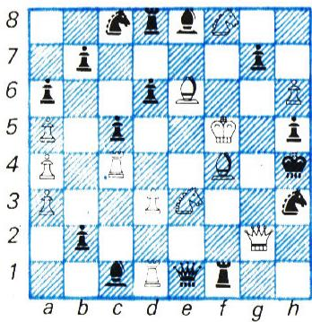

塞缪尔·洛伊德（Samuel Loyd，1841—1911）是史上最伟大的趣味题与益智游戏大师之一。他构思出了许多精彩的题目，至今仍然风靡不衰。那款『十五数字推盘』游戏更是让他名扬世界（关于这个游戏的详细介绍，可见《Kvant》1974 年第 2 期）。

> **译者注**：『十五数字推盘』（Игра «Пятнадцать»）是洛伊德最出名的发明之一，玩法是在一个 $4\times 4$ 的盘子上滑动写着 1—15 的小方块，把它们排成顺序。

有趣的是，洛伊德不但是一位出色的谜题发明家，同时也是史上最重要的国际象棋排局家之一。凡是破解过洛伊德棋题的人，无不为他构思的巧妙与独特而拍案叫绝。

少年塞缪尔 17 岁前一直在普通学校读书。倘若他后来进了大学，几乎肯定会成为一名出色的数学家或工程师。然而，尽管他热爱数学，可对国际象棋的痴迷还是占了上风。他没去考大学，而是把全部时间都投入了棋局。洛伊德的第一道棋题发表在纽约的一家报纸上，当时他只有 14 岁。16 岁时，洛伊德已经在美国《国际象棋月刊》主持一个栏目；上世纪七十年代，他又在《Scientific American》（科学美国人）杂志上开设了每周一期的国际象棋专版。他的文章常常以一道排局开篇——棋盘上棋子的位置会摆成某个字母或某种几何图形，例如这道『轮中轮』（图 1）。这枚『轮子』是这样转起来的：

a) 1. 后:h3+ 王:h3  2. 王g5 将死；  
b) 1…马e7+  2. 王e4 车:f4 将死；  
c) 1. 后g3+ 后:g3  2. 马g6+ 后:g6 将死；  
d) 1…马e7+  2. 王e4 马g5+ 3. 后:g5 将死（c) 和 d) 是『反向』将死）。

> **译者注**：棋谱中的符号——『+』表示将军，『:』表示吃子，『…』前表示黑方走子；『反向将死』（обратный мат）指一方主动让自己的王被对方将死，是洛伊德的一大创意。

洛伊德当然也想把自己的数学爱好和棋艺爱好结合起来。所以毫不奇怪，他的许多棋题同时具有数学和棋艺两重内核。下面我们就来欣赏 15 道依我们看最有意思的洛伊德棋盘数学题。

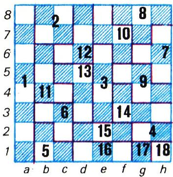

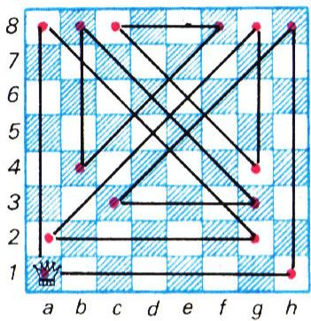

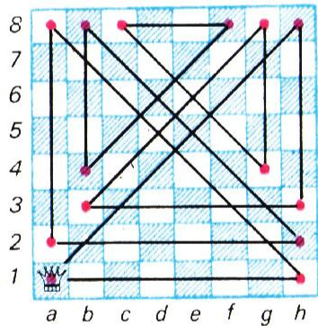

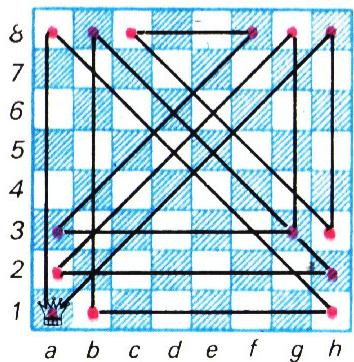

洛伊德在其他体裁的题目，可在 M. 加德纳《数学谜题与娱乐》（俄译本，莫斯科『Мир』出版社 1971 年版）一书中找到。

**题 1.** 把一张国际象棋盘切成尽可能多的块，要求任意两块要么形状不同，要么对应格子的颜色不同；切下来的块不许翻转。

答案是 18 块。图 2 给出了一种可行的切法。

**题 2.** 在 a1、b2、c3、d4 四格上各放一个白马。请把棋盘切成四块全等的部分，使每一块里恰好有一个马。

后来人们又发明了许多切棋盘的益智游戏，但是这一类题目真正的开创者正是洛伊德。洛伊德最钟爱的棋子之一是『后』；可以说，他几乎为以『后』为主角的题目建起了一整套理论。

**题 3.** 后位于 a1。它要走遍棋盘上每一格，最后回到出发的那一格，至少需要多少步？

答案是 14 步。这样的路线共有 6 条：其中 3 条画在图 3 中，另外 3 条由它们沿对角线 a1—h8 翻转对称得到。图中用红色标出的是后中途停留的格子。

洛伊德还证明：如果出发格位于图 4 的蓝色区域中，那么后走遍全盘再回到起点的封闭路线需要 15 步；如果出发格位于红色区域，则只要 14 步就够了。请你自己想想，这个红色区域是怎样从对称的图 4（即图 3）中得到的。

**题 4.** 在 $3\times 3$ 的棋盘上，后最少走几步就能遍历全部 9 格？这里允许后走到棋盘外面去。

只要 4 步就够了（图 5）。这道题在科普书里常常换一种说法：笔尖不离纸面，用 4 条直线段把排成正方形的 9 个点全部串起来。

> **译者注**：这就是著名的『九点连线问题』。诀窍在于让线段伸出 9 个点构成的小正方形之外。

**题 5.** 后位于 d1。在 5 步以内，它能走出的最长（按几何长度算）路线是多少？（后要经过格子的中心。）

**题 6.** 后从 c3 出发，用 15 步走遍整张棋盘，最后停在 f6。途中任何一格都不能走第二次。

**题 7.** 在棋盘上摆 16 个后，使每一条纵线、横线和对角线上都至多有 2 个后。

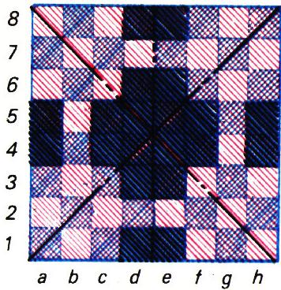

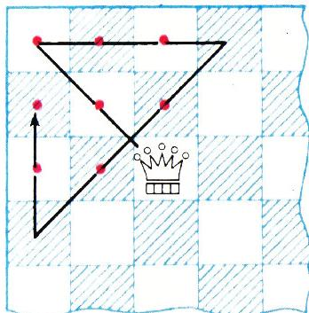

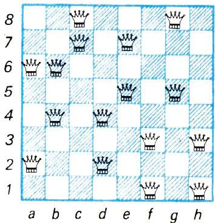

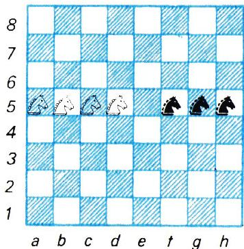

图 6 给出了一种满足条件的摆法；值得一提的是，对于 $n\times n$ 的棋盘和 $2n$ 个后，这个问题至今仍未解决。

洛伊德的许多题目是关于在棋盘上 необычные（非同寻常）的布子方式以及马的走法的。下面各举一例。

**题 8.** 在棋盘上摆 3 个后和 2 个车，使它们合起来能攻击到全部 64 格。

**题 9.** 在图 7 的局面中，要把白马换到 e、f、g、h 几条纵线上，相应地，黑马换到 a、b、c 几条纵线上。要求：不考虑轮到谁走；白马不许向左退，黑马不许向右退；每条纵线上同时只能有一个马。

这道题是洛伊德最难的谜题之一，他本人对此颇为自豪。

在『剖析』棋子初始布阵方面，洛伊德也施展了大量的巧思。你当然知道，最快的一局将死发生在第二步，而且是白方将死黑方：1. f4 e6 2. g4 后h4 将死。这种将死在棋谱里叫做『傻瓜将死』。更出名的是四步的『儿童将死』，初学下棋的小朋友常常中招：1. e4 e5 2. 象c4 马c6 3. 后h5 马f6 4. 后:f7 将死。

至于和棋，常见的有下面三种局面，棋局到此即判为平局：

a) 棋盘上出现逼和（无子可走的一方轮到走，但王并未被将军）；

b) 一方对另一方走出『长将』（永远将军下去）；

c) 双方都只剩下王。

很自然地，就有人提出了新的题目。

**题 10.** 一盘棋最快走到图 8 的局面需要多少步？

这种局面下，双方都必须吃掉对方 15 个棋子和兵。由于白方第一步不可能吃子，所以这盘棋至少要走 16 步。不过目前已知的、能把整张棋盘『吃光』的棋局，最短也要 17 步。根据最后两个王的位置，解有很多。我们这个局面可以这样走 17 步：1. e4 d5 2. ed 后:d5 3. 后h5 后:a2 4. 后:h7 后:b1 5. 后:g7 车:h2 6. 车:a7 车:g2 7. 车:b7 车:g1 8. 车:c7 后:b2 9. 车:c8+ 王d7 10. 车:b8 车:b8 11. 象:b2 车:b2 12. 车:g1 车:c2 13. 后:f7 车:d2 14. 后:e7+ 王:e7 15. 车:g8 车:f2 16. 车:f8 车:f1+ 17. 王:f1 王:f8。

**题 11.** 一盘棋最快几步能走出逼和（pat）？

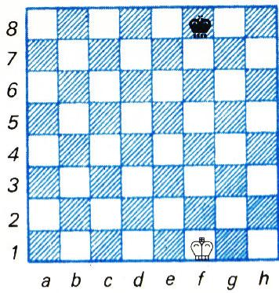

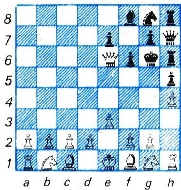

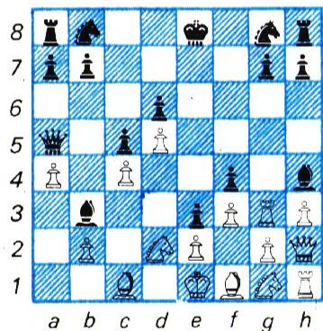

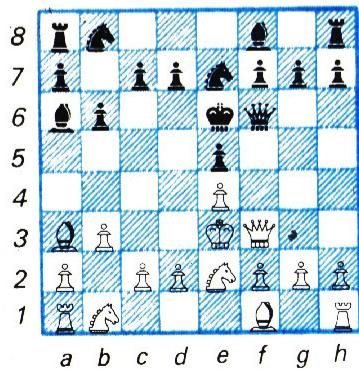

看上去步数好像应该很多。因为逼和与将死不同：将死时只是（被将军的）王无路可走；逼和却要求所有棋子都被『封死』。然而，这个目标只要 10 步就能达成：1. e3 a5 2. 后h5 车a6 3. 后:a5 h5 4. 后:c7 车a6h6 5. h4 f6 6. 后:d7+ 王f7 7. 后:b7 后d3 8. 后:b8 后h7 9. 后:c8 王g6 10. 后e6 逼和！（图 9）。

> **译者注**：原文 4. …Лah6 当为车从 a6 走到 h6，按棋谱记法疑为 Лh6，此处保留原文记法。

**题 12.** 如果不允许任何棋子（无论白方还是黑方）被吃掉，那么一盘棋最快几步能走出逼和？

让人意外的是，加上这样一个看似苛刻的附加条件后，棋局只多了两步：1. d4 d6 2. 后d2 e5 3. a4 e4 4. 后f4 f5 5. h3 象e7 6. 后h2 象e6 7. 车a3 c5 8. 车g3 后a5+ 9. 马d2 象h4 10. f3 象b3 11. d5 e3 12. c4 f4 逼和！（图 10）。

要证明这两局是最短的，非常困难——基本上要把所有 9 步和 11 步的棋局逐一枚举一遍才行。不过，鉴于这两局棋马上就要一百岁了，我们完全可以放心地承认它们就是世界纪录。

**题 13.** 一盘棋最快几步能形成『长将』（永远将军下去）？

只要 3 步就够了：1. f4 e5 2. 王f2 后f6 3. 王g3 后:f4+ 4. 王h3 后f5+ …，以此类推，可以一直将下去。

最后，再介绍两项洛伊德的纪录，同样与棋子的初始布阵有关。

**题 14.** 黑方对称地模仿白方的走法（在还能模仿的时候）。白方最少用几步就能将死对方的王？

第 4 步就能将死，而且有两条路：1. c4 c5 2. 后a4 后a5 3. 后c6 后c3 4. 后:c8 将死；或 1. d4 d5 2. 后d3 后d6 3. 后h3 后h6 4. 后:c8 将死。

关于这道题还有一个有趣的故事。有个人走进一家国际象棋俱乐部，宣称自己找到了一种执黑必不败的办法。『什么办法？』别人问他。『很简单——照着对手的走法走！』洛伊德主动要求和这位『发明家』下一盘，结果只用了 4 步就把他将死了。

**题 15.** 还是黑方模仿白方的走法。在知道这一点的前提下，白方最少几步能把自己『将死』？

白方在第 8 步就能『反向』将自己将死：1. e4 e5 2. 王e2 王e7 3. 王e3 王e6 4. 后f3 后f6 5. 马e2 马e7 6. b3 b6 7. 象a3 象a6（图 11）8. 马d4+! ed 将死。

当然，论巧思我们很难和洛伊德较量，不过，说不定你也能在国际象棋盘上创下某项纪录呢？！

---

**附：OCR 修正与译者说明**

- 原文 OCR 中混入的页面标记 `<!-- OCR page: pXX -->` 已剔除，正文 4 页（p55—p58）内容完整保留。
- 棋谱中若干明显 OCR 错讹已据国际象棋记谱惯例订正：如 `Ф`（后）、`Кр`/`Kp`（王）、`Л`（车）、`К`/`K`（马）、`С`/`C`（象）等字母大小写与拼写的统一；`Kp :e7` 之空格已规范为 `王:e7`；`Лah6` 一处保留原文记法并加译者注。
- `контруентные` 系 `конгруэнтные`（全等）之 OCR 错读，已按『全等』译出。
- 俄文原题中的 `n × n` 改写为 `$n\times n$`；几何记号规范化。
- 邻页未串入无关文章。
