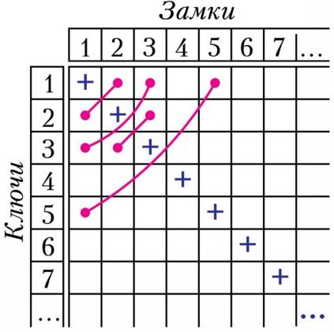
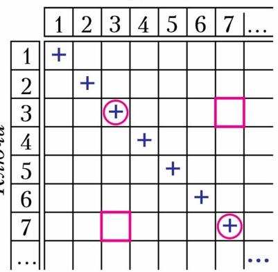

# 一百把锁与一百把钥匙

> **原标题**：Сто замков и сто ключей
> **作者**：С. А. Дориченко（多里琴科·谢·亚）
> **译自**：Квант 2023, № 1
> **栏目**：Квант для младших школьников（小学）
> **原文**：https://www.kvant.digital/issues/2023/1/dorichenko-sto_zamkov_i_sto_klyuchey-4ace7cfe/
> **主题**：谜题/逻辑
> **难度**：★★（小学高年级可读；证明部分需细品）
> **译者**：Claude（AI 初译，2026-06）

---

> 致迈克罗夫特·福尔摩斯爵士

> 请原谅我写这封令人不安的信，但歇洛克·福尔摩斯现在的状况糟透了。一直没有能让他动脑子的案子，这严重损害了他的健康。我的朋友急需一道难题。既然犯罪界已无法应对这样的挑战，那么，一道配得上这颗伟大头脑的逻辑谜题，或许能救他一命？

> 怀着希望，

> 华生医生

> 致约翰·华生医生

> 我万分感谢您对我兄弟的关心。眼下我正巧在研究一道数学题，暂时还没解出来。它算不上刑侦案件，可挑衅者偏偏是莫里亚蒂。也许歇洛克会有兴趣？题目附后。

> 您诚挚的，

> 迈克罗夫特·福尔摩斯

## \*\*\*

「——那么，华生，现在有一百把看上去一模一样的锁，和一百把开锁的钥匙，全堆成一堆？」

「——是的。每把锁恰好只有一把钥匙能打开。现在的任务，就是弄清楚哪把锁由哪把钥匙来开。」

「——好吧，这活儿不轻松，但只要有时间、有点耐心，倒也不难办。我们把锁排成一排，然后挨个试钥匙……」

「——可最坏的情况下要试一万次！就算一次只花四秒钟，那也是四万秒——超过十一个小时！」

「——朋友，一看就知道你数学学得不怎么样。你难道打算把每把钥匙都插进每一把锁里去试？」

「——当然啦，万一运气一直不好呢。」

「——可第一把钥匙最多只要试 99 次：要是它一次都没对上，那它一定是开最后那把锁的。」

「——好像是这样。那就是一共 9900 次？」

「——又错了。我们只要把已经配好的『钥匙—锁』放到一边，第二把钥匙最多再试 98 次就够了。」

「——对呀。那第三把钥匙最多试 97 次，以此类推。最后会得到一个吓人的和：$99 + 98 + \ldots + 2 + 1 + 0$。奇怪，第一百把钥匙我居然要试 0 次？」

「——当然了，它的锁到那时自然就确定了。」

「——那这个和到底等于多少呢？」

「——传说，小高斯几乎是一眨眼就算出来的，他用了个小小的窍门。他把两个这样的和摞在一起，把加数两两配成 100 对：99 + 0、98 + 1、97 + 2、……、0 + 99，每一对的和都是 99。所以原来的和等于 $50 \times 99$，也就是 4950 次试开。每次四秒——恰好五个半小时。现在请你让我一个人待着——说真的，这些琐事只会让我更难受。」

> **译者注**：高斯（Carl Friedrich Gauss，1777—1855）是德国伟大的数学家。传说他小时候，老师让全班同学把 1 到 100 加起来，他几乎立刻给出了答案，用的正是这种「两头配对」的办法。

「——可是福尔摩斯，莫里亚蒂在日记里声称，他找到了一种办法，能**保证**在不到 4950 次之内就把所有钥匙分配好！不过他没把方法写出来——说是这办法太复杂，日记里写不下……」

「——又来他这套哗众取宠的把戏。比 4950 次还少？」

福尔摩斯陷入了长久的沉默。不可思议，过了一会儿，他的脸上开始恢复生气，眼中又闪烁起那熟悉的光芒。

「——太有意思了，华生。莫里亚蒂是位数学教授，可这回他大概是搞错了。我这就证明给你看！」

「——证明？这种事怎么证明？说不定他真有什么别人不知道的巧妙办法……」

「——华生，你对数学证明熟不熟？让我考考你。你同不同意，我们必须先找到**至少一对**匹配的『锁—钥匙』？」

「——呃……大概同意吧，因为实在看不出还能怎么动——」

「——等等……那么一切就清楚了！在运气最差的时候，找第一对不可能少于 99 次试开，第二对 98 次，……于是我们的那个和又出现了，这就是最小值！」

「——你立刻就上钩了。为什么不能把不同的钥匙插进不同的锁里，一次做很多次试开，然后一下子同时弄清楚好几把钥匙和几把锁的对应关系？」

「——这听起来不大可信……」

「——你敢保证一定不行？」

「——说实话，我不知道。」

「——那你还没有证明。」

「——那怎么办？」

「——我们一步一步来推理。我的直觉告诉我：不存在任何能保证在 4950 次以下成功的算法。可这个魔鬼莫里亚蒂却声称有。好吧，假设教授是对的。我们把他引进陷阱——当然，只是在脑子里。」

「——可要做到这点，得给他——哪怕只是想象——准备一组锁和钥匙，让他应付不了，对吗？」

「——我们做的正是这件事。想象一下，我们把锁和钥匙交给他。教授拿起某一把钥匙，插进某一把锁里……如果他猜对了，我们立刻把这把锁的内部机芯和另一把锁对调一下，让这把钥匙打不开它。」

「——我们是绅士，不是耍花招的骗子，可不能这么干……」

「——华生，我们只是检验：这个算法在任何情况下都管用。所以这种偷换是完全合法的——锁看上去都一样，教授遇到的本来就可能是另一把内芯的锁。」

「——然后呢？」

「——他再去试下一对『钥匙—锁』。如果需要，我们再把锁的内芯彼此对调一下，让这把钥匙也打不开——只要保证此前已经做过的试开结果不变……」

「——可不能这样无休止地调下去啊，迟早有一把钥匙肯定会对上的。」

「——你说得对。可是等等！那为什么还要去试这把钥匙呢？」

「——对不起，福尔摩斯，我没听懂。」

「——莫里亚蒂不是傻瓜。他手里有自己做过的全部试开记录。目前为止没有一把钥匙对上过一次。现在他把钥匙 X 插进锁 Y——糟了，我们没法——」

「——在不破坏先前结果的前提下，把内芯对调，让这把钥匙打不开这把锁了。但这样的话，莫里亚蒂自己也会发现这一点！」

「——怎么发现的，福尔摩斯？」

「——他可以在脑子里把所有可能的『锁—钥匙』对应关系都枚举一遍。既然不存在一种能保持此前所有试开结果、又使钥匙 X 与锁 Y 互不对应的方案，他就会发觉这一点。」

「——为什么这样的方案不存在呢？」

「——如果存在，我们就会找到它，并且让这一次试开的结果为『打不开』。」

「——有点绕……」

「——你别小看它，华生。如果你愿意——那我们就以绅士的方式，直接给教授一点提示：他这次猜对了，这一回可以不用试了。」

「——可这又是为什么，福尔摩斯？」

「——我预感这对证明很要紧！因为现在我们就有权假设，教授的算法是这样运作的：他做许多次试开，结果一律是『打不开』，到了某一刻，他突然就明白了每把钥匙各开哪把锁！」

「——明白所有钥匙？」

「——对呀。也许是先弄清某一把钥匙，也许是几把一起。当他弄清某些钥匙之后，就不必再去试它们，而是继续按自己的算法行事，只做那些结果可能是『打不开』的试开。而我们呢，就负责让结果始终是『打不开』。直到他彻底弄清所有钥匙为止。」

「——然后呢？」

「——你有什么想法，朋友？」

「——半点主意也没有。」

「——看来咱俩想到一块儿去了……那我有个请求——你先替教授设计一套方便、紧凑的试开记录方法，我还要再想一想。」

福尔摩斯往椅背上一靠，吸了一口烟斗。过了大约半小时，突然——

「——尤里卡！华生，我全明白了。你那边怎么样？」

> **译者注**：尤里卡（Эврика / Eureka），希腊语意为「我找到了！」，相传是古希腊学者阿基米德想出测王冠含金量的办法时喊出的名言。

「——我作为一个常给病人做记录的医生，本来想，可以把所有试开一字不落地记到本子上。但要是想节省地方，倒不如给锁和钥匙都编上号，再画一张大表格，100×100 个格子。试开『第 6 把钥匙、第 75 把锁』这一对时，就在第 6 行第 75 列那个格子里打上加号——钥匙开了，就写加号；打不开，就写减号。」

「——好极了，华生。这办法实在太方便了。不过我提醒你，莫里亚蒂从头到尾写的都是减号。他写的减号不到 4950 个，就一下子全明白了，对吧？」

「——对，算法跑完之后，他只需把所有加号填上就行。」

歇洛克·福尔摩斯皱了皱眉。

「——这些加号，排起来可能挺乱……不要紧，我们这就把它理顺。要知道，这 100 个加号，每一列恰有一个，每一行也恰有一个。不过你注意，华生——在我们的表格里，行和列是可以随意互换的，也不会出任何问题——只要把相应的钥匙和锁也一并对调，对吗？」

「——大概是的。」

「——那我们先在第 1 列里找一个加号，把加号所在的行换到最上面；再在第 2 列里找加号，把那一行紧挨着放到第 1 行下面，以此类推。」

「——你是想让加号整整齐齐地排在主对角线上？」

「——是的。这倒不是必须的，但这样答案会格外清晰。于是，表格里被填上了不到 4950 个减号，然后加号就只能排成主对角线，别无他法。可 4950 又算什么呢？整张表共有多少个格子？」

「——我们的表是 $100 \times 100$ 的，一共 10000 个格子。」

「——那主对角线上有多少个格子？」

「——当然是 100 个。」

「——那么剩下来可以填减号的格子就有 9900 个，可减号却不到 4950 个——不到剩下格子数的一半！」

「——你到底想说什么，福尔摩斯？」

「——把剩下这些格子，按关于主对角线对称的方式两两配成对！喏，我——」

| | 1 | 2 | 3 | 4 | 5 | 6 | 7 | … |
|---|---|---|---|---|---|---|---|---|
| **1** | + | | | | | | | |
| **2** | | + | | | | | | |
| **3** | | | ○ | | | | + | |
| **4** | | | | + | | | | |
| **5** | | | | | + | | | |
| **6** | | | | | | + | | |
| **7** | | | + | | | | ○ | |
| **…** | | | | | | | | … |

「——我在餐巾纸上用红色标了几对。看见了吗？这样的对称对正好 4950 对，可减号不到 4950 个。所以一定有一对里**一个减号也没有**。比方说，第 3 行第 7 列那一格——记作格 $(3,7)$——以及与它对称的格 $(7,3)$。这两格里是空的。」

「——看来是没必要试这两格。」

「——你还是没明白？我画给你看。莫里亚蒂在格 $(3,3)$ 和格 $(7,7)$ 里填了加号。可格 $(3,7)$ 和 $(7,3)$ 都是空的——那就没什么能拦着我们，把这两个加号挪到这两格里去。说白了，就是把 3 号锁和 7 号锁的内芯对调一下。任何一次先前的试开都不会被破坏。所以莫里亚蒂根本没法断定 3 号钥匙和 7 号钥匙各开哪把锁——总还有另一种排法。矛盾，华生！」

「——可是怎么做到的，福尔摩斯？你是怎么想到这一步的？」

「——福尔摩斯先生，有客人找您。看样子是位学者，要不就是数学老师。」

「——您凭什么这么判断，赫德森太太？」

「——您撞见我的时候，我整个人都乱了。我甚至两只脚穿了不一样的鞋，还一直琢磨，它们为什么不『对称』。做完您这道题之后，我感觉好多了。可要是没有下一桩案子……」

---

> **OCR 串入内容说明**：原文 ru.md 自「## Как облегчить сизифов труд / С.ДВОРЯНИНОВ」（即另一篇文章《如何减轻西西弗斯式的劳作》，作者为 С. Дворянинов，非本文）以下至文件末尾的内容，属于 OCR 串入的无关邻页文章，已按翻译指南第五节剔除，不予译出。
