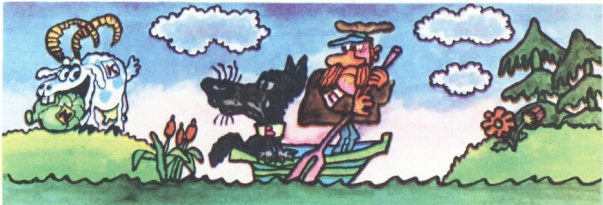
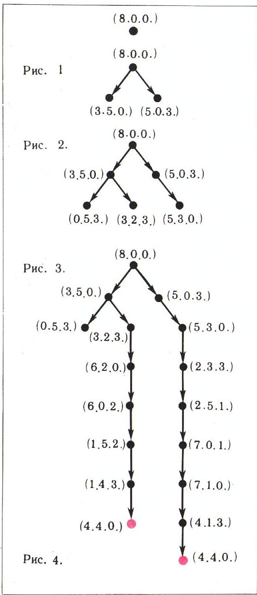
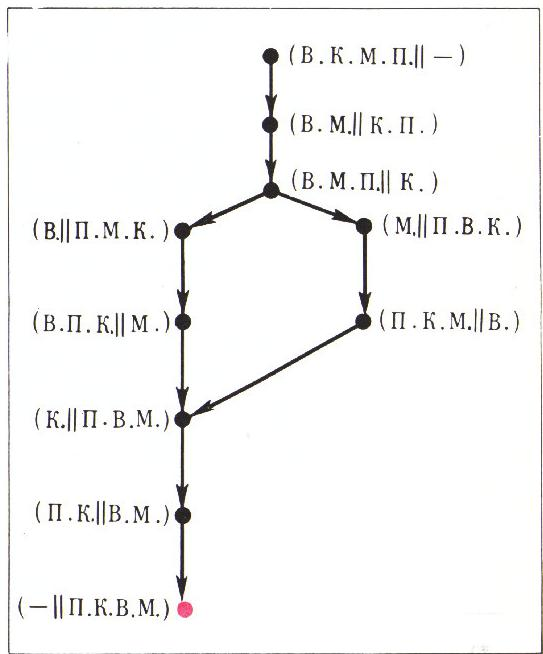
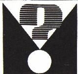

# 谜题与图

> **原标题**：Головоломки и графы
> **作者**：М. П. Барболин（巴尔博林 М. П.）
> **译自**：Квант 1975, № 2
> **栏目**：Квант для младших школьников（小学）
> **原文**：https://www.kvant.digital/issues/1975/2/barbolin-golovolomki_i_grafyi-f2563021/
> **主题**：谜题/游戏
> **难度**：★★（小学高年级可读，图的概念为初中预备）
> **译者**：Claude（AI 初译，2026-06）

---

大家都熟悉倒水、过河、分东西这一类趣题。它们早就成了数学兴趣小组、智力竞赛、数学晚会等活动中的常客。这种题通常是在脑子里推演着做，要靠不少机灵和聪明。用某一种办法把它解出来往往并不难；可要让你说出**最短**的办法，或者**所有**可能的解法，就难得多了。

这些问题，借助一种由「点」和连接点的「箭头」组成的图就能轻松答出。这种图形叫做**图**（граф）。

## 题 1

两个人有一满罐 8 升的牛奶，另外还有两个空罐子，一个 5 升、一个 3 升。他们怎样才能把牛奶平分？

我们就用「图」来解这道题。给每个罐子编个号：8 升的叫 1 号，5 升的叫 2 号，3 升的叫 3 号。我们来看看，经过一次倒动，会出现哪些可能的装法。

开始时 1 号罐是满的，2 号和 3 号是空的。

我们用一个点 $(8,0,0)$ 表示这个状态（图 1）。现在从 1 号罐里，要么可以倒 5 升进 2 号，要么可以倒 3 升进 3 号。于是得到两个新的装法：$(3,5,0)$ 和 $(5,0,3)$。我们也用点表示，并画上箭头，说明它们是从原始状态 $(8,0,0)$ 来的（图 2）。一次倒动不会再有别的可能了。

做第二次倒动。为了不漏掉任何可能，我们按罐子的编号顺序来看。先取 $(3,5,0)$（1 号有 3 升、2 号有 5 升、3 号空）。从 1 号只能倒进 3 号，得到新状态 $(0,5,3)$。在图上从点 $(3,5,0)$ 画箭头到点 $(0,5,3)$（图 3）。从 2 号可以倒进 1 号或 3 号（一次倒进两个罐子要算作两次倒动！），但倒回 1 号得到的是 $(8,0,0)$，已经出现过了，所以这样做没意义。把 2 号倒进 3 号，得到新状态 $(3,2,3)$，在图上画点 $(3,2,3)$（图 3）。3 号罐是空的，不用考虑。

接着转到 $(5,0,3)$。同样地推理，又得到一个状态 $(5,3,0)$，并相应地把图补上。

现在清楚了：解题的过程，其实就是把图当作一棵「树」一点点「种」大。照这样推理下去，就能得到图 4 那样的一张图。

图上可以看到两条链，它们都从 $(8,0,0)$ 出发，最后到达所要的状态 $(4,4,0)$。这两条链正好对应着两种不同的平分方法：

$$
\begin{array}{c}
\text{方法一：} (8,0,0) \rightarrow (3,5,0) \rightarrow \\
\rightarrow (3,2,3) \rightarrow (6,2,0) \rightarrow (6,0,2) \rightarrow \\
(1,5,2) \rightarrow (1,4,3) \rightarrow (4,4,0). \\
\\
\text{方法二：} (8,0,0) \rightarrow (5,0,3) \rightarrow \\
\rightarrow (5,3,0) \rightarrow (2,3,3) \rightarrow \\
\rightarrow (2,5,1) \rightarrow (7,0,1) \rightarrow \\
\rightarrow (7,1,0) \rightarrow (4,1,3) \rightarrow \\
\rightarrow (4,4,0)
\end{array}
$$

## 题 2

一个摆渡人（用 **П** 表示）要把一只狼（**В**）、一只山羊（**К**) 和一袋白菜（**М**）运过河。船太小，除了摆渡人，每次只能再带一样东西。而且，白菜不能和山羊单独留下，山羊也不能和狼单独留下。该怎么过河？

为方便起见，假设开始时大家都在左岸（用 Л. Б. 表示）。我们用一个点表示初始情形，记作 $(В, К, М, П \,\|\, —)$（图 5）。第一趟，摆渡人只能带山羊（因为山羊既不能留给狼，也不能留给白菜）。于是得到新情形 $(В, М \,\|\, К, П)$：狼和白菜袋在左岸，山羊和摆渡人在右岸。我们用一个点表示它，并从点 $(В, К, М, П \,\|\, —)$ 画一

*图 5.*

条箭头到这个新点，表示它是由 $(В, К, М, П \,\|\, —)$ 经过一趟渡河得到的。回来时摆渡人单独划船回去（要是回到初始情形——把山羊再带回来——就没意义了）。出现的新情形 $(В, М, П \,\|\, К)$ 也画成一个点。接下来摆渡人有两种选择：要么带狼（В），要么带白菜袋（М）。于是又得到两种可能情形：$(В \,\|\, П, М, К)$ 或 $(М \,\|\, П, В, К)$。每一种都在图上画成一点。照这样把每一种得到的情形都分析下去，最后就会到达所需的状态 $(— \,\|\, П, К, В, М)$（图 5）。图上有两条（部分重合的）链，对应着这道题的两种不同的解法。

## 练习题

**1.（泊松题）** 法国著名数学家西蒙·泊松（Siméon Poisson，1781—1810）年轻时，有人给他出了下面这道题。泊松来了兴致，从此迷上数学，并把这辈子的心血都献给了这门学科。题目是这样的。

> **译者注**：原文作 1781—1910，应为 1781—1840（泊松生卒年），疑 OCR 误识，此处径改。

某人手上有 12 品脱葡萄酒（品脱是一种容量单位），他想把这酒的一半送人，可他没有 6 品脱的容器。他只有两个容器：一个装 8 品脱，一个装 5 品脱。

怎样把 6 品脱酒装进那个 8 品脱的容器里？最少需要倒几次？

**2.** 有 4 只桶。第一只装 24 桶水，第二只装 13 桶，第三只 11 桶，第四只 5 桶。开始时只有第一只是满的。请把第一只桶里的水三等分，使前三只桶各装 8 桶水，第四只空着。

**3.（古代趣题）** 三个士兵和三个强盗要过河。他们找到一条船，每次最多只能坐两个人。任何一个岸上，都不能让强盗的人数多于士兵的人数（否则士兵会遭殃）。这六个人怎样都过河？请找出所有可能的办法。\*)

---

> **译者注（剔除内容）**：OCR 串入了「答案·提示·解答」栏目（ОТВЕТЫ, УКАЗАНИЯ, РЕШЕНИЯ）中关于另一篇文章《Арифметико-геометрическая прогрессия》（算术-几何数列）的答案片段，与本篇无关，已按翻译指南第五节剔除。本译文只含《谜题与图》正文的题 1、题 2 和练习题 1—3。
