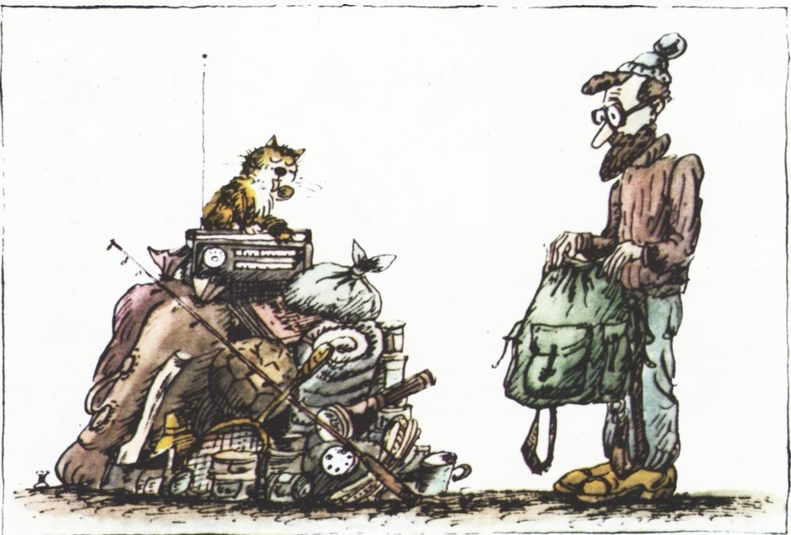
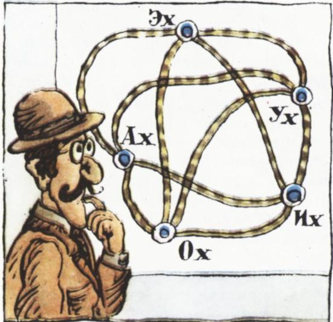

# 枚举法

> **原标题**：Метод перебора
> **作者**：Ф. А. 巴尔捷涅夫（Бартенев）、А. П. 萨温（Савин）
> **译自**：Квант 1982, № 2
> **栏目**：Квант для младших школьников（小学）
> **原文**：https://www.kvant.digital/issues/1982/2/bartenev_savin-metod_perebora-dfbd30ec/
> **主题**：谜题/游戏（枚举法）
> **难度**：★★（小学高年级可读，部分内容偏深）
> **译者**：Claude（AI 初译，2026-06）

---

Ф. 巴尔捷涅夫，А. 萨温

## 枚举法

据说，有一次福尔摩斯的侄子杰克请他这位大名鼎鼎的叔叔帮忙解下面这道题＊）：买了几本同样的书和几本同样的相册。买书一共花了 10 卢布 56 戈比。已知每本书比每本相册贵 1 卢布以上，并且买的书比相册多 6 本，问买了多少本书？

读完题目，这位大名鼎鼎的侦探从桌子走到窗前，又走回桌边，绕着桌子踱来踱去，眼睛盯着天花板，最后说道：「书一共买了 8 本。」

「您是怎么算出来的？」——杰克和当时在场的华生先生异口同声地喊道。

「哦，这再简单不过了！」福尔摩斯坐到扶手椅上答道，「我一看到『买的书比相册多 6 本』这句话，就立刻明白书的数量不会少于 7 本。又由『每本书比相册贵 1 卢布以上』这句话，我推得每本书的价格超过 1 卢布；既然买书总共花了 10 卢布 56 戈比，那么书的本数就不会超过 10 本。这样一来，所有大于 10 和小于 7 的数就都被排除在外了。我把 7、8、9、10 这几个数逐一检验，发现所求的本数只可能是 8：其他几个都不能整除 1056。」

福尔摩斯在这里所用的枚举法，看来是最古老的一种解题方法。很长一段时间，人们把它看作「二等」方法，认为「枚举」式的解法不够漂亮。可是近年来，在所求的量只能取整数值的问题中，枚举法用得越来越频繁。

## 让计算机来枚举

有许多严肃的题目，数学家除了枚举法之外没有别的解法。当然，这时真正在做枚举的是电子计算机，而数学家只是给它下达指令，告诉它该怎样枚举。著名的美国数学家 S. 戈洛姆关于这一点写道＊）：「与人不同，机器解题时做的是千篇一律的计算，那些计算在我们看来极其乏味，可机器却能以难以想象的速度完成。但与此同时，如果某种简化或改进办法没有被编写详细运行指令的程序员事先考虑到，机器自己是发现不了它的。」

尽管如此，近年来计算机速度越来越快、内存越来越大、使用越来越方便、价格越来越便宜，这一切使得人们越来越频繁地用计算机来解各种枚举型问题。例如，著名的「四色问题」（任意一张地理地图，是否都能用四种颜色着色，使得同色国家之间没有公共边界线？）就是靠计算机——用一种非常巧妙的枚举——才得以解决的。不久前，S. 戈洛姆书中关于「多方块」（polyomino）的最有名的问题之一，也是借助计算机用枚举法解出的。

> **译者注**：戈洛姆（Solomon Golomb）是美国数学家，「多方块」是他命名并推广的一类由若干单位正方形拼成的图形，类似于把若干方格连在一起的「俄罗斯方块」。

## 一位游客在装背包

可以用枚举法求解的，还有所谓的「背包问题」：从给定的一批物品中挑选若干件装进背包，使得它们的总重量最大（同时总体积不超过背包的容量）。

这样表述时，问题看上去像个小玩具；可是只要把「背包」换成「轮船货舱」，你就会明白，这道题具有重要的国民经济意义。

**练习 1.** 背包容量为 100 立方分米，物品如下表所列。请解这道背包问题。

| 物品 | 重量 | 体积 |
|---|---|---|
| 帐篷 | 20 | 60 |
| 睡袋 | 5 | 55 |
| 毯子 | 8 | 32 |
| 收音机 | 2 | 20 |
| 食物包 | 10 | 8 |
| 球 | 0.5 | 10 |
| 斧头 | 3 | 2 |

## 推销员上路

另一道用枚举各种方案来求解的、广为人知的题，是「旅行推销员问题」＊）：已知若干个城市，每两个城市之间都有铁路相连；要从某一个城市出发，遍访各城市后再回到出发点，问应当怎样安排路线才能花费的时间最少？

仅就 5 个城市而言，可能的方案就有 24 种；6 个城市有 120 种；7 个城市有 720 种；10 个城市则多达 362880 种。为了不做完全枚举，数学家们想出了各种各样的巧妙办法＊＊)。这并不是白费力气——比如要为一辆给各报刊亭送报刊的货车、一辆到各乡接工人上班的班车等等寻找最佳路线，都需要解这一类问题。

**练习 2.** 图中表示一片地区，上面有 5 个城市：阿城（Ах）、伊城（Их）、奥城（Ох）、乌城（Ух）、埃城（Эх）＊＊＊)；表中给出了它们之间的铁路距离。请找出旅行推销员的最短路线：他要从乌城出发，遍访其他各城后回到乌城。

|  | 阿城 | 伊城 | 奥城 | 乌城 | 埃城 |
|---|---|---|---|---|---|
| 阿城 | 0 | 60 | 40 | 50 | 20 |
| 伊城 | 60 | 0 | 30 | 35 | 45 |
| 奥城 | 40 | 30 | 0 | 55 | 50 |
| 乌城 | 50 | 35 | 55 | 0 | 20 |
| 埃城 | 20 | 45 | 50 | 20 | 0 |

> **译者注**：原文用五个俄语感叹词 Ах/Их/Ох/Ух/Эх（分别像「啊」「咦」「哦」「呜」「诶」）给城市命名，玩的是读音上的趣味。这里译作「阿/伊/奥/乌/埃」五城。

## 让枚举少一些

为了求解这一类问题，人们创造了不少复杂的方法来减少需要枚举的方案数。它们构成了一门新的数学分支，名字叫做「整数规划」。

下面这道题可以让我们初步体会一下「怎样减少枚举」：已知 $\sqrt[3]{\*\*\*\*\,3}$ 是一个自然数，求这个自然数。

首先想到的办法，当然是把所有以 3 结尾的五位数都枚举一遍，看看里面有没有正好是某个数立方：10003、10013、10023，…… 可是要等到 99993 什么时候才能枚举完？再说又怎么判断一个数到底是不是立方数呢？

不如反过来——把数取立方，看看哪些结果是五位数并且以 3 结尾。先列出来：
$$1^{3}=1,\ 2^{3}=8,\ 3^{3}=27,\ 4^{3}=64,\ 5^{3}=125,\ 6^{3}=216,\ 7^{3}=343,\ 8^{3}=512,\ 9^{3}=729,\ 10^{3}=1000.$$

这样也行不通。我们何必去看那些很小的数的立方呢？让我们先看看，立方之后是五位数的数 $x$，最小可能是多少。它一定不会小于 $\sqrt[3]{10000}=10\sqrt[3]{10}$；而 $\sqrt[3]{10}>2$，因为 $2^{3}=8$；所以 $x>20$。再从上方估计一下这个数，也就是看看它最大不会超过多少。显然这个数是 $\sqrt[3]{100000}=10\sqrt[3]{100}$。而 $\sqrt[3]{100}<5$，因为 $5^{3}=125$。于是，只要在 21 到 49 之间枚举就可以了。

再看看「根号下的数以 3 结尾」这一点能不能帮我们进一步缩小范围。仔细研究一下我们刚才列出的、前十个自然数的立方，发现其中只有 7 的立方以 3 结尾。稍微想一想，就不难得出：一个自然数的立方以 3 结尾，当且仅当这个数本身以 7 结尾。

这样一来，需要枚举的只剩下三个数了：27、37 和 47。
$$27^{3}=19683,\quad 37^{3}=50653,\quad 47^{3}=103823.$$
最后一个已经是六位数了，所以只剩下 27 和 37 两个。

> **译者注**：本题答案为 $\sqrt[3]{50653}=37$。

## 练习题

**3.** 一本习题集要编 40 道题（给学生用），有 30 名大学生（来自师范学院）参加编写，他们来自一至五年级。同一年级的任何两个学生编的题数一样多；不同年级的学生编的题数各不相同。问：编一道题的学生有多少人？

**4.** 数 $9^{n}+1$ 末尾可能会有多少个 0？

**5.** 小卖部里馅饼每个 5 戈比、面包圈每个 6 戈比、白面包每个 7 戈比、千层酥每个 8 戈比、小圆饼每个 10 戈比。一群孩子花 1 卢布买了 14 件点心，分属不同品种。如果每种各取一件代表，它们的总价钱等于 21 戈比。已知每种点心的购买数都不超过 6 件，并且任何两种点心的购买数都不同，问每种点心各买了多少？

**6.** 找出两个正整数，使它们的平方差等于 455。

**7.** 一名大学生在 5 年学习期间一共通过了 31 门考试。后一年通过的考试都比前一年多，第五年的考试科目是第一年的 3 倍。问第四年有多少门考试？

---

## 译注

- ＊）本文开篇的福尔摩斯故事为作者为说明枚举法而作的文学性引述，并非出自柯南·道尔原作。
- ＊）「让计算机来枚举」一节中戈洛姆的引文，转引自原杂志。
- ＊）「旅行推销员问题」（задача коммивояжера）是运筹学与组合优化中的经典问题。
- ＊＊) 即各种「分支定界」「启发式」等减少枚举量的算法。
- ＊＊＊) 城市原名参见正文译者注。
