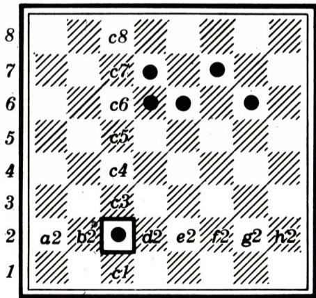
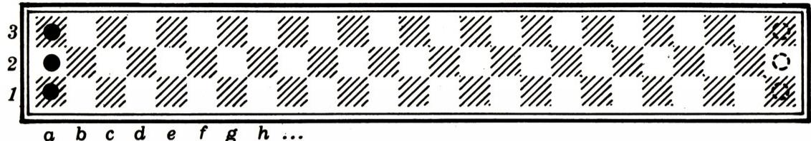
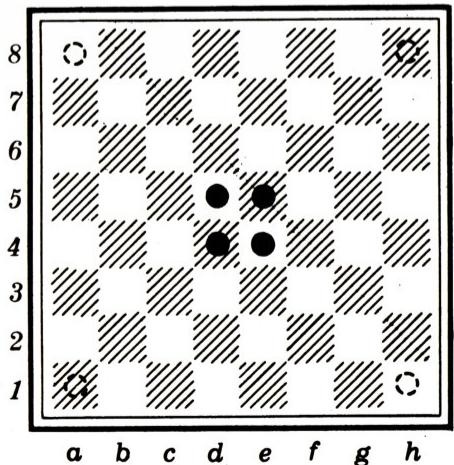
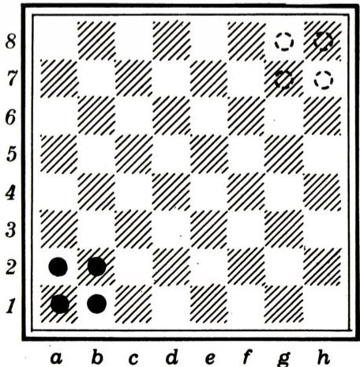
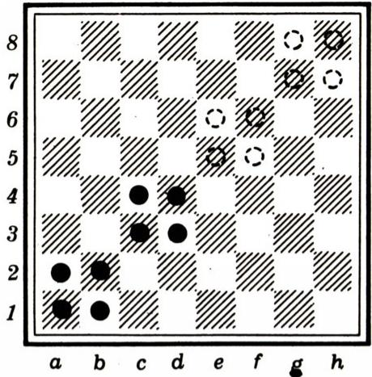

# 游走的棋子

> **原标题**：Блуждающие фишки
> **作者**：Ф. А. Бартенев（巴尔捷涅夫）
> **译自**：Квант 1980, № 3
> **栏目**：Квант для младших школьников（小学）
> **原文**：https://www.kvant.digital/issues/1980/3/bartenev-bluzhdayuschie_fishki-58200936/
> **主题**：谜题/游戏
> **难度**：★★（小学高年级可读；部分题目偏深）
> **译者**：Claude（AI 初译，2026-06）

---

*Ф. 巴尔捷涅夫*

我们常常发现，人们在游戏中最能展现机智，因此数学游戏之所以值得注意，并不在于游戏本身，而在于它能锻炼人的灵巧应变。

——莱布尼茨

也许不少小读者都熟悉棋盘上的「 уголки 」（俄式跳棋·对角棋）游戏。它是各种各样内容有趣又富有启发的游戏、消遣和题目的原型。下面我们就来看其中几个。

我们所说的「棋盘」，是指被划分成大小相同的小方格的任意矩形（见图）。棋子的起始位置用黑圆点表示，终点位置用虚线标出。

棋盘上每一格（每一个格子）都有自己的记号，自己的「地址」，自己的「坐标」，就像国际象棋棋盘那样。比如在图 1 中，有一颗棋子就停在 c2 格。当然，棋盘格子上一般并不会真写上这些记号，但只要图中标出了各纵列的字母和各横行的数字，就不难确定它们。

下面讲讲棋子的走法规则。每颗棋子可以走到任意一个相邻的格子（沿水平方向或竖直方向相邻）。例如，停在 c2 的棋子，可以走到下面四个格子之一：b2、d2、c3、c1。相应的走法我们这样记：

c2—b2；c2—d2；c2—c3；c2—c1。

棋子还可以「跳过」自己相邻的一颗棋子（沿上述四个方向之一），落到对面的一格空地上。例如图 1 中，走法 d6—d8 是允许的。一颗棋子走一步，甚至可以连跳好几次，而且各次跳跃的方向可以不同。比如图 1 中，d6 的那颗棋子，可以按 d6—f6—f8 跳到 f8，也可以按 d6—f6—h6 跳到 h6。

**例 1。** 图 2 中画了一块 $1\times 25$ 的棋盘，给出了三颗棋子的起始位置，并指出了要把它们挪到的目标位置。

原来，要求的这步挪动用 33 步就能完成：只要按下面三步把整组棋子当作一个整体向右挪两格即可：

1. c1—d1；
2. a1—c1—e1；
3. b1—c1。

图 3、图 4。

由于整组棋子要向右挪 22 格，把上面这个方法连用 11 次，总共刚好用 33 步就能完成全部挪动。

**题 1。** 在同一块 $1\times 25$ 的棋盘上摆着四颗棋子（图 3）。能不能用少于 33 步完成相应的挪动？

**题 2。** 有一块宽度为 1 的无限长棋盘。证明：总能在这上面摆下 $n$（$n\ge 3$）颗棋子，使得只需走三步，就能把原来的棋子排列整体向右平移两格。

我们刚才看了几个宽度为 1 的棋盘上挪动棋子的例子。如果改在大小为 $m\times n$（$m>2,\ n>2$）的棋盘上挪动棋子，就能用上更加多种多样的技巧。来看几个例子。

**题 3。** 图 4 中所指的挪动，能不能用少于 40 步完成？

**例 2。** 要求把每一颗棋子，从棋盘中央（图 5）挪到某个角上的格子。

原来，这个挪动用 22 步就能完成，比如像这样：

1. d4—d6；　7. c8—b8；
2. d5—d7；　8. b8—a8；
3. d6—d8；　9. e8—f8；
4. d8—e8；　10. f8—g8；
5. d7—d8；　11. g8—h8；
6. d8—c8；　12. e5—e3；依此类推。

这里我们遇到了一种需要：要能看出最好把解题过程分成哪几步、哪几个阶段。这时我们并没有去求「达到目标所需的最少步数」。「差不多」可以一眼看出，这道题不可能少于 22 步完成，不过这需要加以证明。

**例 3。** 图 6 所示的挪动，可以用 13 步完成。

下面给出一种可行的走法：

1. a2—c2；
2. a1—c1—c3；
3. b1—b3—d3；
4. b2—d2—d4；
5. c2—c4—e4；依此类推。

在这一题里，和前面几题一样，我们是在反复交替使用同一组棋子排列。下面这道题里就不会再有这种整齐的交替了。

**题 4。** 图 7 所示的挪动，能不能用少于 18 步完成？

如果把整组棋子当作一个整体一步一步地挪，需要 18 步。我们建议先把这八颗棋子全部排到大对角线上，然后把形成的这条「棋子链」当作一座「桥」，把棋子运送过去。

**题 5。** 如果给的是一块 $100\times 100$ 的棋盘，而八颗棋子相对于棋盘左下角的起始位置保持不变，请用少于 300 步解出上一题。

再来看两道题，看上去几乎一模一样，但要达到目标，却要用不同的技巧。

**题 6。** 用不超过 20 步，把停在 a1、b1、c1 的三颗棋子挪到 f6、g6、h6。

**题 7。** 用不超过 20 步，把停在 a1、a2、b1 的三颗棋子挪到 g8、h7、h8。

---

> **译者注**：
> 1. 莱布尼茨（G. W. Leibniz，1646—1716），德国大数学家、哲学家，与牛顿各自独立发明了微积分。
> 2. 「 уголки 」（字面意为「角」）是俄国流行的一种棋盘游戏，双方棋子分别排在棋盘两个对角的格子里，目标是把己方全部棋子移到对方原来的角落区域，俗称「对角棋」。
> 3. 原文 OCR 中棋盘格子记号个别处疑为字母形近误识（如 c1 误作 cl、c3 误作 c3 等），译文已按上下文校正为规范坐标。
> 4. 源文件 ru.md 在正文之后另含一篇读者来信《Полупустое равно полуполному》（半空等于半满），属于 1979 年 №9 一道倒牛奶题目的读者回信，与本篇主题无关，按翻译指南第五节予以剔除，未译。
