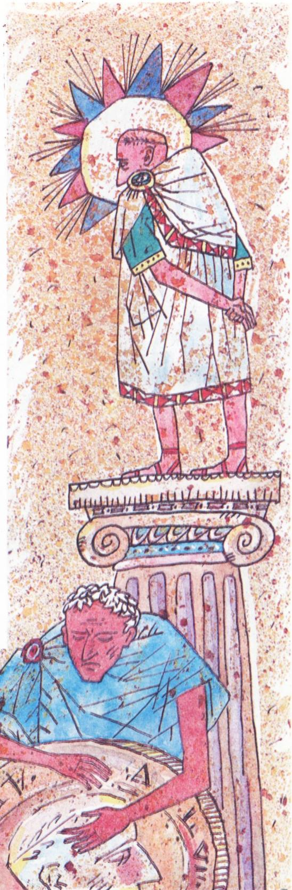
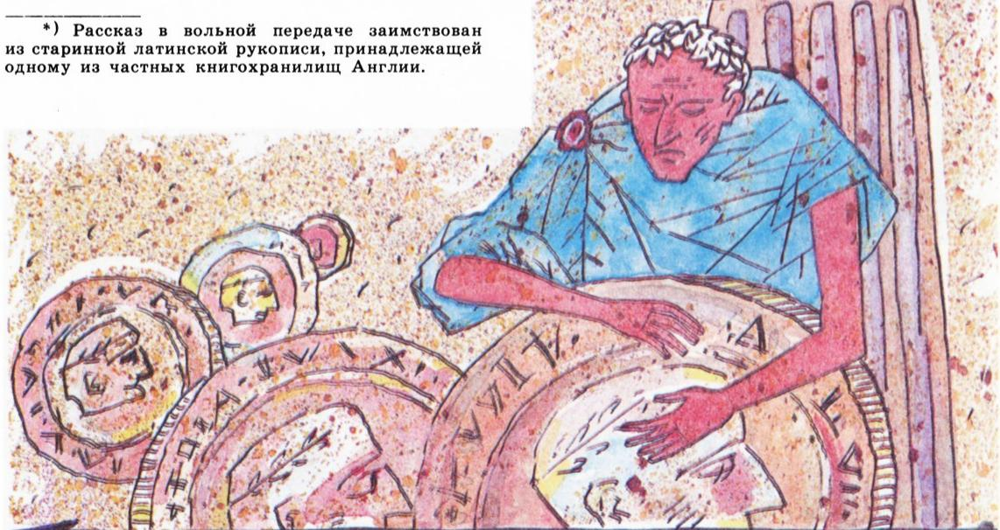

# 奖赏

> **原标题**：Награда（奖赏）
> **作者**：Я. И. Перельман（雅·伊·别莱利曼）
> **译自**：Квант 1989, № 8
> **栏目**：Квант для младших школьников（小学）
> **原文**：https://www.kvant.digital/issues/1989/8/perelman-nagrada-acd4948d/
> **主题**：趣味数学（等比数列/翻倍增长的故事）
> **难度**：★（小学高年级可读）
> **译者**：Claude（AI 初译，2026-06）

---

本期，我们为「低龄小读者」献上一篇出自苏联最负盛名的数学与物理科普作家雅·伊·别莱利曼之手的故事，转载自他的《活生生的数学》（莫斯科：科学出版社，1959 年版）。

## 雅·伊·别莱利曼

相传，许多个世纪以前，在古罗马发生过这样一件事。\*)

将军捷伦齐乌斯奉皇帝之命，打了一个大胜仗，带着战利品回到罗马。一到首都，他便请求觐见皇帝。

皇帝亲切地接见了这位将军，衷心感谢他为帝国立下的战功，并答应赏赐他元老院中的高位。

可是捷伦齐乌斯想要的并不是这个。他答道：

—— 为了壮大陛下的威势，让陛下的威名荣耀四方，我打了许多胜仗。我不怕死，即使我不止一条命，而是有许多条命，我也会全部为你献出。可是我已经厌倦征战了，青春已逝，血液在我血管里流得也慢了。

是时候回到我祖辈的家中歇息，享受居家生活的快乐了。

—— 那么，捷伦齐乌斯，你想从我这儿要什么呢？——皇帝问。

—— 请陛下宽宏地听我说！这么多年戎马生涯，我日复一日地用鲜血染红自己的剑，却没来得及给自己攒下什么钱财。我很穷啊，陛下……

—— 说下去吧，勇敢的捷伦齐乌斯。

—— 假如陛下愿意赏赐你卑微的仆人，—— 受到鼓舞的将军接着说，—— 那就请用你的慷慨帮我安度晚年，让我在自家灶边衣食无虞地度过余生吧。我不求无上元老院的尊荣高位。我只愿远离权势、远离社交，到清静之处休养。陛下，给我些钱，让我安度余生吧。

据传说，这位皇帝向来并不大方。他喜欢替自己攒钱，对别人却花得很吝啬。将军的请求让他沉思起来。

—— 那么，捷伦齐乌斯，你觉得多少钱对你来说才算够呢？——他问。

—— 一百万第纳尔，陛下。

皇帝又沉思起来。将军低着头等待着。终于，皇帝开口了：

—— 英勇的捷伦齐乌斯啊！你是一位伟大的战士，你的赫赫战功理应得到丰厚的奖赏。我会给你一笔财富。明天中午，你会在这里听到我的决定。

捷伦齐乌斯鞠了一躬，退了出去。

第二天，约定的时间一到，将军便来到了皇帝的宫殿。

—— 你好啊，勇敢的捷伦齐乌斯！——皇帝说。

捷伦齐乌斯恭顺地低下了头。

—— 我来了，陛下，来听你的决定。你仁慈地答应过要奖赏我。

皇帝回答道：

—— 像你这样高贵的勇士，我不愿让他为自己的功绩得到一份可怜的赏赐。你听好了。我的金库里放着五百万枚铜布拉司铜币。\*) 现在你听我吩咐：你走进金库，拿起一枚硬币，回到这里，把它放到我的脚下。第二天再到金库去，拿一枚值 2 布拉司的硬币，放到第一枚旁边。第三天拿一枚值 4 布拉司的硬币，第四天值 8 布拉司，第五天值 16 布拉司，依此类推，每次都把硬币的价值翻一番。我会下令每天为你铸造面值合适的硬币。只要你还搬得动，你就继续从我的金库里往外搬硬币。谁也不准帮你；你只能靠自己一个人的力气。等你觉得自己再也搬不动一枚硬币了——就停下来：我们的约定到此结束，可你已经搬出来的所有硬币都将归你所有，作为你的奖赏。

捷伦齐乌斯贪婪地听着皇帝的每一个字。他眼前仿佛浮现出一大堆硬币，一枚比一枚大，全都被他从皇家金库里搬了出来。

—— 陛下的恩典我十分满意，——他带着喜悦的笑容回答，—— 陛下的赏赐真是慷慨至极啊！

捷伦齐乌斯每日造访皇家金库的日子开始了。金库离皇帝的接见大厅不远，起初抱着硬币来回走，对捷伦齐乌斯来说毫不费力。

第一天，他从金库里只搬出了一枚布拉司。这是一枚很小的硬币，直径 21 毫米，重 5 克。\*\*)

第二、第三、第四、第五、第六趟也都很轻松，将军搬出的是 2 倍、4 倍、8 倍、16 倍和 32 倍重的硬币。

第七枚硬币，按我们今天的度量衡，重 320 克，直径为 $8\tfrac{1}{2}$ 厘米（精确地说是 84 毫米）。\*)

第八天，捷伦齐乌斯不得不从金库里搬出一枚相当于 128 枚基础硬币的硬币。它重 640 克，宽约 $10\tfrac{1}{2}$ 厘米。

第九天，捷伦齐乌斯把一枚合 256 枚基础硬币的硬币搬进了皇帝大厅。它宽 13 厘米，重超过 $1\tfrac{1}{4}$ 千克。

第十二天，硬币的直径已将近 27 厘米，重 $10\tfrac{1}{4}$ 千克。

皇帝至今看着将军的神情还是和蔼的，此刻却掩饰不住自己得意的心情。他看得清楚：已经搬了 12 趟了，而从金库里搬出的总共不过是两千来枚小小的铜币。

第十三天，给勇敢的捷伦齐乌斯送来的是一枚等于 4096 枚基础硬币的硬币。它宽约 34 厘米，重量达到 $20\tfrac{1}{2}$ 千克。

第十四天，捷伦齐乌斯从金库搬出了一枚重达 41 千克、宽约 42 厘米的沉甸甸的硬币。

—— 你累了吗，我勇敢的捷伦齐乌斯？——皇帝强忍着笑问他。

—— 没有，陛下，——将军皱着眉回答，一边擦着额头上的汗。

第十五天到了。这一次捷伦齐乌斯的担子可真沉。他慢吞吞地向皇帝走去，抱着由 16384 枚基础硬币合成的一枚巨型硬币。它宽达 53 厘米，重 80 千克——和一名壮硕的战士一样重。

第十六天，将军在压在背上的重负下直打晃。这是一枚合 32768 枚基础硬币的硬币，重 164 千克；直径达到 67 厘米。

将军已经筋疲力尽，气喘吁吁。皇帝微笑着……

当捷伦齐乌斯第二天来到皇帝的接见大厅时，迎接他的是一阵哄堂大笑。他已经没法把重负抱在手里，只好在身前滚着它走。这枚硬币直径 84 厘米，重 328 千克。它相当于 65536 枚基础硬币的重量。

第十八天，是捷伦齐乌斯发财之路的最后一天。这一天，他到金库的造访和把硬币运进皇帝大厅的跋涉都结束了。这一天他不得不搬运的，是一枚相当于 131072 枚基础硬币的硬币。它直径超过一米，重 655 千克。捷伦齐乌斯把自己的长矛当作杠杆，用尽九牛二虎之力才勉强把它滚进大厅。巨型硬币轰隆一声落在皇帝脚下。

捷伦齐乌斯已经彻底精疲力竭。

—— 我不行了……够了，——他低声说。

皇帝好不容易才压住满意的笑声，他看到自己的计谋大获成功。他命令司库算一算，捷伦齐乌斯一共把多少枚布拉司搬进了接见大厅。

司库领命而去，回来禀报说：

—— 陛下，承蒙你的慷慨，这位常胜的勇士捷伦齐乌斯所得到的……

## \* \* \*

这里，我们暂且打断雅·伊·别莱利曼的故事。请你来算一算：捷伦齐乌斯一共得到了多少枚硬币的奖赏？

---

> **译者注**：
> 1. 原文脚注 \*)（第 9 页「相传……」处）原书指明这是一个流传已久的传说，俄文版未直接给出注解内容，本译文保持原标记位置。
> 2. \*\*)「这是一枚很小的硬币，直径 21 毫米，重 5 克」——这是古罗马一种小型铜币（布拉司 / брасс）的实际尺寸与重量。
> 3. \*)「精确地说是 84 毫米」——此处原文有脚注，OCR 未能完整识别，但正文数据 84 毫米与上下文一致，保留。
> 4. **OCR 修正**：原文多处将「государь（陛下）」误识为「государств」「государствь」，已据上下文还原为「государь」；第 8 页标题处的 \*) 脚注星标位置保留。
> 5. **算一算提示**（给小读者）：第 1 天 1 枚，第 2 天 2 枚，第 3 天 4 枚……每天翻倍，共搬了 18 天。所求为 $1+2+4+8+\dots+2^{17}=2^{18}-1=262143$ 枚布拉司。
