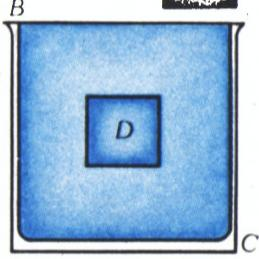
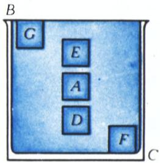

# 阿基米德定律的独创证明

> **原标题**：Оригинальное доказательство закона Архимеда
> **作者**：А. Перышкин（彼雷什金）
> **译自**：Квант 1977, № 9
> **栏目**：Квант для младших школьников（小学）
> **原文**：https://www.kvant.digital/issues/1977/9/peryishkin-originalnoe_dokazatelstvo_zakona_arhimeda-8b655fc3/
> **主题**：物理（流体静力学，从物理学史）
> **难度**：★★（小学高年级可读，部分推理偏深）
> **译者**：Claude（AI 初译，2026-06）

---

## A. 彼雷什金

## 阿基米德定律的独创证明

## （从物理学史说起）

流体静力学这门学问的基础是由古希腊学者阿基米德奠定的，后来许多科学家都研究过它。其中有一位荷兰科学家，名叫西蒙·斯台文（Simon Stevin，1548—1620）。他在《流体静力学原理》一书中，给出了一个简单却非常别出心裁的阿基米德定律证明。在这个证明之前，他先列出了七条「公设」——也就是不需要再作证明、直接承认其成立的断言。其中一条公设是这样的：

> 「物体自身的重量，就是它在空气中的重量；在水里，物体的重量则有所不同。」

接下来，斯台文证明了下面这条「命题」：**水里的水能停在水里的任何位置**。

已知有一个没有重量的容器 $A$，里面装着水，整个被放进一大盆水 $BC$ 里（图 1）。要证明的是：$A$ 里的水不会移动。

**证明**。假如不是这样，$A$ 里的水没有停在原处，而是下沉到 $D$ 的位置；那么，原本会来填补它位置的那部分水，出于同样的原因也会跟着下沉；这样一来，$A$ 里水的移动就会造成一种永久的、停不下来的运动——这显然是荒谬的。

> **译者注**：斯台文这里用的是「永动机不可能」的思想——这种「假如它会动，就会永远动下去，而永动是不可能的，所以它不会动」的论证方式，在物理学中很有名。

用同样的办法，也可以证明 $A$ 既不会上升，也不会朝任何一侧偏移。所以，它就会乖乖待在原来被放进的地方——无论是在 $D$、$E$、$F$、$G$，还是水 $BC$ 里的任何别处。

*图 1*

以这条已证的命题为基础，斯台文接着证明了下面这条定理：

> **任何固体在水里都比在空气里轻，减轻的重量正好等于与它同体积的水的重量。**

已知有固体 $A$ 和一大盆水 $BC$（图 2）。要证明的是：如果把 $A$ 放进水 $BC$ 里，那么它在水里的重量就会比在空气里轻，并且恰好减轻了「与 $A$ 同体积的那部分水」的重量。

**证明**。设 $D$ 是一个没有重量的容器，它的形状和体积都跟固体 $A$ 完全一样。我们在 $D$ 里灌满水，再把它放进水 $BC$ 里。根据上面已经证过的「命题」，容器 $D$ 能在水 $BC$ 里保持任意位置而不动。现在，把 $D$ 里的水倒掉，把固体 $A$ 放进 $D$ 里。

*图 2*

这时候，容器 $D$ 里所装东西的重量，就等于固体 $A$ 的重量，再减去刚才倒出去的那部分水的重量。而被倒掉的水的体积，正好等于 $A$ 的体积。所以，固体 $A$ 在水里的重量，比它在空气里的重量，恰好少了「与 $A$ 同体积的水」那么重的份量。

---

最后，我们向对物理学史感兴趣的读者推荐一本书：《流体静力学原理：阿基米德、斯台文、伽利略、帕斯卡》（国家技术理论出版社，莫斯科，1932 年版）。书里收录了阿基米德、斯台文、伽利略、帕斯卡这几位大师关于流体静力学的原著译文。

> **译者注**：斯台文在这里推出的结论，今天我们叫它**阿基米德定律**（也叫浮力定律）——浸在液体里的物体受到一个向上的浮力，浮力的大小等于物体排开的液体所受的重力。斯台文的证法巧妙之处在于：他不必去算液体压强怎么作用在物体表面，而是用一个「假想的、和物体同形状的『水壳』」来代替物体，再利用「这层水在水里能保持平衡」这一事实，一下子就推出了浮力的来由。这种「以水替物」的思路，至今仍是物理教科书里讲解浮力最优雅的方式之一。

---

*原文 OCR 干净，未发现混入的邻页无关内容。原文有两处图（图 1、图 2），译文中已保留原图引用并加中文图注；原文图前另有两张无图注的图片（应为作者肖像与版头装饰），按指南「纯文字/装饰页不强加图注」原则，此处不再单独标注。*
