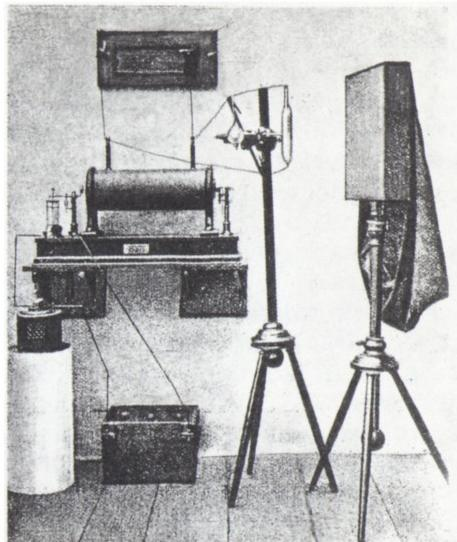
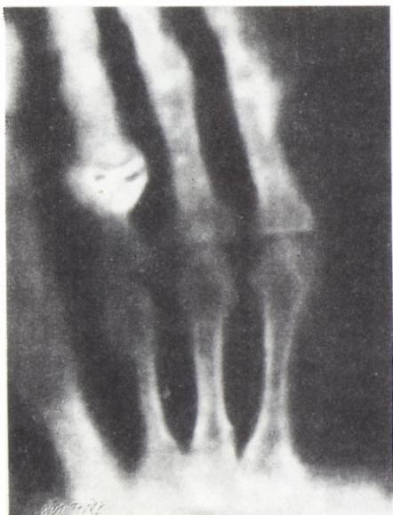
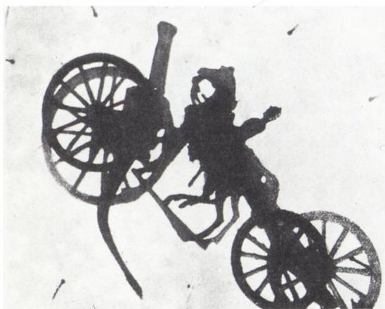

# X 射线

> **原标题**：Лучи «икс»
> **作者**：М. П. Бронштейн（M. P. 布朗施泰因）
> **译自**：Квант 1989, № 11
> **栏目**：Квант для младших школьников（小学）
> **原文**：https://www.kvant.digital/issues/1989/11/bronshteyn-luchi_iks-4bb047f9/
> **主题**：物理
> **难度**：★★（小学高年级可读，部分内容偏深）
> **译者**：Claude（AI 初译，2026-06）

---

1990 年，「科学」出版社将在「量子小文库」丛书中出版一本《太阳物质》。我们非常建议小读者们别错过它。这本书收入了杰出的苏联物理学家马特维·彼得罗维奇·布朗施泰因的三篇科学故事：《无线电报的发明者》《太阳物质》和《X 射线》。

## X 射线

（节选自同名书）

**М. П. 布朗施泰因**

### 第一个消息

1896 年 1 月，一个奇怪的消息传遍了整个地球。

有位德国科学家，竟然发现了一种前所未闻的射线，它有着神秘的特性。

射线的第一个神秘之处——它是看不见的。无论你怎么瞪大眼睛，都没法看清它。它什么颜色也没有，根本没有颜色。

第二个惊人的特性——它能穿过厚纸板，穿过铝，穿过厚木板，穿过锡纸。对它来说，「不透明」的东西反而透明。你躲到木墙后面、躲到门后面都没用。木门对它来说，就像玻璃一样能透过。

第三个特性是——有些物质在它的照射下会出现奇怪的变化。把铂氰化钡、硅锌矿、硫化锌的晶体放到它下面，它们就会突然闪出明亮的光。在看不见的射线作用下，照相底片会发黑。就连空气，一旦被这种看不见的射线穿过，也会奇妙地发生变化：它获得了一种新本领——能导电了。

报纸在刊登射线消息时，只顺便提了一下做出这项不寻常发现的人的名字：威廉·康拉德·伦琴。

> **译者注**：小读者们已经能在 1987 年第 2 期《量子》杂志上读到《无线电报的发明者》一书的节选。这一期，我们给大家送上《X 射线》一书的片段。本文由 Г. Е. 戈列利克整理编辑。

不过，这个名字对一般读者来说意义不大：很少人知道这位伦琴是谁。而且也并不是所有人都相信报纸上的消息——什么射线，还是看不见的，还能穿过墙壁——报纸上瞎写的东西还少吗！

### 谨慎的科学家

威廉·康拉德·伦琴是巴伐利亚一座小城——维尔茨堡——的物理学教授。

这位腼腆的教授，在古老大学的讲台上用很低的声音讲课，连他自己的城市里都没多少人认识他。可是全世界的科学家都熟知他。

在德意志全部二十五所大学里，找不出一位科学家比物理学家伦琴工作得更认真、更细致、更谨慎。他在自己的实验室里研究过许许多多现象，做过无数极其精确的测量。可是伦琴远没有把自己做过的每一项工作、每一次实验、每一个发现都拿去发表在科学杂志上。他有一条严格的原则：只有当他最后确信结果正确、精确无误时，他才把做过的实验写成文章发表。只要对实验的正确性还有一丝一毫的怀疑，这位谨慎的科学家就什么都不写。

伦琴提防那些仓促的假说、匆忙的猜测，提防种种

<!-- OCR page: p35–36 -->

不切实际的猜想。他只相信实验。「实验是最高的裁判，」伦琴说，「只有实验才能决定一个假说的命运，只有实验才能让我们知道，是该保留这个假说，还是该抛弃它。物理学最大的力量就在这里：研究自然的人可以对自己非常有把握，因为他总能用实验来检验自己一切设想、一切猜测。要是实验不支持某个猜测，那这个猜测就是错的，不管它多么诱人、多么巧妙。」

1895 年，威廉·康拉德·伦琴开始研究电流怎样流过稀薄的气体。

在伦琴之前，已经有科学家研究过这个现象。德国物理学家戈尔德施泰因和希托夫，在很久以前就让电流流过被强力抽气泵抽稀薄了的空气。他们造出了专门的仪器来研究这种电流，做了最初的实验。但还有很多事情不清楚。著名的物理学家海因里希·赫兹——就是发现无线电波的那位赫兹——断言：流过稀薄气体的电流也是一种波，一种类似声音振动的波动。英国人克鲁克斯则提出另一种猜测。他说，稀薄气体中的电流根本不是波，而是一股股极微小、肉眼看不见的粒子流——电子。它们以惊人的速度——每秒钟几万千米！——飞过稀薄的气体。

科学家们的意见分成了两派。有人认为赫兹对，有人认为威廉·克鲁克斯对。只有不肯轻易相信的伦琴，没有参加这场争论。他既不站在赫兹一边，也不站在克鲁克斯一边。

他固执地拒绝做出任何假设和猜测：他认为时机未到，需要尽可能多做实验，尽可能多积累可靠的事实。

1895 年 10 月底，伦琴在实验室里备齐了所需的一切材料和仪器，开始做实验。

### 实验的开始

伦琴拿来一个玻璃球，球里焊进了两块小小的金属片。每块金属片上都接了一根细金属丝。细丝的末端穿过玻璃球壁伸到外面。

接着，伦琴拿来一台强力抽气泵，开始把球里的空气往外抽。空气一点点被抽走，剩得越来越少。等抽到球里只剩原来空气的百万分之一时——伦琴把球封好。

一台用来让电流流过稀薄气体的仪器，就这样做好了。

现在只要把伸出球外的两根细丝接到一台能提供电压的机器的电极上——电流就会从一块金属片流向另一块金属片，穿过球里那稀薄的空气。

伦琴手头就有一台能产生高电压的机器。那是一台感应圈——是 19 世纪中叶巴黎技工鲁姆科夫发明的仪器。它外形看上去像一卷缝衣线，可比普通的线卷大得多；上面绕的也不是线，而是电线：几万圈细细的、外面包着可靠绝缘层的金属导线。

鲁姆科夫线圈里面不是空的。里面还插着另一个线圈——几百圈电线，不过不是细的，而是粗的。这两组绕组——外面的和里面的——的作用是升高电流的电压。如果让一股断断续续的交流电通过里面的绕组，那么外面的

<!-- OCR page: p36–37 -->

绕组里也会流过一股断续的电流，但它的电压要高上几十倍、几百倍！鲁姆科夫线圈就是一个电流变换器：它把低电压的电流变成高电压的电流。借助于鲁姆科夫线圈，可以制造出强大的放电、强大的电火花。

伦琴的那台感应圈，能产生 10 到 15 厘米长的电火花。

他把这台感应圈接到了自己玻璃球上那两根细丝的末端。立刻响起了一阵又急又响的噼啪声——那是鲁姆科夫线圈里的小锤子开始抖动，不停地接通和断开里面绕组中的电流。紧接着，外面绕组的所有线圈里都跑过另一股电流——一股高电压的电流。它沿着细丝冲进玻璃球，在稀薄的空气中开辟出一条通路。它从一块金属片流向另一块金属片，于是在玻璃球壁上忽然亮起一层微弱的绿色辉光。

伦琴的实验，就这样开始了。

### 意外的发现

过了几天，1895 年 11 月 8 日，伦琴发现了一个非同寻常的现象。

事情是这样的。

那是一个晚上。忙了一整天测量的助手们，疲惫地各自回家了。上了年纪的实验室工友也走了。伦琴一个人留在实验室里。他打算干到深夜。感应圈的小锤子噼啪作响，玻璃瓶壁上流泻出绿黄色的光。这已经不再是第一个玻璃瓶了，不是伦琴一开始做实验用的那个玻璃球。这一个星期里，他做了好几个玻璃瓶，每一个都不一样。有的是球形，有的是梨形，有的是又细又长的玻璃管。有的瓶里装的是稀薄的空气，有的装的是稀薄的氮气、氢气、氧气。但每一个瓶子里——不管是球、是管子、是梨，不管是装氧气的还是装氮气的——都同样地焊进了金属片，每个瓶子都伸出两根细细的金属丝。

这天晚上，伦琴的工作是这样的：他把自己的玻璃瓶一个个轮流推近感应圈，让电流从中通过。他想弄清楚：气体的稀薄程度、瓶子的形状、金属片的形状和位置，会怎样影响电流。

他把每一次观察的结果，都仔细地记进实验室日记本里。

时钟敲了十一下。伦琴有些犯困。他给最后一个玻璃瓶盖上一个厚厚的纸板套。现在只要切断感应圈里的电流，关灯，就可以走了。可他一时走神，忘了关掉感应圈。他关了灯，正准备往门口走，小锤子的噼啪声把他从沉思中拉回来。伦琴转身回去，就在这时，眼前出现了一幅奇异的景象。

<!-- OCR page: p37–38 -->

旁边的桌子上——不是放玻璃瓶的那张桌子，而是紧挨着的那张——闪着一团奇怪的光。一件小东西正燃着暗淡的绿黄色火光。伦琴在黑暗中朝桌子走去，想看个究竟。

原来，发光的是一小片纸。这纸不是普通的纸：它的一面涂着厚厚一层铂氰化钡。这种物质有个特点——只要太阳光照到它，它就会发光。可是现在外面是黑夜，房间里一团漆黑。铂氰化钡为什么还会发光呢？

伦琴在黑暗中摸到开关，切断了电流。

他手里拿着的那片纸，立刻不再发光了。

他重新接通电流。纸又闪起光来。

再切断。纸又熄灭了。

伦琴再也想不起要离开实验室了。

### 不眠之夜

伦琴决心研究这个莫名其妙的现象。

是什么让纸发光？是电流流过的感应圈，还是电流穿过稀薄气体的那个玻璃瓶？

为了弄清楚，伦琴决定把玻璃瓶拿走，把感应圈接到别的东西上——比方说，接到实验室里用来研究电火花的那两个金属小球上。

他就这样做了。小锤子又噼啪响起来，电流又在线圈里跑起来，不过这一次它不再流入装稀薄气体的瓶子，而是在两个金属小球之间跳成一道电火花。

伦琴去看那片涂着铂氰化钡的纸。纸就是一片普通的纸，一点光也没有。

于是他又把感应圈接回玻璃瓶，纸立刻又亮了起来。

再也没有什么可怀疑的了。感应圈在这里毫无关系。光靠它，没法让纸发光。问题全在那个瓶子上：当电流流过装着稀薄空气的瓶子时，铂氰化钡才会发光。

也就是说，在电流作用下，装着稀薄气体的玻璃瓶获得了某种特别的、神秘的力量。

这种看不见的力量究竟是什么？它不但能穿过玻璃瓶壁，还能穿过盖在瓶子外面的纸板套？

1895 年 11 月 8 日到 9 日的那一夜，伦琴整夜没合眼，一个人在实验室里度过。

### X 射线

伦琴决定把这种他新发现的、未知的现象叫作「X 射线」。X 是一个拉丁字母。在代数里，人们习惯用这个字母表示未知数。

而事实上，伦琴所发现的这种「力量」，正是一个完全未知的量。

关于它，伦琴自己究竟知道多少呢？

只有三件事。

他知道，要产生这种力量，必须让电流流过装着稀薄气体的瓶子。

他还知道，它能让铂氰化钡发光。

他还知道，它能自由地穿过纸板——因为铂氰化钡和瓶子之间隔着纸板套，可瓶子放出的 X 射线还是照到了纸上。

这就是伦琴关于 X 射线所知道的全部。

他决定继续做实验，直到这种未知的力量变成已知的东西。

### 新的实验

对于伦琴来说，这是一段不安的日子。他仍然不能完全确信自己的

<!-- OCR page: p38–39 -->

观察是对的。万一这一切只是他的错觉呢？万一他上了眼睛的当、上了自我催眠的当呢？X 射线真的存在吗？

很长一段时间里，按照他一向的习惯，伦琴没有把这次意外的发现告诉任何人。他的好朋友、动物学教授柏韦瑞后来回忆说，1895 年 11 月，伦琴有一次随口对他说：「我好像做了一个有趣的发现，不过还得再验证一下我的观察对不对。」至于他的助手们，伦琴连这句话都没有说。

他一个人把自己关在实验室里，从一大早一直做到深夜，一个实验接一个实验地做。有时候连夜里也在工作，只是偶尔抽空打个把钟头的盹。从 11 月 8 日到 9 日那个难忘的夜晚之后，他的实验室里多了一张折叠行军床。

他把实验室的窗户用厚厚的深色窗帘遮起来，生怕白天的光会干扰他看见铂氰化钡那微弱的绿黄色辉光。

伦琴研究着这种神秘射线的作用。

他把一本超过一千页的厚书，放在发光的纸和瓶子之间。

纸片继续发光。

也就是说，X 射线不仅能穿过薄薄的纸板，还能穿过厚厚一层纸，穿过一本一千页的书。

伦琴把书换成了一副扑克牌。X 射线也征服了这副牌。于是伦琴在纸片和瓶子之间放了两副牌叠在一起。射线也越过了这道障碍：纸片依旧发光，只是不像先前那么亮了。

伦琴试了许许多多种物质。他试过一块一英寸半厚的杉木板、一块胶木板、一张锡纸。

X 射线穿过了木板，穿过了胶木，也穿过了锡纸。

只有把三十张锡纸叠在一起，才勉强挡住了 X 射线：铂氰化钡的发光变弱了、暗淡了。

伦琴由此得出结论：X 射线会被锡吸收。只有极少一部分能穿过锡照到铂氰化钡上，其余的都被吸收掉了。

伦琴又试了别的金属：铜、银、金、铅。结果发现：X 射线能自由地穿过薄薄的金属层，而厚的金属层只能让极少一部分穿过。

结论很清楚：所有物质对 X 射线来说都是「半透明」的，只是程度不同。纸、木头、胶木对 X 射线来说，就像玻璃对太阳光一样透明；而厚厚的金属层则几乎完全透不过。

确信了这一点之后，伦琴决定把实验变得复杂一些，找一个同时含有两种东西的物体——一种能让 X 射线穿过、一种不能。比如，木头和金属。

他选了一只小木盒做实验，盒子里装着

<!-- OCR page: p39–42 -->

整整一套黄铜砝码。伦琴把小盒放到 X 射线的路上。

射线能不能也越过这道障碍？

能。绿黄色的光立刻亮起来。X 射线穿过小盒，就像刚才穿过纸板和杉木板一样轻松。

但在这条发着绿黄色光的钡带里，伦琴看出了一些暗色的斑点。仔细一看，他清楚地辨认出了这些斑点的轮廓。

斑点的形状，正是那些黄铜砝码。那是藏在木盒里的黄铜砝码的影子。

### 最后的验证

伦琴一个实验接一个实验地做。每一次新实验，都让他发现这种神秘射线的新特性。

他亲眼看见了它那令人惊奇的作用，可这位谨慎的研究者，已经习惯了不相信自己的眼睛。

最后，他想起用照相底片来做一个实验。「人的眼睛会看错，」伦琴想，「可要是照相底片也能发现这种看不见的射线，那就说明它们是真实存在的。照相底片是骗不了的。」

说干就干。他在 X 射线的路上放了一块照相底片。结果如何呢？几乎就在同一瞬间，底片变黑了。

看来，X 射线并不是想象的产物。伦琴再也不怀疑它的存在了。

于是，他开始把以前用看不见的射线做过的那些实验，统统重做一遍。只是这一次，他不再用涂着铂氰化钡的纸去接 X 射线，而是改用一个装着照相底片的木匣子。他再也不必用厚窗帘把窗户遮死了。因为太阳光穿不过木匣子，可对看不见的 X 射线来说，木匣子根本算不上障碍。

伦琴又让 X 射线穿过装着砝码的小盒，不过这一次他放在射线路上接射线的，不是涂着钡的纸片，而是一块照相底片。

几分钟后，他把底片冲洗出来、定影。

底片上印出了砝码清晰的影像。

在这之后，伦琴又做了一个实验——他最最精彩的一个实验。

他把装着稀薄空气的玻璃瓶放到桌子底下。他把一只手放到桌面上，再在手上放一个装着照相底片的木匣子。然后接通电流。

等这块照相底片冲洗出来之后，上面出现了一只手骨头的清晰、锐利的影像。X 射线穿过了皮肤、穿过了肌肉，却穿不过骨头。骨头的影子，就这样印在了照相底片上。

就这样，伦琴做到了在他之前谁也没有做到过的事——他拍下了自己的骨头。
