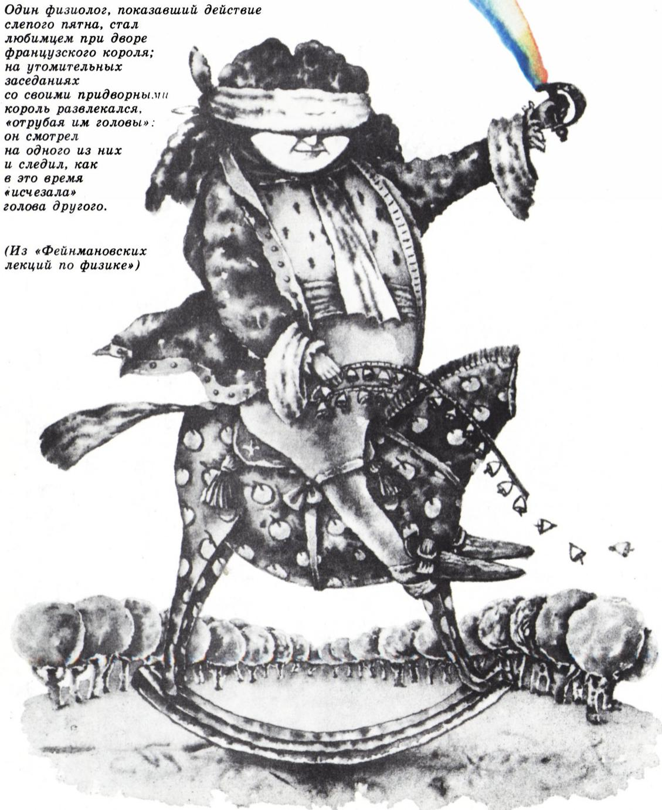
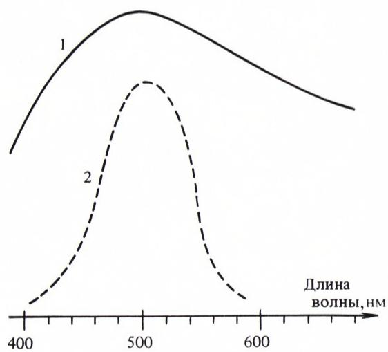
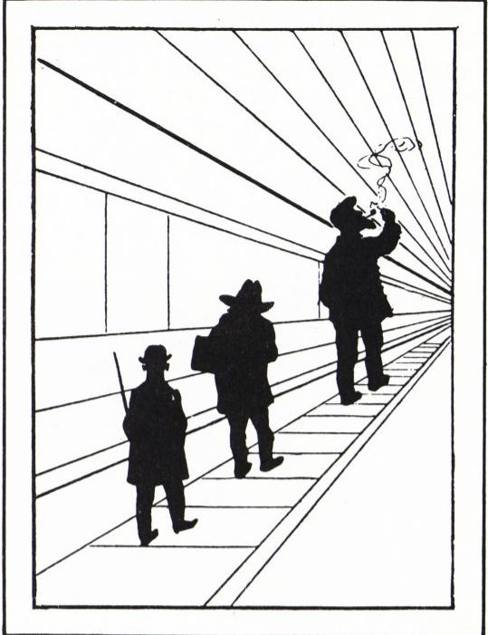
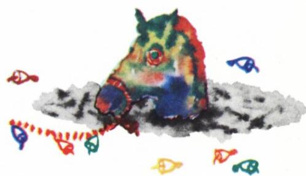

# 我们看到什么、怎么看

> **原标题**：Что и как мы видим
> **作者**：А. И. Буздин（A. I. 布兹金）、С. С. Кротов（S. S. 克罗托夫）
> **译自**：Квант 1988, № 3
> **栏目**：Квант для младших школьников（小学）
> **原文**：https://www.kvant.digital/issues/1988/3/buzdin_krotov-chto_i_kak_myi_vidim-8ac79996/
> **主题**：物理（光、视觉与颜色）
> **难度**：★★（小学高年级在指导下可读，部分内容涉及量子、粒子物理概念偏深）
> **译者**：Claude（AI 初译，2026-06）

---

> 一位生理学家向大家展示了「盲点」的实验，从而成了法国国王宫廷里的红人；在那些冗长乏味的御前会议中，国王用这个法子来解闷——「砍掉大臣们的脑袋」：他盯着其中一位大臣看，同时看着另一位大臣的脑袋怎样凭空「消失」。
>
> ——《费曼物理学讲义》

在《雅克敲钟人如何一头撞坏了灯笼……》（去年 12 月号《Kvant》曾刊载）一文中，我们曾提醒读者：彩虹中不同的颜色，对应着不同波长的电磁波——从 380 纳米（紫色）到 770 纳米（红色）。正是这一段波长范围内的电磁波，组成了我们所说的「可见光谱」。紧挨着它的两端，分别是红外线（波长更长）和紫外线（波长更短）。虽然我们的肉眼看不见这些射线，但它们也属于「光学波段」。这样做的历史原因是：研究红外线和紫外线时，人们用的光学仪器，和用来研究可见光的仪器其实差不多。

在红外线之外，是无线电波（波长从 $0.1$ 毫米到 $10^{4}$ 米）；在紫外线之外，则是 X 射线（波长从 $10^{-5}$ 纳米到 $10^{2}$ 纳米）。无线电波和 X 射线的性质，和光学波段的波差别很大，研究它们要用到截然不同的方法。

紫外线的「威力」，你多半亲身感受过：太阳光里就含有紫外线，被晒过之后皮肤会变黑，这就是「晒黑」。红外线你也熟悉——想想那种反射式电暖器吧，它的工作原理跟探照灯一样，只不过它发出的是一束「热光」。对了，红外线还有一个名字，就叫「热射线」。

> **译者注**：「纳米」（нм，即 nm）是长度的极小单位，1 纳米等于十亿分之一米（$10^{-9}$ 米）。

这里想请读者注意一件事：说到底，「透明」是相对的——透过普通玻璃看东西很清楚，可你想隔着普通玻璃晒黑可不行（石英玻璃就另当别论了）；普通玻璃对红外线的透过性也很差。

那么，我们的眼睛对红外线和紫外线都不敏感。可即便在可见光范围内，眼睛对不同颜色的敏感程度也不一样。请看「眼睛的光谱灵敏度曲线」（图 1），它用相对的单位，描绘了眼睛对各种颜色的「敏锐程度」。

人怎样感知光和颜色，这个问题可不简单。最大的难点在于：形成「颜色」这种感受，不光是物理上把光信号转换一下那么简单，人的神经系统在其中扮演着极为重要的角色。

照进眼睛的光线发生折射，会在视网膜上形成我们所观察物体的像。（说来有趣，古时候关于「人为什么能看见东西」，有过五花八门的理论。我们今天常说的「眼中之光」这种说法，其实正反映了古希腊人的一种观念——他们认为，之所以能看见东西，是因为眼睛会发出一种特殊的「流质」。）视网膜其实就是视神经末梢铺成的一层，这些神经末梢有两种类型——「视杆细胞」和「视锥细胞」（这名字来自它们的形状）。光线很弱时，主要靠视杆细胞在起作用；可惜的是，视杆细胞没法分辨颜色。负责色觉的是视锥细胞，而它们要等到光线足够亮时才「上线」。俗话说的「夜里所有的猫都是灰的」，原因就在这里——光线很暗时，所有东西看起来都褪了色。

图 1：曲线 1 表示太阳辐射能量按波长的分布，曲线 2 描述眼睛对颜色的敏感程度。可以看出，太阳光中，落在紫色区的能量比落在蓝色区的要少；而眼睛对蓝色又更敏感一些。所以，尽管紫光比蓝光被散射得更厉害，最终我们看到的，主要还是蓝色——于是天空看上去是蓝的。

从恒星传到地球的微弱光线，只够让我们分辨出最亮几颗星的颜色；可相比之下，用望远镜拍出来的彩色星空照片，色彩之绚烂、之美丽，实在令人惊叹——只可惜，肉眼是看不到这些颜色的。然而我们这种「没有颜色」的视觉，灵敏度却高得惊人：眼睛原则上连单个的光子都能「记下来」。所谓光子，就是电磁振荡的一份量子，可以看作是辐射能「最小的那一小份」。（这里我们碰到了一件奇妙的事：根据量子理论，光一方面是电磁波，另一方面又是粒子流——这些粒子就是「量子」或「光子」。）

前面已经说过，色觉的形成是个复杂的过程。眼睛里的感光细胞，不仅和大脑相连，彼此之间也相互连接。眼睛自己就好像在先做一道「初步加工」的工序。这并非偶然——在胚胎发育时，眼睛是从大脑直接「长出」神经纤维形成的，说到底，眼睛就是大脑的一部分。

顺便说一句，视网膜上那个视神经纤维「分叉而出」的地方，偏偏就没有感光细胞——既没有视杆细胞，也没有视锥细胞——所以对光一点也不敏感，这个位置就叫「盲点」。如果某个物体的像正好落在盲点上，你就看不见它。盲点是著名物理学家马略特（Mariotte）发现的，他于 1666 年在巴黎科学院的一次会议上报告了这一奇特现象。也正是这位「生理学家」（本文题记里提到的那位），教会了法国国王那种「人道地砍掉大臣脑袋」的玩法。

图 2.

大脑在感知外部形象时所起的关键作用，可以用下面这个例子来说明。如果一个人戴上一副能让画面上下颠倒的眼镜，一开始他看到的一切都会「脚朝上、头朝下」。然而过上一段时间，他对所见的形象就会重新习惯、觉得「正常」了。可一旦摘下眼镜，所有东西看上去又像是倒过来的，需要再过一段时间，世界才会回到原来的样子。

现在请你看看图 2，上面画着三个小人。看上去，下面那个明显比上面那个矮得多。可是拿尺子量一量，你就会发现：三个小人的高度其实是一样的。这都是图上那些「射线」造成的，它们营造出一种「远近透视」的错觉。同样，你大概也很难相信，图 3 上那些「直线」其实是彼此平行的。

图 3.

这种错觉，早在远古时代就给建筑师们添了不少麻烦：要让一座建筑物的轮廓看上去笔直，他们施工时反而得把线条做得微微弯曲才行。谈到这类错觉，给人印象最深的，恐怕要数荷兰画家埃舍尔（M. C. Escher）的那些画——它们直观地揭示了：我们所「看见」的世界，其实充满了主观的「约定俗成」（本期封面第二页就印有一幅埃舍尔画作的复制品）。

> **译者注**：埃舍尔（M. C. Escher，1898—1972）以擅长绘制「不可能图形」和视觉错觉作品闻名。

那么你来想一想：在伸手不见五指的黑屋子里，脑袋不小心撞到了门框，眼前为什么会冒出一圈圈彩色的光圈？那要是撞到了路灯杆呢？

我们的眼睛，并不擅长对光的颜色组成做严格的分析。要做这件事，最好借助物理仪器（最简单的一种就是三棱镜）。可是反过来，只要按合适的比例混合**三种**颜色——比如红、黄、蓝——就几乎可以调配出任何一种颜色（至少能调配出对应的「颜色感觉」）。这一点，彩色电视用得十分充分：电视屏幕上所有的颜色，都是用三种「基色」按不同比例叠出来的。彩色印刷也是同样的道理，只用了三种颜料。例如，把黄色颜料和蓝色颜料混在一起，就得到绿色；往屏幕上同时投一束黄光和一束蓝光，看到的也是一块绿斑。很显然，这样得到的「绿色」，并不是彩虹里那种「纯粹」的绿——彩虹里的绿光对应的是某一确定波长的电磁波。两种情况下，只不过是产生了相同的主观色觉罢了。但即便如此，人眼所能感受的色彩依然丰富得惊人——好的画家，能分辨出多达三百种颜色色调。

最后，我们再讲一个关于「颜色」的故事，它来自……粒子物理学。当代最伟大的理论物理学家之一盖尔曼（Gell-Mann），设想出了一些「奇异」的物质小颗粒——「夸克」。它们不仅被允许用一种颇为不寻常的方式存在（在自由状态下它们无法存在），而且还获得了「颜色」。夸克有三种「颜色」——红、绿、蓝。普通的质子由三个「不同颜色」的夸克组成，在这套理论里就是「白色」的，也就是「无色」的。把这三种颜色按不同方式混合，就能得到可见光谱中的任何一种颜色——这一点，正如彩色电视所做的那样。

于是，现代物理学已经能够自信地谈论那些「颜色」——尽管对于能否直接观测到这些对象本身，物理学同样自信地说「不能」。人的想象力，当真没有边界……

在结束之前，请你再思考几个小问题。

1. 大家都知道，正午去晒太阳，很容易「晒伤」。可是早晚时分，被太阳晒伤的危险几乎「等于零」。这是为什么呢？

2. 如果从侧面去看一束探照灯的光柱，它会显得是弯曲的。为什么？
