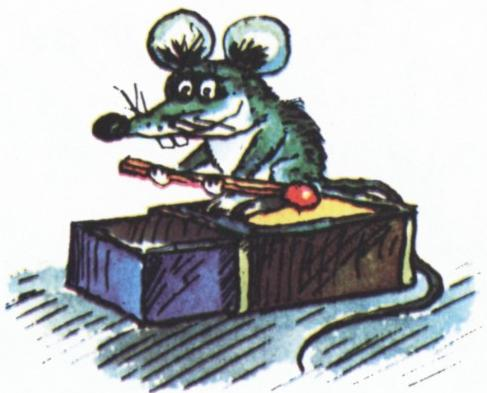
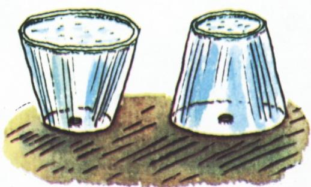

# 题

> **原标题**：Задачи（题）
> **作者**：Родина Н.А.（罗季娜·Н. А.）；本组题由 Р. Ю. 维诺库尔、В. Д. 维云、Г. А. 加利佩林、А. С. 科津斯基、С. Р. 谢菲别科夫 提供
> **译自**：Квант 1984, № 2
> **栏目**：Квант для младших школьников（小学）
> **原文**：https://www.kvant.digital/issues/1984/2/zadachi-4265872d/
> **主题**：算术 / 几何 / 物理（综合题集）
> **难度**：★★（小学高年级可读，第 3、5 题需略作思考）
> **译者**：Claude（AI 初译，2026-06）

---

1. 盒子里原来有一些火柴。先把火柴数**翻一倍**，再拿走 8 根；把剩下的火柴**再翻一倍**，又拿走 8 根。这样一套操作一共做了 3 次，第三次做完后盒子里正好一根不剩。问：盒子里原来有多少根火柴？

2. 在下面的乘法竖式中，字母 А 和 К 各代表一个数字，且 А 与 К 是**不同的**数字。竖式里还有 7 个数字被星号（\*）盖住了。请把所有被盖住的数字都还原出来。

   

3. 平面上有 $A$、$B$、$C$ 三个点。已知：对于这张平面上的**任意**一点 $M$，距离 $AM$ 一定比 $BM$、$CM$ 这两个距离中**至少一个**要小（也就是说 $AM$ 总是小于 $BM$，或者小于 $CM$）。

   由这个条件，你能对 $A$、$B$、$C$ 三个点说出些什么来？

4. 萨沙和格里沙常骑着自行车，沿一条林中小路从林子的一头骑到另一头。有一天，格里沙骑进林子，骑了 2 千米后碰见了萨沙——他正在修自行车。两个朋友聊了聊学校里的事，格里沙便继续往前骑。骑到林子边的时候，格里沙看了看时间：从他进林子算起，已经过了 24 分钟。他立刻掉头往回骑，骑了 2 千米又碰见了萨沙——萨沙还在修车，不过已经换了一个地方。

   「你到底骑了多远？」格里沙问。
   「一共就 900 米。」萨沙答道。

   已知格里沙从头到尾都以每小时 10 千米的同一速度骑行，请算一算：他们**第一次**交谈时是格里沙进林子后过了多少分钟。

   

5. 如图，有两个**圆锥形**的容器，里面都装满了水，而且两个容器里装的水**一样多**。两个容器的底部都有同样大小的小孔。如果同时把这两个小孔打开，水从哪个容器里先流光？

   

---

**本组题由 Р. Ю. 维诺库尔、В. Д. 维云、Г. А. 加利佩林、А. С. 科津斯基、С. Р. 谢菲别科夫 提供。**

> **译者注**：
> 1. 俄文原题为「Задачи」（题），是 1984 年第 2 期「小学 Kvant」栏目的一组综合题（共 5 道，涵盖算术、几何、行程、物理）。任务卡给的中文短标题「这熟悉又奇妙的水」与本组题实际内容（5 道数学/物理题）并不相符，疑为目录串行所致；本译文忠实于俄文源（ru.md），译整组 5 道题。
> 2. 第 4 题中速度单位「10 км/час」即 10 千米/小时；行程题常见陷阱是萨沙的位移（修车、推车）与格里沙匀速骑行之间的关系，需仔细列出两人各段时间。
> 3. 第 5 题图中两个圆锥开口方向相反（一个尖朝下、一个尖朝上），盛等量水、底孔相同；问题问哪个先流空，可结合「水位随体积变化的快慢」来思考——这是一道很好的物理直觉题。
