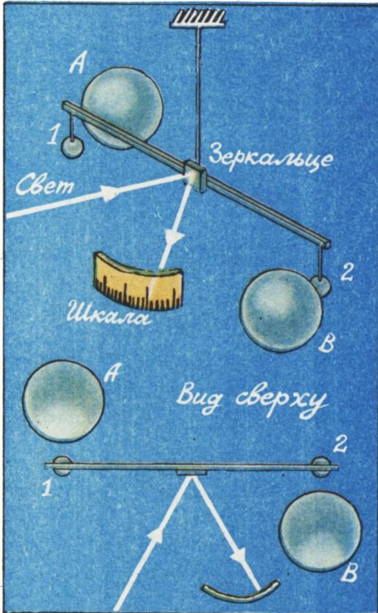
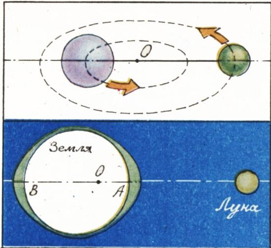

# 论万有引力与潮汐

> **原标题**：О всемирном тяготении, приливах и отливах
> **作者**：Н. А. Родина（罗季娜，教育学博士）
> **译自**：Квант 1985, № 8
> **栏目**：Квант для младших школьников（小学）
> **原文**：https://www.kvant.digital/issues/1985/8/rodina-o_vsemirnom_tyagotenii_prilivah_i_otlivah-fac0bfa9/
> **主题**：物理（万有引力、潮汐）
> **难度**：★★（小学高年级可读，潮汐成因一节偏深）
> **译者**：Claude（AI 初译，2026-06）

---

在一本介绍旅行的书里，记载过这样一种壮观景象：涨潮时分，滔滔水流猛烈地灌进阿尔达布拉群岛（位于非洲东岸外的印度洋海域）中某座岛屿的潟湖；在连通潟湖与大海的海峡里，水流的时速可达 25 千米，灌进来的水多达几十亿吨。退潮时分，水流又掉头奔回大海，潟湖的湖底有近三分之二露出水面，浅滩上数以千计的鸟儿走来走去，寻觅食物。

究竟是哪些巨大的力量，在退潮时把水「泼出」潟湖，又在涨潮时把水举起来？这力量，就是万有引力。

人们常说：牛顿之所以想到「一切自然物体之间都存在着吸引力」，是看到苹果落到地上才受到启发的。

但是，发现和研究引力，其实有着一段曲折的历史。

早在希腊最早的几个学派（公元前 5—前 4 世纪）里，学者们就断言「同类的东西会彼此相吸」。整个中世纪，这种说法又靠「磁石吸铁」这个类比得到了支持。

回顾万有引力学说建立的历史，我们会遇见许多闪光的名字。比如第谷·布拉赫，他连续二十年观测太阳系的行星，留下了大量精确的行星运动资料；又如约翰内斯·开普勒，依据这些资料归纳出行星运动的定律，并提出「月球之所以绕地球转动，正是由于引力的作用」的想法；还有伽利略·伽利莱，他发现了木星的卫星；此外还有很多很多人。不过，我们要把目光转向牛顿——正是他发现了万有引力定律。

对牛顿来说，「实验室」就是浩瀚的宇宙，他用来「做实验」的物体，是太阳和太阳系的行星。牛顿研究行星运动的资料后得出结论：在所有情形里，处于中心的物体（太阳之于行星，行星之于自己的卫星）都会以一种力作用于绕它转动的物体，正是这个力把物体牢牢「拽」在轨道上。其中一条结论，对确立万有引力定律起着决定性的作用，那就是——把天体留在轨道上的力，与它到中心物体的距离的平方成反比。

而牛顿给出的另一条结论写道：「引力对一切物体普遍存在，并且与每个物体的质量成正比。」

也就是说，**一切物体都在彼此吸引**。可是，既然吸引是所有物体共同的本性，那为什么在日常生活中我们只察觉到它的一种表现——地球对物体的吸引（提重物时感觉格外明显！）——却察觉不到别的呢？为什么我们坐在课桌旁、挨着同桌的时候，却感觉不到彼此的吸引呢？

牛顿对此回答道：「如果有人反驳说，按这条规律，我们身边一切物体本应彼此相吸，可这种吸引却完全感觉不到；那么我这样回答：这些物体对我们的吸引，比地球对我们的吸引要小——小多少呢？小上一个物体质量与整个地球质量之比那么多倍——所以远远不到能被感觉出来的程度。」

事实上，两个相距一米的人（例如围坐一张桌子的两个人）彼此之间的吸引力，大约只有 $0{,}00000025$ 牛（N）。

可见，同是一种引力，一会儿能把行星牢牢拴在轨道上，一会儿又能小到完全察觉不到。

我们引入一个比例系数 $G$，把两个物体的引力 $F$、它们的质量 $m_1$ 与 $m_2$ 以及它们之间的距离 $r$ 联系起来，于是万有引力定律可以写成：

$$
F = G \dfrac{m_1 m_2}{r^2}.\tag{*}
$$

要算出两个物体彼此的吸引力，就必须知道系数 $G$ 是多少，也就是说，要知道两个「质量都等于一个单位」的物体，在「相距一个单位距离」时，彼此之间有多大的吸引力。

这个系数只能通过实验来测定，它叫作**引力常数**（「引力」一词源自拉丁文，俄语意为「重量」）。这是物理学史上第一个「常数」（拉丁文叫 *constans*），也是一系列被称为「普适常数」中的第一个——所谓普适，就是对自然界一切物体都一样。牛顿把这个常数引进了科学，但他自己并没有测出它的数值。

测定引力常数的难处在于：实验室所用物体之间的引力「无可救药」地小，要测量它，需要极为精巧的办法。

……英国科学家亨利·卡文迪什做科学测量时一丝不苟到了这种地步，以致他的严谨在物理学史上都被专门记下一笔。他只有在自己完全确信结果正确、精确时才肯发表。也许正是这种近乎苛刻的自我要求，使得卡文迪许的不少发现（其中不少对科学意义重大！）几乎是在完成一百年之后，人们整理他的笔记时才得以知晓。

正是亨利·卡文迪什在 1798 年于实验室中测出了引力常数。他所用装置的示意图见图 1。

两个小铅球（1 和 2）被固定在一根轻杆的两端，轻杆从正中用一根又长又细的线悬挂起来。再把两个大铅球（A 和 B）靠近这两个小球。大球与小球互相吸引，轻杆随之转动，并把悬线拧转。当悬线的弹力与大小球之间的引力相互抵消时，拧转就停了下来。而在不同拧转角度下悬线的弹力有多大，卡文迪什事先已经一一测好。于是，根据悬线被拧转的角度，就能定出大小球彼此吸引的力。

知道了物体之间的引力、它们的质量和相互距离，就能算出引力常数：既然 $F = G \dfrac{m_1 m_2}{r^2}$，那么 $G = \dfrac{F r^2}{m_1 m_2}$。在卡文迪什的实验里，小球质量为 $m_1 = 0{,}73\,\text{кг}$（千克），大球质量为 $m_2 = 158\,\text{кг}$。卡文迪什得到 $G = 6{,}71 \times 10^{-11}\,\text{Н}\cdot\text{м}^2/\text{кг}^2$。而按现代数据，引力常数为 $G = 6{,}672 \cdot 10^{-11}\,\text{Н}\cdot\text{м}^2/\text{кг}^2$。

> **译者注**：原文质量单位写为「кг」（千克），原文公式中出现的拉丁字母「H」「m」「kr」均为 OCR 识别错误，已按俄文物理记号统一更正为 Н（牛，牛顿）、м（米）、кг（千克）。

现在，按照公式 (\*)，只要其余量已知，就可以算出公式中的任何一个量。不过要注意：这条定律在以下两种情形最为准确——一是物体呈球形（此时公式中的 $r$ 就是两球球心之间的距离），二是物体的尺寸远远小于它们之间的距离。

比方说，你想算一算自己的身体受到地球多大的吸引。在公式 (\*) 中就要代入「地球球心到你身体的距离」（至于「身体的中心」就不必讨论了，因为地球上任何一个物体的尺寸——哪怕是最高大的山脉——与地球相比都小得不成比例；所以我们就把这个距离取作地球的半径）。

我们来为质量为 40 千克的物体算一算。计算需要知道地球的质量——它等于 $6 \cdot 10^{24}$ 千克——以及地球的半径——6400 千米，也就是 $6{,}4 \cdot 10^6$ 米。把这些数据代入公式 (\*)，就得到：

$$
F = 6{,}67 \cdot 10^{-11}\,\dfrac{\text{Н}\cdot\text{м}^2}{\text{кг}^2}\cdot\dfrac{6 \cdot 10^{24}\,\text{кг}\cdot 40\,\text{кг}}{(6{,}4\cdot 10^6\,\text{м})^2}\approx 390\,\text{Н}.
$$

我们算出的，正是物体受到地球吸引的力，也就是处于地面上的物体所受的重力。可是从六年级物理课本（第 50 页）我们已经知道，重力可以更简单地算出：它等于 $9{,}8\,\text{Н/кг} \times 40\,\text{кг} \approx 390\,\text{Н}$。这样的吻合是巧合吗？当然不是。

回想一下，课本公式里那个 $9{,}8\,\text{Н/кг}$ 的系数，意思是：地面上质量为 1 千克的物体受到的力等于 $9{,}8$ 牛。现在再仔细看看万有引力定律的写法。当我们计算地面上任何一个物体（不管质量 $m$ 是多少）与地球之间的引力时，每次都要把下面这几个量的数值代入公式 (\*)：常数 $G$、地球的质量 $m_3$、地球的半径 $r_3$。也就是说，对地面上一切物体而言，式子 $G \dfrac{m_3}{r_3^2}$ 都是同一个值。请你自己算一算：

$$
6{,}67 \cdot 10^{-11}\,\dfrac{\text{Н}\cdot\text{м}^2}{\text{кг}^2}\cdot\dfrac{6\cdot 10^{24}\,\text{кг}}{(6{,}4\cdot 10^6\,\text{м})^2} = \ldots
$$

请特别留心这个值的单位，并解释一下你所发现的「巧合」。

为了检验自己是否真正弄懂了万有引力定律，请做这样一道题：水星这颗行星的质量只有地球的 $0{,}055$ 倍，可为什么水星上的重力几乎比地球上大 4 倍？（如果你想核对答案，可以查一查手册，例如 А. С. 叶诺霍维奇所著《物理与技术手册》，该书第二版由「教育出版社」于 1983 年出版。）

> **译者注**：此处原文「почти в 4 раза больше」（几乎大 4 倍）依字面直译；但实际水星表面重力约为地球的 0.38 倍（更小），题中数字与事实不符，疑为原文排版或 OCR 之误。读时可只把它当作一道练习题看待，自行用万有引力公式核算。

万有引力定律在科学技术的发展中起到了巨大的作用。借助它，人们发现了太阳系的两颗行星——海王星和冥王星；发射宇宙飞船和人造卫星所需速度的计算、飞行轨道的设计、把自动探测器精准地降落到其他行星上……都要用到它。

言归正传，让我们回到阿尔达布拉群岛的那座潟湖，回到涨潮与退潮。

潮汐之所以发生，原因正是万有引力；而这出戏的「主谋」，则是我们的卫星——月球。

我们姑且把水看作薄薄地铺满地球表面的一层。既然引力与两物体之间距离的平方成反比，那么靠近 A 点（图 2）的水，受到月球的吸引要比靠近 B 点的水更强。看起来，水就该因此全部涌到「朝向月球」的那一侧，在那里堆起一座水丘。又因为地球绕自己的轴在自转，所以每个地方的水一天之内都会涨一次（涨潮）、落一次（退潮）。但实际上，涨潮和退潮一天之内各发生两次。这又是为什么呢？

原因在于：地球和月球并不是彼此相对静止的。想象有两个小球——一个重、一个轻——用一根线连着，放在光滑的水平面上。可以让轻球绕着重球转。然而重球也不会停在原地不动——它的中心同样会画出一个圆，只是这个圆的半径较小（见图 2）。真正不动的，只是那条绷紧的线上、靠近重球的某一点 O（这一点叫作**系统的质心**）。重球也好、轻球也好，都是绕着这一点在转。

地球和月球也是这样：它们绕着某一点转动；由于地球比月球重得多，这个点甚至落在地球的内部（但并不在地心）。地球的中心绕着这个点转动，而地球表面的水则被「甩离」转动中心。这就使得在背向月球的那一侧，也隆起一座水丘。海洋表面因此被拉成一个长椭圆形：朝向月球的方向拉得长一些，反方向（背向月球）也拉得长一些（只是稍短）。随着地球自转，这道「双峰」的潮汐波便沿着地球表面「奔走」。而夹在两个水丘中间的区域，出现的就是退潮。

研究潮汐有许多难处。我们刚才讨论的是一个大大简化了的模型，离真实情况还差得远。地球并不是一个标准的球，它在两极处稍扁；水也并不是均匀地覆盖在地球表面。月球沿轨道运行时，到地球的距离时远时近。太阳同样会对潮汐的形成出一份力。而太阳、地球、月球三者的相对位置又在周期性地变化。这些因素以及其它许许多多因素，都会显著影响潮汐波真实的形成与传播，可能挪动水丘的位置、改变它们的高低，等等。

但有一点现在已经清楚了：潮汐的起因，就是万有引力。

可以肯定地说，远在古代，祭司们就已经懂得推算潮汐的时间了。不然的话，他们又怎能在古埃及的童话里演出那样的「奇迹」呢——

> 「……当船队驶入『双鱼运河』时，众人一见浅滩已经露了出来，再也无法前行。于是陛下法老召来杰季，并下令……杰季便对着水面念起神秘的咒语。随着他的话音，运河里的水涨了起来，把浅滩淹了四肘之深。法老的船队这才继续前进……」
