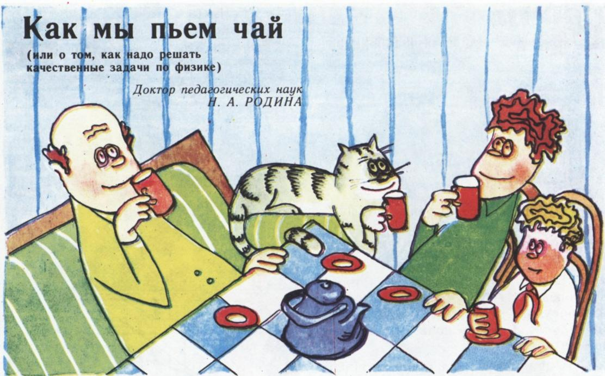
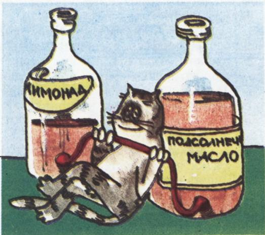
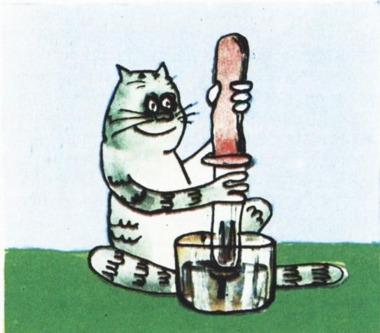

# 我们怎样喝茶

> **原标题**：Как мы пьём чай（或：我们怎样解物理定性题）
> **作者**：Родина Н. А.（罗金娜·Н. А.）
> **译自**：Квант 1984, № 12
> **栏目**：Квант для младших школьников（小学）
> **原文**：https://www.kvant.digital/issues/1984/12/rodina-kak_myi_pem_chay-2ccfac08/
> **主题**：物理（定性物理题）
> **难度**：★★（小学高年级可读，部分推理略深）
> **译者**：Claude（AI 初译，2026-06）

---

# 我们怎样喝茶

（也谈谈该怎样解物理定性题）

在一期「什么？在哪里？什么时候？」电视节目里，主持人给「智囊团」出了这样一道题（这里把题目说得稍微更准确一些）：

> 「尊敬的智囊团！你们面前放着一杯茶。请喝上一口，然后回答问题：为什么茶会往上升，而平时水都是往下流的呢？」

智囊团商量了一阵，最后给出的答案是：「我们是把水吸上来的。」这个答案被判定为正确，他们因此得到一分，并赢得一本书作为奖品。

如果有人不是在电视节目里，而是在物理课上向你提出同样的问题，你会怎么回答呢？这其实是一道真正的物理**定性题**（所谓定性题，是指那种题目里没有具体数字，答案也不一定要写成公式或数字的题目）。不过，在动脑筋想答案之前，我们先说清楚：什么才算一个「答案」。解一道物理定性题，就是用物理学的定律和规则来说明题中现象，用规范的术语把它讲清楚，而且要一步一步地讲，让每一步都从上一步顺理成章地推出来。照这个标准看，智囊团给出的「茶水」一题答案，恐怕还不能算是满意的。

那么，这道题究竟该怎么解呢？我们来听听两个六年级小朋友——萨沙和阿廖沙——是怎么做的。

**萨沙**：这全靠大气压！

（要说一句，萨沙喜欢抢着回答问题。）

**阿廖沙**：等等，得先从头想起——从题目的条件开始：本来静止的物体——杯子里的茶——开始运动了。我们知道有一种现象叫**惯性**：如果一个物体不受其他物体的作用，没有力作用在它上面，它就会保持静止，或者做匀速直线运动。物体本身不能改变这种状态，所以茶也不可能自己动起来，一定要有力去作用才行。

**萨沙**：可是任何物体都受到**重力**作用呀，茶也受重力。它之所以没有流出来、没有往下掉，是因为杯子有底。

**阿廖沙**：「杯子有底」这种说法，连小娃娃都会说。从物理学角度看，这算不上解释。学过物理的人会这样说：在茶的重量作用下，杯底向下凹了一点点，于是就产生了一个方向向上的**弹力**。这个弹力作用在茶上，正好和作用在茶上的重力大小相等、方向相反，彼此抵消。

这样就解释清楚了，为什么茶一开始对杯子来说是静止的。但我们这道题里要研究的，不是整杯水作为整体怎么动，而是水的**各个部分之间**怎样相对运动。

这种各部分之间的相对运动，是由液体内部不同地方、或者液体表面不同处的**压强差**引起的。

**萨沙**：这就像**连通器**里的情形。当两个容器里液柱的压强不一样时，一个液柱下降，另一个液柱就上升。在我们这道题里，一个「茶柱」就是靠近嘴的那一小部分茶，另一个「茶柱」就是其余全部的茶。我们还没喝茶的时候，这两个水柱产生的压强是相等的，可是一旦……

**阿廖沙**：你得先说清楚，为什么你刚才提到的两小柱茶，彼此之间会产生相等的压强。

**萨沙**：这个等会儿再证，我们先把题目解下去。现在已知条件是：杯里的茶本来是静止的，当人的嘴唇碰到杯子时，茶就开始往上升。

**阿廖沙**：第一，物理学里有更准确的说法，应该说：茶对杯子是**静止**的；第二，得把现象里所有的细节都考虑到。你没注意到吗——如果杯子没倒满，人还得把杯子倾斜一下，直到嘴唇碰到茶面；然后人吸一口气——只有到这时，茶才开始往上升。

我来把题目这样表述一下，我觉得这样说更清楚：

> **已知**：杯子里有茶，茶对杯子静止。人凑近杯子，或者把杯子倾斜，让茶和嘴唇挨到一起。然后人吸一口气，这一处的茶就往上升，进到人的嘴里。其余的茶则往下降。
> **问题**：为什么碰到人嘴唇的那部分茶会往上升呢？

**萨沙**：可题目条件里根本没写这些呀！

**阿廖沙**：写了。只是你得把题目里所说的现象准确地想象出来。然后再补充一些题目里没明说、但通过观察或者认真想一想就能得到的信息。依我看，**把题目的条件正确地、彻底地弄明白，就已经是解题的开头了**。

**萨沙**：那我们继续往下解。人吸一口气，也就是把空气往自己身体里吸……

**阿廖沙**：慢着。「把空气往里吸」是什么意思？人吸气是这么回事：靠肌肉用力，让自己的胸廓扩大，肺的体积变大，里面的空气就膨胀了。这样一来，肺里、以及和肺相通的口腔里的空气**密度**变小，空气的**压强**也就变得比外面空气的压强低。于是空气就从压强高的地方——也就是外面——流到压强低的地方——也就是肺里去。

**萨沙**：而人在吸气的时候，嘴唇又紧紧地贴在茶水的表面上，于是发生了这样的事：整个茶水面都受**大气压**的作用，只有紧贴嘴唇的那一小块表面上，受的是口腔里空气的压强，而这个压强比大气压小。全明白了！我早就说过，这一切的根源就是大气压！你又要说「等等」了吧？

**阿廖沙**：是要说「等等」。我们知道大气压是从上往下压在茶水面上的，那它怎么反而会让茶往上升呢？

**萨沙**：因为液体和气体都能把所受的压强**大小不变地向各个方向传递**。这就是**帕斯卡定律**。

**阿廖沙**：我看，我们已经可以总结出这道题的最终答案了。

茶在杯中本来是静止的，因为作用在它上面的合力——重力和杯底弹力——为零：这两个力大小相等、方向相反、作用在同一条直线上。液体（茶）的各部分之间也彼此静止，因为液体内部和液体表面各处的压强都是相等的。

当人把嘴唇紧贴在茶面的某一处，又吸了一口气（也就是扩大了肺），这一处空气对茶面的压强，就变得小于作用在其余表面上的大气压。于是出现了**压强差**，茶就被压向压强较低的那一处——贴在人嘴唇下面的那一小柱茶被抬了起来，其余的茶则往下降。

依我看，我们给出了一个堪称样板的解答。

**阿廖沙**：我们问问文章作者，看看我们的解答能得几分吧。

**作者**：我是物理老师，要是六年级的萨沙和阿廖沙给我交上这样一份解答，我会给他们打「五分」（满分）。我认为这份解答非常好。我特别喜欢的是，阿廖沙在推理的过程中，不断地冒出各种「顺手想到」的问题。回答这些问题的过程，正好就是一步步解出整道题的过程。

不过，这个解答算不算「样板」呢？这要看解题的人本来想达到什么实际目的、他已经掌握了哪些知识——同一种解法可以有不同的评价。但解答这东西，几乎是可以一直改进下去的。比方说，可以进一步说明：空气的密度在体积变化时**为什么**会改变、在**什么条件**下才会改变，并且用分子运动的知识来解释；也可以更详细地讲一讲帕斯卡定律在所观察到的现象中到底起了什么作用，等等。

这些补充解释，还有萨沙和阿廖沙解题时谈到的那些问题，建议读者们自己也好好想一想。

最后，请大家自己动手来解一道定性题。

大家都用过滴管（吸管式）。**为什么滴管里的液体会被吸上来呢？**如果把滴管玻璃管上那个橡胶小气囊换成一个小小的塑料袋（聚乙烯小袋），滴管还能「工作」吗？

---

> **译者注（OCR 邻页内容）**：俄文原文 p30 之后串入了一段「我们的问卷」（Наша анкета），是编辑部对读者的调查问卷（姓名、年龄、就读学校、何时开始读《Kvant》、对各栏目意见、1985 年想看哪些主题等），属读者调查类非正文内容，按翻译指南第五节已剔除。
