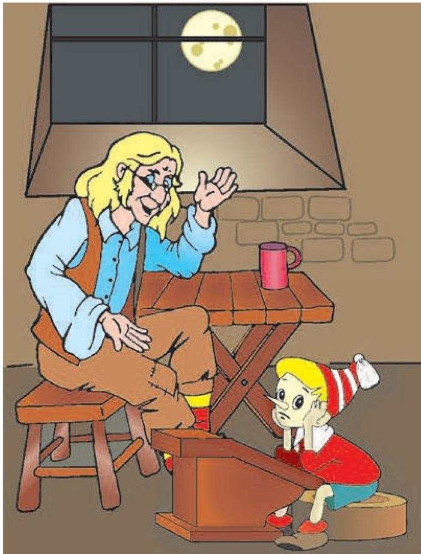
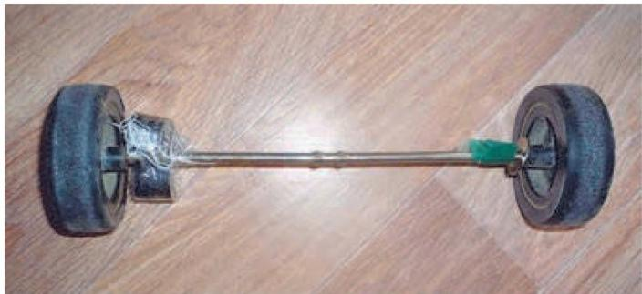

# 为什么月球不掉到地球上

> **原标题**：Почему Луна не падает на Землю
> **作者**：С. Дворянинов（S. 德沃里亚尼诺夫）
> **译自**：Квант 2018, № 4
> **栏目**：Квант для младших школьников（小学）
> **原文**：https://www.kvant.digital/issues/2018/4/dvoryaninov-pochemu_luna_ne_padaet_na_zemlyu-073713ca/
> **主题**：物理
> **难度**：★★（初中预备；含向心力、万有引力等概念，建议 6–7 年级阅读）
> **译者**：Claude（AI 初译，2026-06）

---

「我看你正深深地想着什么事儿呢。」卡洛爸爸对布拉蒂诺说。卡洛爸爸抖了抖围裙上的木屑，从工作台前走开，俯身到布拉蒂诺做作业的那张桌子前。

「你一个字都没写。是什么事儿这么缠着你的脑筋？」

「是啊，我怎么也没法想明白，月球为什么不掉到地球上来。它就那么高高地悬着，跟一个苹果似的，可就是不往下掉。」布拉蒂诺回答。

「嗯，这问题挺有意思。那有没有让你也奇怪过：月球为什么不会从地球这儿飞走呢？」

「它凭啥要飞走？」布拉蒂诺来了劲，「我活了这么久，从来没见过这种事，从没有任何东西从地球这儿飞走。可掉下来的东西倒是数都数不过来：桌上的课本、树上的苹果、屋顶上的瓦片。扔进海里的石头，沉到水底。就连大车扬起来的轻飘飘的尘土，到头来也得落回路上。要想从地球这儿飞走，那得一刻不停地扇翅膀。可太空里没有空气，扇也白扇——没东西可蹬。所以你这个问题，跟我问的那个根本搭不上界。」

「好吧，那咱们来推一推。月球在绕着地球转。对吧？」

「那当然。有满月，也有没月亮的夜晚，这都是因为月球绕着地球转。」

「那月球这条轨道的几个数据，你都知道些什么？」

「月球转一圈大约要 28 个昼夜，月球轨道的半径大约是 $380000$ 公里。所以月球沿着自己的轨道走，它的线速度是——」布拉蒂诺拿起铅笔——「这样算：

$$
v = \frac{2 \pi R}{T} = \frac{2 \cdot 3{,}14 \cdot 38 \cdot 10^{7}\ \mathrm{м}}{28 \cdot 24 \cdot 60 \cdot 60\ \mathrm{с}} \approx 0{,}99 \cdot 10^{3}\ \mathrm{м/с} \approx 10^{3}\ \mathrm{м/с},
$$

差不多每秒 $1$ 公里。」

「现在咱们来搭一个『沿圆周运动』的模型。」卡洛爸爸提议。他拿来一块胶合板，在板中央从下面钉进一颗钉子，钉帽留在板下面，钉尖朝上。他在钉子上套了一只轻轻的铁丝环，又往环上系了一根细线，把线的另一头穿过一颗小木球——这木球是他早先给书架准备好的。轻轻一弹——小球便绕着钉子沿一个圆周转了起来，靠线的拉力拽着它。

「那要是线突然断了，小球会怎么接着动？」卡洛爸爸问。

「呃，小球靠惯性滚下去，线像条尾巴似的拖在后面……」布拉蒂诺刚开口。

「滚——是会滚，可怎么滚，往哪儿滚？这个当然可以想一想，不过咱们还是来做一个……」

「……实验。你去院子里的沙坑里抓一把沙来。」卡洛爸爸说。

过了一分钟，沙子就备齐了。卡洛爸爸把沙薄薄地撒在胶合板上。这下子，滚动的小球在沙上就留下了一条细细的圆形痕迹。卡洛爸爸再次把小球转起来，然后把钉子抽掉。脱了束缚的小球在胶合板上滚了出去，在沙上拖出一条直直的痕迹。

「你仔细瞧瞧，这条小球的痕迹和那个圆是什么关系。」卡洛爸爸说，「这条直直的痕迹，是圆周切线的一段。一个物体沿圆周运动时，它的速度方向永远沿着这个圆的切线。也可以说，这个物体总想顺着切线方向飞出去。」

系在线上的小球，速度方向一直在变。月球的速度也同样一直在变方向。月球的加速度指向地球的中心（这叫**向心加速度**），大小是

$$
a = \frac{v^{2}}{R} = \frac{10^{6}\ \mathrm{м^{2}/с^{2}}}{38 \cdot 10^{7}\ \mathrm{м}} \approx 2{,}6 \cdot 10^{-3}\ \mathrm{м/с^{2}}.
$$

产生这个加速度的，是地球和月球之间的相互引力（万有引力），它等于

$$
F = G \frac{M_{\mathrm{З}} M_{\mathrm{Л}}}{R^{2}},
$$

由此算出的加速度是：

$$
a = \frac{F}{M_{\mathrm{Л}}} = G \frac{M_{\mathrm{З}}}{R^{2}} = 6{,}67 \cdot 10^{-11} \cdot \frac{5{,}97 \cdot 10^{24}}{(38 \cdot 10^{7})^{2}}\ \mathrm{м/с^{2}} \approx 2{,}8 \cdot 10^{-3}\ \mathrm{м/с^{2}}.
$$

你看，这两个加速度的数值彼此十分接近。

下面这件事真是又奇妙又让人吃惊。对咱们的小球来说，我们能亲眼看到一个造成「把球拽向转动中心的力」的实实在在的东西——那就是线。线会发生形变、被拉长，于是产生拉力。只不过这形变很小，不像弹簧那样一眼看得见，可力是确确实实存在的。那么，又是什么力把月球拴在它绕地球的这条圆轨道上的呢？我们手头没有任何一个实验，能够把这件事演示出来、解释清楚。

「你刚才琢磨的是，」卡洛爸爸接着说，「月球为什么不掉到地球上，而且你觉得这事儿奇怪。其实呀，月球一直在往地球上掉。倒不如说，同样让人吃惊的是，月球又没有从地球这儿飞走。它之所以飞不走，正是因为它被我们的星球吸引着。」

最后再说一点。人们平常总爱说「月球绕着地球转」。这话其实并不太准确。咱们来做这么个实验。在一根长为 $L$ 的轴上，安上两个一模一样、能自由转动的轮子。把这套装置放到地上，让它在水平面上转起来。我们会看到，两个轮子都沿着同一个半径为 $L/2$ 的圆滚动。两个轮子在绕着它们公共的**质心**转。两个质量相等的天体，也是这样彼此绕转的。

现在让两个轮子质量不一样——比如，在靠近其中一个轮子的轴上，再固定一个额外的重物。这种情形下，两个轮子就沿着大小不同的圆滚动了。重的轮子沿小圆走，轻的轮子沿大圆走。这两个圆的半径与两个轮子的质量成反比。如果让其中一个轮子变得非常非常重，那它就几乎不再转动了，它在地面上的轨迹会缩成一个点。在我们看来，就是轻的轮子在绕着重的轮子转。

就是这样：地球的质量远远大于月球的质量，所以人们才说「月球绕着地球转」。
